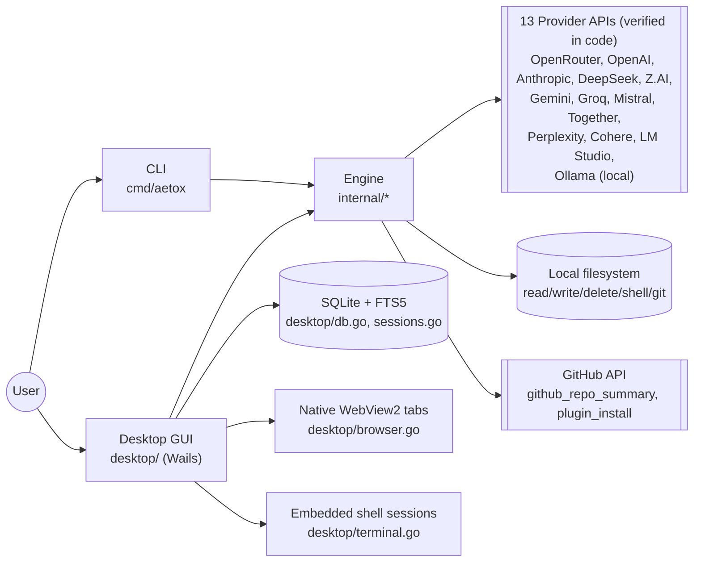
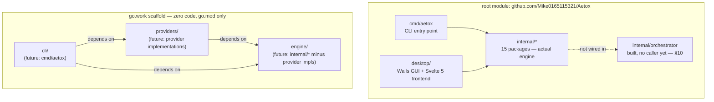
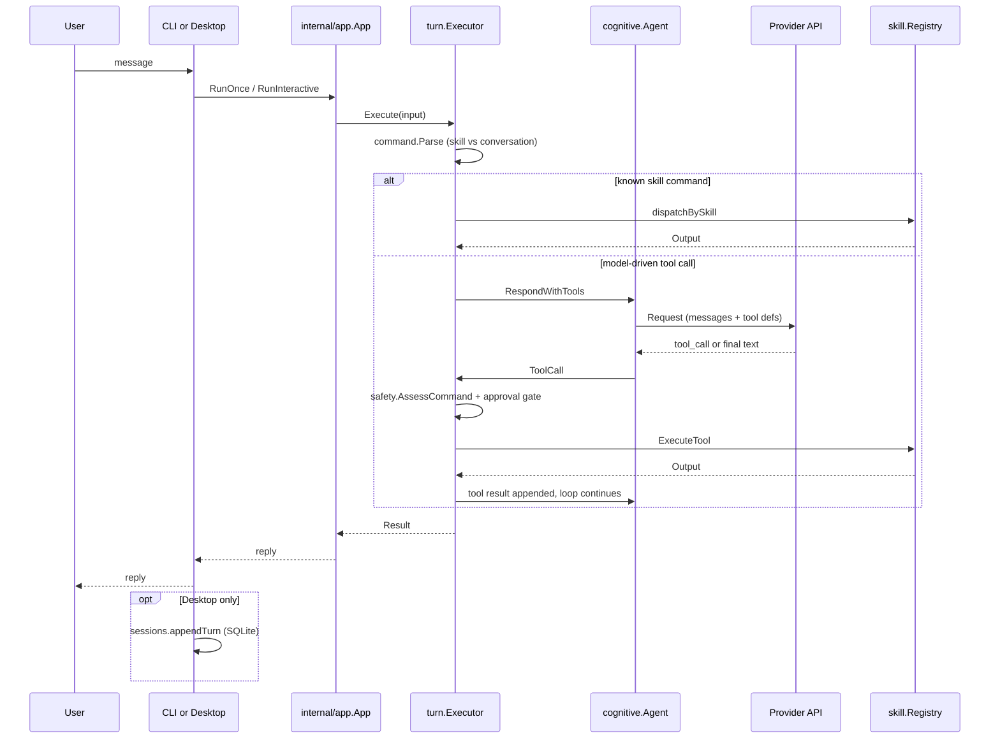
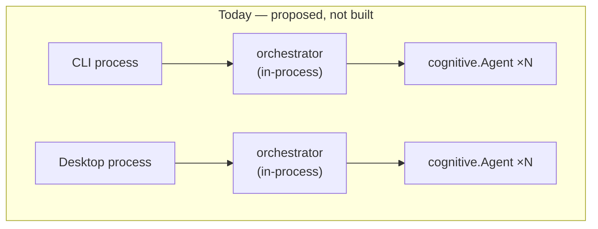

> **Pass level:** Full Mode
> **Trigger:** whole-project documentation requested at root; 3+ interacting modules (root/`internal`, `engine`, `providers`, `cli`, `desktop`), local persistence (SQLite), 11+ external provider integrations, remote code execution path (`plugin_install`).
> **Scope:** entire repository (`e:\Aetox\Aetox`), last updated 2026-07-22.
> **Evidence:** file tree, `go.work`/`go.mod`×4, `README.md`, `AETOX.md`, `docs/adr/0001`, `docs/adr/0002`, `docs/architecture/module-split-2026-07-21.md`, `docs/architecture/browser-security-2026-07-21.md`, `TEST-REPORT.md`, `MCP-SUPPORT-PLAN.md`, and direct reads of `cmd/aetox/main.go`, `internal/app/app.go`, `internal/cognitive/agent.go`, `internal/turn/executor.go`, `internal/skill/{skill,dispatcher,github_tools}.go`, `internal/safety/safety.go`, `internal/config/config.go`, `desktop/{app,browser,terminal,db,sessions,workbench}.go` and their `_test.go` files, `desktop/frontend/src/{App.svelte,style.css,lib/workbench/*}`.
> **Skipped:** Svelte component internals, provider-by-provider implementation detail (`internal/model/*.go` bodies), test file contents (existence noted, not read line-by-line).
> **Status labels used below:** `Direct` = confirmed by reading the file. `Inferred` = derived from evidence but not line-verified. `Proposed` = design intent, not yet built — never presented as existing.

This document is an evidence-first architecture map, distinct from [README.md](README.md) and [AETOX.md](AETOX.md), which are product vision/pitch documents and mix shipped state with roadmap in the same tables. Where they conflict with the code, this document follows the code.

---

## Reader's Map — the "5 layers" mental model vs. actual code

A working mental model used for planning this project splits responsibility into 5 layers: **model management**, **model-control (skills/MCP)**, **orchestrator (multi-agent)**, **UI/CLI front ends**, and **desktop app**. This section states plainly how much of that is real, separate code today, so the mental model isn't mistaken for the module boundaries in §4.

| Layer | What exists today | Where |
|---|---|---|
| 1. Model management | Real behavior, but **not its own module** — lives inside `internal/model` (interface + all 11 provider clients + factory/bootstrap) and `internal/provider` (catalog), both part of the same flat root module. `providers/` (scaffold, §4) is where this is *meant* to move — zero code there yet. |
| 2. Model-control (skill dispatch, tool-calling loop) | Real, but **three cooperating packages, not one**: `internal/skill` (Registry/Dispatcher/15 tools), `internal/cognitive` (Agent), `internal/turn` (Executor) — see the flow in §5. MCP itself is not built (`MCP-SUPPORT-PLAN.md`). |
| 3. Orchestrator (multi-agent) | **Scaffold only.** `internal/orchestrator` exists (§10) but nothing calls it — both front ends still construct exactly one `cognitive.Agent` each. |
| 4. UI/CLI front ends | Real. Two front ends — `cmd/aetox` (CLI) and `desktop/` (GUI) — both driving the same engine through `internal/app`. |
| 5. Desktop app (browser/terminal/extension surface) | Real, and the most independently-developed layer as of this session: session persistence (SQLite), native browser tab (WebView2), embedded terminal (ConPTY) — see §4.2, `TEST-REPORT.md` Module 5, and `docs/architecture/browser-security-2026-07-21.md`. |

**Answering "is it 5 clean modules now": no.** Only layer 5 (`desktop/`) is a genuinely separate Go package boundary from the rest. Layers 1–3 are conceptual groupings *within* the same flat `internal/` module (15 packages) — there is no compiler-enforced boundary stopping "layer 1" code from reaching into "layer 2" today. Treat the 5-layer split as a **planning/reading aid**, not as enforced architecture, until the `engine/providers/cli` migration (§4) actually happens.

---

## 1. Synthesis (read this first)

- **Two systems currently share the root Go module without a boundary.** `cmd/aetox` (CLI) and `desktop/` (Wails GUI) both import `internal/app`, but the GUI only uses ~2 of that package's ~35 exported methods (`NewApp`, `RunOnce`) — the rest is CLI terminal presentation (banner, status bar, spinner, Thai-language approval prompts). See [§6.1](#61-internalapp-mixes-orchestration-with-cli-terminal-presentation). `Medium`, `Direct`.
- **`internal/model` imports `internal/provider`**, so the abstraction (Provider interface, Message types) depends on the implementation catalog — already identified by the project's own [module-split proposal](docs/architecture/module-split-2026-07-21.md). Confirmed still true by direct import scan. `Medium`, `Direct`. This is the stated reason `engine/`, `providers/`, `cli/` exist as scaffolds.
- **The 3-module split (`engine/`, `providers/`, `cli/`) is an empty scaffold** — `go.mod` files only, zero source. `internal/` and `cmd/` remain the actual running code. `go.work` did not include the root module until this session added it (`e70cba...`, see [§7 open questions](#7-open-questions)), which is why `wails dev` broke.
- ~~`Registry.Register()` silently overwrites on name collision, and there is no built-in-vs-user-added distinction~~ — **fixed 2026-07-21**, see §6.4 below. `Register` now takes a `Source` and rejects collisions instead of overwriting.
- ~~`SearchSessions` (Desktop session search) doesn't work at all — silently returns nothing on every call~~ — **fixed 2026-07-22**, see §6.7 below. Root cause was narrower than first recorded: `snippet()` combined with `GROUP BY` in one query (not the whole query shape). Fixed with a `MATERIALIZED` CTE, single query, no two-step needed.
- **Browser tab Z-order, `postMessage` origin/replay forgery, and two frontend resize/layout bugs — all fixed 2026-07-21/22.** See §6.6 and §6.8 below.
- ~~`README.md`/`AETOX.md` advertise Anthropic support that doesn't exist in the actual provider catalog~~ — **fixed 2026-07-22**, see §6.9 below. `internal/model/anthropic.go` now implements a real client against Anthropic's Messages API (`/v1/messages`, `x-api-key`/`anthropic-version` headers, content-block request/response shape — not OpenAI-compatible, so it's its own file, not a reuse of `openai_compatible.go`), registered in the catalog and wired into the desktop provider picker (`desktop/app.go`'s `desktopProviders`). `zai` is still undocumented in both docs — that half of §6.9 is still open.

**Primary recommendation:** ~~apply the `SearchSessions` fix (§6.7)~~ — applied 2026-07-22, suite green. Next: the `Registry` Source gap (§6.4, closed) unblocks deciding what `plugin_install`'s loader (§6.5) or an MCP client should set as `Source` — `SourceExternal` alone doesn't yet distinguish them. Independently, `zai` (Z.AI/GLM) is fully implemented but still absent from `README.md`/`AETOX.md`'s provider tables — same category of doc-drift as the now-fixed Anthropic gap, worth a follow-up pass.

---

## 2. System Overview (confirmed)

Aetox is a single-user, local-first AI coding/personal-assistant agent with two front ends sharing one Go engine:

- **CLI** (`cmd/aetox`) — interactive REPL or one-shot invocation, Thai-language terminal UI.
- **Desktop** (`desktop/`) — Wails v2 + Svelte 5 GUI with chat, a tabbed workbench (Review/Terminal/Files/Browser), persistent SQLite-backed sessions, and an agent-controlled native browser (WebView2).

Both front ends drive the same tool-calling agent loop: user message → `cognitive.Agent` → provider API (model-driven tool calls) → `turn.Executor` dispatches to one of 15 built-in skills → result folded back into the conversation.

No backend server, no cloud database, no multi-tenant concerns — everything runs on the user's machine against third-party model provider APIs.

---

## 3. System Boundary



- **Confirmed external dependencies:** 12 named provider HTTP APIs, verified against the actual catalog map in `internal/provider/catalog.go` (not README's list — see §6.9, they differ), GitHub REST API (`internal/skill/github_tools.go`), local shell (`internal/skill/shell.go`), local filesystem, SQLite (confirmed `modernc.org/sqlite`, `Direct` — `desktop/db.go:17`), Windows WebView2 (`desktop/browser.go`, Win32 syscalls — Windows-only, `Direct`).
- **Not observed:** no outbound telemetry/analytics code found in `internal/` or `desktop/` during inspection (`Inferred`, `Verify first: Yes` — not exhaustively grepped for every HTTP client call).

---

## 4. Module Map



`rootmod` is what actually builds and runs today. `scaffold` is [proposed](docs/architecture/module-split-2026-07-21.md) — `go.mod` files exist with correct `replace` directives and the correct dependency direction (`engine` has zero deps on `providers`), but no files have been migrated. Do not treat `engine/providers/cli` as runnable.

### 4.1 `internal/` packages (root module, `Direct`)

Per-module docs (hub-and-spoke, §12): Tier-1 modules carry a `README.md` in their own folder — linked in the **Docs** column. Front-end modules: [cmd/aetox/README.md](cmd/aetox/README.md), [desktop/README.md](desktop/README.md) (§4.2).

| Package | Files | Role | Docs |
|---|---|---|---|
| `app` | 4 | CLI interactive loop + orchestration wiring (`NewApp`, `RunOnce`, `RunInteractive`, banner/status bar, approval-mode picker). Shared with desktop only via `NewApp`/`RunOnce` — see [§6.1](#61-internalapp-mixes-orchestration-with-cli-terminal-presentation). | [README](internal/app/README.md) |
| `cognitive` | 2 | `Agent` — builds provider requests, runs the (unbounded, §11 "related cleanup") tool-call loop, streams responses. | [model-control deep dive](docs/architecture/model-control-layer-2026-07-22.md) |
| `turn` | 3 | `Executor` — turn pipeline (§17): explicit skill command → direct dispatch, else model-driven tool loop, else streaming chat; approval gate on every tool path. No NL intent inference — that layer was deleted 2026-07-23. | [README](internal/turn/README.md) |
| `skill` | 19 | `Registry`/`Dispatcher` + all 15 built-in tools (read/write/edit/delete/list/fs/grep/shell/git/echo/time/help/github_repo_summary/plugin_install/image_ocr). | [README](internal/skill/README.md) |
| `model` | 14 | `Provider` interface, `Message`/`Request`/`Response` types, factory, bootstrap, and **all 11 provider client implementations** in the same package. Imports `internal/provider` (see [§6.2](#62-modelprovider-imports-providers-catalog)). | [README](internal/model/README.md) |
| `provider` | 2 | Provider runtime catalog (names, capabilities) — separate from `model`'s own `provider_catalog.go`, which is a second source for similar data (`Inferred`, `Verify first: Yes` — not diffed line-by-line). | — |
| `safety` | 2 | 3-tier approval (`ask`/`unsafe-only`/`full-access`), per-command risk assessment (`AssessCommand`, git/fs-specific rules). | [model-control deep dive](docs/architecture/model-control-layer-2026-07-22.md) |
| `command` | 3 | Input intent parsing facade — thin aliases delegating to `grammar` (the real implementation). | see `grammar` |
| `config` | 2 | Config loading, `.env`, model-preference persistence (JSON on disk). Owns `DataRoot()` — the single directory every Aetox-owned file lives under, see [§14](#14-decision--unified-data-root-2026-07-23-cleaning-up-where-aetox-writes-its-own-data). | — |
| `think` | 2 | Thinking-level normalization per provider. | — |
| `plan` | 2 | Execution planning (conversation vs. skill classification, per ADR 0001). | — |
| `memory` | 1 | Context/conversation memory. | — |
| `audit` | 2 | Execution audit log. | — |
| `debuglog` | 1 | Debug logging. | — |
| `grammar` | 2 | Input classification rules engine (Kind/Intent/slash parsing) behind the `command` facade. | [README](internal/grammar/README.md) |
| `orchestrator` | 2 | Multi-`cognitive.Agent` lifecycle tracker (`Spawn`/`Get`/`Stop`/`List`). Built this session, **not called by `cmd/aetox` or `desktop/app.go` yet** — see [§10](#10-decision--agent-orchestrator-layer-proposed-approved-2026-07-21) for scope and naming rationale. | §10 |
| `prompt` | 2 | System prompt assembly (identity/environment/user-global/project layers) — both front ends call it, replacing two near-duplicate `buildSystemPrompt` copies. Built 2026-07-22, see [§11](#11-decision--promptcontext-layer-proposed-being-settled-section-by-section-2026-07-22). | [README](internal/prompt/README.md) |
| `rtk` | 4 | Optional bridge to the owner's `rtk` CLI — shrinks tool-call output before it's wrapped into the model's receipt (`turn.modelToolReceipt`). v1: `git`+`shell` only. Auto-installs itself once from GitHub if missing (`install.go`), no NSIS changes. Built 2026-07-22, see [§13](#13-decision--rtk-integration-proposed-being-settled-section-by-section-2026-07-22). | [README](internal/rtk/README.md) |

### 4.2 `desktop/` (root module, `Direct`)

Module doc: [desktop/README.md](desktop/README.md) (replaced the Wails template boilerplate 2026-07-22).

| File | Role |
|---|---|
| `app.go` (665 lines) | Wails-bound `App` struct — the GUI's own type, distinct from `internal/app.App`. Owns `bootstrapFromConfig` (wires `internal/app.App` + `cognitive.Agent` + extra skills), provider/model switching, project tree/file read-write for the Files pane. |
| `sessions.go` | Per-project session persistence: `ListSessions`, `SearchSessions` (FTS5 — fixed 2026-07-22, see §6.7 below), `LoadSession`, transcript ↔ `model.Message` conversion. |
| `db.go` (77 lines) | SQLite connection + schema. `App.dbDir` overrides the default `<UserConfigDir>/aetox` directory (empty = production default) — a test seam added this session, not a behavior change. |
| `browser.go` (~470 lines) | Native WebView2 tab host via raw Win32 syscalls (`wndClassExW`, message loop) — Windows-specific, no build-tag isolation observed (`Inferred`, `Verify first: Yes`). Z-order and `postMessage`-forgery issues fixed this session — see §6.6 below and `docs/architecture/browser-security-2026-07-21.md`. |
| `workbench.go` | `browser_open`/`browser_read`/`browser_click`/`browser_type` implemented as `skill.Tool` — the agent drives the browser itself, distinct from the user-facing `BrowserOpen`/`BrowserNavigate` etc. in `browser.go`. `browser_read` tags interactive elements with `data-aetox-ref` (see `textScript`, `browser.go`) so `browser_click`/`browser_type` can target one by number — same ref-based pattern as Playwright MCP's accessibility tree and browser-use's element index. This is the pattern [MCP-SUPPORT-PLAN.md](MCP-SUPPORT-PLAN.md) recommends reusing for an MCP adapter. |
| `terminal.go` | Embedded shell session lifecycle (`TerminalStart`/`Write`/`Resize`/`Close`), independent of `internal/skill/shell.go` (that one is the agent's `shell` tool; this is the user-facing terminal pane). |
| `main.go` (39 lines) | Wails bootstrap. |

Test files added this session (`Direct`, all passing except the one noted bug): `app_test.go`, `browser_test.go`, `db_test.go`, `sessions_test.go`, `terminal_test.go` — per-file coverage detail in `TEST-REPORT.md` Module 5. `TerminalStart`/`TerminalClose`/`browser.go`'s Win32 window plumbing remain **not** unit-testable (documented there): `wailsruntime.EventsEmit` calls `log.Fatalf`/`os.Exit(1)` when the context isn't a real Wails-bound one, which a test never has.

`desktop/frontend/src/lib/`: `stores/` (Svelte 5 runes: `cockpit.svelte.ts`, `workbench.svelte.ts`), `services/cockpit.ts` (Go binding wrappers), `workbench/*.svelte` (Review/Files/Browser panes). Not read in detail — structure only (`Direct` for existence, `Inferred` for internal behavior), except `App.svelte` (resize-handle logic, read in full — see §6.8) and `workbench/Workbench.svelte`/`style.css` (address-bar + blank-state layout, read in full — see §6.8).

---

## 5. Primary Workflow — one chat turn



Desktop-specific additions confirmed in `desktop/app.go`/`sessions.go`: every turn is persisted via `appendTurn` after `SendMessage` returns; sessions are keyed per project root (`projectKey`); full-text search is FTS5-backed.

---

## 6. Debt Register

### 6.1 `internal/app` mixes orchestration with CLI terminal presentation

- **Evidence:** `internal/app/app.go` exports `NewApp`, `RunOnce`, `RunInteractive`, `PrintBanner`, `printStatusBar`, `printPromptLine`, `pickApprovalMode` (Thai-language console prompts), `showHelp`, `showSkillPalette` — all in one package/type. `desktop/app.go:275-289` (`SendMessage`) calls only `a.chat.RunOnce`; no desktop code path reaches `RunInteractive`, `PrintBanner`, or the approval-mode console picker.
- **Impact:** the GUI binary compiles and links terminal-rendering code it never calls. Any change to CLI presentation (banner, status bar, Thai approval prompts) risks breaking desktop's build even though desktop doesn't use those methods. The project's own [module-split plan](docs/architecture/module-split-2026-07-21.md) intends to move this whole package to `engine/app/` labeled "shared by CLI + desktop" — migrating as-is carries the same mixing forward.
- **Severity:** `Medium` (taxes the planned migration; doesn't break anything today).
- **Confidence:** `Direct`.
- **Direction (proposed, needs approval):** split `internal/app` into an orchestration piece (`NewApp`, `RunOnce`, turn-executor wiring — genuinely shared) and a CLI-presentation piece (banner, status bar, interactive loop, approval picker) before or during the `engine/` migration, so `engine/app/` doesn't inherit terminal-only code.

### 6.2 `model` imports `provider` — abstraction depends on implementation

- **Evidence:** `internal/model/factory.go`, `provider_catalog.go`, `thinking_capabilities.go` import `internal/provider`. Documented and accepted as the reason for the 3-module split in [module-split-2026-07-21.md:8-16](docs/architecture/module-split-2026-07-21.md).
- **Impact:** any consumer of `model.Provider`/`model.Message` transitively pulls in the full provider catalog; can't depend on the interface alone.
- **Severity:** `Medium`.
- **Confidence:** `Direct`.
- **Direction:** already proposed and scaffolded (`engine/model` interface-only, `providers/` for implementations) — no new recommendation, just confirming the existing plan matches the evidence.

### 6.3 Two provider catalogs

- **Evidence:** `internal/model/provider_catalog.go` and `internal/provider/catalog.go` both exist; not diffed for exact overlap.
- **Impact:** unclear without deeper read — possibly one is the canonical list and the other is a thin re-export, or they've drifted.
- **Severity:** `Low`–`Medium` (`Unverified` which).
- **Confidence:** `Inferred`, `Verify first: Yes`.
- **Direction:** none proposed — needs verification first, listed as an open question (§7).

### 6.4 Skill registry has no core/user-added boundary — FIXED 2026-07-21

- **Original evidence:** `internal/skill/skill.go:44` `Registry.Register()` overwrote on key collision with no warning. `internal/skill/defaults.go` registered all 17 built-ins and `plugin_install` into the same flat map. Documented in detail in [MCP-SUPPORT-PLAN.md:37-51](MCP-SUPPORT-PLAN.md).
- **Impact (was):** couldn't gate trust levels differently (built-in vs. third-party MCP/plugin tool), couldn't show "core" vs. "installed" separately in the Settings UI, and a user-installed skill could silently shadow a built-in tool by name.
- **Severity:** was `High` (blocked safe MCP support).
- **Fix applied:** [internal/skill/skill.go](internal/skill/skill.go) — added `Source` type (`SourceBuiltin`/`SourceExternal`), `Registry` now stores `{skill, source}` pairs and exposes `SourceOf(name)`. `Register(skill, source)` returns an error instead of silently overwriting on name collision.
  - [internal/skill/defaults.go](internal/skill/defaults.go) — all 12 built-ins register with `SourceBuiltin`; a collision among built-ins now panics at startup (programmer error, not a runtime condition).
  - [desktop/app.go](desktop/app.go) `bootstrapFromConfig` — `extraSkills` (the `workbenchTools`: `browser_open`/`browser_read`/`browser_click`/`browser_type`) register with `SourceExternal`; a collision is logged via `debuglog.Msg` and the skill is skipped rather than silently overwriting a built-in.
  - Tests: [internal/skill/skill_test.go](internal/skill/skill_test.go) (`TestRegisterTracksSource`, `TestRegisterRefusesCollision`).
- **Still open:** `SourceExternal` is one bucket for everything non-built-in — MCP and `plugin_install`-loaded skills don't yet have their own distinct source values, and nothing consumes `SourceOf` yet (no per-source permission gating, no Settings UI grouping). Add `SourceMCP`/`SourcePlugin` when those integrations are actually built, not before.
- **Confidence:** `Direct` — `go build ./...` and `go test ./internal/skill/...` pass.

### 6.5 `plugin_install` downloads files but nothing loads them back

- **Evidence:** `internal/skill/github_tools.go` implements `plugin_install` fully (fetches manifest, path-traversal-checked, writes to `~/.agents/skills/<name>/`) but `internal/skill/defaults.go` only registers compiled-in Go skills — no bootstrap-time scan of the install directory. Confirmed by direct read of `validatePluginManifest`/`normalizeManifestRelativePath` (traversal guards present) and by `MCP-SUPPORT-PLAN.md:17-23`.
- **Impact:** "installing a plugin" via this tool currently has no observable effect after download completes.
- **Severity:** `Medium` (feature is inert, not unsafe — path traversal is guarded and manifest type is restricted to `"skill-bundle"`).
- **Confidence:** `Direct`.
- **Direction:** proposed in `MCP-SUPPORT-PLAN.md` — write a loader that scans the install directory at `bootstrapFromConfig` time; decide execution model for downloaded (non-compiled) skills first.

### 6.6 Browser tab Z-order + `postMessage` forgery — FIXED 2026-07-21/22

- **Evidence (Z-order):** `desktop/browser.go`'s tab window used only `MoveWindow`/`ShowWindow` — neither changes Z order. Two independent WebView2 controllers in one top-level window each composite via DirectComposition; without an explicit Z-order call the tab's pixels could render behind the app's own webview — confirmed live (page navigated successfully, per-page title updated, but the tab area stayed solid black, the app's own background color).
- **Evidence (`postMessage` forgery):** `onMessage` trusted a page's `postMessage({__aetox:...})` envelope with no check that the page was the one it claimed to be, or that a `"text"` response corresponded to a specific `BrowserGetText` call. `args.GetSource()` (real origin, page can't forge) was available on `ICoreWebView2WebMessageReceivedEventArgs` but unused.
- **Impact:** Z-order bug made the entire browser tab feature appear non-functional (page loads, nothing visible). The `postMessage` gap allowed a malicious page to (a) claim an arbitrary `url` in a `"meta"` message — address-bar spoofing, a phishing enabler — and (b) inject fabricated `"text"` content into the agent's `BrowserGetText` read path — a prompt-injection vector distinct from the page's own real (untrusted) DOM content.
- **Severity:** was `High` for the `postMessage` gap (security), `Medium` for Z-order (functionality, not security).
- **Fix applied:** `procSetWindowPos` + `HWND_TOP` on tab creation/resize/show ([browser.go](../../desktop/browser.go)). `onMessage` now requires `sameOrigin(source, m.URL)` for `"meta"`, and a matching per-request nonce (`textToken`, minted by `BrowserGetText`, `crypto/rand`) for `"text"`. Full threat model and residual risk in [docs/architecture/browser-security-2026-07-21.md](../../docs/architecture/browser-security-2026-07-21.md).
- **Confidence:** `Direct` — 12 new tests in `browser_test.go`, `go build`/`go vet` clean.

### 6.7 `SearchSessions` returned nothing, ever — FIXED 2026-07-22

- **Evidence:** `desktop/sessions.go`'s `SearchSessions` joined `messages_fts` (FTS5) with `messages`/`sessions` in one query and called `snippet(messages_fts, ...)` in the same statement. That shape returns SQL error `"unable to use function snippet in the requested context"` from `modernc.org/sqlite` every time — and `SearchSessions` swallows the error (`if err != nil { return out }`), so the function always silently returned zero results instead of surfacing a failure. That silent swallow is why the bug was invisible outside the failing test.
- **Root cause (narrowed from the original record):** not the whole join shape — specifically `snippet()` + `GROUP BY` in one statement. Probing each variant against `modernc.org/sqlite v1.54.0` showed the same query passes with either `snippet()` or `GROUP BY` removed, and a plain subquery doesn't help (the planner flattens it back into the failing shape).
- **Fix applied:** `snippet()` moved into a `WITH f AS MATERIALIZED (...)` CTE, which the planner may not flatten; the outer query keeps the joins, `GROUP BY s.id` dedupe, and ordering. Single query — the originally proposed two-step rewrite wasn't needed.
- **Confidence:** `Direct` — [`TestSearchSessionsFindsMatch`](../../desktop/sessions_test.go) now passes (it verified both a hit and a miss), full `desktop` suite green.

### 6.8 Frontend layout bugs — FIXED 2026-07-22

Three distinct issues surfaced while verifying the Z-order fix (§6.6) visually, all in `desktop/frontend/src/`:

- **Blank-state text clipped instead of wrapping** — [style.css](../../desktop/frontend/src/style.css) `.insp-blank-title`/`.insp-blank-sub` sat in a `align-items:center` flex column with no `max-width`, so they sized to their own text's natural width instead of the pane's — at a narrow pane width the text overflowed and was hard-clipped by the ancestor's `overflow:hidden` instead of wrapping. **Fixed:** added `max-width:100%` + `text-align:center` + container padding.
- **Resize drag could get stuck and grow a panel forever** — dragging the sidebar/inspector resize handle across the native WebView2 browser window (§6.6) let the OS deliver the drag-ending `pointerup` to that separate native window instead of the DOM, so the drag state never cleared and any later mouse movement kept growing the panel. **Fixed:** `setPointerCapture` on the handle at drag start ([App.svelte](../../desktop/frontend/src/App.svelte)), with `pointercancel`/`blur` as backstops.
- **Panel width had no maximum at all** — `clampSize` was `Math.max(min, px)`, deliberately unbounded per a prior code comment ("neither side panel can squeeze [main] into the overlap bug from before"). Confirmed by the user that unbounded dragging itself is undesirable (pushes chat content off-screen, `.app`'s `overflow-x:auto` masking it as a horizontal scrollbar rather than a visible error). **Fixed:** max is now computed at drag time as `window.innerWidth − (other panel's current width) − 360 (main's own grid floor) − 12 (two 6px handles)` — keeps main's floor guarantee intact (the thing the original unbounded design was protecting) while capping runaway growth.
- **Confidence:** `Direct` — `svelte-check`: 0 errors after each change; visually confirmed against the user's screenshots for the first and third.

### 6.9 README.md/AETOX.md advertised Anthropic support that didn't exist; still omit a real provider (Z.AI) that does

- **Status: Anthropic half fixed 2026-07-22.** `internal/provider/catalog.go` now registers `anthropic` (aliases `anthropic`/`claude`, `ANTHROPIC_API_KEY`) and `internal/model/anthropic.go` implements a real client against Anthropic's Messages API — its own file, not a reuse of `openai_compatible.go`, since Anthropic's wire format differs on every axis that matters (`system` is a top-level field not a message, `x-api-key`/`anthropic-version` headers instead of `Authorization: Bearer`, content-block request/response shape instead of a flat string, different SSE event types for streaming). Wired through the existing `Provider`/`StreamingProvider`/`ReasoningProvider` interfaces via `internal/model/factory.go`, so `BootstrapProvider`'s fallback-to-noop path (still described below) no longer triggers for `--model-provider anthropic`. The desktop GUI's provider picker (`desktop/app.go`'s `desktopProviders` allowlist) was updated in the same pass — the engine catalog alone wasn't enough to surface it in the Settings dropdown.
- **What's still open:** `zai` (Z.AI / GLM) is fully registered and implemented but is **still not mentioned anywhere** in `README.md` or `AETOX.md`. Same category of issue as the Anthropic gap was — a real provider missing from user-facing docs — just not yet addressed.
- **`BootstrapProvider`'s silent-fallback behavior is unchanged** — `internal/model/bootstrap.go:21-54` still catches any `NewProvider` error (e.g. a genuinely unknown/mistyped `--model-provider` value) and falls back to the `noop` stub with only a non-fatal warning string, no hard error. This was flagged independently of the Anthropic question and is still true; worth a second look regardless.
- **Confidence:** `Direct` — Anthropic fix verified by `go build ./...`, `go vet ./...`, and `go test ./internal/...` all passing, plus a direct read of the new client, factory wiring, and catalog entry.

### 6.10 Permission per-tool (pattern-based) + skill auto-discovery — FIXED 2026-07-22

- **Original gap:** per `MCP-SUPPORT-PLAN.md` and `docs/architecture-reference-opencode.md` §5, Aetox only had a 3-tier `ApprovalMode` (ask/unsafe-only/full-access) with no per-tool pattern override, and no scan of `~/.agents/skills/`/`~/.claude/skills/` for externally authored skills — two of the four gaps opencode's own comparison doc named.
- **Fix applied — permissions:** [internal/safety/safety.go](internal/safety/safety.go) adds `PermissionConfig`/`PermissionRule` (`Tool`+`Pattern` glob match, `Action` allow/ask/deny, last-match-wins — opencode's own semantics). `turn.Executor.resolveApproval` (new, [internal/turn/executor.go](internal/turn/executor.go)) checks it before falling back to `ApprovalMode`/`ShouldPrompt`, replacing the `if safety.ShouldPrompt(...)` gate at all 3 call sites that used to call it directly. A matched `deny`/`allow` rule skips the prompt entirely (including under `full-access`, where `ask` now still forces a prompt). Persisted via `config.LoadPermissions`/`SavePermissions` (`~/.config/aetox/permissions.json`, same shape as `model-preference.json`) and threaded through `internal/app.Options.Permissions` into all 4 `turn.NewExecutor` call sites, and wired at both bootstrap points (`cmd/aetox/main.go`, `desktop/app.go`'s `bootstrapFromConfig`).
- **Fix applied — auto-discovery:** [internal/skill/discovery.go](internal/skill/discovery.go) adds `DiscoverSkills`/`RegisterDiscovered`, scanning `~/.agents/skills/` then `~/.claude/skills/` (`DefaultDiscoveryPaths`, opencode's own scan order) for `<dir>/*/SKILL.md`, parsing `name`/`description` frontmatter + a markdown body into a `markdownSkill` (`skill.Tool` — invoking it just returns the body as tool output, the model follows the instructions itself, same shape as opencode/Claude Code skills). Registered as `SourceExternal`; a name collision with a built-in is reported and skipped, not fatal (mirrors the existing `extraSkills` collision handling). Wired into both `cmd/aetox/main.go` and `desktop/app.go`'s bootstrap.
- **Still open:** `plugin_install`'s downloaded bundles ([internal/skill/github_tools.go](internal/skill/github_tools.go), §6.5) are only picked back up by the new discovery scan if the bundle happens to contain a `SKILL.md` — the manifest format doesn't guarantee one, so §6.5's loader gap is only partially closed by this. No Settings UI exists yet to edit `permissions.json` rules (JSON-only for now). MCP itself is still not built — see `MCP-SUPPORT-PLAN.md`, which this closes 2 of the 4 originally-named gaps for (auto-discovery, permission pattern); MCP client and plugin hook system remain.
- **Confidence:** `Direct` — `go build ./...`/`go vet ./...` clean in both modules, new tests in `internal/safety/safety_test.go`, `internal/turn/executor_test.go`, `internal/config/config_test.go`, `internal/skill/discovery_test.go` all pass; full suite otherwise unchanged (`desktop`'s pre-existing `TestSearchSessionsFindsMatch` failure, §6.7, is unrelated and still open).

---

## 7. Open Questions

- Are `internal/model/provider_catalog.go` and `internal/provider/catalog.go` duplicates, or does one wrap the other? (§6.3) — affects how cleanly `providers/` can absorb both during migration.
- Is `desktop/browser.go`'s direct Win32 syscall usage guarded by a build tag for non-Windows, or is desktop Windows-only by design? Not confirmed either way.
- `go.work.sum` appeared as an untracked file this session (see repo git status) — is it intended to be committed, or should it be gitignored like typical `go.sum` companions in multi-module workspaces? Decision needed before the next commit touching `go.work`.

## 8. Risks

- **Migration drift risk:** `engine/providers/cli` scaffolds exist with zero code; if `internal/`/`cmd/` continue evolving without a migration timeline, the scaffold's dependency graph may stop matching reality by the time migration starts. No timeline found in any doc (`Unverified`).
- **MCP readiness risk:** per `MCP-SUPPORT-PLAN.md`, adding an MCP client before resolving §6.4 (registry core/user-added split) means third-party tool code would run under the same 3-tier safety model designed for trusted, self-written built-ins.

## 9. AI Agent Notes

- **Documentation discipline (owner-set, 2026-07-22):** this repo's architecture documentation follows the `senior-architect-agent` skill's discipline — evidence-first (`Direct`/`Inferred`/`Proposed`, `Verify first: Yes`), describe-then-judge findings (evidence + impact + severity + confidence, never bare style opinions), and numbered Decision sections for new design before implementation. This was a deliberate choice, not a retrofit: §§2–10 of this file already matched the skill's Full Mode template set (overview/boundary/module-map/workflow/debt-register/open-questions/risks/agent-notes/decision-record) before the skill was ever invoked — confirmed 2026-07-22. Module-level `README.md` files (§12) are the skill's "file responsibility map," kept plain/descriptive rather than evidence-tagged line-by-line — tagging is for claims under dispute (debt, risk, inferred behavior), not for code the writer read directly.
- **Documentation rule (owner-set, 2026-07-22):** docs live with their module, not as loose root files. A change that meaningfully alters a Tier-1 module (§12) updates that module's `README.md` in the same commit; if it changes the architecture picture, update the relevant ARCHITECTURE.md section too. New design discussions become numbered `Decision` sections here (§10/§11/§12 style) before implementation — do not create new standalone `.md` files at the repo root.
- Start reading at `cmd/aetox/main.go` (CLI) or `desktop/app.go:bootstrapFromConfig` (Desktop) — both converge on the same `internal/app.NewApp` + `cognitive.Agent` + `turn.Executor` wiring. Each Tier-1 module's `README.md` (§4 Docs column) is the fast map of its seams.
- `engine/`, `providers/`, `cli/` are **not** where the running code lives yet — don't edit there expecting it to affect the built binaries; edit `internal/` and `cmd/aetox`.
- `go.work` must list every module whose directory tree you run workspace-aware commands (`go mod tidy`, `wails dev`) from, including the root module — Go activates workspace mode for any subdirectory under a `go.work` ancestor, regardless of intent (this is why `desktop/` needed the root module added — see git history, 2026-07-21).
- For skill/tool changes, `internal/skill/dispatcher.go` and `skill.go`'s `Tool` interface are the seam — already MCP-shaped per `MCP-SUPPORT-PLAN.md`.
- Per-module test status (what's covered, what's structurally untestable and why) lives in `TEST-REPORT.md`, organized by the same 5-layer reading grouped above — don't re-derive it from scratch, read it first.
- `desktop/browser.go`'s `postMessage` security model (threat model, the 3-layer defense, residual risk) is documented separately in `docs/architecture/browser-security-2026-07-21.md` — read it before touching `onMessage`/`metaScript`/`textScript`.
- Two deep-dive docs expand the layers with the most independent complexity — read them before making non-trivial changes in either: `docs/architecture/model-control-layer-2026-07-22.md` (layer 2: `skill`+`cognitive`+`turn`, the exact 4-phase turn pipeline, the safety-gate chokepoint, where MCP plugs in) and `docs/architecture/desktop-app-2026-07-22.md` (layer 5: `desktop/`, the Svelte↔native-window bridge, known issues).
- `internal/skill/image_ocr.go` shells out to a `tesseract` binary the user doesn't install manually — on Windows it's silently downloaded and installed by the NSIS installer itself (checksummed, install-time, not vendored in git); on macOS/Linux (no packaging pipeline exists for either yet) `image_ocr.go` itself does a lightweight runtime fallback instead (auto `brew install` on macOS, a copy-paste `apt`/`dnf`/`pacman` hint on Linux). Full mechanism + pinned-version bump instructions: `docs/architecture/tesseract-ocr-bundling-2026-07-22.md`.

---

## 10. Decision — Agent Orchestrator Layer (Proposed, approved 2026-07-21)

Discussed with the project owner: CLI, Desktop, and future UI front ends currently each embed the engine as a Go library in their own process (§2, §4) — there is no gateway process and no shared live agent/session state across front ends. The owner asked whether a background layer for multi-agent orchestration should exist, and whether front ends should share one running agent.

**Decision:** keep the embedded-library model (no new standalone gateway process — rejected as premature; no front end today needs to observe another front end's live session). Add a new orchestrator responsible for multi-agent lifecycle, built so it can be wrapped by local RPC later without a rewrite if that need becomes concrete.



- **What it is:** a new package, [internal/orchestrator/orchestrator.go](internal/orchestrator/orchestrator.go) (moves to `engine/orchestrator` once the module split migrates), that spawns/tracks/stops multiple `cognitive.Agent` instances per process via `Spawn`/`Get`/`Stop`/`List`, replacing the current one-`Agent`-per-front-end model. Distinct from `internal/app` (§6.1), which wires exactly one agent today. Not yet wired into `cmd/aetox` or `desktop/app.go` — those still construct a single `cognitive.Agent` directly via `bootstrapFromConfig`.
- **Interface constraint (the point of the decision):** operates on agent **IDs and a serializable `Info` snapshot** (`ID`, `Model`, `CreatedAt`), not Go closures or channels owned by a specific front end — so a future local-RPC wrapper (front end as thin client, Desktop or a dedicated process as host) can sit on top without redesigning the orchestrator itself.
- **Explicitly deferred, not built:** any IPC/RPC transport, any "Desktop as host for CLI" wiring, any shared-state protocol, and wiring into the existing front ends. Build only when a front end has a concrete requirement to observe or drive another front end's session, or to run more than one agent concurrently.
- **Status:** `Direct` (package exists, `go test ./internal/orchestrator/...` passes) but **unused** — no caller yet. Not to be confused with existing `internal/cognitive.Agent` (single-agent, already built and wired) or the roadmap "MAIN + sub-agent" description in `AETOX.md`, which this scaffolds toward but does not yet implement (no sub-agent spawning logic, no profile/tool-filtering, no MAIN-vs-sub-agent role distinction).

**Naming — settled, don't rename without checking this first:**

| Rejected name | Why it was rejected |
|---|---|
| `gateway` | Implies a network/process boundary (something external connects *into*) — there is none yet (§10 decision explicitly defers IPC/RPC). If a local-RPC layer is ever built in front of this package, `gateway` belongs to *that* layer, not to the in-process tracker. |
| `router` | Already claimed in `README.md`'s architecture diagram — "Multi-Provider Orchestration: **Router** \| Comparator \| Consensus" means routing a request to which *provider/model*, an unrelated concept. Reusing it for agent lifecycle tracking would collide with that already-planned component. |

`orchestrator` was kept because (a) it doesn't collide with any name already used in `README.md`/`AETOX.md`, and (b) `AETOX.md`'s own "Multi-Agent Layer" description ("MAIN → spawn sub-agent") already implies exactly this responsibility — lifecycle, not routing or transport.

---

## 11. Decision — Prompt/Context Layer (Proposed, being settled section-by-section, 2026-07-22)

Discussed with the project owner, who asked whether it is time to build the layer that manages system prompts and per-project context files (`AETOX.md`), and requested the design be settled here in ARCHITECTURE.md piece-by-piece rather than approved wholesale. Findings that motivated it (all `Direct`):

- The system prompt is a hardcoded string duplicated in **three places**: `cmd/aetox/main.go:buildSystemPrompt`, `desktop/app.go:buildSystemPrompt` (95% identical, one sentence differs), and a fallback in `internal/cognitive/agent.go:NewAgent`.
- **The desktop `GovernanceLoaded` badge lies.** `desktop/app.go:projectStatus` only `os.Stat`s `Aetox.md` — no code anywhere reads its contents into the prompt. A user who writes rules in `Aetox.md` sees "loaded ✓" while the model never sees a byte of it. The CLI ignores the file entirely.
- There is no user-level (cross-project) instruction file at all.
- Adjacent parts that are **fine and out of scope**: model management (`config.ModelPreference`, already centralized, CLI/desktop share one preference file) and conversation memory/truncation (`internal/memory.Context`).

**Where it sits:** one new engine-side package, `internal/prompt` (moves to `engine/prompt` when the §4 module split migrates). Both front ends call it from their existing bootstrap paths (`cmd/aetox/main.go`, `desktop/app.go:bootstrapFromConfig`), deleting both `buildSystemPrompt` copies. In the 5-layer reader's map this feeds layer 2 (what the model sees) but is a leaf package — no new dependencies, no new process, no front-end code beyond the call site.

**Assembly order (settled 2026-07-22):** four layers concatenated, most-specific last, because models weight later context higher on conflict — so project rules beat personal rules:

| # | Layer | Source | Notes |
|---|---|---|---|
| 1 | Identity | hardcoded in Go, `surface` param (`"cli"`/`"desktop"`) | the only per-surface difference today is one sentence |
| 2 | Environment | sandbox root (+ existing don't-leak-path rule) | |
| 3 | User global | every `*.md` file in `<UserConfigDir>/aetox/identity/` | new capability; cross-project personal rules — a directory, not one file, see 2026-07-23 addendum below |
| 4 | Project | `<root>/AETOX.md`, fallback `<root>/AGENTS.md` | wins on conflict |

Missing files are skipped silently; per-file size cap (~16KB) to keep the prompt bounded. Content format is free markdown — no schema, the model reads it as-is.

**Project file naming (settled 2026-07-22):** `AETOX.md` uppercase — matches this repo's own root file. Falls back to `AGENTS.md` because the ecosystem is converging on it (OpenCode, Codex, Gemini CLI), so any repo that already has one works with Aetox without creating a new file. The desktop badge should switch from stat-ing the file to reporting what the prompt layer actually loaded, making it honest.

**Reload timing (settled 2026-07-22, owner: "ตอนรีสตาร์ท หรือตอนเริ่ม ... หลายๆที่ทำก็แบบนั้น"):** **Option A, bootstrap-only.** The file is read where the agent is created — app start, project switch, model/provider switch. Editing `AETOX.md` mid-session has no effect until one of those happens. Matches convention elsewhere; zero new mechanism (no context-reset seam, no per-turn stat cost). An upgrade path to per-turn mtime-checking (previously sketched as "Option B") is still possible later without an API change, if it's ever needed — not built now (YAGNI).

**Explicitly deferred, not part of this layer:** per-turn dynamic context (git status / open files injected every turn, OpenCode-style), and sub-agent profile files (`.aetox/agents/*.md`) — the latter waits until the orchestrator (§10) has a real caller; per `docs/opencode-study/agents.md`, a profile is just model override + prompt override + permission ruleset (+ `steps`), so it can be layered on top of this package later without redesign.

**Related cleanup (done 2026-07-22):** the tool loop is now unbounded engine-wide (OpenCode-style; brakes = approval layer + ctx cancel — CLI Ctrl+C, desktop Stop button → `App.CancelTurn`). The CLI's leftover `defaultAgentMaxToolCalls = 16` was removed — it was only applied at startup and silently lost on `/model` switch anyway. Details: `docs/architecture/model-control-layer-2026-07-22.md` §3.

**Status:** `Approved & done 2026-07-22.` [internal/prompt](internal/prompt/README.md) built and wired into both front ends: both copies of `buildSystemPrompt` (`cmd/aetox/main.go`, `desktop/app.go`) deleted, both now call `prompt.Build`/`prompt.BuildWithReport`. `desktop/app.go`'s `projectStatus` no longer stats a hardcoded `Aetox.md` — it calls `prompt.ProjectContextFile`, so the `GovernanceLoaded` badge now reports the same file the prompt layer actually loaded (the "badge lies" gap this section opened with is closed). New: `config.UserGlobalContextPath()` (same `<UserConfigDir>/aetox/*` pattern as `PreferencePath`/`PermissionsPath`). Tests: `internal/prompt/prompt_test.go` (layering, fallback priority, size cap). **Incidental fix while wiring the CLI call site:** the CLI's leftover `defaultAgentMaxToolCalls = 16` (only applied at startup, silently lost on `/model` switch) was removed in the same pass as the "related cleanup" note above — see `docs/architecture/model-control-layer-2026-07-22.md` §3.

**Addendum 2026-07-23 — user global layer became a directory, not one file (owner: "ตัวตน เอไอ หมายถึง พวกไฟล์ root ที่ติดตัว เอไอ ไปตลอดอ่ะ ไฟล์ context.md ไฟล์ สกิล ไฟล์ พวกนี้อ่ะ").** The single `AETOX.md` blob from row 3 above didn't match the owner's mental model — they picture the "AI Identity" layer as a small set of always-attached root files (`context.md`, a skills note, etc.), not one text box. Changed: `config.IdentityDir()` (`<UserConfigDir>/aetox/identity/`) replaces `UserGlobalContextPath` as the layer 3 source; `prompt.BuildWithReport` now folds in every `*.md` file found there (sorted by filename, same per-file 16KB cap), each as its own `Personal instructions — <name>` block, most-specific-last ordering unaffected since this whole layer still sits before the project layer. `Loaded.UserGlobalPath` (single string) became `Loaded.UserGlobalPaths` (`[]string`) — not consumed by any caller outside `internal/prompt` yet, so this was a safe rename. `desktop/app.go` gained `ListIdentityFiles`/`ReadIdentityFile`/`SaveIdentityFile`/`DeleteIdentityFile` (replacing the short-lived single-file `ReadGlobalInstructions`/`SaveGlobalInstructions` pair from the same day), with a one-time migration: the old `AETOX.md` at `DataRoot` is moved into `identity/context.md` the first time the identity directory is touched. `UserGlobalContextPath` itself is kept only as that migration's source path, not for new code. Desktop sidebar's "ตัวตน AI" section is now a small file list (open/create/delete) over a single-file editor — see `desktop/frontend/src/lib/identity.svelte.ts`.

**Addendum 2026-07-24 — identity-layer conventions (settled in discussion with owner):**

- **Suggested identity files (convention, not schema):** `identity.md` (who the AI is), `thinking.md` (thinking discipline), `context.md` (about the user), `skills.md` (always-on notes). Surfaced as one-click templates in the desktop sidebar (`identityTemplates` in `identity.svelte.ts`) shown for any not-yet-created name. The engine still treats every `*.md` in the identity dir identically — **zero magic filenames**; the differentiation is UI nudge only.
- **`thinking.md` is discipline, not steps — and goes to every model.** Owner initially proposed skipping it for models without native reasoning; inverted after discussion: non-reasoning models benefit *most* from prose thinking discipline (that's what CoT prompting is), while step-by-step "think like this" instructions are what provider guidance (DeepSeek R1, OpenAI o-series) warns can degrade native-reasoning models. So the template is values-style (evidence-first, don't guess, say when unsure), safe for all models. Upgrade path if a specific model measurably degrades: per-file frontmatter condition (e.g. `when: reasoning|no-reasoning`), declared in the file — never hardcoded filenames in Go.
- **Guiding rule for what goes where:** habit/style → prompt (identity file); hard prohibition → code (`internal/safety` permission layer, prose can't enforce); thinking *effort* → `think.Level` (already a real API knob via `model.ReasoningConfig`, not prose).
- **Project fallback chain extended:** `AETOX.md` → `AGENTS.md` → `CLAUDE.md` (Claude Code compat — same drop-in motivation as `AGENTS.md`, mirrors OpenCode reading Claude Code's files).
- **Agent profile files (`agents/*.md`) remain deferred** per this section's original deferral — owner confirmed they are a separate topic and will never be merged into `AETOX.md`; format to be settled when `internal/orchestrator` (§10) gets a real caller.

---

## 12. Decision — Per-Module Documentation, Hub-and-Spoke (Proposed 2026-07-22)

Owner proposal: each module owns its documentation inside its own folder (complex modules first), ARCHITECTURE.md stays the central overview/hub, and every module doc links back here (and the hub's §4 module map links out). This section is the survey of how many modules that actually means, so it can be approved with real numbers instead of "น่าจะเยอะ".

**Survey (2026-07-22, non-test LOC):** 19 modules total — 17 `internal/` packages + `desktop/` + `cmd/aetox`. Tiered by what documentation they actually warrant:

| Tier | Rule | Modules (LOC) | Action |
|---|---|---|---|
| **1 — complex, gets a `README.md` in its folder** | >1000 LOC or many files or a real subsystem | `internal/model` (3852, 10 files), `internal/skill` (3391, 18 files), `internal/turn` (3367), `desktop/` (3345 Go + Svelte frontend), `internal/app` (1440), `internal/grammar` (1032 — **single file, zero docs today**), `cmd/aetox` (1010) | **7 READMEs to write.** `desktop/README.md` exists but is Wails template boilerplate — replace, don't append. |
| **2 — medium, hub row + package doc comment** | 300–800 LOC, already covered elsewhere or too simple for a file | `internal/provider` (771), `internal/mcp` (681), `internal/config` (606), `internal/cognitive` (517 — already covered by `docs/architecture/model-control-layer-2026-07-22.md` + ADR 0002), `internal/safety` (481 — same doc), `internal/command` (298) | No new files until one grows. |
| **3 — small, doc comment at top of file only** | <300 LOC, single concern | `internal/audit` (283), `internal/memory` (194), `internal/think` (166), `internal/orchestrator` (131 — §10 covers the design), `internal/plan` (106), `internal/debuglog` (100) | Nothing to do beyond existing comments. |

**Conventions (proposed):**

- A module `README.md` answers: what this package is, its key seams (the 2–3 types/functions everything else hangs off), links to its dated deep-dive docs, and one link back to `ARCHITECTURE.md` — a map, not a novel. Aim under ~80 lines each.
- **Dated deep-dive docs stay where they are** (`docs/architecture/*-2026-*.md`, `docs/adr/`) — they are session records/history, not living module docs. Module READMEs link to them; nothing gets moved, so existing links and git history stay intact.
- The hub embeds the index: §4's module map gains a **Docs** column linking each Tier-1 README (done when the READMEs land, not before — no dead links).
- New rule going forward: a change that meaningfully alters a Tier-1 module updates that module's README in the same commit.

**Suggested write order (follows active work, not size):** `internal/app` + `cmd/aetox` + `desktop/` first (the prompt layer §11 touches exactly these three), then `internal/turn`/`internal/skill`/`internal/model`, `internal/grammar` last.

**Addendum (2026-07-22):** `internal/prompt` was added after this survey (§11). By LOC alone (~110 lines) it would be Tier 3 (doc comment only), but it got a README anyway — a new module that implements an approved Decision section earns one regardless of size, so the design doesn't only live in ARCHITECTURE.md. Tier boundaries above are for *existing, undocumented* modules; a freshly-built module tied to a Decision section is a standing exception, not a tier-4.

**Status:** `Approved & done 2026-07-22.` All 7 Tier-1 READMEs written ([internal/app](internal/app/README.md), [cmd/aetox](cmd/aetox/README.md), [internal/turn](internal/turn/README.md), [internal/skill](internal/skill/README.md), [internal/model](internal/model/README.md), [internal/grammar](internal/grammar/README.md), [desktop](desktop/README.md) — boilerplate replaced); §4 map carries the Docs column; the update-docs-with-changes rule is recorded in §9. The 5-layer reader's map stays as the top-level reading aid — module READMEs are the finer breakdown beneath it.

---

## 13. Decision — RTK Integration (Proposed, being settled section-by-section, 2026-07-22)

Owner asked to integrate `rtk` (Rust Token Killer — the owner's own CLI output-filtering tool, already used as a Claude Code hook) into Aetox itself. This section also closes a documentation gap the owner flagged in the same conversation: the model-call path (what exactly gets sent to/from the provider each turn) was explained in chat but never written down — closing it here because RTK's insertion point *is* that exact seam.

### 13.1 The call path this plugs into (closes the doc gap)

**Moved to its permanent home:** [docs/architecture/model-control-layer-2026-07-22.md §6](docs/architecture/model-control-layer-2026-07-22.md) ("The exact call path — what a 'call' to the provider actually contains") — full diagram, `model.Request` field breakdown, and why `memory.Context.enforceLimits` is the only *other* token-budget mechanism. §7 of that same doc explains, with evidence, why the RTK hook is **not** inside `Agent.buildRequest` (a question re-raised and settled in this same 2026-07-22 session): by the time `buildRequest` runs, tool output is already a flat, un-typed message string — the tool name/args needed to pick an `rtk pipe -f <filter>` only exist earlier, at `modelToolReceipt`. A second hook at `buildRequest` would be redundant (re-filtering already-filtered text) and risk corrupting already-correct content by guessing wrong.

### 13.2 What RTK is (evidence from direct inspection, not the owner's description alone)

- Installed at `~/.cargo/bin/rtk`, v0.34.3 — a real, already-installed Rust binary, not vendored into this repo. `Direct`.
- Its own description: "a high-performance CLI proxy designed to filter and summarize system outputs before they reach your LLM context." Subcommands overlap directly with existing Aetox skills: `rtk git {status,diff,log,show}` ↔ `internal/skill/git.go`, `rtk grep` ↔ a grep-style tool, `rtk read --level {minimal,aggressive}` ↔ `internal/skill/read.go`, `rtk ls`/`rtk tree`/`rtk find` ↔ `internal/skill/list.go`/`fs.go`.
- Demonstrated on this repo (`Direct`, ran live): `rtk git status` on a clean tree returned `clean — nothing to commit` (one line) instead of porcelain output.
- Demonstrated risk (`Direct`, ran live): `rtk read internal/prompt/prompt.go --level minimal` **silently dropped every doc comment**, including the package comment and the one on `type Surface`. For a tool whose output the agent might use to *edit* a file afterward, or whose commentary explains a non-obvious constraint, this is a correctness risk, not just a cosmetic change.
- Today has no library/API mode found in `--help` output — integration means shelling out to the `rtk` binary per call, same as Aetox's skills already shell out to `git`/native commands.
- No hook currently installed for this machine's `rtk` (`rtk config` reports "No hook installed"); Aetox integrating it would be independent of whatever Claude Code hook setup exists on this machine.

### 13.3 Corrected design — the actual hook point (found only after tracing the real data path)

The owner's own framing ("สอดตอนที่ระบบสร้าง call ก่อนส่งให้ provider" — insert where the system builds the call, before sending to the provider) pointed at `internal/cognitive/agent.go`'s tool-loop as the first guess. Tracing the actual data (`Direct`, not assumed) showed that's the wrong seam: by the time `cognitive.Agent.RespondWithTools` has a tool's output, it's *already* the JSON-wrapped receipt string from `turn.executeToolCallWithOutcome` → `modelToolReceipt` (`internal/turn/executor.go:661`), which bundles `{"tool", "status", "output", "stderr", ...}`. Piping a JSON envelope through `rtk pipe -f git-status` would just fail to parse. **The real seam is one line earlier, inside `modelToolReceipt` itself** — where `result := output.RawOutput` is still a plain string, before it's wrapped into JSON and before the existing secret-redaction pass (`sanitizeAndTrimOutput`, `internal/turn/result.go:158` — redacts api key/token/password patterns, enforces `summaryLimit`).

Also discovered live (`rtk pipe -f <bogus-name>` lists its own valid filters in the error): `rtk pipe -f <filter>` needs a **named, format-aware filter** — `cargo-test, pytest, go-test, go-build, tsc, vitest, grep, rg, find, fd, git-log, git-diff, git-status, log, mypy, ruff-check, ruff-format, prettier` — it is not a blind text compactor. This confirms the §13.4 read.go concern independently: there is no filter name for "arbitrary file content," so file reads were never a fit for this mechanism at all (they'd need the separate `rtk read --level` mechanism, not attempted here).

### 13.4 Settled design

- **Hook location:** `internal/turn/executor.go:modelToolReceipt`, immediately after `result` is computed from `output.RawOutput`/`output.Content`, **before** `sanitizeAndTrimOutput` — so RTK sees genuine unredacted command output (needed to match its filter formats) but the existing secret-redaction/length-cap safety net still runs unconditionally afterward on whatever comes out, RTK-filtered or not.
- **New package:** [internal/rtk](internal/rtk/README.md) — `Available()` (cached `exec.LookPath` check), `FilterForTool(name, args)` (tool → filter-name mapping), `Filter(filter, content)` (runs `rtk pipe -f <filter>`, 5s timeout, any failure returns the original content untouched).
- **Optional, never required.** No installer bundling (unlike tesseract's precedent in `docs/architecture/tesseract-ocr-bundling-2026-07-22.md`) — a token-cost optimization doesn't earn download-on-first-use the way an OCR capability did.
- **Approval untouched.** `safety.AssessCommand`/`turn.resolveApproval` see the real command (`git status`) always — RTK only touches the result string, after execution, never what's presented for approval.
- **v1 scope, decided from evidence rather than re-asked:** `git` (status→`git-status`, diff/show→`git-diff`, log→`git-log`) and `shell`. `read.go` excluded (§13.3's mechanism mismatch, plus the demonstrated comment-stripping risk). Every other tool (`write`/`delete`/`list`/`fs`/`echo`/`time`/`help`/`input`/`output`/`github_repo_summary`/`plugin_install`/`image_ocr`) has no mapping and passes through exactly as before.
- **Failure behavior:** any error (missing binary, unknown filter, subprocess failure, empty output) falls back to the original content silently — never surfaced as a tool error, since RTK is strictly an optimization layer, not a capability.

**Status:** `Approved & done 2026-07-22`, refined `2026-07-23` (below). Full repo `go build`/`go vet`/`go test ./...` green throughout. List/fs and a wider filter set are natural v2 candidates once v1 usage confirms real savings — not built now (YAGNI).

### 13.5 Refinement (2026-07-23) — `shell` switched from a guessed prefix-list to `Rewrite`, matching rtk's own OpenCode plugin

Owner's own instruction: check how OpenCode's actual RTK integration is configured before expanding ours, and "เอาแค่คำสั่งที่จำเป็น...อย่ายัดทุกอย่างเข้า" (take only what's necessary, don't stuff everything in). Ran `rtk init -g --opencode --dry-run -v` (`Direct`, live) — it previews the exact plugin rtk would install for OpenCode:

```ts
export const RtkOpenCodePlugin: Plugin = async ({ $ }) => {
  // ...checks `which rtk`...
  return {
    "tool.execute.before": async (input, output) => {
      // ...only for tool === "bash"/"shell"...
      const result = await $`rtk rewrite ${command}`.quiet().nothrow()
      // ...substitutes args.command with the rewritten result if different...
    },
  }
}
```

The real plugin is a **single hook, single delegated call** (`rtk rewrite`) — no hand-maintained command-to-filter table at all. Aetox's v1 `shell` case (a hardcoded `strings.Contains`/`HasPrefix` guess-list: `go test`, `go build`, `grep`, `rg`, `find`, `fd`) was strictly inferior: incomplete (misses anything not on the list, e.g. `cat`→`rtk read`, confirmed live), and would silently drift out of date as rtk's own registry grows.

**Change made:** `shell.go` now calls `rtk.Rewrite(commandLine)` directly (after approval, before `exec.Command`) — if rtk has an equivalent, Aetox runs *that* instead of the original command line; same underlying side effects (rtk actually runs the real command), just captured pre-compacted. `FilterForTool`'s `shell` case was deleted entirely (dead code once `Rewrite` covers it — keeping both would have double-processed shell output). `git` was deliberately **left unchanged** — it already parses its exact subcommand (`internal/skill/git.go`'s `allowedGitReadActions`), so reconstructing a command string just to ask `Rewrite` would be strictly more roundabout than the existing direct name→filter mapping; not "everything," only where it actually simplifies something.

**Bug found and fixed during this change:** `rtk rewrite`'s own `--help` claims "exits 0 and prints the rewritten command if supported" — a live check showed a *successful* rewrite (`git status` → `rtk git status`) exiting **3**, not 0. `internal/rtk.Rewrite` originally used `exec.Cmd.Output()` (which errors on any non-zero exit, discarding stdout) and so treated every successful call as a failure. Fixed by capturing stdout unconditionally and judging success by content, not exit code — same resilient pattern `Filter` already used correctly. Caught by `TestRewriteRealBinary`, a live integration test against the real installed binary (same pattern as `TestFilterRealBinary`) — this is exactly the kind of gap a mocked test would have missed.

Updated: [internal/rtk/README.md](internal/rtk/README.md) (seam table split by which mechanism each tool uses and why), `rtk_test.go` (shell prefix-list tests replaced with `Rewrite` tests, including the live one that caught the exit-code bug). No change needed to `internal/turn/executor.go` beyond what §13.4 already describes — `FilterForTool` shrinking to git-only doesn't change its call site.

**Test coverage gap closed (2026-07-23):** `internal/rtk`'s own 9 tests cover the package's logic in isolation, but neither integration seam had a direct test — added two: `internal/turn/rtk_hook_test.go` (`modelToolReceipt` calling into `rtk.FilterForTool`/`Filter` for real, plus a regression check that an unmapped tool like `read` passes through byte-for-byte unfiltered) and a new case in `internal/skill/shell_test.go` (`shellSkill.Execute` actually substitutes the rtk-rewritten command — asserted by the *output shape* difference: rtk's compact `git status` reads `clean — nothing to commit`, plain git's doesn't, so passing proves substitution happened, not just that `Rewrite()` works standalone — and confirms the recorded `Command` field stays the original, never the rtk one). All three tests skip gracefully when `rtk` isn't installed, same pattern as `internal/rtk`'s own live tests. Full repo `go build`/`go vet`/`go test ./...` green.

### 13.6 Runtime auto-install (2026-07-23) — RTK downloads itself once if missing, no installer changes

Owner's direction: Aetox is meant to become a program other people download and run, so should `rtk` be part of the installer? Asked, then explicitly chose **runtime fallback instead of touching the NSIS installer** — see the three options put to the owner (installer bundling / runtime fallback / defer) and the choice made.

**Evidence gathered before building anything (`Direct`, all live):**
- `rtk` on this machine was installed via `cargo install --git https://github.com/rtk-ai/rtk` — a real, specific, identifiable public repo, not the owner's private/undisclosed tool.
- `gh api repos/rtk-ai/rtk` confirms: public, **72,590 stars**, license **Apache 2.0**, not archived — permissively redistributable, no licensing blocker for bundling or auto-downloading it.
- Its latest release (`v0.43.0`) publishes a portable, checksummed asset per platform: `rtk-x86_64-pc-windows-msvc.zip`, `rtk-{x86_64,aarch64}-apple-darwin.tar.gz`, `rtk-x86_64-unknown-linux-musl.tar.gz`, `rtk-aarch64-unknown-linux-gnu.tar.gz` — each with a `sha256:` digest **published directly in the GitHub release API response** (no separately-computed/pinned hash needed, unlike the Tesseract installer's case where the digest field was `null`).
- Downloaded and inspected both archive shapes directly: the Windows zip contains a single bare `rtk.exe` at its root (no subfolder); the Linux tar.gz contains a single bare `rtk` file, already executable. Both confirmed by actually unzipping/untarring them, not assumed from convention.

**Design, mirroring the Tesseract precedent's judgment (`docs/architecture/tesseract-ocr-bundling-2026-07-22.md` §3 — macOS's Homebrew auto-install, "no elevation needed, so one automatic attempt is safe") but applicable on every OS here** since rtk ships a portable archive with no installer wizard to script around, unlike Tesseract's Windows story which needed a real install-time hook:

- New file [internal/rtk/install.go](internal/rtk/install.go): `resolve()` (package-private, `sync.Once`-cached) tries, in order: (1) PATH, (2) a previously-downloaded copy at `<UserConfigDir>/aetox/bin/rtk[.exe]`, (3) one download-verify-extract attempt from the GitHub release matching `GOOS`/`GOARCH`. `Available()` now calls this instead of a bare `exec.LookPath`; `Rewrite`/`Filter` invoke the resolved path instead of a literal `"rtk"` string, so a downloaded-but-not-on-PATH binary actually gets used.
- Any failure at any step (offline, unsupported OS/arch, checksum mismatch, GitHub rate-limited) leaves `Available()` returning `false` — identical fallback behavior to rtk never having been installed at all. This is strictly additive to §13's original "optional, never required" principle, not a change to it.
- **Explicitly not done:** no change to `project.nsi`/the NSIS installer. This is the owner's deliberate scope boundary for this round — an install-time mechanism remains a live option later if the runtime fallback proves insufficient (e.g. if GitHub API rate-limiting or offline-install scenarios turn out to matter in practice), same "revisit later if needed" posture the Tesseract doc already takes for macOS/Linux packaging.

**Testing:** `internal/rtk/install_test.go` — fast, deterministic, no-network tests for the pure logic (`assetNameFor` across all 5 supported platforms + one unsupported, `parseSha256Digest`, zip/tar.gz extraction against synthetic in-memory archives) plus light real-network checks against the actual GitHub API using the small `checksums.txt` asset (838 bytes) rather than the multi-MB platform binaries, so the routine `go test ./...` sweep stays fast and skips cleanly if offline. One additional test, `TestTryAutoInstallEndToEnd`, actually downloads the full real binary, extracts it, and runs `--version` to confirm the pieces compose correctly end to end — gated behind `AETOX_TEST_RTK_E2E=1` (skipped by default) since a full multi-MB download on every test run would be disproportionate; run manually once during this work and confirmed passing.

**Status:** `Approved & done 2026-07-23.` Full repo `go build`/`go vet`/`go test ./...` green (including the gated end-to-end check, run manually and passing).

---

## 14. Decision — Unified Data Root (2026-07-23) — cleaning up where Aetox writes its own data

Owner, continuing straight from §13.6: "ทำระบบของเราให้คลีนเลยไม่ไปสร้างเครสมั่วๆ อีกได้ไหมครับ... ข้อมูลใน WebView เราจะฝังในระบบของเราเลยดีสุดปลอดภัยสุดครับ" — make the system clean, stop scattering files, and WebView2 data specifically should be embedded in Aetox's own design rather than left to an external library's default. Also raised as a general principle: things Aetox designs itself and doesn't need to share with other tools should live inside Aetox's own structure, not wherever an OS/library convention happens to put them.

### 14.1 Evidence — re-surveyed every OS-directory resolution point (`Direct`, re-grepped after §13's rtk work)

| Location found | Consistent with the others? |
|---|---|
| `internal/config`'s 5 path functions (preferences, permissions, MCP servers, `.env`, `AETOX.md`) | ✅ all `<UserConfigDir>/aetox/*`, but each one duplicated the same 6-line OS-fallback block inline |
| `desktop/db.go` (session SQLite) | ✅ same folder, but its own separate copy of the same fallback logic |
| `internal/rtk/install.go` (downloaded `rtk` binary, built in §13.6) | ✅ already correct, reused `UserGlobalContextPath`'s directory |
| `internal/audit/audit.go` (shell command audit log) | ❌ used `os.UserHomeDir()` + `.aetox` — a **second, different "Aetox home"** (`~/.aetox`) that had nothing to do with the `%AppData%\aetox` folder everything else uses. Flagged in an earlier session pass, left pending owner approval — approved and fixed in this pass. |
| `desktop/main.go`/`browser.go` (WebView2 profiles) | ❌ left empty by default → Wails/go-webview2's own silent convention (`%AppData%\<exe-name>`), which is *why* `aetox-desktop.exe`, `aetox-desktop-dev.exe`, and `aetox-browser` were three unrelated folder names for what's conceptually one thing — not a location Aetox itself ever decided on |
| `internal/skill/discovery.go` + `github_tools.go` (`~/.agents/skills`, `~/.claude/skills`) | **Deliberately not unified** — see §14.3 |

### 14.2 Design — one function, everything else derives from it

`config.DataRoot()` (new, `internal/config/config.go`): resolves an `AETOX_DATA_ROOT` env var override first, else `<UserConfigDir>/aetox` (the production default, unchanged). Every one of the ✅ and ❌ rows above except the intentional exception now calls this one function instead of repeating the OS-fallback dance or inventing its own convention:

- `PreferencePath`/`PermissionsPath`/`MCPServersPath`/`EnvFilePath`/`UserGlobalContextPath` — refactored onto `DataRoot()`, deleting 5 copies of identical fallback logic (`LegacyPreferencePath` deliberately left untouched — it represents a fixed historical location for one-time migration, not a place to redirect).
- `desktop/db.go` — same, keeping its existing `dbDir` test-seam override (a *different*, test-only mechanism from `AETOX_DATA_ROOT`, both still work together).
- `internal/rtk/install.go`'s `privateBinaryPath` — simplified to call `DataRoot()` directly instead of borrowing another function's directory.
- `internal/audit/audit.go` — **fixed**: `ShellAuditLogPath` now uses `DataRoot()`, closing the `~/.aetox` vs `%AppData%\aetox` inconsistency flagged earlier.
- `desktop/main.go`'s `webviewUserDataDir` — **now always** returns `<DataRoot()>/webview/<name>`, explicitly, every time (empty return is only a last-resort fallback if `DataRoot()` itself errors) — never Wails'/go-webview2's silent exe-name-based default again, for dev *or* production. `browser.go` already called this same helper, so it picked up the fix automatically.
- `desktop/wails-dev.bat` — the dev-only override env var is renamed from the narrower `AETOX_WEBVIEW_DATA_DIR` (introduced in §13's disk-cleanup pass, webview-only) to the general `AETOX_DATA_ROOT`, now covering *all* of Aetox's data during dev, not just WebView2. `desktop/.gitignore`'s `.webview2-data` entry renamed to `.aetox-data` to match.

This reconciles the two asks that were briefly in tension: "keep dev data off C:" (§13, still true — `wails-dev.bat` still redirects everything to a project-local folder) and "WebView data should be embedded in our own design" (this section — the *shape* of where it lives is now something Aetox explicitly decides, `<DataRoot>/webview/*`, not a location any external library chose for it; the drive it happens to sit on during dev is a separate, already-solved concern).

### 14.3 Explicit exception — skill discovery/`plugin_install` stay pointed at shared, external locations

`~/.agents/skills` and `~/.claude/skills` (`internal/skill/discovery.go`) are deliberately **not** brought under `DataRoot()`. These are ecosystem-wide conventions — the same paths OpenCode and Claude Code use — and the entire value of scanning them is that *other tools'* skills/plugins get auto-discovered, and anything `plugin_install` writes into `~/.agents/skills` becomes visible to those other tools too. "Don't share what doesn't need to be shared" (the owner's own stated principle) cuts the other way here: this is a location that specifically *needs* to stay shared to keep working. Unifying it under Aetox's own private folder would quietly break interop for no benefit.

### 14.4 Test-isolation bug found and fixed along the way

`internal/audit/audit_test.go` isolated itself by overriding `HOME`/`USERPROFILE` — which redirected the *old* `os.UserHomeDir()`-based path, but `DataRoot()` resolves via `os.UserConfigDir()` (`%AppData%` on Windows), which those env vars don't affect. Running the suite after the refactor made this obvious immediately: tests started reading/writing the real `%AppData%\aetox\shell-audit.log` on this machine, accumulating real entries across runs (`want 2 got 5`-style failures). Fixed by isolating via `AETOX_DATA_ROOT` instead — dogfooding the same override mechanism `wails-dev.bat` uses, rather than the audit package inventing its own isolation trick.

Also found while fixing it: `internal/skill/shell_test.go`'s tests call `shellSkill.Execute`, which unconditionally calls `audit.WriteShell` — and had **never** isolated the audit log at all, on any prior session. Every `go test ./...` run before this fix was silently appending real entries to the real, machine-wide audit log. Fixed the same way (`isolateAuditLog` helper, `AETOX_DATA_ROOT`). The real log file this had already polluted was deleted by hand as part of this cleanup.

### 14.5 Deferred, not designed now — easier installation (npm or otherwise)

Owner mentioned wanting Aetox installable via `npm` or similar "someday," explicitly framed as a future direction, not a current ask. Noted here so it isn't lost, not designed: Aetox is a Go+Wails binary, not a Node package, so "npm install" would mean a thin wrapper package (the pattern several Go/Rust CLI tools use — an npm package whose `postinstall` fetches the real platform binary, similar in spirit to how `internal/rtk/install.go` already fetches `rtk`'s binary). Revisit when actual distribution work starts; not blocking anything today.

**Status:** `Approved & done 2026-07-23.` Full repo `go build`/`go vet`/`go test ./...` green.

---

## 15. Decision — Coding Loop Tools: `edit` + `grep` (2026-07-23)

Owner brought external feedback proposing three workstreams (browser mastery, total tool command, full coding capability). Checked against the actual code before building anything:

### 15.1 Evidence — most of the feedback was already built or already decided

| Proposed | Reality |
|---|---|
| "Tool chaining" | Already exists — `cognitive.Agent.RespondWithTools` is the model-driven multi-tool loop (§10/§3 of the model-control doc). |
| "Self-healing execution" | Not a feature — `turn.modelToolReceipt` already returns `stderr`/`success` to the model; retrying is the model reading the receipt. No code needed. |
| "Max-retry guard against infinite loops" | Already decided — `AgentConfig.MaxToolCalls` is an opt-in cap; the deliberate default is unbounded with permission gate + ctx cancel as the brakes (comment at `cognitive/agent.go:71`). Not re-litigated. |
| "Coding loop: Explore→Read→Edit→Verify" | Read (`read`), Verify (`shell`) existed. **Explore and Edit were the real gaps** — no content search, and `write` (whole-file overwrite) was the only mutation tool. |
| "Browser control" | Skeleton already exists (`desktop/workbench.go` `browser_open/read/click/type`, `SourceExternal`). Deeper design deferred until the coding loop is proven. |

### 15.2 Design — two new built-ins, nothing else

- **`edit`** (`internal/skill/edit.go`) — exact search & replace: model sends `path`/`old_string`/`new_string`; Go verifies `old_string` matches **exactly once** (0 → "not found, re-read the file"; >1 → "add surrounding lines"), then replaces. **Rejected the feedback's suggestion of LLM-generated unified diffs + `go-diff`**: models drift on line numbers, and uniqueness-checked literal replace is both safer and dependency-free (`strings.Count` + `strings.Replace`). `ExecuteTool` deliberately bypasses `stringSlice` (it trims/drops empties, which corrupts whitespace-significant match strings). Classified `RiskHigh`/`EffectWriteWorkspace` in `safety.go` — critical because *unknown* skill names default to `RiskLow`/no-effects there, which would have made `edit` an unprompted file writer.
- **`grep`** (`internal/skill/grep.go`) — stdlib `regexp` + `filepath.WalkDir` content search returning `path:line:text`, capped (200 results, 1 MB/file, skips dot-dirs and binaries). **Rejected shelling out to ripgrep**: not guaranteed installed, and the stdlib walk is ~100 lines with no dependency. `RiskLow`/`EffectReadWorkspace`.

Both registered in `defaults.go`, path-arg extraction added to `turn.toolCallToArgs` so permission patterns (`{Tool: "edit", Pattern: "docs/*"}`) can match. Tests follow the existing per-skill pattern; the full suite also caught that `stringSlice` trimming issue before it shipped.

**Status:** `Done 2026-07-23.` `go build`/`go test ./...` green. Next in this thread when owner resumes it: browser-control design (§15.1 last row) as its own Decision section.

---

## 16. Decision — Dead-Code Sweep (2026-07-23)

Ran `golang.org/x/tools/cmd/deadcode ./...` (trustworthy here: Wails-bound desktop methods register as reachable). 47 findings, triaged three ways:

**Deleted (~430 lines):** CLI-era and module-split leftovers — `model/provider_catalog.go` 4 delegate funcs (note the trap: dead `ModelChoicesWithEndpointAndAPIKEY` vs live `...APIKey`), `DefaultThinkingLevel` + `BuildCapabilityCatalog`/`ModelCapability`, `provider.CapabilitiesFor`/`EnvKeys`, duplicated `SlashMetaLegend`/`SlashSuggestions` in both `command` and `grammar` (+ `grammar.New`), `turn/infer.go`'s regex-inference helpers superseded by the model-driven loop (`inferToolFromConversation`, `parseWriteIntent`, `parseListPath`, `applyExtensionHint`, `splitIntentParts`), `turn.executeToolCall`, `app.go`'s `dispatchBySkill`/`showSkillPalette`/`printAvailableSkills`, `config.SavePermissions` (its round-trip test rewritten to cover the live `LoadPermissions` directly), `safety.ApprovalModeFromLegacy`, `debuglog.IsEnabled`/`LogDir`. Tests referencing deleted funcs removed with them; two tests that actually pinned live code were kept and repointed instead of deleted.

**Deliberately kept despite being flagged:** `internal/orchestrator` (§10's unwired layer — the future task/subagent tool) and `rtk.Available` (live test-infrastructure: skip-guard in `shell_test.go`/`rtk_hook_test.go`; deadcode doesn't count test binaries).

**Pending manual delete (session tooling can't remove files):** `internal/plan/` (whole package, zero callers), `internal/model/openrouter.go` + `_test.go` (duplicate of the live OpenRouter spec in `internal/provider`), `internal/turn/record.go` (aspirational audit-record type, never constructed anywhere).

**Status:** `Done 2026-07-23` except the four files above. `go build`/`go vet`/`go test ./...` green; `deadcode` re-run clean apart from the kept/pending items.

---

## 17. Decision — Kill the Regex Intent Layer (Proposed 2026-07-23)

**Trigger (real failure, 2026-07-23):** user asked `ornith:9b` "คุณทำอะไรได้อีก เอาเนื้อหาในเว็บมา ทำเป็นไฟล์ html ให้ผมได้ไหม". Phase 1's regex (`internal/turn/infer.go`, `reWriteIntent`) matched the bare verb "ทำ", hijacked the turn into a direct `write` with a garbage path, and the model never saw the message. The per-regex patch shipped that day treats one symptom; the architecture invites the next one.

**The debt, mapped (audit 2026-07-23):** `turn.Executor.Execute` runs *four* phases, three of which second-guess the model with NL keyword regexes:
- Phase 1 (`executor.go:178`, `shouldExecuteInferredBeforeAgent` :255): regex candidates for write/read/delete/github/plugin_install execute **before the model is ever called**.
- Phase 2 (:190): the real model-driven `RespondWithTools` loop — but if the model doesn't call a tool, or the tool fails, it **silently re-enters the regex loop** (:196-209).
- Phase 3 (:213): regex-only path for non-tool agents.
- `infer.go` is 746 lines / 22 NL regexes (Thai + English), the only NL-inference file left in the repo (§16's sweep already deleted its dead half).
- Compounding it: `ollama.SupportsToolCalling()` is hardcoded `true` (`internal/model/ollama.go:56`) — never checked against the actual model, so weak local models "pass" the Phase 2 gate, fail to tool-call, and land in the regex layer anyway.

**Reference points:** Claude Code does zero NL inference — pre-model parsing is explicit syntax only (`/slash`, `!bash`, `@file`); everything else goes to the model with tool definitions and the model decides every call. A weak model's failure mode is a plain text answer, never a hijacked tool. OpenCode is the same shape: a per-model capability catalog declares `tool_call` true/false; non-tool models simply get no tools (chat-only). Neither has a keyword layer, in any language.

**Decision:**
1. **Delete the layer.** `internal/turn/infer.go` entirely; executor Phases 1 and 3; both silent regex fallbacks inside Phase 2; `shouldExecuteInferredBeforeAgent` / `shouldUseInferredToolPath` / `executeInferredToolCandidatesLoop` / `executeInferredTool` and the inferred-path test suites (executor_test.go is 1,387 lines mostly pinning this layer). Net ≈ −2,000 lines.
2. **Pipeline becomes CC-shaped:** `grammar.Parse` (kept — explicit slash/meta/known-command tokens, the analog of CC's slash commands) → explicit `KindSkill` command → `executeSkillTurn` direct dispatch (kept — analog of `!`) → everything else: model tool loop when the provider truly supports tools, else plain streaming chat. The model's answer is final; nothing re-guesses it.
3. **Make Ollama capability honest:** replace the hardcoded `true` with a bootstrap probe of Ollama's `/api/show` capabilities list (`"tools"`, Ollama ≥ 0.4), plus a runtime backstop — on the API's "does not support tools" error, mark the session chat-only. Surface the result in `ModelInfo` so the desktop UI can show "tools unavailable for this model" instead of pretending.
4. **Accepted regression:** non-tool-capable local models lose the "สร้างไฟล์ x.txt" magic and become chat-only — same behavior as OpenCode, and honest. The fix for a weak model is a tool-capable model, not a regex.

**Status:** `Done 2026-07-23.` Owner approved same day, with one amendment to point 3: **no preemptive capability gating** — tools are served to every model normally, no size/capability prejudgment (owner's call: "ระบบเราจะเสิร์ฟให้โมเดลตามปกติ... แต่เผื่อทางไว้ก็ดี"). The `/api/show` probe was dropped; only the runtime backstop shipped — `ollama.Complete` retries a tools request as plain chat when Ollama itself answers "does not support tools" (`internal/model/ollama.go`, pinned by `TestOllamaComplete_RetriesWithoutToolsWhenModelRejectsThem`). Demolition tally: `infer.go` (−746), `record.go` (−36, §16's pending item), `executor.go` 876→620, `executor_test.go` 1387→560 — net ≈ −2,050 lines. New §17 regression pin: `TestExecute_ConversationTextNeverTriggersToolsDirectly` (the exact Thai sentence that triggered this decision). `go build`/`go test ./...` green.

---

## Validation

1. **Claim traceability:** every claim above cites a file or an existing project doc; the two `Unverified`/`Inferred, Verify first: Yes` items are marked as such, not stated as fact.
2. **Scope alignment:** scope matches intake (whole-repo documentation at root); no expansion.
3. **Handoff readiness:** open questions (§7) and safe next actions (§6 "Direction" fields, all marked proposed/pending approval) are included.

**Artifact budget note:** this is a single consolidated file rather than the full multi-template package (overview/boundary/module-map/debt-register as separate files), because the request specified one location ("ที่ root") and the repo already has `docs/architecture/module-split-2026-07-21.md` and two ADRs covering deeper detail on the migration and cognition-engine designs — this file indexes and cross-links them instead of duplicating.
