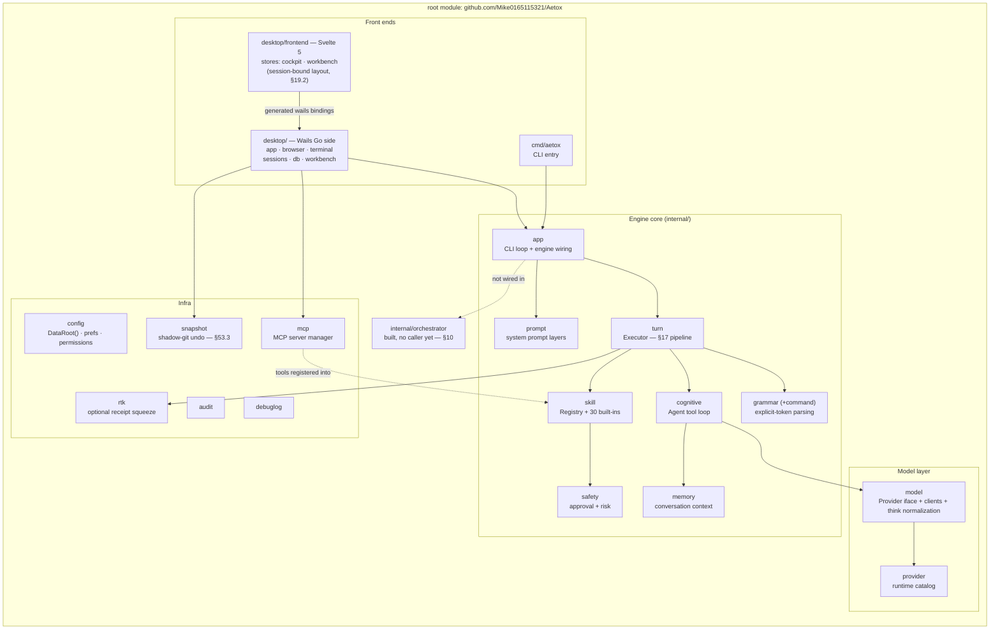
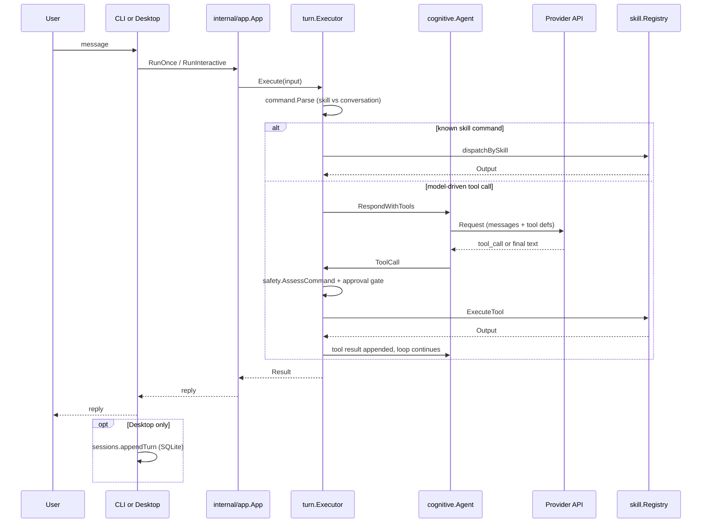
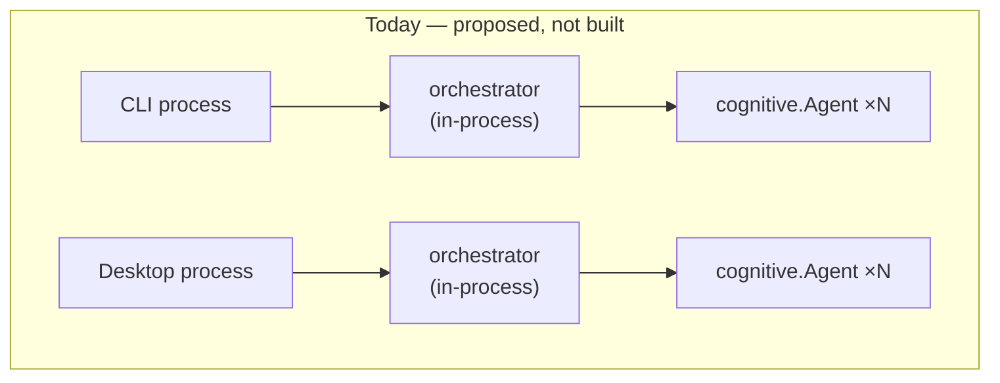

> **Pass level:** Full Mode
> **Trigger:** whole-project documentation requested at root; 3+ interacting modules (root/`internal`, `engine`, `providers`, `cli`, `desktop`), local persistence (SQLite), 11+ external provider integrations, remote code execution path (`plugin_install`).
> **Scope:** entire repository (`e:\Aetox\Aetox`), last updated 2026-07-24.
> **Evidence:** file tree, `go.work`/`go.mod`×4, `README.md`, `AETOX.md`, `docs/adr/0001`, `docs/adr/0002`, `docs/architecture/module-split-2026-07-21.md`, `docs/architecture/browser-security-2026-07-21.md`, `TEST-REPORT.md`, `MCP-SUPPORT-PLAN.md`, and direct reads of `cmd/aetox/main.go`, `internal/app/app.go`, `internal/cognitive/agent.go`, `internal/turn/executor.go`, `internal/skill/{skill,dispatcher,github_tools}.go`, `internal/safety/safety.go`, `internal/config/config.go`, `desktop/{app,browser,terminal,db,sessions,workbench}.go` and their `_test.go` files, `desktop/frontend/src/{App.svelte,style.css,lib/workbench/*}`.
> **Skipped:** Svelte component internals, provider-by-provider implementation detail (`internal/model/*.go` bodies), test file contents (existence noted, not read line-by-line).
> **Status labels used below:** `Direct` = confirmed by reading the file. `Inferred` = derived from evidence but not line-verified. `Proposed` = design intent, not yet built — never presented as existing.

This document is an evidence-first architecture map, distinct from [README.md](README.md) and [AETOX.md](AETOX.md), which are product vision/pitch documents and mix shipped state with roadmap in the same tables. Where they conflict with the code, this document follows the code.

---

## Document Map — this file is the hub

**Owner's law (2026-07-24): this is the master architecture document. Every separate architecture doc must be referenced here — a new doc gets its row in this table (and, if it records a decision, a numbered Decision section) in the same commit that creates it.**

| Doc | What it is |
|---|---|
| **This file** | Evidence-first whole-system map + the numbered Decision log (§10–§56). Start here; everything below is a spoke. |
| [README.md](README.md) · [AETOX.md](AETOX.md) · [Aetox Desktop.md](Aetox%20Desktop.md) | Product vision/pitch documents — mix shipped state with roadmap; this file wins on conflicts. |
| [docs/architecture/module-split-2026-07-21.md](docs/architecture/module-split-2026-07-21.md) | Why an `engine/`/`providers/`/`cli/` split was proposed and the migration plan (§4). ⚠️ The scaffold directories it describes were deleted in §28 — the rationale stands, the on-disk structure is gone. |
| [docs/architecture/browser-security-2026-07-21.md](docs/architecture/browser-security-2026-07-21.md) | Browser tab `postMessage` bridge — threat model, 3-check defense, residual risk (§6.6). |
| [docs/architecture/desktop-app-2026-07-22.md](docs/architecture/desktop-app-2026-07-22.md) | Layer-5 deep dive: every `desktop/` Go file + workbench frontend, read in full. |
| [docs/architecture/model-control-layer-2026-07-22.md](docs/architecture/model-control-layer-2026-07-22.md) | Layer-2 deep dive (`turn`/`cognitive`/`skill`/`safety`). ⚠️ Executor sections superseded by §17 — the doc says so itself. |
| [docs/architecture/tesseract-ocr-bundling-2026-07-22.md](docs/architecture/tesseract-ocr-bundling-2026-07-22.md) | How `image_ocr`'s Tesseract dependency reaches the user's machine per OS. |
| [docs/architecture/native-browser-embedding-2026-07-24.md](docs/architecture/native-browser-embedding-2026-07-24.md) | Native browser embedding: architecture, 7-entry failure catalog, macOS/Linux port blueprint (§18). |
| [docs/architecture/foreign-coding-clis-2026-07-27.md](docs/architecture/foreign-coding-clis-2026-07-27.md) | Why Claude Code / Codex / OpenCode may be consultants but never the provider seam; the deferred `claude-cli` profile plan (§46). |
| [docs/adr/0001-native-tool-calling-foundation.md](docs/adr/0001-native-tool-calling-foundation.md) | ADR, Accepted 2026-06-07 — native tool calling as the agentic foundation. |
| [docs/adr/0002-directional-cognition-engine.md](docs/adr/0002-directional-cognition-engine.md) | ADR, Proposed 2026-07-10 — long-term multi-AI orchestration vision (ensemble/routing/consensus). |
| [MCP-SUPPORT-PLAN.md](MCP-SUPPORT-PLAN.md) | MCP integration plan (skill.Tool is already MCP-shaped; staged rollout). |
| [PLATFORM-SUPPORT.md](PLATFORM-SUPPORT.md) | What runs where **and the live port plan** — phases, per-phase blockers, and what each one has actually been measured to do. Was a record only; §48 made it the work. |
| [SETTINGS-PARITY-PLAN.md](SETTINGS-PARITY-PLAN.md) | Settings-parity roadmap vs ZCode (Skills/Plugins → Onboarding → Usage → Commands → Preview → Subagents; Indexing deliberately skipped) — decisions recorded in §24. |
| [third_party/go-webview2/AETOX-PATCH.md](third_party/go-webview2/AETOX-PATCH.md) | Why go-webview2 is vendored+patched: stop a single browser tab's WebView2 error from `os.Exit`-crashing the whole app (§26). |
| [TEST-REPORT.md](TEST-REPORT.md) | Module-by-module test coverage and known untestable seams. CI that runs it all: [.github/workflows/ci.yml](.github/workflows/ci.yml) (§28). |
| [BENCHMARK.md](BENCHMARK.md) · [bench.ps1](bench.ps1) | Measured comparison against 13 installed rivals (disk/startup/RAM/soak) — the fairness rules, the raw results, and which numbers are **not** clean enough to publish. Every figure quoted in README.md or docs/index.html must trace back to a passing row here. |
| [LICENSE](LICENSE) · [NOTICE](NOTICE) | Apache-2.0 since §60 (MIT up to v0.7.1, §28). `NOTICE` reserves the "Aetox" name and logo and must travel with every redistribution — the anti-rebrand teeth. |
| [docs/opencode-study/](docs/opencode-study/README.md) | Source-level reading of opencode at a pinned commit (agents, MCP, permissions, plugin hooks, snapshot). |
| [docs/architecture-reference-opencode.md](docs/architecture-reference-opencode.md) · [docs/competitor-research.md](docs/competitor-research.md) | Package/feature-level comparisons that motivated the deep study above. |
| [docs/architecture-review-aetox-cli.md](docs/architecture-review-aetox-cli.md) | **Superseded** (predates `desktop/`); kept for history. |
| Tier-1 module READMEs | `internal/{app,turn,skill,model,grammar,prompt,rtk,subagent}/README.md`, `cmd/aetox/README.md`, `desktop/README.md` — hub-and-spoke rule per §12: meaningful change to a module updates its README in the same commit. [internal/subagent/README.md](internal/subagent/README.md) is also the **sub-agent profile file-format reference** (§44). |

---

## Reader's Map — the "5 layers" mental model vs. actual code

A working mental model used for planning this project splits responsibility into 5 layers: **model management**, **model-control (skills/MCP)**, **orchestrator (multi-agent)**, **UI/CLI front ends**, and **desktop app**. This section states plainly how much of that is real, separate code today, so the mental model isn't mistaken for the module boundaries in §4.

| Layer | What exists today | Where |
|---|---|---|
| 1. Model management | Real behavior, but **not its own module** — lives inside `internal/model` (interface + all 11 provider clients + factory/bootstrap) and `internal/provider` (catalog), both part of the same flat root module. `providers/` (scaffold, §4) is where this is *meant* to move — zero code there yet. |
| 2. Model-control (skill dispatch, tool-calling loop) | Real, but **three cooperating packages, not one**: `internal/skill` (Registry/Dispatcher/30 built-ins), `internal/cognitive` (Agent), `internal/turn` (Executor) — see the flow in §5. MCP is real too, in its own package `internal/mcp` (§55). |
| 3. Orchestrator (multi-agent) | **Scaffold only.** `internal/orchestrator` exists (§10) but nothing calls it — both front ends still construct exactly one `cognitive.Agent` each. |
| 4. UI/CLI front ends | Real. Two front ends — `cmd/aetox` (CLI) and `desktop/` (GUI) — both driving the same engine through `internal/app`. |
| 5. Desktop app (browser/terminal/extension surface) | Real, and the most independently-developed layer as of this session: session persistence (SQLite), native browser tab (WebView2), embedded terminal (ConPTY) — see §4.2, `TEST-REPORT.md` Module 5, and `docs/architecture/browser-security-2026-07-21.md`. |

**Answering "is it 5 clean modules now": no.** Only layer 5 (`desktop/`) is a genuinely separate Go package boundary from the rest. Layers 1–3 are conceptual groupings *within* the same flat `internal/` module (15 packages) — there is no compiler-enforced boundary stopping "layer 1" code from reaching into "layer 2" today. Treat the 5-layer split as a **planning/reading aid**, not as enforced architecture, until the `engine/providers/cli` migration (§4) actually happens.

---

## 1. Synthesis (read this first)

- **Two systems currently share the root Go module without a boundary.** `cmd/aetox` (CLI) and `desktop/` (Wails GUI) both import `internal/app`, but the GUI only uses ~2 of that package's ~35 exported methods (`NewApp`, `RunOnce`) — the rest is CLI terminal presentation (banner, status bar, spinner, Thai-language approval prompts). See [§6.1](#61-internalapp-mixes-orchestration-with-cli-terminal-presentation). `Medium`, `Direct`.
- **`internal/model` imports `internal/provider`**, so the abstraction (Provider interface, Message types) depends on the implementation catalog — already identified by the project's own [module-split proposal](docs/architecture/module-split-2026-07-21.md). Confirmed still true by direct import scan. `Medium`, `Direct`. This was the stated reason `engine/`, `providers/`, `cli/` existed as scaffolds; the coupling outlived them.
- ~~**The 3-module split (`engine/`, `providers/`, `cli/`) is an empty scaffold** — `go.mod` files only, zero source~~ — **deleted 2026-07-25 (§28)** along with `go.work`/`go.work.sum`. Four days of empty directories only obscured where the running code lives: `internal/` and `cmd/`. The migration rationale is preserved in the module-split doc; re-scaffold when migration actually starts.
- ~~`Registry.Register()` silently overwrites on name collision, and there is no built-in-vs-user-added distinction~~ — **fixed 2026-07-21**, see §6.4 below. `Register` now takes a `Source` and rejects collisions instead of overwriting.
- ~~`SearchSessions` (Desktop session search) doesn't work at all — silently returns nothing on every call~~ — **fixed 2026-07-22**, see §6.7 below. Root cause was narrower than first recorded: `snippet()` combined with `GROUP BY` in one query (not the whole query shape). Fixed with a `MATERIALIZED` CTE, single query, no two-step needed.
- **Browser tab Z-order, `postMessage` origin/replay forgery, and two frontend resize/layout bugs — all fixed 2026-07-21/22.** See §6.6 and §6.8 below.
- ~~`README.md`/`AETOX.md` advertise Anthropic support that doesn't exist in the actual provider catalog~~ — **fixed 2026-07-22**, see §6.9 below. `internal/model/anthropic.go` now implements a real client against Anthropic's Messages API (`/v1/messages`, `x-api-key`/`anthropic-version` headers, content-block request/response shape — not OpenAI-compatible, so it's its own file, not a reuse of `openai_compatible.go`), registered in the catalog and wired into the desktop provider picker (`desktop/app.go`'s `desktopProviders`). `zai` is still undocumented in both docs — that half of §6.9 is still open.

**Primary recommendation:** ~~apply the `SearchSessions` fix (§6.7)~~ — applied 2026-07-22, suite green. Next: the `Registry` Source gap (§6.4, closed) unblocks deciding what `plugin_install`'s loader (§6.5) or an MCP client should set as `Source` — `SourceExternal` alone doesn't yet distinguish them. Independently, `zai` (Z.AI/GLM) is fully implemented but still absent from `README.md`/`AETOX.md`'s provider tables — same category of doc-drift as the now-fixed Anthropic gap, worth a follow-up pass.

---

## 2. System Overview (confirmed)

Aetox is a single-user, local-first AI coding/personal-assistant agent with two front ends sharing one Go engine:

- **CLI** (`cmd/aetox`) — interactive REPL or one-shot invocation, Thai-language terminal UI.
- **Desktop** (`desktop/`) — Wails v2 + Svelte 5 GUI with chat, a tabbed workbench (Review/Terminal/Files/Browser), persistent SQLite-backed sessions, and an agent-controlled native browser (WebView2).

Both front ends drive the same tool-calling agent loop: user message → `cognitive.Agent` → provider API (model-driven tool calls) → `turn.Executor` dispatches to one of the 27 model-facing built-in skills → result folded back into the conversation.

No backend server, no cloud database, no multi-tenant concerns — everything runs on the user's machine against third-party model provider APIs.

---

## 3. System Boundary


```mermaid
flowchart LR
    User(("User"))
    CLI["CLI — cmd/aetox\nThai-language REPL / one-shot"]

    subgraph DesktopApp["Desktop GUI — desktop/ (Wails v2 · Windows-only today, §18)"]
        direction TB
        FE["Svelte 5 frontend\nchat · composer (project-focus + model pickers, §19)\nworkbench tabs — layout persisted per session (§19.2)"]
        Bindings["Wails-bound App\ndesktop/app.go\n(bindings return [] never nil — §19.3)"]
        BrowserHost["Native browser host — desktop/browser.go\nWebView2 child windows on one STA thread\nparent found by PID, never title (§18)"]
        Term["Embedded terminals\ndesktop/terminal.go (ConPTY)"]
        Sessions["Session persistence + FTS5 search\ndesktop/sessions.go · db.go\nunfocused chats → their own bucket (§19.1)"]
        FE <--> Bindings
        Bindings --> BrowserHost
        Bindings --> Term
        Bindings --> Sessions
    end

    subgraph Engine["Engine — internal/* (one shared engine, both front ends)"]
        direction TB
        Grammar["grammar (+command facade)\nexplicit tokens only — no NL inference (§17)"]
        Turn["turn.Executor\nexplicit skill → direct dispatch\nelse model tool loop, else streaming chat"]
        Cog["cognitive.Agent\nunbounded tool loop — brakes are\napproval gate + ctx cancel"]
        Skills["skill.Registry — 30 built-ins (27 model-facing)\n+ 6 workbench tools (SourceWorkbench)\n+ 3 sub-agent tools (task/task_result/task_answer)\n+ MCP tools via mcp.Manager"]
        Safety["safety — ask / unsafe-only / full-access\nper-command risk rules"]
        Prompt["prompt — system prompt layers\n(identity · environment · user · project)"]
        RTK["rtk (optional)\nsqueezes tool receipts"]
        Model["model — Provider interface\n+ all provider clients + backstops (§17)"]
        Grammar --> Turn
        Turn --> Cog
        Cog --> Model
        Turn --> Skills
        Skills --> Safety
        Turn --> RTK
        Prompt -->|bootstrap| Cog
    end

    User --> FE
    User --> CLI
    CLI --> Engine
    Bindings --> Engine

    Providers[["13 Provider APIs (verified in code)\nOpenRouter, OpenAI, Anthropic, DeepSeek, Z.AI,\nGemini, Groq, Mistral, Together,\nPerplexity, Cohere, LM Studio,\nOllama (local)"]]
    GH[["GitHub API\ngithub_repo_summary · plugin_install · rtk self-install"]]
    MCPExt[["Configured MCP servers"]]
    Web[["Live web pages\n(inside native browser tabs)"]]
    FS[("Local filesystem + shell + git\nrooted at project, or ~/aetox when unfocused (§19.1)")]

    Model --> Providers
    Skills --> GH
    Skills --> FS
    Skills -.-> MCPExt
    BrowserHost --> Web

    subgraph Data["DataRoot() — every Aetox-owned file, one directory (§14)"]
        DB[("SQLite + FTS5\nsessions per project bucket")]
        Profiles[("WebView2 profiles\nwebview/app · webview/browser")]
        Misc[("model prefs · permissions\ndebug logs · audit log · rtk binary")]
    end

    Sessions --> DB
    BrowserHost --> Profiles
    Engine --> Misc
```

- **Confirmed external dependencies:** 13 named provider HTTP APIs (14 catalog entries, counting the built-in `aetox` fallback), verified against the actual catalog map in `internal/provider/catalog.go` (not README's list — see §6.9, they differ), GitHub REST API (`internal/skill/github_tools.go`), local shell (`internal/skill/shell.go`), local filesystem, SQLite (confirmed `modernc.org/sqlite`, `Direct` — `desktop/db.go:17`), Windows WebView2 (`desktop/browser.go`, Win32 syscalls — Windows-only, `Direct`).
- **Not observed:** no outbound telemetry/analytics code found in `internal/` or `desktop/` during inspection (`Inferred`, `Verify first: Yes` — not exhaustively grepped for every HTTP client call).

---

## 4. Module Map


```mermaid
flowchart TB
    subgraph rootmod["root module: github.com/Mike0165115321/Aetox"]
        direction TB
        subgraph fronts["Front ends"]
            cmd["cmd/aetox\nCLI entry"]
            dfe["desktop/frontend — Svelte 5\nstores: cockpit · workbench\n(session-bound layout, §19.2)"]
            dgo["desktop/ — Wails Go side\napp · browser · terminal\nsessions · db · workbench"]
            dfe -->|generated wails bindings| dgo
        end
        subgraph engcore["Engine core (internal/)"]
            app["app\nCLI loop + engine wiring"]
            turn["turn\nExecutor — §17 pipeline"]
            cognitive["cognitive\nAgent tool loop"]
            skill["skill\nRegistry + 30 built-ins"]
            safety["safety\napproval + risk"]
            grammar["grammar (+command)\nexplicit-token parsing"]
            prompt["prompt\nsystem prompt layers"]
            memory["memory\nconversation context"]
        end
        subgraph modellayer["Model layer"]
            model["model\nProvider iface + clients + think normalization"]
            provider["provider\nruntime catalog"]
        end
        subgraph infra["Infra"]
            config["config\nDataRoot() · prefs · permissions"]
            mcp["mcp\nMCP server manager"]
            snapshot["snapshot\nshadow-git undo — §53.3"]
            rtk["rtk\noptional receipt squeeze"]
            audit["audit"]
            debuglog["debuglog"]
        end
        orch["internal/orchestrator\nbuilt, no caller yet — §10"]

        cmd --> app
        dgo --> app
        app --> turn
        turn --> grammar
        turn --> cognitive
        turn --> skill
        turn --> rtk
        skill --> safety
        cognitive --> model
        cognitive --> memory
        model --> provider
        app --> prompt
        dgo --> mcp
        dgo --> snapshot
        mcp -.->|tools registered into| skill
        app -.->|not wired in| orch
    end

```

`rootmod` is the whole picture — one module, no workspace. The `engine/`/`providers/`/`cli/` scaffold that used to sit beside it was deleted in §28; the split it was meant to become is still [proposed](docs/architecture/module-split-2026-07-21.md), just no longer half-present on disk.

### 4.1 `internal/` packages (root module, `Direct`)

Per-module docs (hub-and-spoke, §12): Tier-1 modules carry a `README.md` in their own folder — linked in the **Docs** column. Front-end modules: [cmd/aetox/README.md](cmd/aetox/README.md), [desktop/README.md](desktop/README.md) (§4.2).

| Package | Files | Role | Docs |
|---|---|---|---|
| `app` | 4 | CLI interactive loop + orchestration wiring (`NewApp`, `RunOnce`, `RunInteractive`, banner/status bar, approval-mode picker). Shared with desktop only via `NewApp`/`RunOnce` — see [§6.1](#61-internalapp-mixes-orchestration-with-cli-terminal-presentation). | [README](internal/app/README.md) |
| `cognitive` | 2 | `Agent` — builds provider requests, runs the (unbounded, §11 "related cleanup") tool-call loop, streams responses. | [model-control deep dive](docs/architecture/model-control-layer-2026-07-22.md) |
| `turn` | 3 | `Executor` — turn pipeline (§17): explicit skill command → direct dispatch, else model-driven tool loop, else streaming chat; approval gate on every tool path. No NL intent inference — that layer was deleted 2026-07-23. | [README](internal/turn/README.md) |
| `skill` | 32 | `Registry`/`Dispatcher` + all 30 built-in tools. The 27 the model is offered: read/write/edit/delete/list/glob/grep/apply_patch/notebook_edit/diagnostics/symbol/shell/shell_output/shell_kill/git/time/web_fetch/web_search/image_ocr/video_ocr/pdf_read/audio_transcribe/github_repo_summary/github_search/github_read_file/github_list_files/plugin_install. The other 3 (`echo`/`fs`/`help`) are CLI-only and never sent to the model. | [README](internal/skill/README.md) |
| `model` | 14 | `Provider` interface, `Message`/`Request`/`Response` types, factory, bootstrap, and **all 11 provider client implementations** in the same package. Imports `internal/provider` (see [§6.2](#62-modelprovider-imports-providers-catalog)). | [README](internal/model/README.md) |
| `provider` | 2 | Provider runtime catalog (names, capabilities) — separate from `model`'s own `provider_catalog.go`, which is a second source for similar data (`Inferred`, `Verify first: Yes` — not diffed line-by-line). | — |
| `safety` | 2 | 3-tier approval (`ask`/`unsafe-only`/`full-access`), per-command risk assessment (`AssessCommand`, git/fs-specific rules). | [model-control deep dive](docs/architecture/model-control-layer-2026-07-22.md) |
| `command` | 3 | Input intent parsing facade — thin aliases delegating to `grammar` (the real implementation). | see `grammar` |
| `config` | 2 | Config loading, `.env`, model-preference persistence (JSON on disk). Owns `DataRoot()` — the single directory every Aetox-owned file lives under, see [§14](#14-decision--unified-data-root-2026-07-23-cleaning-up-where-aetox-writes-its-own-data). | — |
| `think` | 2 | Thinking-level normalization per provider. | — |
| `plan` | 2 | Execution planning (conversation vs. skill classification, per ADR 0001). | — |
| `memory` | 1 | Context/conversation memory. | — |
| `audit` | 2 | Execution audit log. | — |
| `debuglog` | 1 | Debug logging. | — |
| `grammar` | 2 | Input classification rules engine (Kind/Intent/slash parsing) behind the `command` facade. | [README](internal/grammar/README.md) |
| `orchestrator` | 2 | Multi-`cognitive.Agent` lifecycle tracker (`Spawn`/`Get`/`Stop`/`List`). Built this session, **not called by `cmd/aetox` or `desktop/app.go` yet** — see [§10](#10-decision--agent-orchestrator-layer-proposed-approved-2026-07-21) for scope and naming rationale. | §10 |
| `prompt` | 2 | System prompt assembly (identity/environment/user-global/project layers) — both front ends call it, replacing two near-duplicate `buildSystemPrompt` copies. Built 2026-07-22, see [§11](#11-decision--promptcontext-layer-proposed-being-settled-section-by-section-2026-07-22). | [README](internal/prompt/README.md) |
| `snapshot` | 1 | Shadow-git undo: a per-project git repository under `DataRoot()` with its work tree pointed at the real project, so a snapshot costs one `write-tree` and the user's own repository never notices. Bound into `desktop/app.go`; **no UI button yet** — see [§53.3](#533-undo--internalsnapshot). | §53.3 |
| `rtk` | 4 | Optional bridge to the owner's `rtk` CLI — shrinks tool-call output before it's wrapped into the model's receipt (`turn.modelToolReceipt`). v1: `git`+`shell` only. Auto-installs itself once from GitHub if missing (`install.go`), no NSIS changes. Built 2026-07-22, see [§13](#13-decision--rtk-integration-proposed-being-settled-section-by-section-2026-07-22). | [README](internal/rtk/README.md) |

### 4.2 `desktop/` (root module, `Direct`)

Module doc: [desktop/README.md](desktop/README.md) (replaced the Wails template boilerplate 2026-07-22).

| File | Role |
|---|---|
| `app.go` (665 lines) | Wails-bound `App` struct — the GUI's own type, distinct from `internal/app.App`. Owns `bootstrapFromConfig` (wires `internal/app.App` + `cognitive.Agent` + extra skills), provider/model switching, project tree/file read-write for the Files pane. |
| `sessions.go` | Per-project session persistence: `ListSessions`, `SearchSessions` (FTS5 — fixed 2026-07-22, see §6.7 below), `LoadSession`, transcript ↔ `model.Message` conversion. |
| `db.go` (77 lines) | SQLite connection + schema. `App.dbDir` overrides the default `<UserConfigDir>/aetox` directory (empty = production default) — a test seam added this session, not a behavior change. |
| `browser.go` (~470 lines) | Native WebView2 tab host via raw Win32 syscalls (`wndClassExW`, message loop) — Windows-specific, no build-tag isolation observed (`Inferred`, `Verify first: Yes`). Z-order and `postMessage`-forgery issues fixed this session — see §6.6 below and `docs/architecture/browser-security-2026-07-21.md`. |
| `workbench.go` | `browser_open`/`browser_read`/`browser_click`/`browser_type` implemented as `skill.Tool` — the agent drives the browser itself, distinct from the user-facing `BrowserOpen`/`BrowserNavigate` etc. in `browser.go`. `browser_read` tags interactive elements with `data-aetox-ref` (see `textScript`, `browser.go`) so `browser_click`/`browser_type` can target one by number — same ref-based pattern as Playwright MCP's accessibility tree and browser-use's element index. This is the pattern [MCP-SUPPORT-PLAN.md](MCP-SUPPORT-PLAN.md) recommends reusing for an MCP adapter. |
| `terminal.go` | Embedded shell session lifecycle (`TerminalStart`/`Write`/`Resize`/`Close`), independent of `internal/skill/shell.go` (that one is the agent's `shell` tool; this is the user-facing terminal pane). |
| `main.go` (39 lines) | Wails bootstrap. |

Test files added this session (`Direct`, all passing except the one noted bug): `app_test.go`, `browser_test.go`, `db_test.go`, `sessions_test.go`, `terminal_test.go` — per-file coverage detail in `TEST-REPORT.md` Module 5. `TerminalStart`/`TerminalClose`/`browser.go`'s Win32 window plumbing remain **not** unit-testable (documented there): `wailsruntime.EventsEmit` calls `log.Fatalf`/`os.Exit(1)` when the context isn't a real Wails-bound one, which a test never has.

`desktop/frontend/src/lib/`: `stores/` (Svelte 5 runes: `cockpit.svelte.ts`, `workbench.svelte.ts`), `services/cockpit.ts` (Go binding wrappers), `workbench/*.svelte` (Review/Files/Browser panes). Not read in detail — structure only (`Direct` for existence, `Inferred` for internal behavior), except `App.svelte` (resize-handle logic, read in full — see §6.8) and `workbench/Workbench.svelte`/`style.css` (address-bar + blank-state layout, read in full — see §6.8).

---

## 5. Primary Workflow — one chat turn


```mermaid
sequenceDiagram
    participant U as User
    participant Front as CLI or Desktop
    participant App as internal/app.App
    participant Turn as turn.Executor
    participant Agent as cognitive.Agent
    participant Provider as Provider API
    participant Skill as skill.Registry

    U->>Front: message
    Front->>App: RunOnce / RunInteractive
    App->>Turn: Execute(input)
    Turn->>Turn: command.Parse (skill vs conversation)
    alt known skill command
        Turn->>Skill: dispatchBySkill
        Skill-->>Turn: Output
    else model-driven tool call
        Turn->>Agent: RespondWithTools
        Agent->>Provider: Request (messages + tool defs)
        Provider-->>Agent: tool_call or final text
        Agent->>Turn: ToolCall
        Turn->>Turn: safety.AssessCommand + approval gate
        Turn->>Skill: ExecuteTool
        Skill-->>Turn: Output
        Turn->>Agent: tool result appended, loop continues
    end
    Turn-->>App: Result
    App-->>Front: reply
    Front-->>U: reply
    opt Desktop only
        Front->>Front: sessions.appendTurn (SQLite)
    end
```

Desktop-specific additions confirmed in `desktop/app.go`/`sessions.go`: every turn is persisted via `appendTurn` after `SendMessage` returns; sessions are keyed per project root (`projectKey`); full-text search is FTS5-backed.

---

## 6. Debt Register

### 6.1 `internal/app` mixes orchestration with CLI terminal presentation

- **Evidence:** `internal/app/app.go` exports `NewApp`, `RunOnce`, `RunInteractive`, `PrintBanner`, `printStatusBar`, `printPromptLine`, `pickApprovalMode` (Thai-language console prompts), `showHelp`, `showSkillPalette` — all in one package/type. `desktop/app.go:275-289` (`SendMessage`) calls only `a.chat.RunOnce`; no desktop code path reaches `RunInteractive`, `PrintBanner`, or the approval-mode console picker.
- **Impact:** the GUI binary compiles and links terminal-rendering code it never calls. Any change to CLI presentation (banner, status bar, Thai approval prompts) risks breaking desktop's build even though desktop doesn't use those methods. The project's own [module-split plan](docs/architecture/module-split-2026-07-21.md) intends to move this whole package to `engine/app/` labeled "shared by CLI + desktop" — migrating as-is carries the same mixing forward.
- **Severity:** `Medium` (taxes the planned migration; doesn't break anything today).
- **Confidence:** `Direct`.
- **Direction (proposed, needs approval):** split `internal/app` into an orchestration piece (`NewApp`, `RunOnce`, turn-executor wiring — genuinely shared) and a CLI-presentation piece (banner, status bar, interactive loop, approval picker) before or during the `engine/` migration, so `engine/app/` doesn't inherit terminal-only code.

### 6.2 `model` imports `provider` — abstraction depends on implementation

- **Evidence:** `internal/model/factory.go`, `provider_catalog.go`, `thinking_capabilities.go` import `internal/provider`. Documented and accepted as the reason for the 3-module split in [module-split-2026-07-21.md:8-16](docs/architecture/module-split-2026-07-21.md).
- **Impact:** any consumer of `model.Provider`/`model.Message` transitively pulls in the full provider catalog; can't depend on the interface alone.
- **Severity:** `Medium`.
- **Confidence:** `Direct`.
- **Direction:** already proposed (`engine/model` interface-only, `providers/` for implementations) — no new recommendation, just confirming the existing plan matches the evidence. The empty scaffold that used to stand in for it is gone (§28); the plan is a plan again, not a half-built directory.

### 6.3 Two provider catalogs

- **Evidence:** `internal/model/provider_catalog.go` and `internal/provider/catalog.go` both exist; not diffed for exact overlap.
- **Impact:** unclear without deeper read — possibly one is the canonical list and the other is a thin re-export, or they've drifted.
- **Severity:** `Low`–`Medium` (`Unverified` which).
- **Confidence:** `Inferred`, `Verify first: Yes`.
- **Direction:** none proposed — needs verification first, listed as an open question (§7).

### 6.4 Skill registry has no core/user-added boundary — FIXED 2026-07-21

- **Original evidence:** `internal/skill/skill.go:44` `Registry.Register()` overwrote on key collision with no warning. `internal/skill/defaults.go` registered all 17 built-ins and `plugin_install` into the same flat map. Documented in detail in [MCP-SUPPORT-PLAN.md:37-51](MCP-SUPPORT-PLAN.md).
- **Impact (was):** couldn't gate trust levels differently (built-in vs. third-party MCP/plugin tool), couldn't show "core" vs. "installed" separately in the Settings UI, and a user-installed skill could silently shadow a built-in tool by name.
- **Severity:** was `High` (blocked safe MCP support).
- **Fix applied:** [internal/skill/skill.go](internal/skill/skill.go) — added `Source` type (`SourceBuiltin`/`SourceExternal`), `Registry` now stores `{skill, source}` pairs and exposes `SourceOf(name)`. `Register(skill, source)` returns an error instead of silently overwriting on name collision.
  - [internal/skill/defaults.go](internal/skill/defaults.go) — all 12 built-ins register with `SourceBuiltin`; a collision among built-ins now panics at startup (programmer error, not a runtime condition).
  - [desktop/app.go](desktop/app.go) `bootstrapFromConfig` — `extraSkills` (the `workbenchTools`: `browser_open`/`browser_read`/`browser_click`/`browser_type`) register with `SourceExternal`; a collision is logged via `debuglog.Msg` and the skill is skipped rather than silently overwriting a built-in.
  - Tests: [internal/skill/skill_test.go](internal/skill/skill_test.go) (`TestRegisterTracksSource`, `TestRegisterRefusesCollision`).
- **Still open:** `SourceExternal` is one bucket for everything non-built-in — MCP and `plugin_install`-loaded skills don't yet have their own distinct source values, and nothing consumes `SourceOf` yet (no per-source permission gating, no Settings UI grouping). Add `SourceMCP`/`SourcePlugin` when those integrations are actually built, not before.
- **Confidence:** `Direct` — `go build ./...` and `go test ./internal/skill/...` pass.

### 6.5 `plugin_install` downloads files but nothing loads them back

- **Evidence:** `internal/skill/github_tools.go` implements `plugin_install` fully (fetches manifest, path-traversal-checked, writes to `~/.agents/skills/<name>/`) but `internal/skill/defaults.go` only registers compiled-in Go skills — no bootstrap-time scan of the install directory. Confirmed by direct read of `validatePluginManifest`/`normalizeManifestRelativePath` (traversal guards present) and by `MCP-SUPPORT-PLAN.md:17-23`.
- **Impact:** "installing a plugin" via this tool currently has no observable effect after download completes.
- **Severity:** `Medium` (feature is inert, not unsafe — path traversal is guarded and manifest type is restricted to `"skill-bundle"`).
- **Confidence:** `Direct`.
- **Direction:** proposed in `MCP-SUPPORT-PLAN.md` — write a loader that scans the install directory at `bootstrapFromConfig` time; decide execution model for downloaded (non-compiled) skills first.

### 6.6 Browser tab Z-order + `postMessage` forgery — FIXED 2026-07-21/22

- **Evidence (Z-order):** `desktop/browser.go`'s tab window used only `MoveWindow`/`ShowWindow` — neither changes Z order. Two independent WebView2 controllers in one top-level window each composite via DirectComposition; without an explicit Z-order call the tab's pixels could render behind the app's own webview — confirmed live (page navigated successfully, per-page title updated, but the tab area stayed solid black, the app's own background color).
- **Evidence (`postMessage` forgery):** `onMessage` trusted a page's `postMessage({__aetox:...})` envelope with no check that the page was the one it claimed to be, or that a `"text"` response corresponded to a specific `BrowserGetText` call. `args.GetSource()` (real origin, page can't forge) was available on `ICoreWebView2WebMessageReceivedEventArgs` but unused.
- **Impact:** Z-order bug made the entire browser tab feature appear non-functional (page loads, nothing visible). The `postMessage` gap allowed a malicious page to (a) claim an arbitrary `url` in a `"meta"` message — address-bar spoofing, a phishing enabler — and (b) inject fabricated `"text"` content into the agent's `BrowserGetText` read path — a prompt-injection vector distinct from the page's own real (untrusted) DOM content.
- **Severity:** was `High` for the `postMessage` gap (security), `Medium` for Z-order (functionality, not security).
- **Fix applied:** `procSetWindowPos` + `HWND_TOP` on tab creation/resize/show ([browser.go](desktop/browser.go)). `onMessage` now requires `sameOrigin(source, m.URL)` for `"meta"`, and a matching per-request nonce (`textToken`, minted by `BrowserGetText`, `crypto/rand`) for `"text"`. Full threat model and residual risk in [docs/architecture/browser-security-2026-07-21.md](docs/architecture/browser-security-2026-07-21.md).
- **Confidence:** `Direct` — 12 new tests in `browser_test.go`, `go build`/`go vet` clean.

### 6.7 `SearchSessions` returned nothing, ever — FIXED 2026-07-22

- **Evidence:** `desktop/sessions.go`'s `SearchSessions` joined `messages_fts` (FTS5) with `messages`/`sessions` in one query and called `snippet(messages_fts, ...)` in the same statement. That shape returns SQL error `"unable to use function snippet in the requested context"` from `modernc.org/sqlite` every time — and `SearchSessions` swallows the error (`if err != nil { return out }`), so the function always silently returned zero results instead of surfacing a failure. That silent swallow is why the bug was invisible outside the failing test.
- **Root cause (narrowed from the original record):** not the whole join shape — specifically `snippet()` + `GROUP BY` in one statement. Probing each variant against `modernc.org/sqlite v1.54.0` showed the same query passes with either `snippet()` or `GROUP BY` removed, and a plain subquery doesn't help (the planner flattens it back into the failing shape).
- **Fix applied:** `snippet()` moved into a `WITH f AS MATERIALIZED (...)` CTE, which the planner may not flatten; the outer query keeps the joins, `GROUP BY s.id` dedupe, and ordering. Single query — the originally proposed two-step rewrite wasn't needed.
- **Confidence:** `Direct` — [`TestSearchSessionsFindsMatch`](desktop/sessions_test.go) now passes (it verified both a hit and a miss), full `desktop` suite green.

### 6.8 Frontend layout bugs — FIXED 2026-07-22

Three distinct issues surfaced while verifying the Z-order fix (§6.6) visually, all in `desktop/frontend/src/`:

- **Blank-state text clipped instead of wrapping** — [style.css](desktop/frontend/src/style.css) `.insp-blank-title`/`.insp-blank-sub` sat in a `align-items:center` flex column with no `max-width`, so they sized to their own text's natural width instead of the pane's — at a narrow pane width the text overflowed and was hard-clipped by the ancestor's `overflow:hidden` instead of wrapping. **Fixed:** added `max-width:100%` + `text-align:center` + container padding.
- **Resize drag could get stuck and grow a panel forever** — dragging the sidebar/inspector resize handle across the native WebView2 browser window (§6.6) let the OS deliver the drag-ending `pointerup` to that separate native window instead of the DOM, so the drag state never cleared and any later mouse movement kept growing the panel. **Fixed:** `setPointerCapture` on the handle at drag start ([App.svelte](desktop/frontend/src/App.svelte)), with `pointercancel`/`blur` as backstops.
- **Panel width had no maximum at all** — `clampSize` was `Math.max(min, px)`, deliberately unbounded per a prior code comment ("neither side panel can squeeze [main] into the overlap bug from before"). Confirmed by the user that unbounded dragging itself is undesirable (pushes chat content off-screen, `.app`'s `overflow-x:auto` masking it as a horizontal scrollbar rather than a visible error). **Fixed:** max is now computed at drag time as `window.innerWidth − (other panel's current width) − 360 (main's own grid floor) − 12 (two 6px handles)` — keeps main's floor guarantee intact (the thing the original unbounded design was protecting) while capping runaway growth.
- **Confidence:** `Direct` — `svelte-check`: 0 errors after each change; visually confirmed against the user's screenshots for the first and third.

### 6.9 README.md/AETOX.md advertised Anthropic support that didn't exist; still omit a real provider (Z.AI) that does

- **Status: Anthropic half fixed 2026-07-22.** `internal/provider/catalog.go` now registers `anthropic` (aliases `anthropic`/`claude`, `ANTHROPIC_API_KEY`) and `internal/model/anthropic.go` implements a real client against Anthropic's Messages API — its own file, not a reuse of `openai_compatible.go`, since Anthropic's wire format differs on every axis that matters (`system` is a top-level field not a message, `x-api-key`/`anthropic-version` headers instead of `Authorization: Bearer`, content-block request/response shape instead of a flat string, different SSE event types for streaming). Wired through the existing `Provider`/`StreamingProvider`/`ReasoningProvider` interfaces via `internal/model/factory.go`, so `BootstrapProvider`'s fallback-to-noop path (still described below) no longer triggers for `--model-provider anthropic`. The desktop GUI's provider picker (`desktop/app.go`'s `desktopProviders` allowlist) was updated in the same pass — the engine catalog alone wasn't enough to surface it in the Settings dropdown.
- **What's still open:** `zai` (Z.AI / GLM) is fully registered and implemented but is **still not mentioned anywhere** in `README.md` or `AETOX.md`. Same category of issue as the Anthropic gap was — a real provider missing from user-facing docs — just not yet addressed.
- **`BootstrapProvider`'s silent fallback — no longer silent in the desktop app, 2026-07-28.** The fallback itself stays: `internal/model/bootstrap.go` still catches any `NewProvider` error and swaps in the `noop` stub, because a window that goes dead on a bad provider is worse than one that keeps answering. What changed is that the reason now reaches the user. Reported as "LM Studio can't connect": with its server off, `ResolveDefaultModel` correctly returns `""` (local runtimes carry no catalog fallback model on purpose), `NewOpenAICompatibleProvider` returns `ErrMissingModel`, the bootstrap falls back — and every `Switch*` method in `desktop/app.go` checked only `a.chat == nil`, which a successful fallback never trips. The picker showed `lmstudio / —` with no error while Aetox's own provider answered. Three fixes, one per layer: `clarifyBootstrapError` replaces the misleading "model name is required" with the endpoint that went unanswered (an empty model on a provider with no catalog fallback means the server is down, not that the user forgot to type a name); `bootstrapFromConfig` returns its error, `applyConfig` stores it as `App.modelErr`, and one `modelSwitchResult` helper replaces the six copies of the old guard; `ModelInfo.Warning` carries it to the composer's model menu and the Settings provider panel. The CLI half of this (`--model-provider` typo'd into a silent noop session) is unchanged and still worth a look.
- **Base URL was read-only, so a non-default endpoint was unreachable — fixed 2026-07-28.** Found while confirming the above: LM Studio's server port is user-configurable (`~/.lmstudio/.internal/http-server-config.json`), and Settings displayed the catalog default in a read-only field with no way to override it. `ModelPreference.ModelBaseURL` did exist but held one slot for whatever provider was active, so switching away reset it and the custom URL was gone. Now `ModelPreference.ModelBaseURLs` is keyed per provider (same shape as `ModelAPIKeys`), `resolveBaseURLForProvider` is the single answer to "where do we dial this provider" that discovery, the connection test, and every switch share, and `App.SetProviderBaseURL` persists it — validated as an http/https URL at the boundary, empty clears the override. The legacy single slot is still read for old preference files.
- **A thinking model's whole answer was dropped on the OpenAI-compatible path — fixed 2026-07-28.** Found only by running the live test the two fixes above deserved and had not had (`desktop/live_provider_test.go`, `AETOX_LIVE=1`): against a real keyless local server, `TestProviderConnection` failed with "response has empty text" on a server that had answered HTTP 200 with a valid completion. `Message.ReasoningContent` is tagged `reasoning_content` — DeepSeek's spelling — but Ollama's OpenAI-compatible endpoint and llama.cpp (LM Studio's runtime) send plain `reasoning`, so every reasoning token was discarded and a reply that was all reasoning read as empty. `openAIMessage.reasoningText()` now reads whichever field arrived, in both `Complete` and `StreamComplete`. This is the same bug `ollamaMessage.reasoning` already fixed for the native Ollama client in `internal/model/ollama.go` — fixed there, never carried across to the shared OpenAI-compatible client, and no unit test caught it because every fixture used DeepSeek's spelling.
- **The warning was a snapshot and got stuck — fixed 2026-07-28.** Reported one screenshot later: the red banner still claiming "start its server" while the model list directly beneath it had just been discovered from that exact endpoint. It was not lying about the engine — the bootstrap that failed while the server was down is still the one running, on the aetox fallback — but nothing ever re-tried, so recovery required the user to re-select the provider by hand. `App.RetryActiveProvider` re-bootstraps only when `modelErr != nil` (and re-resolves the model name, which a failed local bootstrap leaves empty), called from both places the banner is visible: Settings' `selectProvider` and the composer's `refreshProviderDerived`, each gated on a successful model discovery — the list loading IS the proof the endpoint answers. Clearing the banner without re-bootstrapping would have been the actual lie.
- **Confidence:** `Direct` — Anthropic fix verified by `go build ./...`, `go vet ./...`, and `go test ./internal/...` all passing, plus a direct read of the new client, factory wiring, and catalog entry.

### 6.10 Permission per-tool (pattern-based) + skill auto-discovery — FIXED 2026-07-22

- **Original gap:** per `MCP-SUPPORT-PLAN.md` and `docs/architecture-reference-opencode.md` §5, Aetox only had a 3-tier `ApprovalMode` (ask/unsafe-only/full-access) with no per-tool pattern override, and no scan of `~/.agents/skills/`/`~/.claude/skills/` for externally authored skills — two of the four gaps opencode's own comparison doc named.
- **Fix applied — permissions:** [internal/safety/safety.go](internal/safety/safety.go) adds `PermissionConfig`/`PermissionRule` (`Tool`+`Pattern` glob match, `Action` allow/ask/deny, last-match-wins — opencode's own semantics). `turn.Executor.resolveApproval` (new, [internal/turn/executor.go](internal/turn/executor.go)) checks it before falling back to `ApprovalMode`/`ShouldPrompt`, replacing the `if safety.ShouldPrompt(...)` gate at all 3 call sites that used to call it directly. A matched `deny`/`allow` rule skips the prompt entirely (including under `full-access`, where `ask` now still forces a prompt). Persisted via `config.LoadPermissions`/`SavePermissions` (`~/.config/aetox/permissions.json`, same shape as `model-preference.json`) and threaded through `internal/app.Options.Permissions` into all 4 `turn.NewExecutor` call sites, and wired at both bootstrap points (`cmd/aetox/main.go`, `desktop/app.go`'s `bootstrapFromConfig`).
- **Fix applied — auto-discovery:** [internal/skill/discovery.go](internal/skill/discovery.go) adds `DiscoverSkills`/`RegisterDiscovered`, scanning `~/.agents/skills/` then `~/.claude/skills/` (`DefaultDiscoveryPaths`, opencode's own scan order) for `<dir>/*/SKILL.md`, parsing `name`/`description` frontmatter + a markdown body into a `markdownSkill` (`skill.Tool` — invoking it just returns the body as tool output, the model follows the instructions itself, same shape as opencode/Claude Code skills). Registered as `SourceExternal`; a name collision with a built-in is reported and skipped, not fatal (mirrors the existing `extraSkills` collision handling). Wired into both `cmd/aetox/main.go` and `desktop/app.go`'s bootstrap.
- **Still open:** `plugin_install`'s downloaded bundles ([internal/skill/github_tools.go](internal/skill/github_tools.go), §6.5) are only picked back up by the new discovery scan if the bundle happens to contain a `SKILL.md` — the manifest format doesn't guarantee one, so §6.5's loader gap is only partially closed by this. No Settings UI exists yet to edit `permissions.json` rules (JSON-only for now). MCP itself is still not built — see `MCP-SUPPORT-PLAN.md`, which this closes 2 of the 4 originally-named gaps for (auto-discovery, permission pattern); MCP client and plugin hook system remain.
- **Confidence:** `Direct` — `go build ./...`/`go vet ./...` clean in both modules, new tests in `internal/safety/safety_test.go`, `internal/turn/executor_test.go`, `internal/config/config_test.go`, `internal/skill/discovery_test.go` all pass; full suite otherwise unchanged (`desktop`'s pre-existing `TestSearchSessionsFindsMatch` failure, §6.7, is unrelated and still open).

---

## 7. Open Questions

- Are `internal/model/provider_catalog.go` and `internal/provider/catalog.go` duplicates, or does one wrap the other? (§6.3) — affects how cleanly `providers/` can absorb both during migration.
- Is `desktop/browser.go`'s direct Win32 syscall usage guarded by a build tag for non-Windows, or is desktop Windows-only by design? Not confirmed either way.
- ~~`go.work.sum`: commit it or gitignore it?~~ — moot since §28 deleted the workspace; there is one module and no `go.work`.

## 8. Risks

- ~~**Migration drift risk:** `engine/providers/cli` scaffolds exist with zero code~~ — removed at the source (§28): the scaffolds are deleted, so there is no stale dependency graph left to drift. The `internal/model` → `internal/provider` coupling that motivated the split is still open (§6.3).
- **MCP readiness risk:** per `MCP-SUPPORT-PLAN.md`, adding an MCP client before resolving §6.4 (registry core/user-added split) means third-party tool code would run under the same 3-tier safety model designed for trusted, self-written built-ins.

## 9. AI Agent Notes

- **Documentation discipline (owner-set, 2026-07-22):** this repo's architecture documentation follows the `senior-architect-agent` skill's discipline — evidence-first (`Direct`/`Inferred`/`Proposed`, `Verify first: Yes`), describe-then-judge findings (evidence + impact + severity + confidence, never bare style opinions), and numbered Decision sections for new design before implementation. This was a deliberate choice, not a retrofit: §§2–10 of this file already matched the skill's Full Mode template set (overview/boundary/module-map/workflow/debt-register/open-questions/risks/agent-notes/decision-record) before the skill was ever invoked — confirmed 2026-07-22. Module-level `README.md` files (§12) are the skill's "file responsibility map," kept plain/descriptive rather than evidence-tagged line-by-line — tagging is for claims under dispute (debt, risk, inferred behavior), not for code the writer read directly.
- **Documentation rule (owner-set, 2026-07-22):** docs live with their module, not as loose root files. A change that meaningfully alters a Tier-1 module (§12) updates that module's `README.md` in the same commit; if it changes the architecture picture, update the relevant ARCHITECTURE.md section too. New design discussions become numbered `Decision` sections here (§10/§11/§12 style) before implementation — do not create new standalone `.md` files at the repo root.
- Start reading at `cmd/aetox/main.go` (CLI) or `desktop/app.go:bootstrapFromConfig` (Desktop) — both converge on the same `internal/app.NewApp` + `cognitive.Agent` + `turn.Executor` wiring. Each Tier-1 module's `README.md` (§4 Docs column) is the fast map of its seams.
- **One Go module, no workspace** (since §28). All running code is `internal/`, `cmd/aetox` and `desktop/`. If you ever re-introduce a `go.work`, it must list every module whose directory tree you run workspace-aware commands (`go mod tidy`, `wails dev`) from, *including* the root module — Go activates workspace mode for any subdirectory under a `go.work` ancestor regardless of intent, and forgetting this is what broke `wails dev` in 2026-07-21.
- For skill/tool changes, `internal/skill/dispatcher.go` and `skill.go`'s `Tool` interface are the seam — already MCP-shaped per `MCP-SUPPORT-PLAN.md`.
- Per-module test status (what's covered, what's structurally untestable and why) lives in `TEST-REPORT.md`, organized by the same 5-layer reading grouped above — don't re-derive it from scratch, read it first.
- `desktop/browser.go`'s `postMessage` security model (threat model, the 3-layer defense, residual risk) is documented separately in `docs/architecture/browser-security-2026-07-21.md` — read it before touching `onMessage`/`metaScript`/`textScript`.
- Two deep-dive docs expand the layers with the most independent complexity — read them before making non-trivial changes in either: `docs/architecture/model-control-layer-2026-07-22.md` (layer 2: `skill`+`cognitive`+`turn`, the exact 4-phase turn pipeline, the safety-gate chokepoint, where MCP plugs in) and `docs/architecture/desktop-app-2026-07-22.md` (layer 5: `desktop/`, the Svelte↔native-window bridge, known issues).
- `internal/skill/image_ocr.go` shells out to a `tesseract` binary the user doesn't install manually — on Windows it's silently downloaded and installed by the NSIS installer itself (checksummed, install-time, not vendored in git); on macOS/Linux (no packaging pipeline exists for either yet) `image_ocr.go` itself does a lightweight runtime fallback instead (auto `brew install` on macOS, a copy-paste `apt`/`dnf`/`pacman` hint on Linux). Full mechanism + pinned-version bump instructions: `docs/architecture/tesseract-ocr-bundling-2026-07-22.md`.

---

## 10. Decision — Agent Orchestrator Layer (Proposed, approved 2026-07-21)

Discussed with the project owner: CLI, Desktop, and future UI front ends currently each embed the engine as a Go library in their own process (§2, §4) — there is no gateway process and no shared live agent/session state across front ends. The owner asked whether a background layer for multi-agent orchestration should exist, and whether front ends should share one running agent.

**Decision:** keep the embedded-library model (no new standalone gateway process — rejected as premature; no front end today needs to observe another front end's live session). Add a new orchestrator responsible for multi-agent lifecycle, built so it can be wrapped by local RPC later without a rewrite if that need becomes concrete.


```mermaid
flowchart TB
    subgraph today["Today — proposed, not built"]
        CLIp["CLI process"] --> Orch1["orchestrator\n(in-process)"]
        Deskp["Desktop process"] --> Orch2["orchestrator\n(in-process)"]
        Orch1 --> A1["cognitive.Agent ×N"]
        Orch2 --> A2["cognitive.Agent ×N"]
    end
```

- **What it is:** a new package, [internal/orchestrator/orchestrator.go](internal/orchestrator/orchestrator.go) (moves to `engine/orchestrator` once the module split migrates), that spawns/tracks/stops multiple `cognitive.Agent` instances per process via `Spawn`/`Get`/`Stop`/`List`, replacing the current one-`Agent`-per-front-end model. Distinct from `internal/app` (§6.1), which wires exactly one agent today. Not yet wired into `cmd/aetox` or `desktop/app.go` — those still construct a single `cognitive.Agent` directly via `bootstrapFromConfig`.
- **Interface constraint (the point of the decision):** operates on agent **IDs and a serializable `Info` snapshot** (`ID`, `Model`, `CreatedAt`), not Go closures or channels owned by a specific front end — so a future local-RPC wrapper (front end as thin client, Desktop or a dedicated process as host) can sit on top without redesigning the orchestrator itself.
- **Explicitly deferred, not built:** any IPC/RPC transport, any "Desktop as host for CLI" wiring, any shared-state protocol, and wiring into the existing front ends. Build only when a front end has a concrete requirement to observe or drive another front end's session, or to run more than one agent concurrently.
- **Status:** `Direct` (package exists, `go test ./internal/orchestrator/...` passes) but **unused** — no caller yet. Not to be confused with existing `internal/cognitive.Agent` (single-agent, already built and wired) or the roadmap "MAIN + sub-agent" description in `AETOX.md`, which this scaffolds toward but does not yet implement (no sub-agent spawning logic, no profile/tool-filtering, no MAIN-vs-sub-agent role distinction).

**Naming — settled, don't rename without checking this first:**

| Rejected name | Why it was rejected |
|---|---|
| `gateway` | Implies a network/process boundary (something external connects *into*) — there is none yet (§10 decision explicitly defers IPC/RPC). If a local-RPC layer is ever built in front of this package, `gateway` belongs to *that* layer, not to the in-process tracker. |
| `router` | Already claimed in `README.md`'s architecture diagram — "Multi-Provider Orchestration: **Router** \| Comparator \| Consensus" means routing a request to which *provider/model*, an unrelated concept. Reusing it for agent lifecycle tracking would collide with that already-planned component. |

`orchestrator` was kept because (a) it doesn't collide with any name already used in `README.md`/`AETOX.md`, and (b) `AETOX.md`'s own "Multi-Agent Layer" description ("MAIN → spawn sub-agent") already implies exactly this responsibility — lifecycle, not routing or transport.

---

## 11. Decision — Prompt/Context Layer (Proposed, being settled section-by-section, 2026-07-22)

Discussed with the project owner, who asked whether it is time to build the layer that manages system prompts and per-project context files (`AETOX.md`), and requested the design be settled here in ARCHITECTURE.md piece-by-piece rather than approved wholesale. Findings that motivated it (all `Direct`):

- The system prompt is a hardcoded string duplicated in **three places**: `cmd/aetox/main.go:buildSystemPrompt`, `desktop/app.go:buildSystemPrompt` (95% identical, one sentence differs), and a fallback in `internal/cognitive/agent.go:NewAgent`.
- **The desktop `GovernanceLoaded` badge lies.** `desktop/app.go:projectStatus` only `os.Stat`s `Aetox.md` — no code anywhere reads its contents into the prompt. A user who writes rules in `Aetox.md` sees "loaded ✓" while the model never sees a byte of it. The CLI ignores the file entirely.
- There is no user-level (cross-project) instruction file at all.
- Adjacent parts that are **fine and out of scope**: model management (`config.ModelPreference`, already centralized, CLI/desktop share one preference file) and conversation memory/truncation (`internal/memory.Context`).

**Where it sits:** one new engine-side package, `internal/prompt` (moves to `engine/prompt` when the §4 module split migrates). Both front ends call it from their existing bootstrap paths (`cmd/aetox/main.go`, `desktop/app.go:bootstrapFromConfig`), deleting both `buildSystemPrompt` copies. In the 5-layer reader's map this feeds layer 2 (what the model sees) but is a leaf package — no new dependencies, no new process, no front-end code beyond the call site.

**Assembly order (settled 2026-07-22):** four layers concatenated, most-specific last, because models weight later context higher on conflict — so project rules beat personal rules:

| # | Layer | Source | Notes |
|---|---|---|---|
| 1 | Identity | hardcoded in Go, `surface` param (`"cli"`/`"desktop"`) | the only per-surface difference today is one sentence |
| 2 | Environment | sandbox root (+ existing don't-leak-path rule) | |
| 3 | User global | every `*.md` file in `<UserConfigDir>/aetox/identity/` | new capability; cross-project personal rules — a directory, not one file, see 2026-07-23 addendum below |
| 4 | Project | `<root>/AETOX.md`, fallback `<root>/AGENTS.md` | wins on conflict |

Missing files are skipped silently; per-file size cap (~16KB) to keep the prompt bounded. Content format is free markdown — no schema, the model reads it as-is.

**Project file naming (settled 2026-07-22):** `AETOX.md` uppercase — matches this repo's own root file. Falls back to `AGENTS.md` because the ecosystem is converging on it (OpenCode, Codex, Gemini CLI), so any repo that already has one works with Aetox without creating a new file. The desktop badge should switch from stat-ing the file to reporting what the prompt layer actually loaded, making it honest.

**Reload timing (settled 2026-07-22, owner: "ตอนรีสตาร์ท หรือตอนเริ่ม ... หลายๆที่ทำก็แบบนั้น"):** **Option A, bootstrap-only.** The file is read where the agent is created — app start, project switch, model/provider switch. Editing `AETOX.md` mid-session has no effect until one of those happens. Matches convention elsewhere; zero new mechanism (no context-reset seam, no per-turn stat cost). An upgrade path to per-turn mtime-checking (previously sketched as "Option B") is still possible later without an API change, if it's ever needed — not built now (YAGNI).

**Explicitly deferred, not part of this layer:** per-turn dynamic context (git status / open files injected every turn, OpenCode-style), and sub-agent profile files (`.aetox/agents/*.md`) — the latter waits until the orchestrator (§10) has a real caller; per `docs/opencode-study/agents.md`, a profile is just model override + prompt override + permission ruleset (+ `steps`), so it can be layered on top of this package later without redesign.

**Related cleanup (done 2026-07-22):** the tool loop is now unbounded engine-wide (OpenCode-style; brakes = approval layer + ctx cancel — CLI Ctrl+C, desktop Stop button → `App.CancelTurn`). The CLI's leftover `defaultAgentMaxToolCalls = 16` was removed — it was only applied at startup and silently lost on `/model` switch anyway. Details: `docs/architecture/model-control-layer-2026-07-22.md` §3.

**Status:** `Approved & done 2026-07-22.` [internal/prompt](internal/prompt/README.md) built and wired into both front ends: both copies of `buildSystemPrompt` (`cmd/aetox/main.go`, `desktop/app.go`) deleted, both now call `prompt.Build`/`prompt.BuildWithReport`. `desktop/app.go`'s `projectStatus` no longer stats a hardcoded `Aetox.md` — it calls `prompt.ProjectContextFile`, so the `GovernanceLoaded` badge now reports the same file the prompt layer actually loaded (the "badge lies" gap this section opened with is closed). New: `config.UserGlobalContextPath()` (same `<UserConfigDir>/aetox/*` pattern as `PreferencePath`/`PermissionsPath`). Tests: `internal/prompt/prompt_test.go` (layering, fallback priority, size cap). **Incidental fix while wiring the CLI call site:** the CLI's leftover `defaultAgentMaxToolCalls = 16` (only applied at startup, silently lost on `/model` switch) was removed in the same pass as the "related cleanup" note above — see `docs/architecture/model-control-layer-2026-07-22.md` §3.

**Addendum 2026-07-23 — user global layer became a directory, not one file (owner: "ตัวตน เอไอ หมายถึง พวกไฟล์ root ที่ติดตัว เอไอ ไปตลอดอ่ะ ไฟล์ context.md ไฟล์ สกิล ไฟล์ พวกนี้อ่ะ").** The single `AETOX.md` blob from row 3 above didn't match the owner's mental model — they picture the "AI Identity" layer as a small set of always-attached root files (`context.md`, a skills note, etc.), not one text box. Changed: `config.IdentityDir()` (`<UserConfigDir>/aetox/identity/`) replaces `UserGlobalContextPath` as the layer 3 source; `prompt.BuildWithReport` now folds in every `*.md` file found there (sorted by filename, same per-file 16KB cap), each as its own `Personal instructions — <name>` block, most-specific-last ordering unaffected since this whole layer still sits before the project layer. `Loaded.UserGlobalPath` (single string) became `Loaded.UserGlobalPaths` (`[]string`) — not consumed by any caller outside `internal/prompt` yet, so this was a safe rename. `desktop/app.go` gained `ListIdentityFiles`/`ReadIdentityFile`/`SaveIdentityFile`/`DeleteIdentityFile` (replacing the short-lived single-file `ReadGlobalInstructions`/`SaveGlobalInstructions` pair from the same day), with a one-time migration: the old `AETOX.md` at `DataRoot` is moved into `identity/context.md` the first time the identity directory is touched. `UserGlobalContextPath` itself is kept only as that migration's source path, not for new code. Desktop sidebar's "ตัวตน AI" section is now a small file list (open/create/delete) over a single-file editor — see `desktop/frontend/src/lib/identity.svelte.ts`.

**Addendum 2026-07-24 — identity-layer conventions (settled in discussion with owner):**

- **Suggested identity files (convention, not schema):** `identity.md` (who the AI is), `thinking.md` (thinking discipline), `context.md` (about the user), `skills.md` (always-on notes). Surfaced as one-click templates in the desktop sidebar (`identityTemplates` in `identity.svelte.ts`) shown for any not-yet-created name. The engine still treats every `*.md` in the identity dir identically — **zero magic filenames**; the differentiation is UI nudge only.
- **`thinking.md` is discipline, not steps — and goes to every model.** Owner initially proposed skipping it for models without native reasoning; inverted after discussion: non-reasoning models benefit *most* from prose thinking discipline (that's what CoT prompting is), while step-by-step "think like this" instructions are what provider guidance (DeepSeek R1, OpenAI o-series) warns can degrade native-reasoning models. So the template is values-style (evidence-first, don't guess, say when unsure), safe for all models. Upgrade path if a specific model measurably degrades: per-file frontmatter condition (e.g. `when: reasoning|no-reasoning`), declared in the file — never hardcoded filenames in Go.
- **Guiding rule for what goes where:** habit/style → prompt (identity file); hard prohibition → code (`internal/safety` permission layer, prose can't enforce); thinking *effort* → `think.Level` (already a real API knob via `model.ReasoningConfig`, not prose).
- **Project fallback chain extended:** `AETOX.md` → `AGENTS.md` → `CLAUDE.md` (Claude Code compat — same drop-in motivation as `AGENTS.md`, mirrors OpenCode reading Claude Code's files).
- **Agent profile files (`agents/*.md`) remain deferred** per this section's original deferral — owner confirmed they are a separate topic and will never be merged into `AETOX.md`; format to be settled when `internal/orchestrator` (§10) gets a real caller.

---

## 12. Decision — Per-Module Documentation, Hub-and-Spoke (Proposed 2026-07-22)

Owner proposal: each module owns its documentation inside its own folder (complex modules first), ARCHITECTURE.md stays the central overview/hub, and every module doc links back here (and the hub's §4 module map links out). This section is the survey of how many modules that actually means, so it can be approved with real numbers instead of "น่าจะเยอะ".

**Survey (2026-07-22, non-test LOC):** 19 modules total — 17 `internal/` packages + `desktop/` + `cmd/aetox`. Tiered by what documentation they actually warrant:

| Tier | Rule | Modules (LOC) | Action |
|---|---|---|---|
| **1 — complex, gets a `README.md` in its folder** | >1000 LOC or many files or a real subsystem | `internal/model` (3852, 10 files), `internal/skill` (3391, 18 files), `internal/turn` (3367), `desktop/` (3345 Go + Svelte frontend), `internal/app` (1440), `internal/grammar` (1032 — **single file, zero docs today**), `cmd/aetox` (1010) | **7 READMEs to write.** `desktop/README.md` exists but is Wails template boilerplate — replace, don't append. |
| **2 — medium, hub row + package doc comment** | 300–800 LOC, already covered elsewhere or too simple for a file | `internal/provider` (771), `internal/mcp` (681), `internal/config` (606), `internal/cognitive` (517 — already covered by `docs/architecture/model-control-layer-2026-07-22.md` + ADR 0002), `internal/safety` (481 — same doc), `internal/command` (298) | No new files until one grows. |
| **3 — small, doc comment at top of file only** | <300 LOC, single concern | `internal/audit` (283), `internal/memory` (194), `internal/think` (166), `internal/orchestrator` (131 — §10 covers the design), `internal/plan` (106), `internal/debuglog` (100) | Nothing to do beyond existing comments. |

**Conventions (proposed):**

- A module `README.md` answers: what this package is, its key seams (the 2–3 types/functions everything else hangs off), links to its dated deep-dive docs, and one link back to `ARCHITECTURE.md` — a map, not a novel. Aim under ~80 lines each.
- **Dated deep-dive docs stay where they are** (`docs/architecture/*-2026-*.md`, `docs/adr/`) — they are session records/history, not living module docs. Module READMEs link to them; nothing gets moved, so existing links and git history stay intact.
- The hub embeds the index: §4's module map gains a **Docs** column linking each Tier-1 README (done when the READMEs land, not before — no dead links).
- New rule going forward: a change that meaningfully alters a Tier-1 module updates that module's README in the same commit.

**Suggested write order (follows active work, not size):** `internal/app` + `cmd/aetox` + `desktop/` first (the prompt layer §11 touches exactly these three), then `internal/turn`/`internal/skill`/`internal/model`, `internal/grammar` last.

**Addendum (2026-07-22):** `internal/prompt` was added after this survey (§11). By LOC alone (~110 lines) it would be Tier 3 (doc comment only), but it got a README anyway — a new module that implements an approved Decision section earns one regardless of size, so the design doesn't only live in ARCHITECTURE.md. Tier boundaries above are for *existing, undocumented* modules; a freshly-built module tied to a Decision section is a standing exception, not a tier-4.

**Status:** `Approved & done 2026-07-22.` All 7 Tier-1 READMEs written ([internal/app](internal/app/README.md), [cmd/aetox](cmd/aetox/README.md), [internal/turn](internal/turn/README.md), [internal/skill](internal/skill/README.md), [internal/model](internal/model/README.md), [internal/grammar](internal/grammar/README.md), [desktop](desktop/README.md) — boilerplate replaced); §4 map carries the Docs column; the update-docs-with-changes rule is recorded in §9. The 5-layer reader's map stays as the top-level reading aid — module READMEs are the finer breakdown beneath it.

---

## 13. Decision — RTK Integration (Proposed, being settled section-by-section, 2026-07-22)

Owner asked to integrate `rtk` (Rust Token Killer — the owner's own CLI output-filtering tool, already used as a Claude Code hook) into Aetox itself. This section also closes a documentation gap the owner flagged in the same conversation: the model-call path (what exactly gets sent to/from the provider each turn) was explained in chat but never written down — closing it here because RTK's insertion point *is* that exact seam.

### 13.1 The call path this plugs into (closes the doc gap)

**Moved to its permanent home:** [docs/architecture/model-control-layer-2026-07-22.md §6](docs/architecture/model-control-layer-2026-07-22.md) ("The exact call path — what a 'call' to the provider actually contains") — full diagram, `model.Request` field breakdown, and why `memory.Context.enforceLimits` is the only *other* token-budget mechanism. §7 of that same doc explains, with evidence, why the RTK hook is **not** inside `Agent.buildRequest` (a question re-raised and settled in this same 2026-07-22 session): by the time `buildRequest` runs, tool output is already a flat, un-typed message string — the tool name/args needed to pick an `rtk pipe -f <filter>` only exist earlier, at `modelToolReceipt`. A second hook at `buildRequest` would be redundant (re-filtering already-filtered text) and risk corrupting already-correct content by guessing wrong.

### 13.2 What RTK is (evidence from direct inspection, not the owner's description alone)

- Installed at `~/.cargo/bin/rtk`, v0.34.3 — a real, already-installed Rust binary, not vendored into this repo. `Direct`.
- Its own description: "a high-performance CLI proxy designed to filter and summarize system outputs before they reach your LLM context." Subcommands overlap directly with existing Aetox skills: `rtk git {status,diff,log,show}` ↔ `internal/skill/git.go`, `rtk grep` ↔ a grep-style tool, `rtk read --level {minimal,aggressive}` ↔ `internal/skill/read.go`, `rtk ls`/`rtk tree`/`rtk find` ↔ `internal/skill/list.go`/`fs.go`.
- Demonstrated on this repo (`Direct`, ran live): `rtk git status` on a clean tree returned `clean — nothing to commit` (one line) instead of porcelain output.
- Demonstrated risk (`Direct`, ran live): `rtk read internal/prompt/prompt.go --level minimal` **silently dropped every doc comment**, including the package comment and the one on `type Surface`. For a tool whose output the agent might use to *edit* a file afterward, or whose commentary explains a non-obvious constraint, this is a correctness risk, not just a cosmetic change.
- Today has no library/API mode found in `--help` output — integration means shelling out to the `rtk` binary per call, same as Aetox's skills already shell out to `git`/native commands.
- No hook currently installed for this machine's `rtk` (`rtk config` reports "No hook installed"); Aetox integrating it would be independent of whatever Claude Code hook setup exists on this machine.

### 13.3 Corrected design — the actual hook point (found only after tracing the real data path)

The owner's own framing ("สอดตอนที่ระบบสร้าง call ก่อนส่งให้ provider" — insert where the system builds the call, before sending to the provider) pointed at `internal/cognitive/agent.go`'s tool-loop as the first guess. Tracing the actual data (`Direct`, not assumed) showed that's the wrong seam: by the time `cognitive.Agent.RespondWithTools` has a tool's output, it's *already* the JSON-wrapped receipt string from `turn.executeToolCallWithOutcome` → `modelToolReceipt` (`internal/turn/executor.go:661`), which bundles `{"tool", "status", "output", "stderr", ...}`. Piping a JSON envelope through `rtk pipe -f git-status` would just fail to parse. **The real seam is one line earlier, inside `modelToolReceipt` itself** — where `result := output.RawOutput` is still a plain string, before it's wrapped into JSON and before the existing secret-redaction pass (`sanitizeAndTrimOutput`, `internal/turn/result.go:158` — redacts api key/token/password patterns, enforces `summaryLimit`).

Also discovered live (`rtk pipe -f <bogus-name>` lists its own valid filters in the error): `rtk pipe -f <filter>` needs a **named, format-aware filter** — `cargo-test, pytest, go-test, go-build, tsc, vitest, grep, rg, find, fd, git-log, git-diff, git-status, log, mypy, ruff-check, ruff-format, prettier` — it is not a blind text compactor. This confirms the §13.4 read.go concern independently: there is no filter name for "arbitrary file content," so file reads were never a fit for this mechanism at all (they'd need the separate `rtk read --level` mechanism, not attempted here).

### 13.4 Settled design

- **Hook location:** `internal/turn/executor.go:modelToolReceipt`, immediately after `result` is computed from `output.RawOutput`/`output.Content`, **before** `sanitizeAndTrimOutput` — so RTK sees genuine unredacted command output (needed to match its filter formats) but the existing secret-redaction/length-cap safety net still runs unconditionally afterward on whatever comes out, RTK-filtered or not.
- **New package:** [internal/rtk](internal/rtk/README.md) — `Available()` (cached `exec.LookPath` check), `FilterForTool(name, args)` (tool → filter-name mapping), `Filter(filter, content)` (runs `rtk pipe -f <filter>`, 5s timeout, any failure returns the original content untouched).
- **Optional, never required.** No installer bundling (unlike tesseract's precedent in `docs/architecture/tesseract-ocr-bundling-2026-07-22.md`) — a token-cost optimization doesn't earn download-on-first-use the way an OCR capability did.
- **Approval untouched.** `safety.AssessCommand`/`turn.resolveApproval` see the real command (`git status`) always — RTK only touches the result string, after execution, never what's presented for approval.
- **v1 scope, decided from evidence rather than re-asked:** `git` (status→`git-status`, diff/show→`git-diff`, log→`git-log`) and `shell`. `read.go` excluded (§13.3's mechanism mismatch, plus the demonstrated comment-stripping risk). Every other tool (`write`/`delete`/`list`/`fs`/`echo`/`time`/`help`/`input`/`output`/`github_repo_summary`/`plugin_install`/`image_ocr`) has no mapping and passes through exactly as before.
- **Failure behavior:** any error (missing binary, unknown filter, subprocess failure, empty output) falls back to the original content silently — never surfaced as a tool error, since RTK is strictly an optimization layer, not a capability.

**Status:** `Approved & done 2026-07-22`, refined `2026-07-23` (below). Full repo `go build`/`go vet`/`go test ./...` green throughout. List/fs and a wider filter set are natural v2 candidates once v1 usage confirms real savings — not built now (YAGNI).

### 13.5 Refinement (2026-07-23) — `shell` switched from a guessed prefix-list to `Rewrite`, matching rtk's own OpenCode plugin

Owner's own instruction: check how OpenCode's actual RTK integration is configured before expanding ours, and "เอาแค่คำสั่งที่จำเป็น...อย่ายัดทุกอย่างเข้า" (take only what's necessary, don't stuff everything in). Ran `rtk init -g --opencode --dry-run -v` (`Direct`, live) — it previews the exact plugin rtk would install for OpenCode:

```ts
export const RtkOpenCodePlugin: Plugin = async ({ $ }) => {
  // ...checks `which rtk`...
  return {
    "tool.execute.before": async (input, output) => {
      // ...only for tool === "bash"/"shell"...
      const result = await $`rtk rewrite ${command}`.quiet().nothrow()
      // ...substitutes args.command with the rewritten result if different...
    },
  }
}
```

The real plugin is a **single hook, single delegated call** (`rtk rewrite`) — no hand-maintained command-to-filter table at all. Aetox's v1 `shell` case (a hardcoded `strings.Contains`/`HasPrefix` guess-list: `go test`, `go build`, `grep`, `rg`, `find`, `fd`) was strictly inferior: incomplete (misses anything not on the list, e.g. `cat`→`rtk read`, confirmed live), and would silently drift out of date as rtk's own registry grows.

**Change made:** `shell.go` now calls `rtk.Rewrite(commandLine)` directly (after approval, before `exec.Command`) — if rtk has an equivalent, Aetox runs *that* instead of the original command line; same underlying side effects (rtk actually runs the real command), just captured pre-compacted. `FilterForTool`'s `shell` case was deleted entirely (dead code once `Rewrite` covers it — keeping both would have double-processed shell output). `git` was deliberately **left unchanged** — it already parses its exact subcommand (`internal/skill/git.go`'s `allowedGitReadActions`), so reconstructing a command string just to ask `Rewrite` would be strictly more roundabout than the existing direct name→filter mapping; not "everything," only where it actually simplifies something.

**Bug found and fixed during this change:** `rtk rewrite`'s own `--help` claims "exits 0 and prints the rewritten command if supported" — a live check showed a *successful* rewrite (`git status` → `rtk git status`) exiting **3**, not 0. `internal/rtk.Rewrite` originally used `exec.Cmd.Output()` (which errors on any non-zero exit, discarding stdout) and so treated every successful call as a failure. Fixed by capturing stdout unconditionally and judging success by content, not exit code — same resilient pattern `Filter` already used correctly. Caught by `TestRewriteRealBinary`, a live integration test against the real installed binary (same pattern as `TestFilterRealBinary`) — this is exactly the kind of gap a mocked test would have missed.

Updated: [internal/rtk/README.md](internal/rtk/README.md) (seam table split by which mechanism each tool uses and why), `rtk_test.go` (shell prefix-list tests replaced with `Rewrite` tests, including the live one that caught the exit-code bug). No change needed to `internal/turn/executor.go` beyond what §13.4 already describes — `FilterForTool` shrinking to git-only doesn't change its call site.

**Test coverage gap closed (2026-07-23):** `internal/rtk`'s own 9 tests cover the package's logic in isolation, but neither integration seam had a direct test — added two: `internal/turn/rtk_hook_test.go` (`modelToolReceipt` calling into `rtk.FilterForTool`/`Filter` for real, plus a regression check that an unmapped tool like `read` passes through byte-for-byte unfiltered) and a new case in `internal/skill/shell_test.go` (`shellSkill.Execute` actually substitutes the rtk-rewritten command — asserted by the *output shape* difference: rtk's compact `git status` reads `clean — nothing to commit`, plain git's doesn't, so passing proves substitution happened, not just that `Rewrite()` works standalone — and confirms the recorded `Command` field stays the original, never the rtk one). All three tests skip gracefully when `rtk` isn't installed, same pattern as `internal/rtk`'s own live tests. Full repo `go build`/`go vet`/`go test ./...` green.

### 13.6 Runtime auto-install (2026-07-23) — RTK downloads itself once if missing, no installer changes

Owner's direction: Aetox is meant to become a program other people download and run, so should `rtk` be part of the installer? Asked, then explicitly chose **runtime fallback instead of touching the NSIS installer** — see the three options put to the owner (installer bundling / runtime fallback / defer) and the choice made.

**Evidence gathered before building anything (`Direct`, all live):**
- `rtk` on this machine was installed via `cargo install --git https://github.com/rtk-ai/rtk` — a real, specific, identifiable public repo, not the owner's private/undisclosed tool.
- `gh api repos/rtk-ai/rtk` confirms: public, **72,590 stars**, license **Apache 2.0**, not archived — permissively redistributable, no licensing blocker for bundling or auto-downloading it.
- Its latest release (`v0.43.0`) publishes a portable, checksummed asset per platform: `rtk-x86_64-pc-windows-msvc.zip`, `rtk-{x86_64,aarch64}-apple-darwin.tar.gz`, `rtk-x86_64-unknown-linux-musl.tar.gz`, `rtk-aarch64-unknown-linux-gnu.tar.gz` — each with a `sha256:` digest **published directly in the GitHub release API response** (no separately-computed/pinned hash needed, unlike the Tesseract installer's case where the digest field was `null`).
- Downloaded and inspected both archive shapes directly: the Windows zip contains a single bare `rtk.exe` at its root (no subfolder); the Linux tar.gz contains a single bare `rtk` file, already executable. Both confirmed by actually unzipping/untarring them, not assumed from convention.

**Design, mirroring the Tesseract precedent's judgment (`docs/architecture/tesseract-ocr-bundling-2026-07-22.md` §3 — macOS's Homebrew auto-install, "no elevation needed, so one automatic attempt is safe") but applicable on every OS here** since rtk ships a portable archive with no installer wizard to script around, unlike Tesseract's Windows story which needed a real install-time hook:

- New file [internal/rtk/install.go](internal/rtk/install.go): `resolve()` (package-private, `sync.Once`-cached) tries, in order: (1) PATH, (2) a previously-downloaded copy at `<UserConfigDir>/aetox/bin/rtk[.exe]`, (3) one download-verify-extract attempt from the GitHub release matching `GOOS`/`GOARCH`. `Available()` now calls this instead of a bare `exec.LookPath`; `Rewrite`/`Filter` invoke the resolved path instead of a literal `"rtk"` string, so a downloaded-but-not-on-PATH binary actually gets used.
- Any failure at any step (offline, unsupported OS/arch, checksum mismatch, GitHub rate-limited) leaves `Available()` returning `false` — identical fallback behavior to rtk never having been installed at all. This is strictly additive to §13's original "optional, never required" principle, not a change to it.
- **Explicitly not done:** no change to `project.nsi`/the NSIS installer. This is the owner's deliberate scope boundary for this round — an install-time mechanism remains a live option later if the runtime fallback proves insufficient (e.g. if GitHub API rate-limiting or offline-install scenarios turn out to matter in practice), same "revisit later if needed" posture the Tesseract doc already takes for macOS/Linux packaging.

**Testing:** `internal/rtk/install_test.go` — fast, deterministic, no-network tests for the pure logic (`assetNameFor` across all 5 supported platforms + one unsupported, `parseSha256Digest`, zip/tar.gz extraction against synthetic in-memory archives) plus light real-network checks against the actual GitHub API using the small `checksums.txt` asset (838 bytes) rather than the multi-MB platform binaries, so the routine `go test ./...` sweep stays fast and skips cleanly if offline. One additional test, `TestTryAutoInstallEndToEnd`, actually downloads the full real binary, extracts it, and runs `--version` to confirm the pieces compose correctly end to end — gated behind `AETOX_TEST_RTK_E2E=1` (skipped by default) since a full multi-MB download on every test run would be disproportionate; run manually once during this work and confirmed passing.

**Status:** `Approved & done 2026-07-23.` Full repo `go build`/`go vet`/`go test ./...` green (including the gated end-to-end check, run manually and passing).

---

## 14. Decision — Unified Data Root (2026-07-23) — cleaning up where Aetox writes its own data

Owner, continuing straight from §13.6: "ทำระบบของเราให้คลีนเลยไม่ไปสร้างเครสมั่วๆ อีกได้ไหมครับ... ข้อมูลใน WebView เราจะฝังในระบบของเราเลยดีสุดปลอดภัยสุดครับ" — make the system clean, stop scattering files, and WebView2 data specifically should be embedded in Aetox's own design rather than left to an external library's default. Also raised as a general principle: things Aetox designs itself and doesn't need to share with other tools should live inside Aetox's own structure, not wherever an OS/library convention happens to put them.

### 14.1 Evidence — re-surveyed every OS-directory resolution point (`Direct`, re-grepped after §13's rtk work)

| Location found | Consistent with the others? |
|---|---|
| `internal/config`'s 5 path functions (preferences, permissions, MCP servers, `.env`, `AETOX.md`) | ✅ all `<UserConfigDir>/aetox/*`, but each one duplicated the same 6-line OS-fallback block inline |
| `desktop/db.go` (session SQLite) | ✅ same folder, but its own separate copy of the same fallback logic |
| `internal/rtk/install.go` (downloaded `rtk` binary, built in §13.6) | ✅ already correct, reused `UserGlobalContextPath`'s directory |
| `internal/audit/audit.go` (shell command audit log) | ❌ used `os.UserHomeDir()` + `.aetox` — a **second, different "Aetox home"** (`~/.aetox`) that had nothing to do with the `%AppData%\aetox` folder everything else uses. Flagged in an earlier session pass, left pending owner approval — approved and fixed in this pass. |
| `desktop/main.go`/`browser.go` (WebView2 profiles) | ❌ left empty by default → Wails/go-webview2's own silent convention (`%AppData%\<exe-name>`), which is *why* `aetox-desktop.exe`, `aetox-desktop-dev.exe`, and `aetox-browser` were three unrelated folder names for what's conceptually one thing — not a location Aetox itself ever decided on |
| `internal/skill/discovery.go` + `github_tools.go` (`~/.agents/skills`, `~/.claude/skills`) | **Deliberately not unified** — see §14.3 |

### 14.2 Design — one function, everything else derives from it

`config.DataRoot()` (new, `internal/config/config.go`): resolves an `AETOX_DATA_ROOT` env var override first, else `<UserConfigDir>/aetox` (the production default, unchanged). Every one of the ✅ and ❌ rows above except the intentional exception now calls this one function instead of repeating the OS-fallback dance or inventing its own convention:

- `PreferencePath`/`PermissionsPath`/`MCPServersPath`/`EnvFilePath`/`UserGlobalContextPath` — refactored onto `DataRoot()`, deleting 5 copies of identical fallback logic (`LegacyPreferencePath` deliberately left untouched — it represents a fixed historical location for one-time migration, not a place to redirect).
- `desktop/db.go` — same, keeping its existing `dbDir` test-seam override (a *different*, test-only mechanism from `AETOX_DATA_ROOT`, both still work together).
- `internal/rtk/install.go`'s `privateBinaryPath` — simplified to call `DataRoot()` directly instead of borrowing another function's directory.
- `internal/audit/audit.go` — **fixed**: `ShellAuditLogPath` now uses `DataRoot()`, closing the `~/.aetox` vs `%AppData%\aetox` inconsistency flagged earlier.
- `desktop/main.go`'s `webviewUserDataDir` — **now always** returns `<DataRoot()>/webview/<name>`, explicitly, every time (empty return is only a last-resort fallback if `DataRoot()` itself errors) — never Wails'/go-webview2's silent exe-name-based default again, for dev *or* production. `browser.go` already called this same helper, so it picked up the fix automatically.
- `desktop/wails-dev.bat` — the dev-only override env var is renamed from the narrower `AETOX_WEBVIEW_DATA_DIR` (introduced in §13's disk-cleanup pass, webview-only) to the general `AETOX_DATA_ROOT`, now covering *all* of Aetox's data during dev, not just WebView2. `desktop/.gitignore`'s `.webview2-data` entry renamed to `.aetox-data` to match.

This reconciles the two asks that were briefly in tension: "keep dev data off C:" (§13, still true — `wails-dev.bat` still redirects everything to a project-local folder) and "WebView data should be embedded in our own design" (this section — the *shape* of where it lives is now something Aetox explicitly decides, `<DataRoot>/webview/*`, not a location any external library chose for it; the drive it happens to sit on during dev is a separate, already-solved concern).

### 14.3 Explicit exception — skill discovery/`plugin_install` stay pointed at shared, external locations

`~/.agents/skills` and `~/.claude/skills` (`internal/skill/discovery.go`) are deliberately **not** brought under `DataRoot()`. These are ecosystem-wide conventions — the same paths OpenCode and Claude Code use — and the entire value of scanning them is that *other tools'* skills/plugins get auto-discovered, and anything `plugin_install` writes into `~/.agents/skills` becomes visible to those other tools too. "Don't share what doesn't need to be shared" (the owner's own stated principle) cuts the other way here: this is a location that specifically *needs* to stay shared to keep working. Unifying it under Aetox's own private folder would quietly break interop for no benefit.

### 14.4 Test-isolation bug found and fixed along the way

`internal/audit/audit_test.go` isolated itself by overriding `HOME`/`USERPROFILE` — which redirected the *old* `os.UserHomeDir()`-based path, but `DataRoot()` resolves via `os.UserConfigDir()` (`%AppData%` on Windows), which those env vars don't affect. Running the suite after the refactor made this obvious immediately: tests started reading/writing the real `%AppData%\aetox\shell-audit.log` on this machine, accumulating real entries across runs (`want 2 got 5`-style failures). Fixed by isolating via `AETOX_DATA_ROOT` instead — dogfooding the same override mechanism `wails-dev.bat` uses, rather than the audit package inventing its own isolation trick.

Also found while fixing it: `internal/skill/shell_test.go`'s tests call `shellSkill.Execute`, which unconditionally calls `audit.WriteShell` — and had **never** isolated the audit log at all, on any prior session. Every `go test ./...` run before this fix was silently appending real entries to the real, machine-wide audit log. Fixed the same way (`isolateAuditLog` helper, `AETOX_DATA_ROOT`). The real log file this had already polluted was deleted by hand as part of this cleanup.

### 14.5 Deferred, not designed now — easier installation (npm or otherwise)

Owner mentioned wanting Aetox installable via `npm` or similar "someday," explicitly framed as a future direction, not a current ask. Noted here so it isn't lost, not designed: Aetox is a Go+Wails binary, not a Node package, so "npm install" would mean a thin wrapper package (the pattern several Go/Rust CLI tools use — an npm package whose `postinstall` fetches the real platform binary, similar in spirit to how `internal/rtk/install.go` already fetches `rtk`'s binary). Revisit when actual distribution work starts; not blocking anything today.

**Status:** `Approved & done 2026-07-23.` Full repo `go build`/`go vet`/`go test ./...` green.

---

## 15. Decision — Coding Loop Tools: `edit` + `grep` (2026-07-23)

Owner brought external feedback proposing three workstreams (browser mastery, total tool command, full coding capability). Checked against the actual code before building anything:

### 15.1 Evidence — most of the feedback was already built or already decided

| Proposed | Reality |
|---|---|
| "Tool chaining" | Already exists — `cognitive.Agent.RespondWithTools` is the model-driven multi-tool loop (§10/§3 of the model-control doc). |
| "Self-healing execution" | Not a feature — `turn.modelToolReceipt` already returns `stderr`/`success` to the model; retrying is the model reading the receipt. No code needed. |
| "Max-retry guard against infinite loops" | Already decided — `AgentConfig.MaxToolCalls` is an opt-in cap; the deliberate default is unbounded with permission gate + ctx cancel as the brakes (comment at `cognitive/agent.go:71`). Not re-litigated. |
| "Coding loop: Explore→Read→Edit→Verify" | Read (`read`), Verify (`shell`) existed. **Explore and Edit were the real gaps** — no content search, and `write` (whole-file overwrite) was the only mutation tool. |
| "Browser control" | Skeleton already exists (`desktop/workbench.go` `browser_open/read/click/type`, `SourceExternal`). Deeper design deferred until the coding loop is proven. |

### 15.2 Design — two new built-ins, nothing else

- **`edit`** (`internal/skill/edit.go`) — exact search & replace: model sends `path`/`old_string`/`new_string`; Go verifies `old_string` matches **exactly once** (0 → "not found, re-read the file"; >1 → "add surrounding lines"), then replaces. **Rejected the feedback's suggestion of LLM-generated unified diffs + `go-diff`**: models drift on line numbers, and uniqueness-checked literal replace is both safer and dependency-free (`strings.Count` + `strings.Replace`). `ExecuteTool` deliberately bypasses `stringSlice` (it trims/drops empties, which corrupts whitespace-significant match strings). Classified `RiskHigh`/`EffectWriteWorkspace` in `safety.go` — critical because *unknown* skill names default to `RiskLow`/no-effects there, which would have made `edit` an unprompted file writer.
- **`grep`** (`internal/skill/grep.go`) — stdlib `regexp` + `filepath.WalkDir` content search returning `path:line:text`, capped (200 results, 1 MB/file, skips dot-dirs and binaries). **Rejected shelling out to ripgrep**: not guaranteed installed, and the stdlib walk is ~100 lines with no dependency. `RiskLow`/`EffectReadWorkspace`.

Both registered in `defaults.go`, path-arg extraction added to `turn.toolCallToArgs` so permission patterns (`{Tool: "edit", Pattern: "docs/*"}`) can match. Tests follow the existing per-skill pattern; the full suite also caught that `stringSlice` trimming issue before it shipped.

**Status:** `Done 2026-07-23.` `go build`/`go test ./...` green. Next in this thread when owner resumes it: browser-control design (§15.1 last row) as its own Decision section.

---

## 16. Decision — Dead-Code Sweep (2026-07-23)

Ran `golang.org/x/tools/cmd/deadcode ./...` (trustworthy here: Wails-bound desktop methods register as reachable). 47 findings, triaged three ways:

**Deleted (~430 lines):** CLI-era and module-split leftovers — `model/provider_catalog.go` 4 delegate funcs (note the trap: dead `ModelChoicesWithEndpointAndAPIKEY` vs live `...APIKey`), `DefaultThinkingLevel` + `BuildCapabilityCatalog`/`ModelCapability`, `provider.CapabilitiesFor`/`EnvKeys`, duplicated `SlashMetaLegend`/`SlashSuggestions` in both `command` and `grammar` (+ `grammar.New`), `turn/infer.go`'s regex-inference helpers superseded by the model-driven loop (`inferToolFromConversation`, `parseWriteIntent`, `parseListPath`, `applyExtensionHint`, `splitIntentParts`), `turn.executeToolCall`, `app.go`'s `dispatchBySkill`/`showSkillPalette`/`printAvailableSkills`, `config.SavePermissions` (its round-trip test rewritten to cover the live `LoadPermissions` directly), `safety.ApprovalModeFromLegacy`, `debuglog.IsEnabled`/`LogDir`. Tests referencing deleted funcs removed with them; two tests that actually pinned live code were kept and repointed instead of deleted.

**Deliberately kept despite being flagged:** `internal/orchestrator` (§10's unwired layer — the future task/subagent tool) and `rtk.Available` (live test-infrastructure: skip-guard in `shell_test.go`/`rtk_hook_test.go`; deadcode doesn't count test binaries).

**Pending manual delete (session tooling can't remove files):** `internal/plan/` (whole package, zero callers), `internal/model/openrouter.go` + `_test.go` (duplicate of the live OpenRouter spec in `internal/provider`), `internal/turn/record.go` (aspirational audit-record type, never constructed anywhere).

**Status:** `Done 2026-07-23` except the four files above. `go build`/`go vet`/`go test ./...` green; `deadcode` re-run clean apart from the kept/pending items.

---

## 17. Decision — Kill the Regex Intent Layer (Proposed 2026-07-23)

**Trigger (real failure, 2026-07-23):** user asked `ornith:9b` "คุณทำอะไรได้อีก เอาเนื้อหาในเว็บมา ทำเป็นไฟล์ html ให้ผมได้ไหม". Phase 1's regex (`internal/turn/infer.go`, `reWriteIntent`) matched the bare verb "ทำ", hijacked the turn into a direct `write` with a garbage path, and the model never saw the message. The per-regex patch shipped that day treats one symptom; the architecture invites the next one.

**The debt, mapped (audit 2026-07-23):** `turn.Executor.Execute` runs *four* phases, three of which second-guess the model with NL keyword regexes:
- Phase 1 (`executor.go:178`, `shouldExecuteInferredBeforeAgent` :255): regex candidates for write/read/delete/github/plugin_install execute **before the model is ever called**.
- Phase 2 (:190): the real model-driven `RespondWithTools` loop — but if the model doesn't call a tool, or the tool fails, it **silently re-enters the regex loop** (:196-209).
- Phase 3 (:213): regex-only path for non-tool agents.
- `infer.go` is 746 lines / 22 NL regexes (Thai + English), the only NL-inference file left in the repo (§16's sweep already deleted its dead half).
- Compounding it: `ollama.SupportsToolCalling()` is hardcoded `true` (`internal/model/ollama.go:56`) — never checked against the actual model, so weak local models "pass" the Phase 2 gate, fail to tool-call, and land in the regex layer anyway.

**Reference points:** Claude Code does zero NL inference — pre-model parsing is explicit syntax only (`/slash`, `!bash`, `@file`); everything else goes to the model with tool definitions and the model decides every call. A weak model's failure mode is a plain text answer, never a hijacked tool. OpenCode is the same shape: a per-model capability catalog declares `tool_call` true/false; non-tool models simply get no tools (chat-only). Neither has a keyword layer, in any language.

**Decision:**
1. **Delete the layer.** `internal/turn/infer.go` entirely; executor Phases 1 and 3; both silent regex fallbacks inside Phase 2; `shouldExecuteInferredBeforeAgent` / `shouldUseInferredToolPath` / `executeInferredToolCandidatesLoop` / `executeInferredTool` and the inferred-path test suites (executor_test.go is 1,387 lines mostly pinning this layer). Net ≈ −2,000 lines.
2. **Pipeline becomes CC-shaped:** `grammar.Parse` (kept — explicit slash/meta/known-command tokens, the analog of CC's slash commands) → explicit `KindSkill` command → `executeSkillTurn` direct dispatch (kept — analog of `!`) → everything else: model tool loop when the provider truly supports tools, else plain streaming chat. The model's answer is final; nothing re-guesses it.
3. **Make Ollama capability honest:** replace the hardcoded `true` with a bootstrap probe of Ollama's `/api/show` capabilities list (`"tools"`, Ollama ≥ 0.4), plus a runtime backstop — on the API's "does not support tools" error, mark the session chat-only. Surface the result in `ModelInfo` so the desktop UI can show "tools unavailable for this model" instead of pretending.
4. **Accepted regression:** non-tool-capable local models lose the "สร้างไฟล์ x.txt" magic and become chat-only — same behavior as OpenCode, and honest. The fix for a weak model is a tool-capable model, not a regex.

**Status:** `Done 2026-07-23.` Owner approved same day, with one amendment to point 3: **no preemptive capability gating** — tools are served to every model normally, no size/capability prejudgment (owner's call: "ระบบเราจะเสิร์ฟให้โมเดลตามปกติ... แต่เผื่อทางไว้ก็ดี"). The `/api/show` probe was dropped; only the runtime backstop shipped — `ollama.Complete` retries a tools request as plain chat when Ollama itself answers "does not support tools" (`internal/model/ollama.go`, pinned by `TestOllamaComplete_RetriesWithoutToolsWhenModelRejectsThem`). Demolition tally: `infer.go` (−746), `record.go` (−36, §16's pending item), `executor.go` 876→620, `executor_test.go` 1387→560 — net ≈ −2,050 lines. New §17 regression pin: `TestExecute_ConversationTextNeverTriggersToolsDirectly` (the exact Thai sentence that triggered this decision). `go build`/`go test ./...` green.

---

## 18. Decision — Browser Embedding: Never Find Your Own Window by Title (2026-07-24)

**Trigger (real failure, 2026-07-24):** every browser tab rendered blank — `file://` pages AND https — surviving app restarts, with zero errors anywhere. §6.6's z-order fix was live and correct, but no tab webview process was even being created.

**Evidence (instrumented `open()`/`start()`, read from `debuglog`):** `CreateWindowExW FAILED: Access is denied.` on every tab, and the one-line diagnosis: `parent hwnd=… parentPid=1464 selfPid=9148` — `browserHost.start()` located the main window via `FindWindowW(nil, "Aetox Desktop")`, i.e. **by title**, and matched a *foreign process's* window carrying the same text (an `explorer.exe` taskbar-thumbnail host; a dev-URL browser tab titled by our own `<title>` can collide the same way). A cross-process parent makes `WS_CHILD` creation fail with `ERROR_ACCESS_DENIED` — silently, because `open()` swallowed every failure path.

**Fix applied ([desktop/browser.go](desktop/browser.go)):**
1. `findOwnMainWindow()` — enumerate top-level windows, match by `GetWindowThreadProcessId == os.Getpid()` + visible. Title-based lookup is banned in this subsystem.
2. Every native failure path now logs to `debuglog` with tab id — the silent `return`s are what turned a one-line bug into a half-night hunt.
3. Visibility hardened while in there: `SetWindowPos(HWND_TOP)` moved into `NavigationCompletedCallback` natively (§6.6's meta-event-driven re-glue depended on page JS surviving the origin check — never true for `file://`, whose URLs have no host; `sameOrigin` now special-cases file↔file, which also restores title/URL sync for local pages).
4. Address-bar `normalizeUrl` (frontend): drive paths → `file:///`, schemes pass through — blind `https://` prefixing had produced dead `https://file:///…` URLs.

**Full write-up:** [docs/architecture/native-browser-embedding-2026-07-24.md](docs/architecture/native-browser-embedding-2026-07-24.md) — architecture, the complete failure catalog (7 entries), and the macOS (WKWebView subview) / Linux (WebKitGTK widget) port blueprint; both platforms structurally avoid the window-parenting and z-order classes entirely. Also settles §7's open question in passing: `desktop/browser.go` has no build tag — desktop is Windows-only today by construction, and the port blueprint is the plan for changing that.

**Status:** `Done 2026-07-24.` Owner verified tabs load (file:// + web). `go build`/`go test ./desktop` green (file↔file origin cases added to `TestSameOrigin`).

---

## 19. Decision — Desktop: No-Project-Focus Default, Session-Bound Workbench, Non-Nil Binding Contract (2026-07-24)

Three same-day desktop decisions, recorded together; all owner-driven, all shipped.

### 19.1 No-project-focus is the startup default

**Trigger:** the composer chip showed "desktop" — the engine silently adopted whatever cwd it was launched from (`config.go`'s `RootPath == "" → os.Getwd()`; `wails dev` runs from `desktop/`). Owner: never bind to the launch folder; focus must be an explicit choice (Claude Desktop's เลือกโปรเจกต์ picker as the reference), and unfocused chat must keep **full tool access** — "เหมือนเปิด Claude/Codex มาคุยดื้อๆ แต่ยังรันอะไรในเครื่องเราได้."

**Design ([desktop/app.go](desktop/app.go), [desktop/sessions.go](desktop/sessions.go)):** `App.projectFocused` flag; startup calls `focusNone()` — engine re-roots at the user's **home dir** (tools all work, rooted neutrally), no `touchProject`, so launch cwd never pollutes recent projects. `ClearProjectFocus` binding + a focus picker on the composer chip (no-focus / recent projects / open folder). Unfocused sessions live under the home-dir `projectKey` bucket — no schema change — and `LoadSessionAnyProject` special-cases that bucket back into unfocused mode instead of erroring "project not found". `ProjectTree`/`GitChangedFiles` return empty when unfocused (never eagerly walk a home dir). `ProjectStatus.Focused` drives the UI.

**Amendment 2026-07-26 — the unfocused root is `<home>/aetox`, not the home directory.** Owner, reading the system prompt aloud: *"Current working sandbox root is: C:\Users\Gigabyte. บรรทัดนี้เหี้ยมาก … แล้ว sandbox คืออันนี้จริงๆหรอ"*. It was. Containment is "anything under the root" ([resolveSandboxPath](internal/skill/list.go)), so unfocused the sandbox held `.ssh`, `.aws`, `.gitconfig`, `AppData` with its browser token stores, Documents — readable by `read`/`grep`/`glob` on any turn and writable with no prompt, since `focusNone` sets full-access in the same call.

What makes this a reversal rather than a correction of a mistake: **the original call was sound for the tools that existed on 2026-07-24.** What changed is the loop's shape — `web_fetch`, `web_search` and `browser_read` now sit in it, so a page can carry an instruction in and the same loop can carry an answer back out. Broad read access stops being a blast radius and becomes an exfiltration path the moment untrusted text and network egress share a loop.

- **`focusNone` roots at `<home>/aetox`** ([desktop/app.go](desktop/app.go)), created on demand so `list .` works on a fresh install.
- **`outputSubdir` drops its `aetox/` prefix** in the same commit — it is now `output/<session>`, joined onto the new root. The absolute destination is unchanged (`<home>/aetox/output/<session>`), so **nothing on disk moved and no migration runs**: the new root is exactly the parent of the folder writes already landed in. Owner caught this one: *"อย่าลืมนะครับ เรามี aetox\output ด้วยหนา"*. The two halves are asserted together in `desktop/app_test.go` — alone, either change doubles the folder name or strands every artifact.
- **`LoadSessionAnyProject` accepts both bucket keys** ([desktop/sessions.go](desktop/sessions.go)): the new root's, and the home dir's for every chat held before this. Dropping the old key would answer real, still-present history with "โฟลเดอร์อาจถูกย้ายหรือลบไปแล้ว".
- **Reaching outside is now a deliberate act**, and both routes already existed: open the folder as a project, or attach the file (`saveChatAttachment` copies it under the root, so it works whatever the root is). What is genuinely lost is *"ไปส่องโฟลเดอร์ Downloads ให้หน่อย"* without focusing anything first — which is the ask that should require a click.
- **Not done, deliberately:** deny-rules for `.ssh`/`.aws`/… while staying rooted at home. That is a list to maintain forever, and it fails on the first entry nobody thought of.

**The prompt line went with it.** [internal/prompt](internal/prompt) no longer states the sandbox root at all: it is machine-specific, carries the user's account name, was sent to whichever provider is configured on every request, and the next sentence told the model not to repeat it. It bought nothing — every file tool rejects an absolute path, so the root could not be used in a tool call — and its one real use, answering *"ไฟล์อยู่ที่ไหนในเครื่อง"*, is now served by `write`'s receipt, which names the on-disk path when placement moved the file. What replaces it is the rule whose absence caused the wrong answer in the first place: **repeat the path a tool reported, never assemble one**. The cost of the trade is that the model can no longer name the project's absolute path unprompted; the UI's project badge already shows it.

### 19.2 Workbench (right pane) state is per-session

**Trigger:** owner: "แต่ละเซสชันต้องผูกกับฝั่งขวาที่เปิดไว้ด้วย" — switching sessions must bring back what was open.

**Design ([workbench.svelte.ts](desktop/frontend/src/lib/stores/workbench.svelte.ts)):** layout snapshots (browser URLs, file paths, singleton panes, active tab) persist to localStorage keyed `aetox-workbench:<sessionId>` — the Go session store never learns about UI layout. Two entry paths: `switchWorkbenchSession` (explicit switch: save old, restore new) and `adoptWorkbenchSession` (passive id change: first sighting restores, a mid-chat re-key migrates the open tabs). **Terminals are excluded** — a dead PTY restored as an empty shell is more confusing than a closed tab.

### 19.3 Bindings never return nil slices

**Trigger (real failure):** the model-picker button "didn't work" — a Go `nil` slice serialized to JSON `null`, and the menu's render crashed on `thinkLevels.length` mid-open. Same class hit `ListModelsForProvider` and `ListIdentityFiles` (sidebar startup error).

**Rule:** any Wails binding returning a slice returns `[]T{}`, never nil. Fixed in `SupportedThinkLevels`/`ListModelsForProvider`/`ListIdentityFiles`; treat this as the standing contract for every future binding (frontend code is allowed to assume arrays).

**Status:** `Done 2026-07-24.` All three verified live (screenshots + `go test ./desktop` + `svelte-check` green). **Open item from the same session:** DeepSeek V4's DSML tool-call markup leaking into chat as raw text — backstop parser written ([internal/model/dsml.go](internal/model/dsml.go), grammar from DeepSeek-V4-Flash's encoding README) but not yet wired into `openai_compatible.go`'s `Complete()`; §17's backstop-not-gate convention applies. A latent sibling bug is noted for the same file: `StreamComplete` silently drops structured tool-call deltas (currently harmless — no streaming path passes tools).

---

## 20. Decision — Tool-Loop Hardening, Context Truth, Summarizing Compaction (2026-07-24)

One session, three engine layers fixed; OpenCode/Claude Code are the confirmed reference implementations for all of it (owner: "ใช้ OpenCode / Claude Code นี่แหละครับ เป็นแนวทางในการพัฒนาระบบโค้ดดิ้งและคอร์หลัก").

### 20.1 Tool-loop doom loops from truncated tool calls (`7017324`)

**Trigger (real failure):** desktop chat looped forever writing a landing page — `write` failed 7 times with `open C:\Users\...\:` before accidentally succeeding.

**Root cause chain (from `debuglog`):** the tool loop hardcoded `max_tokens: 4096` → long write payloads got cut mid-JSON (`finish_reason: "length"`, never checked) → the salvage parser (`salvageWriteArgs`) had an index bug that turned *every* truncated write into path `":"` → the model was told "path is wrong", so it retried new paths forever (the loop is deliberately uncapped, §17-style; the brake was missing). OpenCode hit the identical class — sst/opencode#18108.

**Fixes ([internal/cognitive/agent.go](internal/cognitive/agent.go), [internal/model](internal/model), [internal/turn/executor.go](internal/turn/executor.go)):** per-provider explicit `max_tokens` (OpenCode's 32k ceiling, clamped where an API 400s: deepseek-v4* 32000, V3-era 8192, openai 16384, anthropic/gemini/zai 32000, others 8192; Ollama now maps `MaxTokens → options.num_predict`); `Response.FinishReason` surfaced from all providers (`length`/`max_tokens`/`done_reason`), and a truncated tool call is **not executed** — the model gets a truthful "arguments truncated, shorten or split" receipt; `salvageWriteArgs` deleted (half-written files reported as ✓ are worse than loud failure); doom-loop brake à la OpenCode PR #3445 (identical consecutive call: warn at 3, hard-stop at 5, reset on any different call). §19's open DSML item closed the same day (`3c9c7e1`): the backstop parser is wired into `Complete()`.

### 20.2 Context truth: per-model windows, no message cap (`fa3bb61`)

**Trigger:** the new context meter showed 32k for deepseek-v4-flash — a 1M-token model. The 32k was `memory.Context`'s internal 128k-char buffer, unrelated to the model.

**Fix:** [internal/model/context_window.go](internal/model/context_window.go) — curated per-model windows (thinking_capabilities.go pattern; openrouter resolves `vendor/model` through the vendor; unknown → 0, caller falls back); the agent's char budget scales to the window (`tokens×4`) in CLI and desktop; `MaxTurns=80` deleted outright — nobody set it, the token/char budget is the only brake, same as the references. User override (`ModelContextTokens`) still wins everywhere.

### 20.3 Summarizing compaction (`65fea12`)

**Trigger:** with real windows in place, the remaining honesty gap: at budget the engine dropped whole old turns verbatim — long coding sessions forgot early decisions.

**Design ([internal/memory/context.go](internal/memory/context.go), [internal/cognitive/agent.go](internal/cognitive/agent.go)):** before each turn, if usage > 80% of budget, the model summarizes everything between the system prompt and the last ~6 messages into one dense message (goals, decisions, files touched, unresolved tasks, user's language) which replaces the span. The boundary always lands on a user turn (assistant+tool blocks never split); failure/empty summary is non-fatal (turn proceeds, char trim still guards); the fresh user message is added *after* compaction so it is never summarized. Known ceilings, deliberate: no mid-tool-loop compaction, and the chars/4 estimate over-counts Thai (3 bytes/char) so Thai sessions compact ~3× earlier — revisit only if it hurts.

**Verified live (2026-07-24):** real DeepSeek run — a secret fact stated in turn 1, four padding turns to 8,881/9,000 chars, compaction produced a 1,401-char summary replacing the original turns, and the model recalled the secret *from the summary*. Unit coverage: truncation/doom-loop/finish-reason (cognitive, model, turn), compaction trigger/boundary/failure (memory, cognitive).

---

## 21. Decision — Research Tool Suite: web_search, web_fetch, GitHub read, images end-to-end (2026-07-24)

**Trigger:** owner use case — "ค้นเว็บหาข้อมูล (มือถือ ฯลฯ) พร้อมรูปภาพ". Audit verdict: the browser suite could limp through search-by-hand, but image URLs never reached the model, and multi-page research meant driving visible tabs one at a time.

**Shipped (each its own commit):**
- `browser_read` now surfaces page images (rendered ≥64px, deduped, max 20, URL+alt) with a hint to embed via `` ([desktop/browser.go](desktop/browser.go) textScript, [desktop/workbench.go](desktop/workbench.go)).
- [internal/skill/web_fetch.go](internal/skill/web_fetch.go) — headless page reading: `x/net/html` walk (already a dependency), scripts/styles stripped, links + images collected as absolute URLs, 40k text cap, http(s) only, output flagged as untrusted data (prompt-injection first line).
- [internal/skill/web_search.go](internal/skill/web_search.go) — DuckDuckGo HTML endpoint, no API key; `uddg` redirect decoding; engine-level, so CLI gets it too. Known ceiling: DDG markup drift degrades to "(no results)", selectors live in one place.
- [internal/skill/github_tools.go](internal/skill/github_tools.go) — `github_search` / `github_list_files` / `github_read_file` on the existing `githubRepoClient`; `GITHUB_TOKEN`/`GH_TOKEN` honored on every GitHub request (rate limit 60→5000/h, private repos); path traversal rejected before any request; all read-only network in `safety` (github_* prefix), `plugin_install` keeps its stricter assessment.
- Composer attachments now carry `[attachment: <type>]` source tags (user image vs dragged file-tab vs dragged browser-tab) — the model can no longer confuse provenance ([cockpit.svelte.ts](desktop/frontend/src/lib/stores/cockpit.svelte.ts)).
- Chat rendering: `.markdown-body img` rules (single image capped 240px; multiple images in one paragraph flow as a wrapping gallery at ~⅓ bubble width); fenced code got the standard AI-chat chrome — language label + copy button + highlight.js (delegated clicks; DOMPurify still sanitizes).
- [internal/model/noop.go](internal/model/noop.go) — noop is the UI test harness: picker models `aetox-image:test` / `aetox-think:test` / `aetox-markdown:test` (plus `img1/img5/imgbig/imgbroken` keyword cases) exercise every rendering path with no API key; `aetox-think:test` streams reasoning through `onReasoningChunk` before the answer. Later joined by `aetox-tools:test` (tool loop, todo panel, ask_user cards) and `aetox-subagent:test` (delegation end to end — §44.13).

**Status:** `Done 2026-07-24.` Full suite green; rendering verified live by owner (noop screenshots). Not yet built, deliberately: web_search fallback engine, per-domain fetch rate limiting, browser screenshots (WebView2 `CapturePreview`).

---

## 22. Decision — Capability Extension: video_ocr + computer, and the empty-reply nudge (2026-07-24, `computer` removed 2026-07-25)

**Trigger:** owner positioning — "โมเดลที่อ่านภาพ/วิดีโอไม่ได้ มาใช้ผ่านเราแล้วทำได้ เพราะสถาปัตยกรรมขยายศักยภาพให้โมเดล" — plus a live failure: ornith:9b returned an empty reply after a skill payload and the UI showed a bare `(empty response)`.

**Shipped:**
- Empty-reply recovery ([internal/cognitive/agent.go](internal/cognitive/agent.go)): a blank model reply triggers ONE nudge. In the tool loop the nudge stays **inside the loop with tools intact** — a model missing a capability is told to reach for a tool that covers it, never to refuse; wording is tools-first. Only a second blank reply falls back to the fixed bilingual "เกินขีดจำกัดของโมเดลปัจจุบัน" line. Streaming path returns `streamed=false` on recovery so the UI renders the reply. Language handling is model-mirrored (reply in the user's language), no i18n table.
- [internal/skill/video_ocr.go](internal/skill/video_ocr.go) — ffmpeg samples a frame every N seconds (default 5, cap 120 frames), each frame through the existing `runTesseract`, output as `[m:ss] text` with consecutive duplicates collapsed. Live test synthesizes a two-scene video and asserts text, order, timestamps, dedupe; Thai OCR verified exact on clean rendered text.
- `internal/skill/computer.go` (+ `_windows`/`_other`) — real mouse/keyboard/screen via Win32 SendInput, screenshot through PowerShell `CopyFromScreen`, RiskHigh in safety so every action prompted. **Removed 2026-07-25, see below.**
- Browser form-filling completed (owner: "คลิกในเบราว์เซอร์แม่นยำ กรอกแทนได้หมด"): `browser_type` now handles `<select>` (option matched by value/label via the native setter — previously the else-branch would have destroyed the options with textContent) and takes `enter=true` (synthetic keydown, then `requestSubmit` only if the page didn't preventDefault — untrusted key events never trigger implicit submission); `browser_read` lists each select's `[options: ...]`. JS logic proven by executing the generated script against a stub DOM (select match, no-clobber on miss, no double-submit). RTK-for-web idea assessed and rejected: rtk's filters are per-CLI-format ([internal/rtk/rtk.go](internal/rtk/rtk.go) pipeFilters), web compression already lives in web_fetch.

**Status:** `Done 2026-07-24.` Live-verified on the dev box: cursor round-trip, real-screen screenshot → OCR read actual VS Code content. Not built, deliberately: scene-detection sampling and audio transcription for video_ocr (`ponytail:` comments mark the ceilings).

**Amendment 2026-07-25 — `computer` removed.** In real use the tool did not work from the desktop app (owner: "computer ใช้งานไม่ได้จริง"): calls like `screen_info` and `key win+d` came back failed while every other tool in the same turn succeeded. Deleted rather than debugged — the capability it sold (act on the real screen) is covered inside the app by `browser_*` for web work and by `shell` for the machine, and a tool that fails in front of the user is worse than one that was never offered. Gone: the five `computer*.go` files, its `RegisterDefaults` entry, its `safety.Assess` branch, and its `toolCallToArgs` case. Docs that sold it ([README.md](README.md), [docs/index.html](docs/index.html), [PLATFORM-SUPPORT.md](PLATFORM-SUPPORT.md)) now lead with `browser_*` for the "hands" half of the story. If desktop control comes back, it comes back with a live end-to-end test on a real desktop, not just unit tests over the input-buffer builders — that was the gap that let a broken tool ship.

---

## 23. Decision — Windows Distribution: GitHub Releases → winget → Scoop; npm rejected (2026-07-24)

**Trigger:** owner — "เตรียมทำให้ติดตั้งได้ ผ่าน npm หรืออะไร เสนอมา อันไหนพร้อมและสะดวก วินโดวส์ก่อน".

**Channel ranking:**
1. **GitHub Releases + NSIS installer** — the foundation every other channel points at. The installer ([desktop/build/windows/installer/project.nsi](desktop/build/windows/installer/project.nsi)) was already excellent: WebView2 runtime + Tesseract silently installed with pinned SHA256 + Thai traineddata. What was missing was purely the pipeline.
2. **winget** — widest reach (built into Win 10/11); needs one published release first, then `wingetcreate new <installer-url>` generates the manifest PR. Blocked on the LICENSE decision (winget requires a license field).
3. **Scoop** — zero-gatekeeper channel; manifest lives in this repo ([scoop/aetox.json](scoop/aetox.json), `checkver: github` + autoupdate), users run `scoop install https://raw.githubusercontent.com/Mike0165115321/Aetox/main/scoop/aetox.json`.
4. **npm — rejected:** wrong audience and wrong shape for a desktop app (per-platform binary wrapper packages, no Start-Menu integration). Revisit only if the CLI ever targets JS-ecosystem devs specifically.

**Shipped:**
- [.github/workflows/release.yml](.github/workflows/release.yml) — tag `v*` → windows-latest builds `wails build -nsis` (wails pinned to go.mod's version, NSIS via choco), portable zip, `checksums.txt`, attaches all three to a **draft** release (owner publishes manually). The CLI exe was dropped from the release in §30.
- [desktop/wails.json](desktop/wails.json) `info` block (product name/version/copyright); CI re-stamps `productVersion` from the tag, local builds use the committed value.
- Proven locally end-to-end 2026-07-24: NSIS via `scoop install nsis`, `wails build -nsis` → `aetox-desktop-amd64-installer.exe` (12.4 MB) with correct version metadata (ProductVersion 0.4.0).
- [docs/index.html](docs/index.html) — Thai landing page for GitHub Pages (Settings → Pages → main, `/docs`): download CTA on the stable `releases/latest/download/...` URL, scoop one-liner, capability-extension pitch with a terminal mock of the blind-model loop, honest SmartScreen note. Single self-contained file, no build step, one accent color, gridgeist-reviewed.

**Release checklist (owner):**
1. Bump `info.productVersion` in [desktop/wails.json](desktop/wails.json) — that is the shipped version. `appVersion` in [cmd/aetox/main.go](cmd/aetox/main.go) is the unshipped CLI's own string (§30); keep it in step with the product or leave it, nothing user-facing reads it.
2. `git tag v0.4.0 && git push origin v0.4.0` → CI drafts the release → review + publish.
3. First release only: copy the portable zip's SHA256 from `checksums.txt` into [scoop/aetox.json](scoop/aetox.json) `hash` (autoupdate maintains it afterwards).
4. When LICENSE lands: `wingetcreate new <installer asset URL>` → PR to microsoft/winget-pkgs.

~~**Open decision (owner):** LICENSE file~~ — **closed 2026-07-25 (§28):** MIT, matching what README already claimed; `scoop/aetox.json` updated from `TBD`. The winget step above is now unblocked. *(Relicensed to Apache-2.0 in §60; releases up to v0.7.1 remain MIT.)*

**Not built, deliberately:** code signing (unsigned exe = SmartScreen "unknown publisher" warning on first run — Azure Trusted Signing ~$10/mo when distribution volume justifies it), macOS/Linux packaging (desktop is Win32-only today, §22).

---

## 24. Decision — Settings Parity Roadmap + Process-Tree Lifetime via Job Object (2026-07-24)

**Trigger:** owner — "เรามาทำให้มันพร้อมจริงๆกันดีกว่า ... ผมจะทำทั้งหมดครับ เอาให้เข้ากับบริบทเรา" หลังเทียบ Settings sidebar ของ ZCode กับของจริงในโค้ด (ผลสำรวจอยู่ใน [SETTINGS-PARITY-PLAN.md](SETTINGS-PARITY-PLAN.md) ซึ่งเป็นเอกสารแผนของ decision นี้).

**Decisions:**
1. **ไม่ก็อป sidebar ของ ZCode 1:1** — เอาเฉพาะหัวข้อที่มีของจริงให้ต่อยอดหรือมีความต้องการจริง เรียงถูก→แพง (Skills/Plugins → Onboarding → Usage stats → Commands → Code preview → Subagents) ทุก phase จบแล้ว ship ได้เป็น commit แยก.
2. **Skills + Plugins = หน้าเดียว** — สองหัวข้อของ ZCode คือกลไกเดียวกันของเรา (โฟลเดอร์ `SKILL.md`; `plugin_install` ก็เขียนลง `~/.agents/skills/` อยู่แล้ว) การรวมยังปิด half-finished loop ของ `plugin_install` (ติดตั้งแล้ว re-discover ทันที ไม่ต้อง restart).
3. **Indexing page ตัดทิ้ง** — FTS5 (§ desktop/db.go) เป็น implementation detail ไม่มี knob ให้ผู้ใช้; ZCode มีหน้านี้เพราะทำ repo-wide RAG indexing ซึ่งเราไม่ได้ทำ. เพิ่มเมื่อทำ code indexing จริงเท่านั้น.
4. **Subagents ต้องผ่าน design ก่อนเขียนโค้ด** — `internal/orchestrator` (§10) คือ scaffold ที่รอเรื่องนี้; จะได้ Decision section ของตัวเองก่อน implement (walking skeleton: `task` tool, depth 1) — ไม่แตะ ensemble/routing ของ ADR 0002 ในรอบนี้.
5. **Child-process lifetime แก้ที่ root ด้วย Windows Job Object** — พบ orphan `node.exe`/`cmd.exe` (MCP servers) ค้างหลังปิดแอปจริงในเครื่อง owner คืนนี้. แทนที่จะไล่ทำ process-group cleanup รายทาง (upgrade path เดิมที่มาร์ก `ponytail:` ใน `internal/mcp/client.go`), ตอน boot ใส่ process ตัวเองเข้า Job Object ที่ตั้ง `JOB_OBJECT_LIMIT_KILL_ON_JOB_CLOSE` — ลูกหลานทุกตัวจากทุกเส้น spawn (MCP, ConPTY shell, git, rtk, ffmpeg) อยู่ใน job โดยอัตโนมัติและถูกฆ่าทั้งต้นไม้เมื่อ process หลักตาย ไม่ว่าจะปิดดีๆ หรือโดน force-kill. จุดเดียวจบใน [internal/proc](internal/proc) (แพ็กเกจเดียวกับ `HideConsole` ของ §fix `917b550`) เรียกจาก main ของทั้ง desktop และ CLI; no-op นอก Windows.

---

## 25. Decision — Subagents: the `task` tool (Proposed 2026-07-24, awaiting owner approval)

**Trigger:** [SETTINGS-PARITY-PLAN.md](SETTINGS-PARITY-PLAN.md) Phase 6 — the last parity item, and the first real caller for the `internal/orchestrator` scaffold (§10) that has sat unused since it was built.

**Proposed design (walking skeleton, nothing more):**
1. **One new built-in tool `task`** — schema `{description: string, prompt: string}`. When the MAIN agent calls it, the executor spawns a sub-agent via `orchestrator.Spawn` with the same provider/model, a **fresh context** (no conversation history — the prompt must carry everything, same rule as every task-tool system), and the same skill registry **minus `task` itself** — depth 1 is enforced structurally, not by a counter.
2. **Lifecycle:** the sub-agent runs its own bounded tool loop; ctx cancellation propagates (Stop button kills the whole chain); its final text returns as the tool output; the orchestrator entry is removed on completion. Token usage flows through the same `SetUsageReporter` hook (§ Phase 3), so Usage stats absorb subagent spend automatically.
3. **Safety:** the sub-agent inherits the session's `ApprovalMode` and permission rules unchanged — approval prompts surface to the same UI. No silent privilege widening.
4. **UI:** `task` shows up as a normal tool step in the chat timeline (label = description). No new panel in v1.
5. **Settings:** single knob — enable/disable the `task` tool (default off until proven). Lives on the existing General page, not a new section.

**Explicitly out of scope (this decision):** ADR 0002's ensemble/routing/consensus, per-task model override (phase 2 if wanted), parallel fan-out, persistence of sub-agent transcripts, and any cross-process orchestration.

**Status: Approved 2026-07-26, folded into §44.** Read §44, not this section, before writing code — it is the same decision at implementation resolution, and where the two disagree §44 wins because it was written against the code. Note the one thing §44 adds that this section never had: **a primary-agent picker was built on top of this plan and then cut** (§44.0) — the main agent is the assistant, and only the sub-agent half of Phase 6 survives.

---

## 26. Decision — Browser Tab Errors Must Never Crash the App (2026-07-24)

**Trigger:** owner hit a live crash — `browser tab error: The group or resource is not in the correct state to perform the requested operation` (`ERROR_INVALID_STATE`, 0x8007139F) that took the whole app down ("เบราว์เซอร์ชอบมีปัญหา มันพาแอปเด้งหลุด กลัวคนอื่นจะมีปัญหาด้วย").

**Root cause:** `github.com/wailsapp/go-webview2`'s `Chromium.errorCallback` always calls `os.Exit(1)` after the error callback. `desktop/browser.go` installs a `SetErrorCallback` to log-and-continue, but that only swaps the inner callback — the `os.Exit(1)` fires regardless. Aetox embeds one WebView2 per browser tab, so any single tab's transient failure (RTSS DLL injection — the same RivaTuner that crashed the app's own webview in the install session, GPU driver, low memory) crashed the entire process. `os.Exit` can't be recovered in-process (skips defers, defeats recover).

**Decision — vendor + patch, matching the `conpty` precedent (§ `917b550`), owner-approved:** fork go-webview2 into [third_party/go-webview2](third_party/go-webview2) via a `go.mod replace`. Four surgical `AETOX PATCH` edits (documented in [third_party/go-webview2/AETOX-PATCH.md](third_party/go-webview2/AETOX-PATCH.md)): a caller-installed `SetErrorCallback` now owns the exit decision (default handler still exits, so the **wails main window is unaffected** — it never sets a custom callback); the controller-failure path early-returns instead of nil-dereferencing, unblocks `Embed`'s message loop, and makes `Embed` report `false` so `browser.go` tears down the orphan child window. Net effect: a browser tab that fails to embed just logs and disappears; the app lives.

**Rejected alternative:** per-tab WebView2 user-data folders (would remove *this* `ERROR_INVALID_STATE` trigger but not the class — other machines hit other transient webview errors that all route through the same `os.Exit`). The vendor+patch is trigger-independent.

**Not done:** upgrading past v1.0.22 (re-apply the four patch blocks when doing so); process-isolating the browser host (heavier, unnecessary now that errors are non-fatal).

---

## 27. Decision — Engine Parity Batch + Interactive UI Tools (2026-07-25)

One session, three fronts; OpenCode/Claude Code remain the reference implementations (per §20's owner directive). Everything below is unit-tested; the suite is green across `go test ./...` + vitest.

### 27.1 Engine parity fixes (OpenCode/Claude Code alignment audit)

An audit of model selection / tool loop / long-run behavior against the references found five deviations; all fixed in [internal/cognitive/agent.go](internal/cognitive/agent.go), [internal/turn](internal/turn), [desktop/app.go](desktop/app.go):

1. **Ephemeral tool summaries** — `summarizeToolExecution` used to route through `Respond`, which wrote the summary prompt (kilobytes of tool output, as a fake user message) into conversation history forever. New `Agent.RespondEphemeral` completes over the context without writing anything — the references never let meta-work pollute the transcript.
2. **No duplicate user message** — the tool loop's first-call-failure fallback re-added the user message via `Respond(msg)`; extracted `respondFromContext` responds over history as-is.
3. **Per-provider output ceiling for plain conversation** — `Respond`/`RespondStream` were flat-capped at 768 tokens (truncating long answers for non-tool-calling models); now they use `toolLoopMaxTokens()` like everything else. A ceiling costs nothing until used.
4. **Mid-loop compaction** — §20.3's known ceiling closed: `compactIfNeeded` now runs every tool-loop round (OpenCode checks per step). `SplitForCompaction`'s user-turn boundary guarantees the in-flight turn's tool results are never summarized away.
5. **Model switch keeps tool history** — `applyConfig` now replays the *outgoing agent's real context* (tool calls, results, compaction summaries) into the fresh agent instead of the text-only transcript; falls back to transcript when no live agent exists. Project-switch paths are safe: every `reload` caller immediately `startNewSession`/`LoadSession`s, which resets context.

**Slow-tool guard (owner-requested):** a single chokepoint in [internal/turn/executor.go](internal/turn/executor.go) `executeTool` runs every model-driven tool call under a 60s deadline, so one slow call cannot hang the turn (the 270s `grep "(?i)aetox" .` case). `noDeadlineTools` (`ask_user`, `task`, `task_result`) are exempt: waiting *is* their work.

**Parked, not abandoned (2026-07-29, owner-requested):** the deadline used to *cancel* the call and tell the model "abnormally slow … retry with a narrower scope". A 90-second transcription was therefore thrown away at 60s and started again from zero — twice the work, still no answer, and the user watching two identical rows in the timeline. Now the call is left running and the model reads *"STILL RUNNING … call the same tool with the same arguments to look in on it"*. `beginCall` keys pending calls by tool name + arguments, so the check-up finds the running call instead of starting a second one, and collects its real result the moment it lands; `forget` drops the entry on delivery so the next identical call runs fresh. Same shape as the two pairs already in the engine — shell's `run_in_background`/`shell_output`, and `task`/`task_result` — rather than a third mechanism. `maxToolExecutionTimeout` (10m) is the ceiling for a tool that will never finish; the turn's ctx (Stop) is still the brake. `shell`'s `timeout_seconds` therefore means "report back after", not "kill after". *ponytail:* a parked call the model never checks back on keeps its map entry for the session.

**Approval mode is live (2026-07-29):** `Executor.approvalMode` is an `atomic.Pointer` with `SetApprovalMode`, and [desktop/app.go](desktop/app.go) `SwitchApprovalMode` now calls it instead of rebuilding the engine through `applyConfig`. It used to be fixed at construction, so the rebuild left the *running* turn on the old executor: the user clicked "full access" **because** a prompt was on screen, and that prompt — and every one after it in the same turn — kept asking. Known gap: `subagent.TaskOptions.ApprovalMode` is still a bootstrap-time snapshot, so a delegate started after a live switch runs on the mode the engine booted with.

### 27.2 Wire-format latent bugs (the 401 restart bug)

`c49ec3b`'s wire-format support had two endpoint-resolution bugs that only surfaced when the app finally restarted (preferences normalize the catalog-default BaseURL to `""` on save):

- [internal/model/anthropic.go](internal/model/anthropic.go): empty BaseURL defaulted to `DefaultBaseURL("anthropic")` — the real api.anthropic.com — ignoring `cfg.Provider`. A restarted app sent the DeepSeek key to Anthropic → `401 invalid x-api-key`. Now defaults to the *provider's own* endpoint first.
- [internal/model/factory.go](internal/model/factory.go): switching wire formats kept a stale other-format BaseURL (OpenAI requests aimed at `/anthropic/v1` and vice versa). The default-format URL now swaps to the alt endpoint on an alt-format switch and back; only a user-customized URL survives.

**Model discovery through the alt endpoint** ([internal/model/provider_catalog.go](internal/model/provider_catalog.go)): Anthropic-format providers have no `/models` endpoint, so DeepSeek's model list was always empty. Discovery now routes through the OpenAI-compatible `AltBaseURL` when the primary runtime can't discover — chat stays on the Anthropic format (clean streamed tool calls), listing uses the alt endpoint, same account/key. Verified live against api.deepseek.com.

**Dev loop:** [desktop/wails.json](desktop/wails.json) gained `reloaddirs: ../internal,../cmd` — backend edits outside `desktop/` now trigger the rebuild they always should have (the missing piece behind several "แก้แล้วหน้าจอเหมือนเดิม" sessions).

### 27.3 Interactive UI tools: `ask_user` + `todo_write` (desktop-side skills)

Two new skills in [desktop/ask_user.go](desktop/ask_user.go), registered with the workbench tools (same pattern as `browser_*`) because they talk to the UI over Wails events:

- **`ask_user`** — the Claude Code AskUserQuestion pattern: the model blocks mid-turn on a question + 2–4 options; the chat renders stacked A/B/C/D option cards; the composer doubles as free-text answer input while pending. One question in flight at a time (second concurrent ask fails loudly); turn cancel unblocks; exempt from the slow-tool deadline.
- **`todo_write`** — the Claude Code TodoWrite pattern: the model maintains a task checklist (full-list replace per call; ○/▸/✓ statuses) rendered live in the turn bubble. `ponytail:` frontend-state only — persist with the session if surviving reloads ever matters.

**UI test model** ([internal/model/noop.go](internal/model/noop.go)): `aetox-tools:test` added to the aetox picker — a stateless scripted turn (round derived from tool results in the transcript): todo_write → ask_user (really blocks) → todo_write all-completed → final text echoing the user's pick. `aetox-think:test` now streams ~6 numbered sections of long reasoning to exercise the unbounded panel.

### 27.4 Chat UX (owner-driven)

- **Thinking persists** — reasoning chunks are accumulated in `SendMessage` and saved on the session turn (`SessionMessage.Reasoning` + `ThinkSecs`, first→last chunk); finished messages show a collapsed "คิดเป็นเวลา Xs" toggle. Live panel unchanged; the 220px CSS max-height wall is gone (thinking renders at natural height).
- **Pinned auto-scroll** — while at the bottom, every live update (chunks, reasoning, tool steps, todos, ask panel) keeps the view pinned; scrolling up unpins, scrolling back re-pins. Reference behavior.
- **Stop button** — `CancelTurn` existed backend-side but *nothing in the UI called it*; the send button now becomes a red ■ during a turn.
- Copy button on AI replies; provider connection test (`TestProviderConnection`: a real 1-token completion through the same client chat uses — endpoint+key+wire format in one shot); chat model menu is picker-only (custom model ids live in Settings); sidebar projects fold their chat history by default.

**Not yet built (proposed, awaiting owner):** edit-previous-message + resend (needs history truncation), queued mid-turn send, retry button, `aetox-error:test`/`aetox-doomloop:test` UI test models.

---

## 28. Decision — External Review Response: Sandbox, Process and Read-Path Hardening (2026-07-25)

**Trigger:** an outside code review of the public repo (owner relayed it verbatim). Seven findings, all accepted, all fixed in one batch. Recorded here because three of them change security or tool-contract behavior, not just internals.

**1. `shell` output buffer had no ceiling** ([internal/skill/shell.go](internal/skill/shell.go)). `limitLines` trims *after* the process exits, so between spawn and the 60s slow-tool deadline (§27.1) a runaway producer (`yes`, a looping log tail) grew a plain `bytes.Buffer` without bound — gigabytes of RAM inside a desktop app. Replaced with `cappedWriter`: first 1 MiB kept, remainder dropped, `dropped` folded into the existing `Truncated` flag so the model is still told output was cut. No mutex — `os/exec` collapses Stdout and Stderr to one pipe and one copy goroutine when they hold the same interface value, which is how `Execute` wires them.

**2. Cancelling a command orphaned its children** ([internal/proc/tree_windows.go](internal/proc/tree_windows.go), [tree_other.go](internal/proc/tree_other.go)). `exec.CommandContext` kills only the process it spawned, so Stop-during-`npm install` left npm, node and their children running. §24's Job Object was the *app-exit* answer and is still correct there — it just fires far too late for a user who pressed Stop. New `proc.KillOnCancel(cmd)`: Windows shells out to `taskkill /T /F` (no Win32 kill-process-group primitive exists short of a Job Object per command); Unix sets `Setpgid` and signals `-pid`. Both set `WaitDelay`, without which `Run` blocks past the kill on an output pipe a surviving grandchild still holds open. Wired into `shell` only — the other `exec` sites are short-lived and were not the reported problem.

**3. Sandbox containment was lexical, so symlinks escaped it** ([internal/skill/list.go](internal/skill/list.go)). `resolveSandboxPath` cleaned the path and compared prefixes; a symlink inside the root pointing at `C:\Users` or `/etc` passed untouched, and the existing tests only covered `../`. Now both sides of the comparison run through `evalExistingSymlinks` — `EvalSymlinks` on the deepest *existing* prefix, since `write`/`edit` legitimately name a leaf that does not exist yet. The **returned** path stays lexical so callers and their output still show the path the user asked for. Same fix closes the reviewer's second-order bug: `withinRoot` lower-cases on Windows, because rejecting `C:\Work` under root `c:\work` on a case-insensitive filesystem is a false positive, not safety.

**4. `read` capped at 16KB — a correctness bug for a coding agent** ([internal/skill/read.go](internal/skill/read.go)). An 800-line Go file exceeded it, so the model reasoned about code it had never seen and the truncation notice gave it no way to continue. Replaced with line paging à la Claude Code/opencode (§20's reference rule): `offset` (1-based) + `limit` (default 2000 lines, 256KB hard ceiling), and the truncation marker now names the exact offset to resume from. `bufio.Reader.ReadString` not `Scanner` — a minified bundle blows past Scanner's 64KB token limit. `fs cat` carried an identical 16KB ceiling and now shares the same `readTextLines`/`looksBinary` helpers: one truncation rule in the codebase, not two.

**5. No CI ran the tests** ([.github/workflows/ci.yml](.github/workflows/ci.yml)). 71 test files and nothing executing them outside the owner's machine. `windows-latest` because that is what Aetox ships on. The frontend build step is mandatory, not decorative: `desktop/main.go` embeds `frontend/dist`, which is gitignored, so `go vet ./...` fails on a fresh checkout without it. Runs `go vet` + `go test ./...` + the vitest suite.

**6. The `engine/`/`providers/`/`cli/` module scaffold is deleted.** Four days of `go.mod`-only directories with zero source made first-time readers hunt for where the code lives, and §8's "migration drift risk" had no timeline behind it. Deleted along with `go.work`/`go.work.sum` — with the scaffold gone the workspace listed one module, i.e. nothing, and §7's open question about committing `go.work.sum` dissolves with it. The *reason* the split was proposed (`internal/model` importing `internal/provider`, §6.3) is unchanged and still recorded in [docs/architecture/module-split-2026-07-21.md](docs/architecture/module-split-2026-07-21.md); re-scaffold when the migration actually starts.

**7. API keys are plaintext JSON at `0600`** — accepted as-is for v0.4, but it now appears in [README.md](README.md)'s security table with the OS-keychain move (Windows DPAPI / macOS Keychain) named as the next step. The product pitch leads with "your data is yours"; the gap between that and the storage belongs in public docs, not only in a reviewer's notes.

**Also added:** [LICENSE](LICENSE) (MIT). README already claimed MIT and `scoop/aetox.json` said `TBD` — without the file, "no lock-in" was legally untrue, since no license means all rights reserved. *(Superseded by §60: Apache-2.0 from v0.7.2 on.)*

### 28.1 What CI found in its first hour (the fixes the review did not ask for)

Standing up CI immediately paid for itself — three defects the review never saw, two of them pre-existing and one of them serious:

- **Every quoted shell command was corrupted on Windows** ([internal/proc/shell_windows.go](internal/proc/shell_windows.go)). `exec.Command("cmd", "/C", line)` makes os/exec escape embedded quotes for the C runtime's argv convention, which **cmd.exe does not follow** — so `echo "hello world"` came back as `\"hello world\"`, and `git commit -m "msg"`, `python -c "..."`, `grep "a b"` were all silently mangled. Nothing caught it because every test used unquoted commands; it surfaced only when the new process-tree test tried to run a quoted path. Fixed by building the invocation through `SysProcAttr.CmdLine` as `cmd /S /C "<line>"` — `/S` is cmd's documented "strip the outer quotes, take the rest literally" rule. Unix is unaffected (execve takes an argv array) and now shares one `proc.ShellCommand` seam instead of an inline `runtime.GOOS` branch in [shell.go](internal/skill/shell.go). Regression test: `TestShellSkillPreservesQuotedArguments`.
- **`go test` downloaded a third-party binary from the internet** ([internal/rtk/install.go](internal/rtk/install.go)). §13.6's lazy auto-install fired inside the test suite on a clean CI runner — GitHub API call plus a multi-megabyte download nobody asked for, and network-flaky by construction. `resolve()` now returns empty under `testing.Testing()`; tests that need rtk skip.
- **`TestShellSkillRewritesToRTKWhenAvailable` guarded on the wrong thing** — `rtk.Available()` (binary resolvable) does not imply `rtk.Rewrite` has an equivalent for a given command, and `Rewrite` returning `ok=false` is a normal outcome, not a failure. It only ever passed because the owner's machine has rtk with a `git status` filter. Now guards on the rewrite itself.

- **The CLI did not build on macOS or Linux at all** — `internal/model/context_windows.go` holds model *context-window* token limits and has nothing to do with the OS, but Go reads a `_windows.go` suffix as an implicit build constraint, so every non-Windows build failed on `undefined: model.ContextWindowTokens`. Renamed to `context_window.go`. A cross-compile step now runs in CI, which also gives `internal/proc`'s `!windows` files (the process-group kill above) their first compile check — until now they had never been built by anything. This also answers §7's standing "is Aetox Windows-only by design?" question in the least flattering way: it was Windows-only by filename accident, not by decision.

**Verification beyond unit tests** (owner asked, and the answer was not "yes" until this was done):

- The process-tree fix has a real behavioral test, not a mocked one: `TestShellSkillCancelKillsGrandchild` runs the test binary itself as a grandchild through the shell, writing a heartbeat file every 150ms, then cancels and asserts the heartbeat stops. Checked for teeth by disabling `proc.KillOnCancel` — the test fails, `Execute` hangs on the output pipe the survivor holds, and the orphan locks its temp dir. That is precisely the reported bug, reproduced and then closed.
- **Measured, not assumed:** `resolveSandboxPath` costs **981µs/call** with symlink resolution vs **1.8µs** lexical (Windows; Defender scans every component open) — a 530× relative regression that is ~2ms per tool call in absolute terms, because it runs at most twice per call and never inside `grep`/`fs find`'s `WalkDir` (verified by reading both walk bodies). Left unoptimized with a `ponytail:` note naming the cache-the-root upgrade path.
- End-to-end through the real CLI binary (`aetox chat` + the built-in `aetox-tools:test` model), not just package tests: the `read` rewrite returns real file content through the actual dispatcher.

**Not done:** `proc.KillOnCancel` on the MCP/ffmpeg/tesseract `exec` sites (§24's Job Object still covers those at exit); per-command Job Objects instead of `taskkill` (needs a suspended-start to close the assignment race — real, but not worth it before someone hits it); the keychain migration itself.

---

## 29. Decision — Windows First, Recorded Not Pursued; and the Sibling-Bug Sweep (2026-07-25)

**Trigger:** owner, after §28's cross-platform findings — *"ผมยังไม่อยากรีบโดดไป linux หรือแม็ค แต่ถ้าโครงสร้างมันพร้อม ก็แจ้งในเอกสารไว้ ... เอาวินโด้ให้ทำงานจนเสถียรได้ก่อนดีกว่า"* plus *"เจออะไรอีก อันไหนไม่กระทบมากแก้ได้แก้เลยแต่สำรวจดีๆ"*.

**Decision 1 — Windows is the platform; portability is a record, not a roadmap item.** [PLATFORM-SUPPORT.md](PLATFORM-SUPPORT.md) states exactly what runs where and what each further step costs, and is explicitly *not* a plan in flight. This also closes §7's standing "is Aetox Windows-only by design?" question with evidence, in two parts: the CLI and engine were Windows-only **by accident** (a filename, fixed in §28.1) and now cross-compile under CI guard; `desktop/` is Windows-only **by construction** — it imports ConPTY and go-webview2, and `browser.go` calls Win32 with no build tag. Nothing beyond the cross-compile check was added for Unix; the `!windows` files still have never been executed anywhere.

**Decision 2 — chase the bug class, not the reported instance.** §28's review named the unbounded buffer in `shell`. Grepping every sibling that buffers a child process's output found the same defect elsewhere, and the sweep of every file tool against the real repository (not a synthetic temp dir) found three more:

1. **`git` had the identical unbounded buffer** ([internal/skill/git.go](internal/skill/git.go)) — `git log` with no range, `git diff` on a large change, `git show` of a commit that added a binary. `cappedWriter` moved out of `shell.go` into [output.go](internal/skill/output.go) next to `limitLines` and both tools now share it. `executeCommand` also reports whether the cap was hit, because a capped `git show` of a binary is a single very long line that `limitLines` would otherwise call complete.
2. **Every `git diff` on Windows was prefixed with CRLF warnings** — stdout and stderr were merged into one buffer, so `warning: LF will be replaced by CRLF` appeared once per touched file, glued to the front of the diff the model reads. On a large change that noise can push the real content past the 220-line limit. stderr is now separate and only surfaces when the command fails, which is the only time it carries the information.
3. **`edit` loaded any file entirely into memory** ([edit.go](internal/skill/edit.go)) — `data`, the string conversion, the `Replace` result and the write-back are four live copies, so a few hundred MB of generated log was enough to end the process. A 16 MiB stat guard refuses early with a message telling the model what to do instead. No source file, lockfile or config comes near it.
4. **`write` and `delete` echoed the resolved absolute path** while `edit` echoed the relative one. Made consistent — the absolute form is token noise that also nudges the model toward repeating the sandbox root back at the user, against `internal/prompt`'s environment rule.

Checked and deliberately left alone: `image_ocr` (tesseract stdout is one image's text), `video_ocr` (ffmpeg runs at `-loglevel error`), `rtk` (bounded by the input it filters), `computer` (a PowerShell result). Also verified the project's own "every `exec.Cmd` passes through `HideConsole`" invariant (§`917b550`) still holds at every one of the eleven spawn sites.

**Measured, not assumed:** `read` costs ~0.65ms and shell ~39ms per call end-to-end on Windows (200-iteration benchmarks). Sandbox path resolution dominates the file tools at ~0.6–1ms — the cost of §28's symlink containment — which is noise beside a model round trip, so the cache-the-root upgrade path stays a `ponytail:` note rather than code. Shell is dominated by cmd.exe process creation, unchanged by anything here.

**Verified by sweeping the real repo, not fixtures:** read/list/grep/fs/git against the actual working tree and write/edit/delete against scratch — sandbox escape refused, binary detection correct, paging correct at an offset deep in a large file, git output clean.

---

## 30. Decision — The CLI Is Not a Product: Unship and Unadvertise, Keep the Code (2026-07-25)

**Trigger:** owner — *"CLI ไม่เคยเทสเลย ลบออกไปก่อนได้ไหม ตัวติดตั้ง โฆษณาด้วย ที่ผ่านมาโฟกัสแค่ตัวเดสท็อปอยู่"*.

**The problem was honesty, not code.** `cmd/aetox` compiles, has tests, and passes CI — but it has never been exercised as a product, while [README.md](README.md) listed it as a shipped capability twice and the entire "เริ่มต้นใช้" section taught CLI flags as *the* way to start Aetox. The release attached `aetox-cli-windows-amd64.exe` to every GitHub Release. Users were being handed, and pointed at, something nobody had ever used end to end.

**Decision — stop shipping and stop advertising it; keep the source.** Owner picked this over deleting `cmd/aetox` outright, and it is the right call: the code costs nothing to keep, CI keeps it compiling and tested so it does not rot, and "ก่อน" (for now) stays literally true — bringing it back is a docs change, not a rebuild.

**Changed:**
- [.github/workflows/release.yml](.github/workflows/release.yml) — the `Build CLI` step, the checksum entry and the release asset are gone; a release is now installer + portable zip + `checksums.txt`. Header comment states why, so the next person does not "restore" it.
- [README.md](README.md) — the two feature-table rows claiming a shipped CLI are gone, and **"เริ่มต้นใช้" was rewritten around what actually ships**: installer link, scoop one-liner, portable zip, the SmartScreen note, and `wails build` for building it yourself. The old section was pure CLI flags, i.e. install instructions for a product that no longer exists. The `Flags` table went with it. `cmd/aetox` stays in the project tree, labelled as not-a-product.
- The closing "วันนี้คือ CLI ไม่กี่พันบรรทัด" line was cut whole (owner's call) rather than reworded — the paragraph reads fine without it.
- §23 above: shipped-assets list and release checklist corrected; the LICENSE open decision marked closed by §28.

**Explicitly unchanged:** `cmd/aetox`, `internal/app`'s terminal presentation, and `build.ps1`. §6.1's finding — that the GUI links CLI presentation code it never calls — is untouched and still open; unshipping does not make it worse, and deleting the CLI would have forced that cleanup in the same breath.

**What this costs:** `appVersion` in `cmd/aetox/main.go` is now the only version string nothing user-facing reads. Left in place rather than deleted, for the same reason as the rest of the CLI.

---

## 31. Decision — `audio_transcribe`: the Last Sense, and Why the Model File Is Not Bundled (2026-07-25)

**Trigger:** owner — a clip that is only speech, with nothing written on screen, returns an empty `video_ocr`. Aetox could read images and read text off video frames but could not *hear*.

**Shipped:** [internal/skill/audio_transcribe.go](internal/skill/audio_transcribe.go) — ffmpeg strips a 16kHz mono WAV (`-vn -ar 16000 -ac 1 -c:a pcm_s16le`, one command that covers audio files and video files alike), whisper.cpp transcribes it locally, segments come back as `[m:ss] text`, byte-identical in shape to `video_ocr` so both can run over one clip and read as a single transcript. Language is `-l auto`; consecutive repeats collapse (whisper loops phrases over silence) and `limitLines` caps the output like every other tool.

**Local binary, never a cloud API.** Owner's constraint, and the only one consistent with the product: uploading a user's audio to transcribe it would contradict the single promise Aetox makes. Same shape as tesseract and ffmpeg — an external binary reached through `exec`, no new Go dependency.

**The ggml model is not bundled and not auto-downloaded.** base is ~142MB against a ~12MB installer that [docs/index.html](docs/index.html) advertises by size — bundling would inflate the download twelvefold for a capability most sessions never use. Silently fetching it on first use was rejected too: spending 142MB of someone's bandwidth without asking is not a decision a tool gets to make. A missing model returns instructions instead — what to fetch, how big, and the exact path to drop it in (`<DataRoot>/models/`, the §14 data root). Any `ggml-*.bin` already present is accepted, so a user who chose tiny or small is not nagged for base.

**Safety: no new branch, on purpose.** `video_ocr` and `image_ocr` have no case in `AssessCommand` — they fall to the read-only default (`RiskLow`, no effects, never prompts). Adding a branch for `audio_transcribe` would have put it in a *different* tier than the tools it belongs with, so the change to [internal/safety/safety.go](internal/safety/safety.go) is deliberately zero lines. A test in [safety_test.go](internal/safety/safety_test.go) pins all three to the same assessment and the same `ShouldPrompt` answer in every approval mode, so a future edit cannot silently split them.

**Verification without the 142MB download.** The interesting failure mode is wrong whisper flags or a mis-parsed output format — neither of which unit tests over pure functions can catch, and the live test skips on any machine without whisper.cpp installed (including the dev box). So `TestMain` doubles as a stub whisper.cpp via the `os/exec` helper-process idiom: the test re-execs the test binary in the binary's place, and the stub **fails the test** unless it was handed an existing model, an existing converted `.wav`, `-l auto` and `-np`. ffmpeg conversion, argument construction, output parsing and temp-dir cleanup are all exercised for real on every machine that has ffmpeg. Proven to fail: flipping `-l auto` to `-l th` in the production path turns the test red.

**Status:** `Done 2026-07-25.` Full suite green. Not verified: whisper.cpp's own accuracy on Thai speech, and that the real binary's stdout matches the stubbed format — both need the binary + model on a real machine, which is a user decision, not a build step.

---

## 32. Decision — Assets: What a Tool Needs on Disk, Chosen and Fetched by the User (Proposed 2026-07-25)

**Trigger:** owner, immediately after §31 shipped — *"สกิลนี้ต้องเพิ่มทางเลือกแล้วครับ เขาจะเลือกโมเดลอะไรยังไง ... สกิลอื่นพร้อมให้โมเดลเรียกใช้ อันนี้มันต้องเป็นมากกว่านั้นแล้ว ... อนาคตเผื่อโมเดลอะไรใหม่ๆ มา ระบบต้องรองรับและขยายต่อได้ เราจะไม่ฝังโมเดลในระบบ เพราะมันจะหนักไฟล์ดาวน์โหลด"*.

**The distinction that forces a new concept.** Every skill in [internal/skill](internal/skill) has exactly one audience: the model. `grep`, `shell`, `video_ocr` — the model calls it, it runs, done; no human prepares anything first. `audio_transcribe` has **two** audiences: the model calls it, but a *human* must first choose which ggml model to run (30MB and fast but poor at Thai, 141MB balanced, 466MB best and slow) and get it onto the disk. Aetox has no place for that second audience at all. §31's answer was an error message telling the user to go download a file themselves — which is a capitulation, not a design.

**It was never one tool's problem.** Three tools already depend on something Aetox does not ship, and all three answer it differently: `tesseract` (NSIS installs it silently at Aetox install time), `ffmpeg` (an error with a `winget install` line), `whisper.cpp` + its model (an error with a URL and a path). None of it is visible anywhere in the app, so "why doesn't this work" is answered only after the user has already tried and failed. Assets is where those three converge.

**Naming (owner picked, from three candidates):** **Asset** in code — `internal/asset`, `skill.Provisioner` — and **"ไฟล์ที่ต้องมี"** in the UI. Chosen over "Capability Pack" (nicer in a UI, but couples 1 pack to 1 tool when tesseract already serves two tools) and "Runtime / Local Model" (clearest for Ollama/LM Studio users, but "runtime" already means the WebView2 runtime in this project's installer vocabulary). Asset covers both model weights and binaries, which is what the catalog actually holds.

**Shape — the skill declares, something else provisions:**

```go
// internal/skill
type Provisioner interface{ Requirements() []Requirement }

type Requirement struct {
    ID      string   // "whisper-model"
    Kind    string   // "model" | "binary"
    Options []Option // what the user may pick between
    Active  string   // Option.ID currently on disk, "" if none
}

type Option struct {
    ID, Label   string
    Bytes       int64  // real size, shown before the user commits to it
    URL, SHA256 string // empty URL = not fetchable, instructions only (winget, brew)
    Note        string // "เร็ว แต่ไทยมั่ว" — why you would pick this one
}
```

A skill never downloads anything and never learns how. `internal/asset` owns the catalog, the download, the checksum check and placement under the §14 data root; the UI enumerates the registry for skills implementing `Provisioner` and renders one generic panel. The payoff is exactly what the owner asked for: **a new model is a new line in `Options`** — no UI change, no new code path — and a new asset-hungry tool is one method.

**Only the user downloads (owner picked).** No `asset_install` tool, not even one gated behind approval. Three reasons: spending 141MB of someone's bandwidth is a human decision that needs a progress bar and a cancel button, neither of which exists inside a tool call; a model handed an install tool will "helpfully" fetch on every failure, which is precisely what §31 refused to do; and the failure path already works — an error that names what is missing and where to go. A *read-only* "what is installed" tool may earn its place later; the install path itself never becomes a tool call.

**Never bundled — the constraint that holds all of this up.** The installer stays ~12MB, the number [docs/index.html](docs/index.html) advertises. Sizes measured by HEAD request 2026-07-25, no download: `ggml-tiny-q5_1.bin` 30.7MB · `ggml-tiny.bin` 74.1MB · `ggml-base-q5_1.bin` 56.9MB · `ggml-base.bin` 141.1MB. Bundling base means a 12× larger download for a capability most sessions never touch; the quantized variants exist precisely so the catalog can offer a cheap first step.

**Checksum discipline is not new here.** [desktop/build/windows/installer/project.nsi](desktop/build/windows/installer/project.nsi) already downloads Tesseract with a pinned SHA256; `internal/asset` inherits that rule rather than inventing one — a fetched asset that fails its hash is deleted, not used.

**First slice, proposed:** catalog + verified download + the whisper entries + `Requirements()` on `audioTranscribeSkill` + one settings panel, hung off the existing settings surface ([SETTINGS-PARITY-PLAN.md](SETTINGS-PARITY-PLAN.md)). `tesseract` and `ffmpeg` join as instruction-only entries (`URL` empty) so the panel tells the whole truth from day one instead of showing a single lonely row.

**Status:** `Proposed 2026-07-25 — shape approved by owner (name + user-only downloads), not built.` Open: whether `Active` is stored in preferences or inferred from what is on disk (§31 currently infers — any `ggml-*.bin` wins), and what the panel does when two models are present.

---

## 33. Decision — `internal/stt`: One Language for Every Speech Engine (2026-07-25)

**Trigger:** owner — *"สถาปัตยกรรมเราต้องรับโมเดลอ่านเสียงได้หลายรูปแบบ ... ไม่ว่าจะใช้โมเดลจากที่ไหน สถาปัตยกรรมอะไร ควรจะถูกแปรเป็นภาษาเดียวกันเพื่อทำงาน ... เราพร้อมแค่ไหนครับ"* — with the follow-up that the skills settings page has to become somewhere a user can actually configure this.

**Readiness, answered with evidence before anything was written:**

| What it needs | State when asked |
|---|---|
| A proven translate-many-into-one pattern | ✅ [internal/model/factory.go](internal/model/factory.go) already collapses 13 providers into 4 runtimes behind one `model.Provider`. The pattern was not hypothetical — it shipped. |
| Precedent for "same endpoint, different wire format" | ✅ `ModelWireFormat` in [internal/config](internal/config/config.go). |
| A way to pass user configuration into a skill | ❌ **Zero.** `RegistryOptions` had exactly one field, `SandboxRoot`. Nothing could be configured per skill, by anyone, ever. This was the real blocker — not the engine work. |
| `audio_transcribe` accepting more than one engine | ❌ §31 hardcoded whisper.cpp: binary names, flags and output format all inline in the skill. |
| A settings surface to hang it on | 🟡 ~70%. [Settings.svelte](desktop/frontend/src/lib/Settings.svelte) already builds its nav from an array and has a "skills" section — but that section only lists, installs and removes *external* skills. No built-in skill has ever been configurable. |

**Decision — copy the pattern that already works.** [internal/stt](internal/stt) is `internal/model` in miniature: a `catalog` of `Descriptor`s (id, label, binary candidates, model glob, install hint), a `New(Options)` that switches on the descriptor and returns one `Engine` interface, and callers that never name a concrete engine. Adding faster-whisper, Vosk or sherpa-onnx is a catalog entry plus a constructor — no caller changes, no UI changes.

**The "one language" is `stt.Segment`** — `StartMs`, `EndMs`, `Text`. Every engine's output is translated into that, and nothing above the package knows that whisper prints `[HH:MM:SS.mmm --> ...]` on stdout while another engine will emit JSON. `audio_transcribe` shrank to what is genuinely its own job: sandboxing the path, producing a 16kHz mono WAV with ffmpeg, and formatting `[m:ss]` to match `video_ocr`. Milliseconds rather than a formatted string, because `[m:ss]` is one rendering choice, not the data.

**`RegistryOptions` gained `Speech stt.Options`** — the first configuration ever to reach a built-in skill from outside. That is the seam the settings UI plugs into; without it every UI design was impossible regardless of how it looked. `ponytail:` one field per configurable skill is fine at this count, becomes a map at three or four.

**Two model stores, never mixed** ([internal/stt/stores.go](internal/stt/stores.go)) — owner: *"ตำแหน่งโมเดลของระบบเราด้วย แบบแยกมา จะได้ไม่สับสน"*. **Managed** is `<DataRoot>/models`, the single directory Aetox downloads into and is allowed to delete from. **External** is everything else — Ollama, LM Studio, the HuggingFace cache, or any folder the user points at — discovered automatically (`KnownExternalStores`, env-var aware: `OLLAMA_MODELS`, `HF_HOME`) and **read-only to Aetox forever**. A user with 40GB of models already downloaded should not download again; Aetox still does not get to own someone else's directory. `InstalledModel.Managed` carries that distinction all the way to the UI, so a delete button can only ever appear on a file Aetox put there.

**Verified live, with real speech, on 2026-07-25.** whisper.cpp 1.9.1 installed via scoop, `ggml-base.bin` (141.1MB) downloaded into the managed store, and Windows SAPI used to synthesize a sentence. The full tool returned:

```
[0:00] Hello. This is Edak's testing the audio transcribe tool. The architecture gives every model a pair of ears.
```

Which closes §31's open item: the real binary's stdout format is exactly what the parser expects, and the flags are right. (base mishears the invented word "Aetox" as "Edak's" — a model-quality fact, not a bug.) It also showed whisper writes `load_backend:` / `read_audio_data:` chatter alongside the segments even under `-np`; the parser was already immune, since it ignores every line that does not start with `[`.

**Test structure follows the split.** The engine's real command line is pinned in `internal/stt` by a helper-process stub that fails unless it is handed an existing model, an existing `.wav`, `-l auto` and `-np`. The skill's own tests use a fake `stt.Engine` and assert what the skill owns — sandbox refusal, WAV conversion of an `.mp4`, `[m:ss]` formatting, temp cleanup. Neither needs a model downloaded.

**Status:** `Done 2026-07-25.` Full suite green; live-verified above. Next, proposed not built: the settings UI for this (owner: *"UI หน้าสกิลน่าจะต้องออกแบบใหม่ให้มันว้าว เผื่อสกิลอื่นอาจจะมีเคสแบบนี้ในอนาคต"*) and the §32 Asset download path that would make the model arrive from inside the app instead of a manual download.

---

## 34. Decision — A nil Go Slice Is a Frontend Crash: Fix It at the Boundary (2026-07-25)

**Trigger:** owner, with a screenshot — *"ทำไมกดไม่ได้อ่ะครับ"*. Clicking **Settings → สกิล** highlighted the nav item but the right-hand panel kept showing the previous section. Nothing looked broken; the page just looked dead.

**It was not a UI bug.** The chain, confirmed end to end on the owner's machine:

1. `~/.aetox/skills` does not exist (no external skills ever installed).
2. `scanSkills` declares `var found []DiscoveredSkill` and never appends — idiomatic Go, returns **nil**.
3. `ListExternalSkills` passed that straight through, and a nil slice marshals to JSON **`null`**, not `[]`.
4. `onMount` does `extSkills = await ListExternalSkills()` → the `$state<SkillRow[]>` now holds `null`.
5. Nothing renders it yet, so nothing fails — until the skills panel is opened, where `{#if extSkills.length === 0}` throws `TypeError`.
6. Svelte 5 aborts that update **mid-flush**. The nav button had already been updated in the same flush and keeps its `active` class; the panel never re-renders.

Which is why it reads as "the button doesn't work" rather than "something crashed" — the only visible evidence is a highlight that leads nowhere.

**Decision — convert at the last Go frame, not in `internal/`.** Returning nil for "nothing" is correct Go and every Go caller handles it; `internal/skill` and `internal/command` are not wrong. What cannot survive nil is the JSON boundary, so [desktop/jsonslice.go](desktop/jsonslice.go) adds `jsonSlice[T]` and the rule is: **a binding that hands a slice to the frontend returns it through `jsonSlice`.** Rejected: patching the six frontend load sites with `?? []`, which hides the next nil instead of fixing it.

**Swept the whole class, not the reported instance.** All 22 slice-returning `App` methods were checked. Exactly two were broken — `ListExternalSkills` and `ListCustomCommands` — and both are thin pass-throughs to an `internal/` function, added after the pattern was already understood elsewhere: `ListIdentityFiles` carries the comment *"non-nil so the frontend gets [] not null"* and every binding in `sessions.go` starts from `out := []T{}`. The knowledge existed in the codebase; nothing enforced it. So **Settings → คำสั่ง was one click away from the identical dead page** for any user with no custom commands.

**Enforcement is a test, not a convention.** [desktop/binding_slices_test.go](desktop/binding_slices_test.go) reflects over the bindings a test can safely call, in the environment that produces the bug — empty data root, empty home, an empty non-repo sandbox — and fails on any nil slice with the fix named in the message. It found both offenders before either fix was written, and it is what stops the third one.

**Status:** `Done 2026-07-25.` Full suite green; desktop rebuilt so the owner can confirm the page opens.

---

## 35. Decision — Prompt Presets: Ship the Examples, Not an Empty Folder (2026-07-25)

**Trigger, in three steps, all in one sitting:**
1. §34's fix made Settings → คำสั่ง open for the first time. It showed *"ยังไม่มีคำสั่ง"* — an empty page.
2. Owner: *"ผมว่าเอาออกดีกว่า ผมเองยังไม่รู้เลยว่ามันเอาไว้ทำอะไรยังไง"*. The removal was written and staged.
3. Before it was committed: *"คิดไปคิดมาแม่งดีนะ เป็นเหมือนคลังเก็บพรอมต์คำสั่งดีๆ ใช่ไหมครับ"* — reverted with `git restore`, nothing lost.

**The lesson is the diagnosis.** The feature was never the problem. A working feature that shows an empty list, under a name that describes its mechanism ("คำสั่ง" / commands) rather than its value, is indistinguishable from a broken one — the owner who *built it* could not tell what it was for. It nearly got deleted for that alone.

> **Thai name changed again 2026-07-25 → "ชุดคำสั่ง"** (owner). Only the user-facing Thai word moved; English stays *Prompt presets*, and the code and folder keep `preset` / `prompts/`. The sections below keep the name they were written with — they are a record, not a spec.

**Renamed to what it is: "พรอมต์สำเร็จรูป" / Prompt presets.** Mechanism-names describe the implementation; this one now describes what the user gets. The rename goes all the way down rather than stopping at the label — `CustomCommand`→`Preset`, `ExpandCustom`→`ExpandPreset`, `ListCustomCommands`→`ListPromptPresets`, `<DataRoot>/commands/`→`<DataRoot>/prompts/` — so the next reader never finds product and code disagreeing. Nobody had a file in the old folder, so there is nothing to migrate.

**Bundled presets, compiled in.** [internal/command/presets/](internal/command/presets) ships five `.md` files via `//go:embed`, so the page is useful on a fresh install with no folder created and no file written. Rejected: seeding the folder on first run — updates would never reach existing users, and a user who deletes a preset would watch the app recreate it, which is the app fighting its owner.

**A user file shadows a bundled one of the same name.** Editing a preset is copying it out and changing it; the app never argues. Aetox's own slash grammar still wins over both.

**The five, written from researched structure rather than invented.** Every source on prompt quality converges on the same five parts — role and goal, real context, hard constraints, an output format, and an instruction to verify — so each preset carries all five, and each one ends by consuming `$ARGUMENTS`:

| `/landing` | one-file landing page: scroll-reveal animation, `prefers-reduced-motion` honored, **no invented testimonials or metrics** |
| `/review` | code review biased to real defects: every finding needs file+line, a concrete failure scenario, and a fix — no style comments |
| `/debug` | root cause over symptom: reproduce first, grep every sibling caller, smallest fix at the shared frame, one test proven to fail |
| `/clip` | `audio_transcribe` + `video_ocr` over one file, read together — the §33 architecture as a one-word command |
| `/explain` | a map of unfamiliar code: entry point, data flow, the 20 lines that matter, the traps |

**Tests pin the promise, not the prose.** Every bundled preset must expand, must consume `$ARGUMENTS` (a preset that ignores its input is a snippet, not a command), must carry a description the settings page can show, and must work with no user folder present. Shadowing is asserted to replace rather than duplicate.

**Status:** `Done 2026-07-25.` Go and frontend suites green; desktop rebuilt.

---

## 36. Decision — Composer Palette: `+` and `/`, Split by What Enter Does (2026-07-25)

**Trigger:** owner, with a screenshot of Claude Code's action palette — *"ฟีเจอร์เริ่มเยอะละ เพิ่มปุ่มแบบนี้ดีไหม ... เพราะมันมีคำสั่ง มีสกิล"* — then a second screenshot of a `+` and `/` button pair: *"ทำเป็นปุ่มประมาณนี้นะครับ"*.

**What the survey found before anything was designed:**

| | State |
|---|---|
| Composer controls | 📎 attach · context-window ring · model chip · send. That is all. |
| Keyboard shortcuts | **Six already exist** — `Ctrl+,` `Ctrl+Alt+B` `Ctrl+Alt+S` `Ctrl+N` `Ctrl+T` `Ctrl+Shift+G` — spread across four components and **listed nowhere in the app**. |
| The `/` menu | Did not exist. The placeholder said *"(ใช้ / เพื่อดูคำสั่ง)"* anyway, and had since before there was anything to show. |

That last row is why this was not a nice-to-have. §35 had just shipped prompt presets invoked with `/`, into an app that advertised a `/` menu it did not have. The discovery surface was the missing half of the feature, not decoration.

**Decision — one component, two entry points, split by what Enter does.** Claude Code merges everything into one palette; Aetox cannot, because here `/` means *"write this into my message"* (presets expand engine-side, [internal/command](internal/command)) while `+` means *"do this to the app"*. A list where Enter sometimes types and sometimes executes is a list nobody trusts, so [Palette.svelte](desktop/frontend/src/lib/Palette.svelte) renders both from the same code and the same rows, and the mode decides which rows exist and what picking one does. Typing `/` in an empty composer opens the same list in prompts mode — the placeholder's promise, finally true.

**What the rows carry, and why:**
- **Current value on the right** — model, approval mode and think level live in three different places today; the palette is the first surface that shows all three at once, so it doubles as a status readout rather than only a launcher.
- **Shortcut on the right** — the only place the app has ever told anyone those six shortcuts exist.
- **A read-only tools row** — `ToolCounts()` counts the live registry by `Source` (builtin / skill / MCP) instead of a written-down number, so it cannot rot the way [internal/skill/README.md](internal/skill/README.md)'s "15 built-ins" did (§31 commit). It answers "what can the agent do right now" at the exact moment the user is about to ask for something, which is where the architecture story belongs.
- **Cycling, not submenus**, for approval and think level: the value is on the row, three modes is short, and one click showing the next value beats opening anything.

**Grows by itself.** Presets come from `ListPromptPresets()`, counts from the registry. A new preset, skill or MCP server appears without the palette being touched.

**Another §34 offender found on the way.** `ListSkills()` returned a bare `nil` when the engine was not ready yet — same nil-slice-to-JSON-null crash, in a binding the tools panel already used. Fixed and added to `binding_slices_test.go`'s list, which is now the third defect that test has caught.

**Status:** `Done 2026-07-25.` Go and frontend suites green (21 frontend tests, 5 new for the palette: prompts-mode isolation, insert-with-trailing-space, live counts, static rows not behaving as buttons, filtering, Escape). Desktop rebuilt. Not built: `Ctrl+K` as a keyboard twin of `+` — three lines on the same component whenever it is wanted.

---

## 37. Decision — Preset Gallery: Cards, Covers, and Editable Where the Reference Sites Are Not (2026-07-25)

**Trigger:** owner — *"ผมอยากให้แบ่งเป็นบล็อคๆ ... ตอนเพิ่มพรอมต์ก็ให้ใส่รูปภาพได้ด้วย คนจะได้เห็นว่านี่คือพรอมต์สำเร็จรูป เหมือนเว็บที่พวกเขาแจกพรอมต์สำหรับแลนดิ้งเพจ ... กดมาหน้าพรอมต์สำเร็จรูป ต้องแสดงพรอมต์และแก้ไขได้"*, plus a request to go find the site he was thinking of.

**The reference sites, read rather than guessed:** [jiro.build](https://jiro.build/) is a card grid — cover thumbnail, title, category tag, copy button, click through to a detail page. [websiteprompts.com](https://websiteprompts.com/) is cards with tags and a truncated preview, no images. **Both are copy-only: neither lets you edit the prompt.** That is the gap worth taking, and it is free for us — our presets are already files the user owns (§35), so editing is the natural behavior, not a feature to bolt on.

**Cards, not rows.** A preset is chosen by looking at it, so [Settings.svelte](desktop/frontend/src/lib/Settings.svelte)'s section is a `minmax(220px, 1fr)` grid: cover, `/name`, badge, two-line description. Clicking one opens it — name, cover, and the full prompt in a textarea, saved back to disk.

**Covers are optional and none ship.** A preset with no image gets a generated cover: hue derived from its own name, so the grid reads as a gallery on a fresh install with **zero bytes added to the installer** — the same constraint §32 set for models applies to decoration. A user cover is a real file next to the prompt (`<name>.png` beside `<name>.md`), inlined as a data URI, capped at 4MB so a camera original cannot stall the settings page.

**Editing a bundled preset writes an override, never the binary.** Saving `/landing` creates `<DataRoot>/prompts/landing.md`, which shadows the compiled one; deleting it restores what shipped. The UI says so on the editor rather than disabling the fields — the round trip is safe, so let people try it. Bundled presets have no delete button because there is nothing of theirs to delete.

**The name is a trust boundary, not a label.** It becomes a filename and a `/command`, so `ValidPresetName` rejects empty, `.`/`..`, path separators, Windows-reserved characters, whitespace and anything over 40 runes — tested against all of them, because this is the one field where user input turns into a path.

**Three more presets, sourced from the same reading.** Both sites split "whole page" from "one section", so the shipped set now covers both: `/hero` and `/pricing` are section-level, `/waitlist` is a whole page with a single job. Eight bundled presets, still under 30KB compiled in.

**Amendment, same day — real covers and a textarea that says something.** Owner on seeing it live: *"ผมอยากได้รูปจริงด้วยอ่ะครับ"* and *"เนื้อพรอมต์ ทำไมโล่งแบบนั้น ... ควรจะมีอะไรชี้ให้กดหน่อย มันเป็นเรื่องของ UX UI"*. Both were fair:

- **Generated covers are "no image, handled gracefully", not artwork.** All eight bundled presets now ship a hand-drawn SVG of *what they produce* — a wireframe for `/landing`, three tiers with the middle one lifted for `/pricing`, a waveform feeding `[m:ss]` lines for `/clip`, a symptom arrow tracing back to a root cause and out to sibling callers for `/debug`. Vector, **15.2KB for all eight**, installer unchanged at 12.52MB. A test asserts *every* bundled preset has one, because a grid where some cards have art and others have a coloured rectangle reads as broken rather than minimal. A user cover still wins over the shipped one.
- **A blank 300px box is a question with no hint.** A new preset now opens on the five-part skeleton every good prompt shares, so the work is editing rather than starting; the textarea keeps a placeholder for when it is cleared; and `$ARGUMENTS` — the one token a preset cannot work without and nobody remembers how to spell — gets a button that inserts it at the caret.

**Status:** `Done 2026-07-25.` Go suite green (7 preset tests: name validation, folder-created-on-save, override-then-delete restores the bundled original, cover round trip, cover not mistaken for a prompt, every bundled preset ships a cover, user cover wins); frontend 23 tests green (gallery renders shipped covers as images and falls back to the generated one, clicking a card opens its full text with the override note and a locked name, a new preset opens on the skeleton). Desktop rebuilt.

---

## 38. Decision — `+` Is Attach, `/` Is Prompts, Ctrl+K Is Everything Else (2026-07-25)

**Trigger:** owner, with a crop of the composer showing `+ / 📎` — *"บทบาท มันซ้ำกันครับ ลบออกสักตัว ... เอา + มาเป็นสำหรับโยนไฟล์ หรืออัปโหลด เหมือนที่ปุ่มอันนี้ทำอยู่"*, then on being asked: *"+ แนบไฟล์อัปโหลดไฟล์ เหมือน 📎 ไง และเอา 📎 ออกเพราะมันซ้ำกัน อัปโหลดวิดีโอหรืออะไร ... / เอาสี่เหลี่ยมมาครอบเหมือน Claude Code ก็ดี จะได้เห็นภาพ"*.

He was right, and §36 had caused it: `+` opened a palette whose Context group's first row was *"แนบรูป…"*, so `+` and 📎 were two doors to the same action sitting next to each other.

**Asked before acting, on his instruction** (*"ถามผมก่อนนะถ้าไม่มั่นใจ"*). What was certain — 📎 goes, `+` becomes attach — was never the question; where the palette's *other* rows (model, approval, tool counts, shortcuts) should live was, and guessing would have quietly deleted a surface.

**Result: three roles, no overlap.** `+` attaches. `/` lists prompt presets, in a bordered square so it reads as a key you press rather than a slash you typed — Claude Code's affordance, and what makes the button findable at all. `Ctrl+K` opens the same palette component in full mode, so nothing shipped in §36 was lost, only unbuttoned.

**Attaching is no longer image-only.** `SaveChatImage` already copied into `<sandbox>/.aetox-attachments/` and returned a relative path any sandboxed tool can open — the mechanism was general, only the door was narrow. It now backs `SaveChatFile` too: **streamed with `io.Copy` instead of `os.ReadFile`**, because the whole point of attaching a 1GB clip is that it is a clip, and a 2GB cap that loads into memory first is not a cap, it is a crash. A half-written copy is removed rather than left behind.

**A file is handed over as a path, never inlined.** An image already worked this way; a clip has no other option. The staged attachment names the tool that opens it — audio → `audio_transcribe`, video → *both* `audio_transcribe` and `video_ocr` (speech and screen, §33's pair), anything else → `read`. Naming the wrong tool costs a wasted turn; naming none makes the model guess.

**Status:** `Done 2026-07-25.` Go green; frontend 28 tests (5 new: extension classification, a clip staged as a path with a label, the hint naming `audio_transcribe` for audio and both tools for video, no fenced content in the message, removable before send). Desktop rebuilt.

---

## 39. Decision — The Guide Lives in the Locale Files, Not in the Engine (2026-07-25)

**Trigger:** owner, after settling that *"สกิลคือสิ่งที่โมเดลเรียกเองได้ ส่วนพรอมต์คือคำสั่งสำเร็จว่าเราจะเรียกตอนไหน"* — *"ตอนกด Aetox อ่ะครับ เวลามันตอบให้มันยื่นคำถามมาด้วย ทีละประเด็นเป็นไกด์ ... คำตอบสำเร็จรูปของ Aetox ต้องเปลี่ยนตามภาษานะครับ เช็คดีๆ ... เปลี่ยนชื่อด้วย Aetox 0.0.1 บ้าอะไร"*.

**The constraint decided the architecture.** A guide about Aetox is needed exactly when Aetox has **no model configured** — that is the whole point of the built-in engine. So the answers must be canned. And they must follow the UI language. But **nothing tells Go which language the UI is in**: `config.Config` has no locale field and no binding sets one. Plumbing one through `BootstrapOptions` → `ProviderOptions` → `NoopProvider` would be ~40 lines and a re-bootstrap on every language switch.

**So the guide lives in the frontend locale files.** Question and answer are both `t()` keys, which means language switching is not a feature that had to be built — it is the absence of a problem. `pushGuideExchange` appends the pair straight to the transcript; no model is involved, because there is no model to involve and nothing a model could add about software it has never seen.

**Chips appear only on the built-in engine** (`model.provider === 'aetox'`), one topic at a time, each disappearing once asked. A configured model answers for itself, and canned chips under a real reply would be noise.

**Six topics**, ordered by what a first-run user actually hits: skills vs presets (the distinction that prompted this), how to use presets, how to connect a real model, data safety, what the tools do, who built it and why. The first answer states the real difference — **who invokes it**, not "one calls tools" — because §35/§36's own code proves `markdownSkill.Execute` returns its body and calls nothing ([discovery.go:29](internal/skill/discovery.go#L29)).

**Renamed `Aetox0.0.1:0b` → `aetox-review`.** Owner's call and overdue: the id was a fake version number in a family whose other members are `aetox-image:test`, `aetox-think:test`, `aetox-tools:test`. Renamed at the catalog and every test that pinned it.

**Found and reported, not silently fixed:** the onboarding greeting itself still cannot switch language, for the reason above — it is engine-side. Rather than leave English users with one trailing line, both halves are now complete on their own. Full switching needs the locale plumbed into Go, which is a separate decision to make deliberately rather than smuggle in here.

**Amendment — lettered cards, and the disappearing act.** Owner, with a screenshot of the `ask_user` panel: *"ควรจะแสดงแบบนี้ไม่ใช่หรอครับ ที่ผมบอก ABCD อ่ะ"*. His earlier *"แบบ A ..."* had meant **option A**, not "for example". The guide now renders in the same `.ask-panel` component the `ask_user` tool uses — lettered A/B/C/D rows inside an agent bubble, **reusing the existing markup and CSS wholesale**; the pill-chip styles written for it were deleted rather than kept alongside.

Correcting a claim made in the §40 summary: guide messages already in the transcript do **not** re-render when the language changes. `pushGuideExchange` stores the resolved string, and `ChatMessage.text` is a plain `string` — only the un-clicked options are `$derived` on `t()`. Retroactive translation was considered and rejected: a transcript records what was said, and no chat app rewrites its own history.

Checking that claim surfaced a real defect: `pushGuideExchange` only pushed into the in-memory array, while the transcript is persisted exclusively inside `SendMessage` ([app.go](desktop/app.go)) — so **every guide exchange vanished on reload**. `AppendGuideTurn` now records it through the same `appendTurn` a real turn uses. It reads as part of the conversation, so it has to survive like part of the conversation; a silent disappearance is the one thing an onboarding guide must never do.

**Status:** `Done 2026-07-25.` Go green; frontend 33 tests (5: the exchange lands without a model, it is persisted, every topic has a real question and answer in **both** languages with missing-key detection, switching locale switches the answer text and not just labels, and the skills-vs-presets answer actually names who invokes each). Desktop rebuilt.

---

## 40. Decision — The Locale Reaches Exactly One Provider (2026-07-25)

**Trigger:** owner pushing back on §39's own excuse — *"คือตอนแรก มันยากมากใช่ไหมที่จะทำให้โมเดลมันเปลี่ยนตามภาษา ... ผูกแค่ aetox ก็พอ ผมกลัวเป็นหนี้ทางระบบมากเลย"*.

**The pushback was right and the estimate was wrong.** §39 claimed ~40 lines plus a re-bootstrap on every language switch. Counted properly: `BootstrapOptions{}` is built in **two** places, `NewNoopProvider` is called in **one** production place ([factory.go](internal/model/factory.go)), and `applyConfig` **already** re-bootstraps on every settings change — so the "extra" machinery was machinery that already existed. Real cost: ~15 lines.

**Three options were weighed against debt, not line count:**

| | Approach | Debt taken on |
|---|---|---|
| **A** ✅ | Locale in the preference file → `BootstrapOptions` → `ProviderOptions` → `NoopProvider` | Almost none — the file already stores what the user chose, and language is what the user chose |
| B | The engine returns a sentinel (`[[aetox:onboarding]]`), the frontend renders it | **Real** — an internal token lands in the user's SQLite transcript forever; changing it later breaks old sessions |
| C | Do nothing; keep the greeting bilingual | None, but an English user reads a Thai paragraph first |

B looks shorter and is the trap: it puts an internal identifier inside user data, which is exactly the kind of debt that shows up on the day you want to change something.

**Why A is not layer pollution.** The owner's *"ผูกแค่ aetox ก็พอ"* is what makes it clean: `NoopProvider` **is not a model — it is an onboarding screen wearing a Provider interface**, the thing a user with nothing configured is talking to. Giving it the UI language is not "the engine doing i18n", it is a screen speaking to its user. Every real provider ignores `Locale` entirely, and a test asserts that.

**`SetUILocale` adds no new path.** It writes to `a.cfg` and calls `applyConfig`, which already persists preferences and re-bootstraps; it no-ops when the locale is unchanged, so switching Settings around never re-bootstraps for nothing. The frontend pushes the locale on every start as well as on change, so the two copies self-heal if they ever drift.

**Division of labour, now explicit:** prose the *UI* owns lives in the locale files (§39's guide chips — switching language re-renders them instantly, including history). Prose the *engine* emits — one greeting — takes the locale as data. Nothing else in the engine gets to have a language.

**Status:** `Done 2026-07-25.` Go green including 3 new tests: the greeting follows the locale with Thai as the fallback for empty/unknown, the locale survives the real path (`BootstrapProvider` → factory → provider) rather than only a direct field set, and a real provider never resolves to the built-in one. Frontend 32 green. Desktop rebuilt.

---

## 41. Decision — Every Built-in Model Speaks the User's Language, and an Instant Answer Scrolls to Its Top (2026-07-25)

**Trigger:** owner, three things at once — *"ตอนกดแล้ว มันดันไม่เด้งไปหน้าที่ AI มันตอบ ... เวลา AI ตอบควรพาไปโฟกัสที่ AI ตอบ"*, *"aetox อื่นๆ ก็ทำภาษาอังกฤษด้วยครับ"*, and *"aetox-review เปลี่ยนเป็น aetox-grid ดีกว่ามั้ง"*.

**The audit he asked for, run before answering:** counting Thai-bearing lines per canned surface in [noop.go](internal/model/noop.go) showed **1 of 5 built-in models was language-ready** — the default (§40) — while `aetox-image:test` (11 lines), `aetox-think:test` (7), `aetox-tools:test` (5) and `aetox-markdown:test` (4) were Thai-only.

Three options were put up: translate all four, leave them and document them as dev instruments, or drop them from the model picker so a user never meets them. **Owner chose translation**, and that is the right call for a reason the "they're only test models" argument misses: they are listed in `RecommendedModels`, so they are *in the picker a real user chooses from*. Anything a user can pick is a surface, and a surface that answers in the wrong language is broken regardless of why it exists.

**Implementation is one seam, not four.** `NoopProvider.english()` and `pick(th, en)` — every canned string in the file now routes through them, including the `aetox-tools:test` **tool arguments**, since its todo items and `ask_user` options reach the user through panels rather than message text. A test walks the whole family: each model must answer with no Thai under `locale=en`, the tools model's tool arguments included, and Thai must remain the default for all of them.

**Renamed `aetox-review` → `aetox-grid`** (owner's call).

**The scroll bug was a wrong instinct, not a missing feature.** The chat already auto-scrolls, and the auto-scroll was working: `scrollTop = scrollHeight` on every transcript change while pinned to the bottom. That is correct for a *streamed* reply — following the bottom is following the text as it arrives. It is exactly wrong for an answer that appears **whole**: the guide answers are long, so landing at the bottom lands *past* them, on the options card underneath.

So `askGuide` takes the wheel: it drops the pin, then puts the **top** of the new reply at the top of the view — where reading starts. The guide card carries a `guide-card` class purely so the scroll target can tell an offer from an answer. Streaming behavior is untouched.

**Amendment — the guide is a menu, so it stops pretending to be a chat bubble.** Owner: *"ทำไมมันไม่แยกเป็น 2 แถวอ่ะครับ เช็คการแสดงผลดีๆด้วยนะครับ เผื่อขนาดเล็กๆด้วย"*. Six options stacked in a 72%-wide bubble is a tall thin column. `.guide-card` now takes the full reading width and lays its options out with `repeat(auto-fit, minmax(min(260px, 100%), 1fr))` — two columns while each can hold 260px, one the moment it cannot, no media query.

The `min(260px, 100%)` is the point, and it is the small-size check he asked for: a bare `minmax(260px, 1fr)` has a **hard** floor, so in a container narrower than 260px the track refuses to shrink and overflows instead of wrapping. The same guard was applied to the preset gallery's grid, and `max-width:100%` to the preset cover, which was a fixed 230px inside a wrapping flex. Every other fixed width added in this session is a 14–48px icon or badge — audited, no overflow risk.

Only the guide gets the two-column treatment: `ask_user`'s own panel keeps its single column, because those options are an answer being chosen, not a menu being browsed. The modifier hangs off `.guide-card`, so the shared component is untouched.

**Status:** `Done 2026-07-25.` Go green including the family-wide language test; frontend 37 green (4 new: the guide renders A–F on the built-in engine, stays hidden for a real provider, stays hidden mid-reply, and keeps the markup the grid is written against — jsdom applies no external CSS, so that last one pins the contract rather than the pixels). Desktop rebuilt.

---

## 42. Decision — The Guide Stops Being a Second Path (2026-07-25)

**Trigger:** owner, watching a guide answer appear — *"เวลากดอ่ะครับมันตู้มเดียวเลย ทำไมไม่เป็นแพทเทิร์นเดียวกันอ่ะ ผมกลัวจะมีหนี้ทางระบบมากถ้าสร้างแบบนี้แยกกันเยอะ"*.

**He was reading the symptom and diagnosing the cause correctly.** The answer arrived in one lump because §39 had built the guide as a **parallel path**: `pushGuideExchange` pushed two messages into the store directly, `AppendGuideTurn` persisted them separately, and neither touched the engine. Everything a normal reply gets for free had to be re-implemented or gone without — streaming was gone, persistence was a second Go binding, and scrolling needed its own special case because the normal auto-scroll assumed streaming.

**§40 had already removed the reason for the split.** §39 put the answers in the frontend locale files because Go could not know the UI language. §40 gave the built-in provider the locale. The workaround outlived its constraint by two sections.

**So the guide became a message.** [internal/model/noop.go](internal/model/noop.go) owns the questions and answers in both languages; `GuideTopics(locale)` hands the UI a list; clicking one calls `onSend(question)` — **the same function the composer calls**. From there the answer streams word by word, is persisted by the same `appendTurn` a real turn uses, and scrolls by following the bottom like every other reply.

**Deleted, not moved:** `pushGuideExchange`, the `AppendGuideTurn` binding, its mock, the guide-specific scroll override (`pinnedToBottom` juggling plus a `scrollIntoView`), and 12 locale keys × 2 languages. "Already asked" is no longer state either — it is read off the transcript, so it survives a reload for free and cannot drift from what is on screen.

**One thing the collapse fixed on its own:** the guide question now matches *before* the model-specific test scripts, so clicking an option on `aetox-tools:test` answers the question instead of being hijacked by the tool-loop script. On the old path that bug could not even be expressed — which is the argument against parallel paths in one line.

**Status:** `Done 2026-07-25.` Go green with a new test walking every guide question in both languages: each must resolve (not fall through to onboarding), answer in the right language, still match after a language switch, and not be intercepted by the tools script. Frontend 33 green. Net effect on the tree: **365 lines deleted against 368 added**, and the added ones are almost entirely the answer text moving house.

---

## 43. Decision — A Fresh Install Shows Its Model Name (2026-07-25)

**Trigger:** owner — *"ผมให้ค่าเริ่มต้นไง ตอนเปิดมาครั้งแรกหลังติดตั้งอ่ะ ให้เป็น aetox grid"*.

**Probed rather than assumed.** A throwaway test against `resolveConfig` with no preference file reported `provider="aetox" model=""` — **the model name was blank on a fresh install**, so the composer chip fell back to showing the provider. The catalog has had `FallbackModel: "aetox-grid"` all along; it just never reached a first run.

**The cause was one deliberate exclusion** ([desktop/app.go](desktop/app.go)): `if cfg.ModelName == "" && !strings.EqualFold(cfg.ModelProvider, "aetox")`. It dates from §27, when every aetox model was a test fixture and putting a made-up name in the picker would have been noise. That trade has since inverted — `aetox-grid` answers the guide (§42) and is what a fresh install actually runs on — so the exclusion is gone and aetox gets its catalog default like every other provider.

**Checked before removing, not after:** the noop provider switches on substrings (`image`/`think`/`markdown`/`tools`), and `aetox-grid` matches none of them, so the behavior on a fresh install is unchanged — only the name it reports.

**Pinned by a test, because a default that nobody looks at is a default that drifts.** `TestFreshInstallDefaultsToTheGuideModel` runs `resolveConfig` against an empty data root and asserts both provider and model name.

**Footnote on naming:** the model was briefly renamed to `aetox-guide` on a misread of this instruction, then reverted within the same turn. It stays `aetox-grid`.

**Status:** `Done 2026-07-25.` Go green, frontend 33 green, desktop rebuilt.

---

## 44. Decision — Sub-agents: the `task` Tool and Its Profiles (2026-07-26)

**Trigger:** [SETTINGS-PARITY-PLAN.md](SETTINGS-PARITY-PLAN.md) Phase 6 — the last parity item, and the first real caller for the `internal/orchestrator` scaffold (§10) that has sat unused since it was built. Owner's framing: *"ซับเอเจน ที่คอยช่วยงานซ้ำหรืองานที่เอเจนเมนไม่จำเป็นต้องเสียเวลารันลูปเอง เวลา hit สูง เงินจะได้ไม่โดนผลาญ … มันต้องแสดง tool ด้วย ตัวเมนจะได้รู้ว่ามันทำอะไรอยู่"*.

### 44.0 The main agent is not chosen from a list — and the road to knowing that

This section spent a day being about two things and is now about one. The record matters more than the code that got deleted, because the same mistake is easy to make again.

**What happened.** Asked for "เอเจน 3 ตัว" (personal assistant, coding, planning) plus sub-agents, this document specified both: an agent layer the user picks from, and a sub-agent layer the agent delegates to. Both were built and shipped green — profiles, a preference, a picker in Settings, an agent badge on the composer chip. Then the owner looked at it in the app and cut the first half: *"ผมว่าตัดเลยดีกว่า เมนหลักไม่มีเอเจน เมนหลักคือตัวหลักจริงๆ มันมีผลเชิง UX ต้องถามก่อนว่าเราสร้างมันมาเพื่ออะไร ผมอยากให้มันเป็นผู้ช่วยส่วนตัวอัจฉริยะ การจะมาแบ่งเอเจนทำให้มันแตกไปหลายบุคลิก"*.

**Why he is right, in the terms this document should have used from the start:**

1. **There is already a layer that answers "who is the AI".** The identity directory (§11 — `identity.md`, `thinking.md`, `context.md`) rides into every project and every session. An agent profile carrying its own role prompt is a **second mechanism for the same question**, and the two would eventually contradict each other with no rule for which wins. That is the same class of debt the owner caught twice in one day inside this very feature (a `mode:` key that could disagree with its folder; two layers sharing one list).
2. **`build` and `plan` were never two personalities** — [docs/opencode-study/agents.md](docs/opencode-study/agents.md) says so in its own conclusion: a "mode" is a bundle of (permission ruleset + prompt), not a branch in the engine. But *calling* it an agent and putting it in a dropdown turns it into "who are you talking to", which is precisely the fragmentation the owner felt. Claude Code ships the same capability as **plan mode** (shift+tab) on one assistant; Codex ships no agent switch at all. Only OpenCode models it as a selectable agent — and following that one detail of the reference implementation cost more in product coherence than it bought.
3. **The requirement was never primary switching.** Phase 6 asked for sub-agents. The agent layer was scope this document added on its own.

**Settled: the main agent is the assistant.** One identity, configured by the identity files, never selected from a list. `internal/prompt` has no role-override layer and will not get one. Profiles exist for exactly one purpose — describing who the assistant *delegates to*.

**Kept as a possible future, deliberately not built:** "อ่านได้ แก้ไม่ได้" is genuinely useful during a large refactor. If it returns it returns as a **mode** — one toggle next to approval/think, the same assistant with its hands tied — reusing `Profile.DenyRules` + `FilterRegistry`, which already exist. Not an agent to pick.

**The deleted work is in `6f7ad46`**, committed before the cut on purpose: the reasoning above is worth more than the code, but the code is one `git show` away if a read-only mode ever wants it.

### 44.1 The survey: almost everything needed is already built and unused

| Needed | State (all `Direct`) |
|---|---|
| Multi-agent lifecycle | [internal/orchestrator](internal/orchestrator/orchestrator.go) — `Spawn/Get/Stop/List`, **zero callers** since §10 |
| What a profile even is | [docs/opencode-study/agents.md](docs/opencode-study/agents.md) §1 — profile = prompt + model override + permission ruleset |
| Restricting what a delegate may touch | [safety.go:80](internal/safety/safety.go#L80) `PermissionConfig.Resolve` — glob over tool + args, already allow/deny/ask |
| Showing tools live | [app.go:91](desktop/app.go#L91) `recordToolAction` → `agent:tool` event, already a struct not a string (§27) |
| Per-sub-agent loop cap | `cognitive.AgentConfig.MaxToolCalls` exists; the main agent deliberately runs unbounded ([agent.go:191](internal/cognitive/agent.go#L191)) |
| Absorbing sub-agent token spend | `SetUsageReporter`, wired at [app.go:1210](desktop/app.go#L1210) |
| Ship examples not an empty folder | §35's `//go:embed` + user-file-shadows-bundled rule |
| Frontmatter `.md` parsing | [discovery.go](internal/skill/discovery.go)'s parser, now exported as `skill.ParseFrontmatter` |

### 44.2 Profile format — one package, `internal/subagent`

```go
type Profile struct {
	Name        string   // file basename; also how `task` selects it
	Description string   // shown in the settings row
	Model       string   // "" = whatever model is selected; never forces a provider switch
	Tools       []string // "" = everything in the registry; non-empty = only these
	Deny        []string // → safety.PermissionRule{Tool: x, Action: Deny}
	Steps       int      // → AgentConfig.MaxToolCalls; 0 = 24
	Prompt      string   // the markdown body: the brief, not steps
}
```

Frontmatter keys `description/model/tools/deny/steps`, body = the brief. Rather than a second parser, [discovery.go](internal/skill/discovery.go)'s became exported and generic — `skill.ParseFrontmatter(raw) (map[string]string, body string, err error)` — and its one existing call site reads `name`/`description` off the map. Comma-separated lists; still not YAML, same reasoning as the original. `name:` is **not read**: the filename is the name, because a key that can disagree with the file it lives in is the split §35 was written about.

**`Tools` is a real allowlist even though opencode has none, and the reason is cost, not safety.** A denied tool is still *sent* to the model on every round of the loop — deny only blocks execution. Cutting `explore` from ~25 tool definitions to 4 is a per-round saving on the delegate that gets spawned most often, which is the whole point the owner raised. Safety stays where it already is (`Deny` + the permission layer); this field is a token budget.

**Storage, per §35's precedent:** `profiles/*.md` compiled in via `//go:embed`; a user file at `<DataRoot>/subagents/<name>.md` shadows a bundled one of the same name; nothing is written on first run.

### 44.3 The two that ship

| Profile | Tools | Why it exists |
|---|---|---|
| `explore` | `grep`, `glob`, `list`, `read` | File-search specialist. The cheapest possible win: searching is what floods the main context worst |
| `general` | all minus the forced denials | The "งานซ้ำ" worker — can actually edit and run things, under a step cap |

Forced for every sub-agent regardless of profile: `task` (depth 1, structural — see 44.5), `help` (its registry pointer is the parent's), `ask_user` and `todo_write` (no human is attached to a sub-agent's loop; `ask_user` would block until the per-tool deadline, and a delegate writing the user's todo list is noise — same force-deny opencode applies).

### 44.4 `task` — where it lives, and why not in `internal/skill`

**It cannot be a built-in in [internal/skill](internal/skill/defaults.go): `turn` imports `skill`, and `task` needs `turn` + `cognitive`.** It goes in `internal/subagent` (same package as the profiles — no reason for two), registered at bootstrap as `SourceExternal`, which is exactly how the desktop already injects `ask_user`/`todo_write`/browser tools (§27.3).

Schema `{description, prompt, agent}` — `agent` defaults to `explore`, enum = `subagent.List()`.

One call does:

1. **Build the child registry** — `FilterRegistry` over the parent's `Snapshot()` ([skill.go:135](internal/skill/skill.go#L135)), keeping only what the profile allows. Depth 1 is then structural: `task` is simply not in the child's registry, so no counter can be got wrong.
2. **Build the child agent** — `cognitive.NewAgent` with the profile's brief, a **fresh context** (no history — the `prompt` argument must carry everything), `MaxToolCalls` from `Steps`, and `SetUsageReporter` pointed at the same hook as the main agent so Usage stats absorb the spend with no new plumbing.
3. **Run the full loop through the real executor** — `turn.NewExecutor` over the child registry, then `Execute(ctx, prompt, command.Intent{Raw: prompt, Kind: command.KindConversation}, nil, nil, nil)`. **The explicit `Intent` is load-bearing:** [executor.go:663](internal/turn/executor.go#L663) returns a caller-supplied intent untouched, and without one, a prompt that happens to begin with a tool name ("read every test file and…") would be parsed as an explicit skill command and dispatched as a single tool call instead of a conversation.
4. **Permissions** — the session's deny rules plus the profile's, per the study's point 4: a sub-agent inherits its parent's prohibitions but never inherits its parent's permissions.
5. **Return** — `Result.Reply` (the final text, nothing else) plus one line of receipt: `[task explore: 7 tools, 12.4s]`.

### 44.5 Three gaps in existing files, fixed before `task` can work at all

1. **The 60-second per-tool deadline would kill every sub-agent.** [executor.go:35](internal/turn/executor.go#L35) abandons any tool still running after 60s, and the only exemption is `ask_user` via `interactiveTools` ([executor.go:39](internal/turn/executor.go#L39)). A sub-agent runs for minutes by design. Rename to `noDeadlineTools`, add `task`, and rewrite the comment to state both reasons (waiting on a human; running a whole nested loop) — the brake for both is ctx cancel, i.e. the Stop button, which already propagates.
2. **`ToolEvent` has no way to say who made the call.** Every event goes down one `agent:tool` channel ([app.go:94](desktop/app.go#L94)), so a sub-agent's tools would land in the timeline indistinguishable from the main agent's. Add `Parent string` to [ToolEvent](internal/turn/executor.go#L142); the child's `OnToolAction` stamps it with the `task` call's own id; the frontend nests those rows under the `task` row. `recordToolAction`'s Command History skips stamped events, or it becomes a flat dump of somebody else's work.
3. **Nothing hands a tool its own call id.** `Dispatcher.ExecuteTool(ctx, name, args)` doesn't carry one, and gap 2 needs it. `turn` exports `WithCallID`/`CallID` and stamps ctx at [executor.go:405](internal/turn/executor.go#L405), immediately before `executeToolCallWithOutcome`. Two small functions, and the same seam serves any future depth accounting.

### 44.6 Correcting the premise: sub-agents do not save money by existing

The owner's goal — *"เวลา hit สูง เงินจะได้ไม่โดนผลาญ"* — is right about the mechanism but narrower than it sounds, and recording it here keeps a later reader from expecting savings the design cannot deliver.

**What actually saves:** a large tool result (a 200-line grep, a whole file) never enters the main context, so it is not re-sent on every subsequent round of the main loop. That resend is the real cost of a long loop, and it grows in a way a single call price does not.

**What costs more:** a fresh context pays the system prompt over again, and the child re-sends its own tool definitions every round of its own loop. Delegating a small task is strictly more expensive than doing it inline.

So the three things that make this a saving rather than a spend are all in the design above, and none of them is the `task` tool itself: `Steps` capping a loop nobody is watching, `Tools` shrinking what gets re-sent per round, and **the main agent seeing only the final text plus a one-line receipt**. That last one is the owner's *"มันต้องแสดง tool ด้วย"* split in two: the **UI** shows every sub-agent tool call live (free — it travels over the event channel, not the context window), while the **model** gets the summary. Feeding the tool log back into the main context would undo the entire saving in the name of showing it.

### 44.6.1 What stops the model delegating everything

Owner, right after it started working — *"งานเล็กๆน้อยๆที่เมนทำได้ ไม่ใช่โยนไปซับหมดนะ"*. Correct, and the first cut had only one weak line of prose against it. Two guards now, and it is worth being precise that **neither is enforcement**:

1. **The tool description states the rule and the reason.** WHEN TO USE: work that would otherwise pour into the conversation — hunting through many files for something you cannot name yet, the same mechanical change across many places. WHEN NOT TO: anything you can already name; one read, one grep, one edit, a handful of known paths. With the cost argument attached, because a rule with a reason survives a model's paraphrase where a bare prohibition does not: *a delegate pays for a second system prompt and its own tool list on every round, so a small job is strictly more expensive delegated*.

2. **The receipt judges the delegation afterwards.** A delegate that made ≤1 tool call comes back with `NOTE: that was one tool call — small enough to have done here … Do work this size yourself.` appended to its receipt, which the parent model reads mid-turn.

**Why after and not before.** How big a job turns out to be is not knowable from its brief: "find every caller of Resolve" is one grep in a small repo and forty reads in a large one. A pre-flight heuristic (brief length, paths named) would refuse real work *and* wave through pointless work, which is the worst of both. Measuring the delegation that actually happened costs one line and cannot be wrong about what it observed — and a model that reads "you could have done that here" stops doing it for the rest of the conversation.

**Deliberately not built:** a hard refusal. `task` never declines on size, because the guess would be wrong in both directions and a refused delegation is a turn the user waits through for nothing. The threshold is tool calls rather than seconds — one slow grep is still one call, and wall-clock says more about the disk than the work.

**Still unmeasured:** whether a real paid model actually respects either guard. The built-in provider always makes exactly one call, so the tests pin the *mechanism*, not the model's judgement. That answer needs `--live` or a real session, and it is the honest open item on this whole feature.

### 44.11 Delegation does not block the turn

Owner, once it worked — *"งานไหนคิดว่าควรจะส่งต่อให้ซับเอเจนให้มันพิจารณาถูกแล้วครับ แต่ตอนส่งงานไปให้ซับเอเจนมันจะต้องไม่เสียเวลารอนะ มันต้องไปทำอย่างอื่นได้ระหว่างรอ ไม่ใช่ให้มันโยนงานนะแต่มันต้องรู้ว่าต้องทำอะไร"*. The first cut was foreground and blocking (which §44.7 had listed as fine for a walking skeleton); that is now wrong.

**The shape, and why it is not "make the loop async".** The tool loop is synchronous by design — one round, then the next. Rather than reopen that, delegation splits into two tools:

| | |
|---|---|
| `task` | starts a delegate and **returns immediately** with a handle (`task_1`) |
| `task_result` | redeems a handle; waits only if that delegate has not finished |

The model stays in charge of what happens in between, which is exactly the distinction the owner drew: not *throwing work away*, but knowing what to do while it runs. Nothing in `cognitive` or `turn` changed to allow it — a background goroutine plus a handle was enough, because the loop was never the thing that had to wait.

**What falls out for free:**

- **Parallelism.** N delegates started before the first collect run at once, so wall clock is the slowest rather than the sum. This is §44.9's fan-out arriving as a property of the tool pair rather than as a second mechanism — and it needed no change to `internal/subagent` or to a child's loop, exactly as the study predicted.
- **Batch collection.** `task_result` takes several ids, so collecting three costs one round trip, not three.
- **Turn-bounded lifetime.** A delegate's context descends from the turn's, so Stop cancels every outstanding one and none can outlive the reply it was meant to serve. No reaper, no leak.

**A cap, because a model in a loop is a real failure mode:** four delegates in flight per turn (`maxConcurrent`). Past that, `task` refuses with a message that says how to make room. This is the concurrency question §44.9 left open, answered with a desktop-sized number rather than a setting nobody would know how to tune.

**One real bug this introduced, found by reasoning rather than by the race detector** (at the time `-race` needed cgo and this machine had no gcc — stated so nobody assumed it was checked; **that gap is closed as of 2026-07-27**: gcc 15.2.0 is installed, [verify.sh](verify.sh) carries a `race` stage, and the whole repo is clean under `-race` in 44s, delegation included): tool events now arrive from a delegate's goroutine, and `App.toolHistory` was an unguarded slice written by what used to be the only turn goroutine. Two writers is now normal, so it takes a mutex — and the same fix applies to any App field a delegate's callbacks touch. `recordTokenUsage` was already safe (it only writes through `database/sql`, which is concurrency-safe).

**Known ceilings, deliberate:**

- **An uncollected delegate's work is thrown away** when the turn ends. Both tool descriptions say so; nothing pushes a finished result at the model, because that would mean synthesizing a message into a turn that may already have ended. Revisit only if a model demonstrably forgets.
- **`task_result` waits with no cap of its own.** The turn's ctx (Stop) is the brake, same as the tool loop itself. A model that collects too early waits — which is the cost of its own ordering, and the description tells it to work first.
- **The single-delegation case pays one extra round trip** versus the old blocking call. Accepted: the alternative is two modes of one tool, and the model can always collect immediately when it has nothing else to do.

### 44.12 Repeated work is one delegate looping, not one delegate per item

Owner, thinking past the feature — *"งานซ้ำอ่ะ ไม่จำเป็นต้องทำเอเจนแยก ให้มันลูปเลย เราทำให้ซับเอเจนทำหน้าที่นั้นได้เลยนี่หว่า"*. Right, and it is worth being explicit about **why nothing had to be built for it**: a delegate already runs a full tool loop of its own, so "do this to twelve files" is one brief with twelve items in it. The looping is the sub-agent, not a layer above it.

What that made necessary was a *guard*, because §44.11 had just made the expensive version possible: twelve delegates with one item each, each paying for its own fresh context — multiplying exactly the cost delegation exists to avoid. So:

- **`task`'s description states it as a rule:** *REPEATED WORK IS ONE JOB — hand the whole list to ONE sub-agent and let it loop; twelve items is one task with twelve items in its prompt, never twelve tasks.* With the cost reason attached, and the exception named (start several only when the jobs are genuinely unrelated).
- **`general` is now written as the looper it always was.** Its brief says a list is one job, work through it one after another in the same run, verify as you go, carry on past a failed item with the failure named, and — if it runs out of room — say exactly where it stopped so the work can be resumed rather than repeated. Its cap went from the default 24 to **48**, because a loop over a list needs more rounds than a search does.

**Two real bugs this exposed, both about a loop that ends without the delegate choosing to.** `cognitive`'s tool loop has two such endings — the `MaxToolCalls` ceiling and the doom-loop guard — and both are returned as ordinary *replies* rather than errors, because the user has to see them. For a delegate that is wrong twice over: the parent model got `agent tool loop reached maximum iterations` (an internal sentence) or `หยุดการทำงาน: …ลองสั่งใหม่หรือปรับคำสั่งดูครับ` (Thai prose addressed to a human), **and both came back marked successful**.

Fixed at both ends. `cognitive` exports the two sentinels (`ToolLoopExhausted`, `DoomLoopStopPrefix`) so a caller can recognise them **without matching prose** — the §27 lesson, where the frontend once decided success by matching a Thai word. `task` translates each into the next action: a step-cap ending says *split the work into smaller batches or raise `steps:`*, a doom-loop ending says *the brief was too vague, say concretely what to look at*. Both are failed results, so the parent cannot mistake either for an answer.

### 44.13 A sub-agent that gets stuck asks the main agent — `ask_main` / `task_answer` (2026-07-27)

Owner: *"ผมอยากให้มันเวลามีปัญหา หรือต้องตัดสินใจให้มันถามเมน"*. Until now a delegate could only guess or stop: `ask_user` is force-denied to it (no human watches its loop), `task` is not in its registry, and its whole vocabulary back to the parent was one final string.

**The shape is forced by the loop, not chosen.** The main agent's tool loop is synchronous — the only place a message can enter its head is as the result of a tool it called itself. A delegate therefore cannot interrupt; it can only be *found waiting*. So:

1. The delegate calls **`ask_main`**, which **parks its goroutine inside the tool call**.
2. The next **`task_result`** finds a question instead of an answer, and says which tool unsticks it.
3. **`task_answer`** supplies the reply; it becomes the return value of the parked call.
4. The delegate carries on **in the same loop**, with every file it read and every dead end it ruled out still in context. A second `task_result` collects the finished work.

**Parking rather than returning is the whole value.** A delegate that ended its run to ask would have to be re-briefed and started fresh — the work paid for twice: ten files read, then read again because the answer to *"which folder?"* arrived after they were forgotten. Nothing needed storing to make this work; the child's context stays alive because the child is literally still inside a tool call.

**The deadlock this had to avoid** is the obvious one and it is why `collect` was restructured: the delegate waits on the parent, so a parent that waited on the delegate would leave both parked until the user pressed Stop. `runner.collect` checks for an outstanding question **before** selecting on `done`, and returns the same question every time it is asked until it is answered — collecting a stuck delegate never blocks, however many times a confused model collects it.

**Distribution of the tool:** `ask_main` is injected into each child's registry inside the goroutine (it is bound to one delegation, so it cannot exist before it), **regardless of the profile's `tools:` allowlist** — asking touches nothing on the machine, and a profile that cannot ask is exactly the state this replaces. `task_answer` joins `task`/`task_result` in `forcedDenials`, for the same structural reason: a delegate must not answer a question meant for the main agent.

Both bundled profiles were rewritten — `general`'s brief said *"Do not ask for clarification, because nobody is watching to answer"*, which this makes false, and `explore` claimed a four-tool inventory it no longer has. Both now name the one case worth asking about (the brief means two different things / a problem it did not anticipate) and rule out checking in.

**Scripted-provider support:** the delegate script in [internal/model/noop.go](internal/model/noop.go) asks first when the brief contains `askmain`, so the park-and-resume path is exercised in `verify.sh` with no key — opt-in per brief, the same way the image scenarios are opt-in per keyword, so every other test keeps its one-round delegate.

**The bench that was missing: `aetox-subagent:test`.** Scripting the ask behind a keyword made it *testable* but not *checkable by hand* — §45 says the built-in models double as the manual surface, and delegation had no entry in the picker at all, so nobody could watch the nested timeline without an API key. It is now the sixth built-in model ([internal/provider/catalog.go](internal/provider/catalog.go)): pick it, send anything, and it drives all four rounds itself — `task` → `task_result` (question) → `task_answer` → `task_result` (finished work) — while the delegate runs `ask_main` → `list` underneath. Both sides run on it, since a delegate inherits the session's provider; which script a request gets is decided by whether it was offered `task`, which a delegate structurally never is. The parent script reads the handle back out of the tool result the way a real model would, rather than being handed it.

**Status:** `Done 2026-07-27.` Offline tests cover the three ways it breaks differently (collect-does-not-block, answer-reaches-the-same-run, refusing what is not waiting), plus one that runs the bench model through the real executor and asserts the four rounds in order — a bench that quietly stops working takes the manual check with it. Live-verified on deepseek-v4-flash: two config files, the delegate told not to guess, and exactly the one the main agent named came back edited.

### 44.14 Delegation reaches the CLI, and one over-narrowing reverted (2026-07-27)

Owner: *"เริ่มเลย สร้าง aetox สำหรับเทสซับเอเจนให้ผมด้วยนะ"*. Building a binary to test §44 with turned up the reason there wasn't one: **`task` was registered only in `desktop/app.go`**, so `aetox.exe` — the fastest surface to try anything on — could not delegate at all. Three things followed.

**1. The CLI registers the same three tools.** [cmd/aetox/main.go](cmd/aetox/main.go) now does what `bootstrapFromConfig` does, with one difference that is the interesting part: it registers **after** `app.NewApp` so it can pass `Approve: aetoxApp.ConfirmApproval`. A delegate runs its own `turn.Executor`, and `approveOrDeny` reads a **nil `Approve` as approved** — so the desktop's `ApprovalFullAccess` was hiding a hole rather than choosing one. On the CLI a delegate now asks through the same y/N prompt the main agent does, and the user's approval mode means the same thing inside a delegation as outside it. That is a partial answer to the question §44.9 left open about approvals from children; the remaining half (N children prompting at once) is still open.

**2. The built-in model can drive the parent half.** §45 says whole-path tests run on `aetox-tools:test`, and it could not reach `task`: the CLI has no `todo_write`/`ask_user`, so its main agent landed on `noopDelegateToolsReply` — the *delegate* script — and never delegated. [noop.go](internal/model/noop.go) gains `noopDelegationReply`: whoever holds `task` is a parent (delegates are force-denied all three halves), and a brief containing `subagent` gets `task` → `task_result` → report. Opt-in by keyword like the `askmain` script, so every other tools-test stays one round. The handle is **parsed** out of what `task` returned rather than assumed to be `task_1`, or a two-delegate turn would collect the wrong one.

Verified by running the binary, not only by test:

```
aetox --model-name "aetox-tools:test" --root <sandbox> "ส่งงานให้ subagent general ไปดูหน่อยว่ามีไฟล์อะไรบ้าง"
→ task(general) → delegate runs list → task_result → "[task general: 1 tool calls, 0.0s] NOTE: that was one tool call…"
```

The §44.12 receipt firing on a one-call delegate in a real run is the nudge working as designed.

**3. An allowlist for `general` was built and reverted — worth recording because the revert is the decision.** `general` inherits the whole registry (~25 tool definitions re-sent on every one of its 48 rounds), so a `tools:` line trimming it to find/change/verify looked free. It was not: it silently took `web_search` from a delegate, breaking the live test that asks one to research something, within minutes of being written. A profile named **general** that has to be told about each new tool goes stale the moment one is added — the default has to be *in*.

What shipped instead is `deny: plugin_install, delete` — the two with a reason that is not a token count, both being about **nobody watching the loop**: one changes what Aetox itself can do, the other is one-shot and irreversible. `shell` stays, so this is not a wall; it removes the two a model would otherwise reach for *by name*. `Deny` does both jobs (it trims the handed list *and* reaches `PermissionConfig`), which is why it is the right knob here and `Tools` is not. The token saving stays unclaimed because it was never measured.

**Known ceiling, now written down where it lives.** `maxConcurrent` counts delegates, not writers: four `general` delegates editing one file would interleave, and nothing in [runner.go](internal/subagent/runner.go) stops them. The only guard is prose — `task`'s description and `general`'s brief both say a list goes to **one** delegate (§44.12) — which matches how delegation is meant to be used, so it holds until it doesn't. If two delegates ever genuinely need to write at once, the fix is a git worktree each, not a lock.

**Tests added since, across the dimensions the earlier ones left alone:**

- **The child's tool *loop*, not just its first call.** Every earlier test had the delegate run one `list`. A brief containing `toolchain` now walks `list` → `glob` → `grep`, and the test asserts all three ran **inside** the delegate (parent-stamped), that the receipt counted all three so the one-call nudge stays off real work, and that what reached the parent is the delegate's digest with **no raw tool envelope in it** (§44.6). The script reports byte counts rather than echoing results, which is what makes that last check able to fail.
- **Deny at both layers.** `general`'s two denials have to be gone from the child registry *and* present as `PermissionDeny` rules, so a discovered skill registering under the same name later cannot walk back in.
- **An oversize brief is refused, not truncated.** `memory.Context` trims the *last* message from its tail, so a brief bigger than the child's budget used to arrive cut off at an arbitrary point — and the delegate would work from half of it, confidently, with nothing telling it the rest existed. `task` now compares `len(brief) + len(profile.Prompt)` against `MaxChars` and refuses with all three numbers so the parent can split the job. The ceiling that bites first in practice is different and lives upstream: the parent has to *generate* the brief as tool-call arguments, so it cannot exceed one response's output budget (`cognitive.toolLoopMaxTokens` — 32K tokens, 64K on DeepSeek V4, 8K on the safe default).

**Status:** `Done 2026-07-27.` `go test ./...` green; CLI path verified by running the binary against the built-in model.

### 44.14 A delegation looks like a delegation — and three bugs that only harder tests found (2026-07-27)

Owner, on the timeline: *"UI ตอนซับเอเจนทำงานอ่ะ ควรจะมี 1 ซับเอเจน และชื่อซับเอเจนตัวนั้นด้วยดิ … tool ที่ซับเอเจนรัน ควรจะไปแสดงในซับเอเจนนั้นๆ ถ้าแสดงพรอมที่เมนสั่งซับเอเจนด้วยยิ่งดี"*. The timeline said **"ใช้ 6 เครื่องมือ"** for a turn where four of them were somebody else's work.

- **`ToolEvent` gained `Agent` and `Brief`**, set only on the `task` call that opens a delegation ([internal/turn/executor.go](internal/turn/executor.go)). `turn` names one specific tool to fill them, which it otherwise never does: the alternative is a UI reading a delegate's identity out of English prose in a tool result. Nothing dispatches on the name — a mismatch costs a label, not a turn.
- **`description` joined `ArgSubjectKeys`**, last, so a `task` row reads as the job it was given. It is `task`'s own *"few words naming the job"* — written for exactly this line.
- **The timeline renders a delegation as a block** ([types.ts](desktop/frontend/src/lib/types.ts) `groupSteps`/`isDelegation`, [Chat.svelte](desktop/frontend/src/lib/Chat.svelte)): the sub-agent's name, the job, its own tool count, the brief the main agent wrote (clamped, full text on hover), and its steps inside. The collapsed line counts the two separately — **"ใช้ 3 เครื่องมือ · ซับเอเจน 1 ตัว"**. An orphaned child, whose `task` row is not in the list, stays visible at the top level: a row in the wrong place beats work that vanished.

**Sub-agents are their own panel, not rows in the tool list** (owner: *"ทำไมซับเอเจนกับใช้เครื่องมือดันมาอยู่เป็นก้อนเดียวกันอ่ะ ควรจะแยก เหมือนความคิดกับเครื่องมือดิ"*). Three toggles sharing one slot — **ความคิด · เครื่องมือ · ซับเอเจน** — because *what did it do itself* and *what did it hand to someone else* are different questions and one list answers neither. The split is total: a row counts as the agent's own only if it has no parent and is not itself a delegation, so nothing falls through and gets counted as the agent's work. A delegation is placed by the state of its own `task` row, never its children's — a delegate three tools in and still working is one running block, not three finished fragments and a live one.

**The bench delegate now does a real job**, since a bench exists to be watched: `aetox-subagent:test` delegates to `general` rather than `explore` and the delegate asks, lists, writes a summary file, reads it back and greps it — five rows under one block, ending in an artifact on disk. Each step is conditional on the tool actually being offered, so the same script degrades on a narrower profile instead of calling something it was never handed.

**The brief is the part worth arguing for.** It is the only thing on screen the user did not write and cannot otherwise see — the main agent wrote it, and it is the whole reason the delegate did what it did. Without it a delegation is a black box that happens to have a name.

**Then: "เทสหนักกว่านี้ได้ไหมครับ" — three real bugs, one per new test.**

1. **A question outlived its delegate.** Stop frees a parked goroutine but cannot un-ask its question, and `collect` checked for a pending question *first* — so after Stop the parent was told "it is waiting for a decision" about a delegate that was already dead, forever, and answering it failed. Fixed at both ends: `ask` clears the slot when its context dies, and `collect` treats finished-or-cancelled as outranking any question. The task's own context is what makes that exact instead of a race against the goroutine waking up.
2. **A row could never learn its name.** Argument order is the model's choice, and when it puts `content` first the `path` arrives in the very last fragment — inside the pacing window the previous update just opened. Pacing swallowed the one update that would have named the row, and it stayed unnamed for the rest of the turn. Caught live on a 9KB write. `toolProgressTracker.flush` now runs at `finalize`, forcing the window open once when the arguments are complete.
3. **A pacing test that measured the machine, not the rule.** `TestToolProgressTrackerPaces` fed 500 fragments and hoped they finished inside a real 200ms window; on a loaded box they did not, and the suite went red for no reason. `nowFunc` is now indirected, the test holds the clock still, and it checks the boundary in both directions — which the racing version could not.

**What "harder" bought, beyond those:** three delegates parked at once and answered in reverse order, each asserting it resumed on *its own* answer and saw no one else's; Stop while parked, with a goroutine count taken before and after; two concurrent delegations in the UI asserting no cross-contamination between blocks; and live, two delegates on the real internet at once collected in one `task_result` — 18s wall clock for a 4-tool and a 2-tool delegate, which is the concurrency claim §44.11 makes, measured rather than asserted.

### 44.7 Out of scope for the walking skeleton

~~Parallel fan-out~~ (arrived with §44.11 — N delegates in flight, collected in one call), background tasks returning as a later synthetic message, persisting sub-agent transcripts, per-call model override beyond what the profile names, anything from ADR 0002 (ensemble/routing/consensus), cross-process orchestration.

**Reversed on the way (2026-07-26):** this section originally said `task` would ship **disabled by default** behind a settings toggle. It ships **on**, with no toggle. The owner asked for it working (*"เอาให้มันทำงานได้นะครับ"*), and the caution the toggle stood for is already carried by three things that are actually in the code — `Steps` capping a loop nobody watches, `Tools` shrinking what is re-sent per round, and the parent seeing only a summary. A toggle nobody knows exists protects nobody; if a kill switch is ever wanted it is a preference field and one line at the registration site.

### 44.8 Build order

1. ~~Decision~~ ✅ this section.
2. ~~`internal/subagent`~~ ✅ **done 2026-07-26.** [profile.go](internal/subagent/profile.go) + [store.go](internal/subagent/store.go) + [profiles/](internal/subagent/profiles) (2 files, `//go:embed`), `List`/`Load`/`Dir`, `ReadRaw`/`Save`/`Delete`/`SetModel`, `AllowsTool`/`DenyRules`/`MaxToolCalls`/`FilterRegistry`, user shadowing, path-traversal guard on the name (it arrives from a model-written tool call). `skill.ParseFrontmatter` extracted. Tests: the bundled two, `explore` read-only and unable to recurse, `general` inheriting tools but not `task`, deny rules reaching `PermissionConfig`, step caps, shadow-replaces-not-duplicates, `SetModel` editing exactly one line, `FilterRegistry` never handing back the parent registry, traversal rejection.
3. ~~Settings → ซับเอเจน page~~ ✅ **done 2026-07-26.** [desktop/subagents.go](desktop/subagents.go) bindings (list · read · save · delete · pin model · open folder) and one card in Settings per §44.10, each row carrying its whole configuration as badges. 4 frontend tests.
4. ~~44.5's three gaps, then `task` itself~~ ✅ **done 2026-07-26.** All three gaps closed: `interactiveTools` → `noDeadlineTools` + `task` (with `turn.HasNoDeadline` exported so the dependency can be asserted without sleeping 60s), `ToolEvent.Parent`, and [internal/turn/callid.go](internal/turn/callid.go) (`WithCallID`/`CallID`, stamped one line before `executeToolCallWithOutcome`). The tool is [internal/subagent/task.go](internal/subagent/task.go), registered as `SourceBuiltin` in `bootstrapFromConfig` with the live provider/registry/permissions so a re-bootstrap replaces it. 9 tests on Aetox's own model (§45): a delegate does real work and only its text + receipt comes back, its events are stamped and the parent's are not, `task`/`write`/`shell`/`help`/`ask_user`/`todo_write` are all absent from a child registry while `general` keeps `write`, bad input returns a *failed result* the model can read rather than an error, no `agent` defaults to `explore`, the schema names the profiles, a cancelled turn stops the delegate, and the deadline exemption holds. `recordToolAction` skips stamped events so Command History stays the agent's own log.
5. ~~Frontend nesting~~ ✅ **done 2026-07-26.** `ToolStep.parent` carries the stamp; a delegate's row renders indented with a `↳` mark; `applyToolEvent` matches rows **within their own scope**, because two delegates (or a delegate and the main agent) running `grep` at the same moment would otherwise claim each other's row. 2 frontend tests. **Enable toggle: not built** — see 44.7.

**Two bugs the tests caught, both real:**
- **A cancelled delegate reported success.** `exec.Execute` can return `err == nil` carrying the empty-reply fallback text after a Stop, and the first cut of `task` only checked `err`. Now `ctx.Err()` is checked first and independently: a stopped delegation can never come back as a successful one.
- **Aetox's own model called tools it was never handed.** `aetox-tools:test` scripted `todo_write`/`ask_user` unconditionally, but every delegate is force-denied both — so the built-in model could not drive the delegation path at all, which is exactly what §45 requires it to do. It now scripts from the tool list it was actually given (`noopDelegateToolsReply`), the way a real model does.

### 44.9 Parallel sub-agents — studied before building, per the owner

Owner: *"เมนยังสร้างเอเจนมารันขนานกันได้ในงานซ้ำ จุดนี้อยากให้ศึกษาจากคนอื่นก่อนลงมือทำ เห็นว่าเจ้าอื่นๆก็ทำได้หนิ"*. Read from his own library at `E:\MikeData\OpenSource-Study` (`14-Multi-Agent-Enterprise/`):

| Source | The pattern | What it implies for Aetox |
|---|---|---|
| **LangGraph** (`02-Team-Orchestration/LangGraph.md`) | Supervisor→worker; `Topic` does fan-out → fan-in (map-reduce) inside one superstep; nodes that don't depend on each other run together | The shape to copy: one `task` call that takes N briefs, spawns N children, waits, returns N results in order |
| **CrewAI** | Role-based crew + explicit process (sequential vs hierarchical) | Roles are our profiles already; the "process" is the parent's choice, not new machinery |
| **deer-flow** (ByteDance) | SuperAgent harness + sub-agents | Confirms the harness lives with the parent, not in each child |
| **OpenCode** ([study §2](docs/opencode-study/agents.md)) | `task` is foreground+blocking; background mode exists but sits behind an experimental flag | Foreground first is the reference behavior too, not a shortcut |

**What every one of them has in common, and it is the load-bearing observation:** the orchestrator and the workers are distinct things, and parallelism is the *orchestrator's* concern — never something a worker knows about. So parallel fan-out is an addition to the `task` tool's own signature (`prompts: []string` → N children → N results) plus a concurrency cap, and it changes **nothing** in `internal/subagent` or in a child's loop.

**Not designed yet, on purpose** — the questions it has to answer first, all of which need the serial version running to answer honestly: what a sensible concurrency cap is on one desktop machine, whether N children each holding a fresh context blows the provider's rate limit before it blows the wallet, how the UI shows N live timelines without becoming noise, and whether approval prompts from N children at once are usable at all (they are all `ApprovalFullAccess` on the desktop today, which hides the problem rather than solving it).

**Status: settled 2026-07-26 for §44.0–44.8; steps 4–5 pending; 44.9 studied, not designed.** `./verify.sh` green: vet · build · `go test ./...` · 70 frontend tests · svelte-check 0 errors · vite build.

### 44.10 The settings page, read off ZCode's rather than invented

Owner supplied a screenshot of ZCode's **Subagents** page as the reference, the same way §37 was given jiro.build. What it does, and what Aetox takes:

| ZCode does | Aetox |
|---|---|
| Two groups on one page — *User subagents* / *Built-in subagents* | **Take the grouping idea, drop the split** — one list, with built-in-vs-yours as a row badge, because a user file shadowing a bundled one is the *same* entry, not a second one |
| Row badges: model · `All tools` / `7 tools` | **Take verbatim** — those are `Profile.Model` and `len(Tools)`, computed from the profile the way `ToolCounts()` counts the live registry (§36), never written down. Plus the step cap, which is the thing that decides what a delegate costs |
| The file's absolute path under each row, in mono | **Take.** It is the cheapest way to say "this is a file you own" |
| *"Built-in profiles are runtime defaults and cannot be edited here"* | **Reject — this is the gap worth taking, and it is free.** Bundled profiles here are shadowable by a same-named user file (§35), so Edit on a built-in row opens the real text and saving writes your own copy. Same move as §37: editable where the reference is not |
| `Inherit default ▾` model dropdown | **Take**, implemented as the shadow: picking a model writes `<DataRoot>/subagents/<name>.md` with the bundled body and one changed `model:` line. No second override store |
| Per-row enable/disable toggle | **Defer.** With two profiles the single `task` on/off switch (§44.7) is the same control at less machinery |
| Search box + `All` filter dropdown | **Skip.** Two rows |
| Row shows no permission info | **Add what they lack:** a profile's denials are visible on its row, or a user will not understand why a delegate refuses to edit |

**Sidebar naming:** the page is `ซับเอเจน`, sitting next to สกิล / ชุดคำสั่ง / MCP, with its own *Open folder* button. Noted for the record: ZCode's sidebar also carries *Indexing*, which [SETTINGS-PARITY-PLAN.md](SETTINGS-PARITY-PLAN.md) deliberately dropped (no user-facing knob, and Aetox does not RAG-index a repo) — seeing it in their UI does not reopen that.

**One thing the page must never grow:** a picker for the main agent. See §44.0.

---

## 45. Decision — System Tests Run on Aetox's Own Model (2026-07-26)

**Trigger:** owner, on being shown a sub-agent rehearsal driven by a hand-written fake provider — *"เวลาเทสอ่ะ เทสผ่านโมเดล Aetox นะครับทั้งตัวเมนและซับ"* … *"ตั้งค่าเลยเวลาเทสระบบให้ใช้ Aetox เป็นโมเดลสำหรับเทสยาวๆเลย เพราะเราให้มันผ่านช่องเดียวกันอยู่ละ"*.

**Settled:** any test that exercises a *whole path* — a turn, a tool loop, a delegation — runs on the built-in `aetox` provider ([internal/model/noop.go](internal/model/noop.go)), model `aetox-tools:test` when tools are involved. Not a fake provider written for the test.

**Why it is the better default, and it is not just convenience:**

- **Same channel.** The built-in provider is a real `model.Provider` going through `cognitive.Agent` → `turn.Executor` → the registry, exactly like DeepSeek would. A per-test fake is a second implementation of the thing under test, and it passes even when the real path is broken.
- **No key, no cost, no network.** Which is what makes it usable in `verify.sh` on every run rather than behind `--live`.
- **Deterministic and stateless.** Its scripts derive the next round from the transcript, so they survive a re-bootstrap mid-run and never flake.
- **It doubles as the manual test surface.** `aetox-tools:test` is what a developer switches to in the app to exercise the tool UI by hand (§27.3, §42) — the same model, so a green test and a hand-check are looking at the same behavior.

**What this obliges the provider to do:** stay capable of driving whatever path is under test. It earned a second tool script the same day for exactly that reason — `noopDelegateToolsReply`, taken when the request's tool list lacks `todo_write`/`ask_user`, which is the case for **any** trimmed registry: a sub-agent (they are force-denied to every delegate) and equally the engine-only registry in a Go test, where those two live desktop-side. It runs one read-only `list` and reports the result. Scripting a tool the caller never offered would have tested nothing, because the call dies at dispatch — the same way a real model's would.

**Fakes are still right for one thing:** a test about a provider *edge case* — a truncated tool call, a leaked DSML block, a 401 — needs a provider that can produce that exact wire condition on demand. Those stay hand-written and stay small. The rule is about whole-path tests, not about never writing a stub.

**Where the fixture lives:** `model.NewNoopProvider("aetox-tools:test")`, no options needed. See [internal/subagent/spawn_demo_test.go](internal/subagent/spawn_demo_test.go) for the pattern: build a registry, build a `cognitive.Agent` on the built-in provider, drive it through `turn.NewExecutor`, assert on the tool events and the final text.

**Status:** `Settled 2026-07-26.` Recorded in [TEST-REPORT.md](TEST-REPORT.md) as the convention new tests follow.

---

## 46. Decision — Foreign Coding CLIs Are Consultants, Never the Engine (Deferred 2026-07-27)

**Trigger:** owner asked whether Claude Code / Codex / OpenCode could run through Aetox, so that someone paying for another subscription could try it — then parked the whole thread in favour of the automation direction.

**Settled, so it is not re-argued:** a foreign coding CLI may **never** occupy the `model.Provider` seam. They are agents, not models — one in that slot bypasses the registry, `safety`, rtk (§13), `task` (§44) and compaction (§20.3), leaving Claude Code in an Aetox window; and subscription auth inside a winget/Scoop-distributed product (§23) risks the *user's* account. The allowed shape is a **user-file sub-agent profile used as a consultant** (read-only, one `claude -p` call, `tools: shell`), never bundled and never an implementer. It does not solve "try Aetox without paying" — that is first-run onboarding over the free catalog entries, a separate decision.

**Full reasoning, the rejected alternatives, the profile sketch and its costs:** [docs/architecture/foreign-coding-clis-2026-07-27.md](docs/architecture/foreign-coding-clis-2026-07-27.md).

**Status:** `Deferred 2026-07-27.` Nothing built; the profile written during the discussion was deleted so an unused delegate could not sit in `task`'s enum spending the owner's quota.

---

## 47. Decision — Typing While Aetox Works Goes Into the Turn, Not a Queue (2026-07-27)

Owner, for the second time: *"เวลาพิมพ์อะไรลงไป มันต้องส่งต่อได้ทันทีดิ ไม่ใช่แบบต้องรอให้มันทำงานเสร็จก่อนถึงจะส่งได้ ผมเคยบอกไปแล้วรอบนึง แต่ตอนนั้นไม่ได้ทำ"*. The first pass built the composer half only: a message typed under a running turn was parked in `queuedMessages` and fired as a **fresh turn** once the engine went idle. The composer stayed usable, which is what got checked — but the message still waited, which is what was asked about.

**Why it was a queue.** The engine holds one conversation and the tool loop is synchronous, so a second `SendMessage` into a live turn races the first and is lost. Parking it was the correct fix for *that* bug and the wrong answer to the request.

**What it is now.** The loop already has the only seam this needs — it comes back to the top on every round:

1. **`Agent.Interject(text)`** ([internal/cognitive/agent.go](internal/cognitive/agent.go)) appends to a mutex-guarded buffer. It is called from the UI's goroutine while the loop sits inside a provider call on another.
2. **The loop drains it at the top of every round**, before the next request is built, so the model reads it alongside the tool results it just got rather than after the turn.
3. **An interjection keeps a finishing turn alive.** If the model returned text with no tool calls — it had decided to stop — the drain runs anyway, and a non-empty buffer makes the loop `continue` instead of return. Without this the common case is the lost one: users type while the answer is being written.
4. **`DrainInterjections` gives the host what was left.** A message can still land in the gap between the loop's last drain and the reply arriving; `App.SendMessage` takes it and emits `agent:interjection-missed`, and the composer's old queue — now only a straggler net — sends it as its own turn.

**No new message plumbing.** Consecutive `RoleUser` messages are already merged by the providers that require alternating roles ([convertMessagesToAnthropic](internal/model/anthropic.go)), so an interjection following a tool result needs nothing special.

**It arrives marked, and the mark does not decide anything.** The first cut appended the raw text, which made it identical to a message typed before the turn began — read as a fresh instruction, *"ใส่สีน้ำเงินด้วยนะ"* is a reason to abandon a half-written file. The second cut over-corrected and hard-coded one answer ("treat it as an addition and carry on"), which is the §17 mistake: pre-judging on the model's behalf.

What `interjectionNote` supplies is the one fact the model cannot infer — **this arrived while you were working** — plus the choices, and then gets out of the way. The owner's description of what makes the feature good is exactly this judgement: *"โคตรเจ๋ง โมเดลฉลาดเลือกด้วยนะว่าที่บอกกลางคันนั้นคืออะไร จะทำตอนนี้เลย เช่นบอกปรับสี หรือไว้ทำตอนเสร็จงานใหญ่ที่ทำอยู่ก่อน"*. So the note names three dispositions — **small enough to fold in now** (a colour, a name, a correction), **a change to the job in hand** (adjust course), **separate or larger** (finish the current work first, then do it, and say so) — with one hard rule: only drop what it is doing if the message plainly says to stop.

The straggler path deliberately carries **no** note: by the time it is re-sent the turn really has ended, so it genuinely is a new request.

**Known ceiling: a message typed while a sub-agent is running waits for it.** `task_result` blocks inside a tool call, so the loop has not reached the top where the drain lives — the interjection lands the moment the delegate is collected, not while it is still working. Consistent with the design (the parent's loop is synchronous and §44.11 is built on that), and the parent is told to do other work rather than collect immediately, which shortens the wait. Revisit only if delegations get long enough that this is felt.

**What the user sees:** the bubble appears the moment they press Enter, and the answer arrives inside the turn that was already running — not as a second turn after the first one finishes. `sendUserMessage` therefore pushes the bubble and clears attachments **before** the `awaitingReply` branch, and returns without touching `toolSteps` / `streamingText`, which belong to the turn still in flight.

**Not done:** the CLI. `RunInteractive` blocks on readline, so there is no moment at which a second line can be typed — a different problem (input multiplexing) with a different answer.

**One bug the tests found, and it was pointing the wrong way.** The loop checks `ctx.Err()` *before* it drains, so a cancelled turn returned with the message still buffered — `SendMessage` then handed it back as a straggler and the composer sent **the very thing the user had just cancelled** as a fresh turn. `App.CancelTurn` now discards the buffer before cancelling. Stop meaning stop includes what was typed under it; the composer already cleared its own queue, and this was the half that had no owner.

**Status:** `Done 2026-07-27.` Coverage, by the way each part fails differently:

| Dimension | Test |
|---|---|
| Lands on the next round, **after** the tool result | `TestInterjectionReachesTheModelOnTheNextRound` |
| Keeps a finishing turn alive, earlier answer still in context | `TestInterjectionKeepsAFinishingTurnAlive` |
| Several at once: all delivered, in order, blanks dropped, never twice | `TestInterjectionsArriveTogetherInOrder` |
| Cancelled turn hands it back **unmarked**, fit to re-send | `TestACancelledTurnLeavesTheInterjectionForTheHost` |
| Quiet path allocates nothing; nil agent does not panic | `TestDrainInterjectionsIsEmptyWhenNobodyTyped` |
| All three dispositions survive an edit to the note | `TestTheMidWorkNoteLeavesTheChoiceToTheModel` |
| Binding hands text over, drops blanks, errors with no engine | `TestInterjectHandsTheTextToTheRunningAgent` |
| **Stop discards what was typed under it** | `TestCancelTurnDropsWhatWasTypedUnderIt` |
| Composer: immediate handover, no second `SendMessage`, bubble on send | frontend `queuedMessages.test.ts` |
| Straggler sends as its own turn with no duplicate bubble | same |
| An attachment attached mid-turn rides the interjection, not the next message | same |

---

## 48. Decision — §29 Reversed: the Linux/macOS Port Is Now the Work, Desktop First (2026-07-27)

**Trigger:** owner — *"ผมจะทำให้มันรองรับ mac และ ลีนุ๊กครับ"*, then *"ผมจะทำเดสท็อปก่อนครับ เท่านั้น"*, then *"เราจะสร้าง เวอร์ชั่น 0.7.0 ให้มันรองรับกัน"*. This supersedes §29 Decision 1 ("Windows is the platform; portability is a record, not a roadmap item"). [PLATFORM-SUPPORT.md](PLATFORM-SUPPORT.md) changes role from record to live plan.

**Decision 1 — the port is phased, and CI comes before any port code.** Wails cannot cross-compile a GUI app, and the owner's Windows machine has no C compiler (`verify.sh` skips the `race` stage and says so). Together that means *nothing about this port is provable on the development machine*. The order is therefore: **0** CI matrix → **1** `terminal.go` split → **2** `browser.go` split with a stub host off Windows → **3a** Linux WebKitGTK host → **3b** macOS WKWebView host → **4** packaging. Phases 0–2 touch no GTK and no Objective-C but leave the app building, running and green on all three platforms minus the browser tab — so an abandoned or deferred phase 3 still leaves shippable work rather than an unmergeable branch.

**Decision 2 — the exported binding surface is identical on every platform; only implementations get build tags.** `desktop/frontend/wailsjs/go/main/App.d.ts` is committed and is generated from `App`'s exported methods. Tagging `BrowserOpen`/`TerminalStart` out of a non-Windows build would regenerate that file without them and break `BrowserPane.svelte`'s imports at `vite build` time, not at runtime. Every `App.Browser*`/`App.Terminal*` method therefore exists everywhere; the platform seam sits one level below, at the `hostBackend`/`tabView`/`ptySession` interfaces. This is the constraint that rules out splitting `desktop/` into per-OS directories: two `package main`s means two binding sets.

**Decision 3 — `do()` is asynchronous on every platform.** On Windows the browser host owns a dedicated STA thread and `do()` posts to it. GTK and Cocoa require the webview on the *main* thread, so off Windows `do()` becomes `g_idle_add`/`dispatch_async` — and must never become `dispatch_sync`. `browserSnapshot` ([desktop/browser.go](desktop/browser.go)) calls `do()` and then blocks up to 5s waiting on a channel; a synchronous `do()` called from the main thread deadlocks the read path the agent uses for `browser_read`. Unit tests cannot see this.

**Decision 4 — Linux ships as `.deb`/`.rpm`/tarball, never AppImage.** [BENCHMARK.md](BENCHMARK.md) §4's headline is 33 MB, 4–35× smaller than every competitor, and the stated reason is that Aetox uses the OS's own webview instead of bundling Chromium. That reason holds on macOS (WKWebView is always present) and holds on Linux **only if WebKitGTK stays a declared dependency**. An AppImage bundling it lands near 150 MB and deletes the product's headline number. Flatpak keeps the size but its sandbox fights what Aetox is — an agent that runs shells, git and MCP servers across the user's machine.

**Measured on real Linux (Docker `golang:1.25`, 2026-07-27), not cross-compiled:**

| Check | Result |
|---|---|
| `go vet ./cmd/... ./internal/...` | clean |
| `go test` — 23 packages | all `ok` — first execution of this code on Linux, ever |
| `go test -race` — 23 packages | all `ok`, zero races — the check `verify.sh` has never once been able to run |
| `TestShellSkillCancelKillsGrandchild` | **PASS (2.55s)** — `tree_other.go`'s `Setpgid` + `kill(-pgid)` proven against a real grandchild process, not merely compiled |
| `libwebkit2gtk-4.0-dev` on Ubuntu 24.04 | **does not exist** — 4.1 only, so the Linux job pins `libwebkit2gtk-4.1-dev` and phase 3a needs `-tags webkit2_41` |

The §29 line "the `!windows` files still have never been executed anywhere" is now closed with evidence rather than removed.

**Decision 5 (phase 1, measured) — off Windows a terminal tab is bounded by its *session*, not its process group.** `proc.KillOnCancel`'s negative-pid kill is the obvious thing to reuse when a terminal tab closes, and it is wrong here. Measured on a real Linux kernel, under bash *and* dash, with job control on and off: a backgrounded job always lands in a process group of its own while staying in the shell's session, so `kill(-shellPid)` reaches the shell and nothing it put in the background — `npm run dev &` outlives the tab and keeps its port. Nothing catches it later either, because `proc.KillTreeOnExit` is a no-op without job objects. `unixPTY.Close` therefore sweeps the session (`pkill -KILL -s <pid>`; `pty.StartWithSize` sets `Setsid`, so the session holds that tab and nothing else, and a session leader's id equals its pid on both Linux and macOS). `TestCloseKillsBackgroundedGrandchild` holds the line.

The blast radius was checked rather than assumed: `KillOnCancel`'s own callers ([internal/skill/shell.go](internal/skill/shell.go), [internal/lsp/install.go](internal/lsp/install.go)) run `sh -c` with no tty, which means no job control, which means background jobs *do* stay in the shell's process group — measured, and the kill reaches them. `tree_other.go` is correct for what calls it. The distinction to carry forward: process group is enough for a non-interactive `sh -c`, and never enough for an interactive shell on a pty.

**Decision 6 (phase 2, measured) — a test that isolates the config dir by setting `APPDATA`/`LOCALAPPDATA` isolates nothing off Windows.** Running `desktop/` on Linux for the first time turned four tests red, and none of them was about the browser. `os.UserConfigDir` reads `APPDATA` only on Windows; it reads `XDG_CONFIG_HOME` on Linux and `$HOME/Library/Application Support` on macOS. Nine tests across `desktop/` and `internal/config` were therefore reading and writing the developer's real `~/.config/aetox` on any non-Windows machine — which is how `TestLoadMCPServersMissingFileReturnsNil` began failing the moment another package's tests ran first and left a file behind. One `isolateUserDirs(t)` helper per package now sets all five variables, so the same test isolates on all three platforms. Related and same cause: `TestProjectKeyStableAndDistinct` asserted a `filepath.Base` result against a hardcoded `C:\projects\app`, which is one undivided name off Windows — it had been passing for the wrong reason.

The general shape is worth keeping: **an environment variable that names a Windows path is a portability assumption, and a test is where it hides longest**, because a test that silently touches the real user directory still passes on the machine that wrote it.

**Open cost, found while writing this and not yet paid — phase 3 needs a third vendored patch.** [docs/architecture/native-browser-embedding-2026-07-24.md](docs/architecture/native-browser-embedding-2026-07-24.md) porting rule 1 is *"never locate your own window/view by title or any ambient global — hold a direct handle from the toolkit"*, written out of that session's failure catalog. Wails v2.13.0 exports no such handle: there is no `NativeWindowHandle`/`GetNativeHandle` anywhere in the module, and `pkg/runtime/window.go` stops at geometry. Following the rule means patching Wails in `third_party/` alongside conpty and go-webview2. `findOwnMainWindow()` in `browser.go` already violates the rule on Windows (it enumerates toplevels and matches by PID) — that is pre-existing debt the port should retire, not copy.

---

## 49. Decision — The Agent Can Finally Run What It Writes: `shell` and `git` Reach the Model (2026-07-28)

**The gap, and how long it hid.** [ADR 0001](docs/adr/0001-native-tool-calling-foundation.md) set a phase-1 rule — "`shell` is not exposed as an automatic model tool", available "only through explicit user command paths" — and a phase-3 exit: "keep `shell` manual until narrower tools prove sufficient." The narrower tools shipped: `read`/`grep` (§15), `glob`/`apply_patch`/`diagnostics` (§21, §27). The exit condition was met and never checked, so for the whole life of the desktop product the agent could edit code and **never once run it** — no `go test`, no build, no linter, no package install, no `git diff` of its own work. Explore→Read→Edit→**Verify** was missing its last step, and the loop's own name says so.

Two things made this worse than an unfinished phase:

1. **The docs had already moved on.** §22's amendment justified deleting `computer` by saying the machine half was "covered … by `shell`", and §44 justified a sub-agent deny-list with "`shell` stays, so this is not a wall". Both describe a world where the model has the tool. Neither was true.
2. **The UI claimed it.** After `0ccee0e` split tools from skills, `ListTools` ([desktop/mcp.go](desktop/mcp.go)) returns every registry entry whose `Source` is not `SourceSkill` — which includes `shell` and `git`, since they are `SourceBuiltin`. The model's list is built from a *different* filter: `ToolDefinitions()` ([internal/skill/dispatcher.go](internal/skill/dispatcher.go)) keeps only entries that satisfy the `Tool` interface. Settings therefore listed a capability under "Tools" that was never sent. **`Source` says where a thing came from; `Tool` says whether the model can call it. They are not the same question, and the Settings page can only answer the first.**

**The change.** `ToolDefinition()` + `ExecuteTool()` on [shell.go](internal/skill/shell.go) and [git.go](internal/skill/git.go) — the two methods that were missing, nothing else about either tool touched. `shell` takes one `command` string; `git` takes an `action` enum plus `args`, with the enum built from `allowedGitReadActions` rather than restated, so the schema cannot drift from the allowlist it is supposed to mirror (sorted, because an unsorted enum reshuffles the tool payload every turn and misses the provider's prefix cache — the same reason `Registry.Names` sorts).

**What did not change is the point.** Everything that guards a shell command was already built and already in the path: `safety.AssessCommand`'s `EffectExecuteShell` branch with `isShellHighRisk` on the command word, `PermissionConfig.Resolve`'s per-tool patterns, the approval prompt, the audit log, `cappedWriter`'s 1 MiB ceiling (§28), `proc.KillOnCancel`'s process-tree kill (§28), rtk rewriting (§13.5), and the sandbox root. Under the default `ask` mode a human still approves every call. This decision hands the model a door that was already fitted with every lock — it had simply never been shown the door.

**The one non-obvious wiring detail.** `toolCallToArgs` ([internal/turn/executor.go](internal/turn/executor.go)) translates a tool call into the `[]string` that `safety` reads, and it had no case for either tool. Without one, `AssessCommand("shell", nil)` takes the `len(args) == 0` branch and returns **RiskHigh, "shell with empty command"** for every call alike — `go test` and `rm -rf` rendered identically in the prompt, which is how a user learns to click through the one prompt that matters. So `shell` now passes `strings.Fields(command)` (tokenized, because `isShellHighRisk` reads the command word and its flags separately) and `git` passes `action` followed by its arguments — the same shape the text path produces, so one permission rule matches whether a human typed the command or the model called the tool.

**The pin that will catch the next regression.** `cliOnlySkills` in [desktop/tool_coverage_test.go](desktop/tool_coverage_test.go) is now `{echo, fs, help}`, and both tools got a real case in the coverage test: `shell` runs `echo` and its output is checked, `git` runs `status --short` against a sandbox the fixtures now `git init`. That test failing is what would have caught this years earlier — it pins the hidden set, and the hidden set was simply never questioned once written down.

**Recorded, not fixed, because they are separate work:** a tool is abandoned after 60 seconds (`toolExecutionTimeout`), which a full suite on a large repo will exceed, and there is no background execution at all — no dev server, no watch mode, no long build. `shell`'s description tells the model both limits rather than letting it discover them as failures.

---

## 50. Decision — Four Parameters the Standard Tools Have and Ours Did Not (2026-07-28)

§49 asked whether the model has a tool at all. This asks whether the tools it has are as good as the ones it is used to. Every model Aetox drives has been trained against Claude Code's and opencode's tool schemas, so a missing parameter is not only a missing capability — it is a capability the model *expects* and works around badly. All four below were found by dumping Aetox's real tool definitions and diffing them against those two, parameter by parameter, rather than by reading our own source and deciding it looked complete.

**1. `edit` gained `replace_all`.** Renaming a symbol at ten call sites in one file previously meant ten `apply_patch` entries, each carrying enough surrounding context to be unique, or a whole-file `write`. The uniqueness guard stays the default and stays right — a model that meant one call site and matched eight has made a mistake worth stopping — so the error now names `replace_all` as the way through instead of only demanding more context. Line counts multiply by the number of occurrences replaced, because the timeline's "+9 −0" should describe the change that happened.

**2. `read` numbers its lines.** Both references hand the model `cat -n` output; Aetox handed it bare text, so the model could cite a location only by quoting the code back, and "which line is that" cost a second call to `grep`. Numbering is `%6d\t`, the file's own numbers rather than a count from the top of the page — paging that renumbered from 1 would make every citation past page one wrong. **The prefix is not in the file**, which makes it a hazard for the two exact-match tools: `read`, `edit` and `apply_patch` all now say so in their descriptions, and `read_test.go` pins the exact format, because a change to it silently breaks a promise those descriptions make. `fs cat` opts out via a new argument to `readTextLines` — it prints to a human who asked for the file, not to a model that has to cite it.

**3. `grep` gained `output_mode`, `head_limit` and `offset`.** "Which files mention this" is the commonest question asked of a code search, and answering it with every matching line costs one to two orders of magnitude more tokens than answering it with a list of paths — `files_with_matches` and `count` answer it directly. The paging pair fixes a genuine dead end: the 200-match cap had no way past it, so a search that hit the ceiling left the model inventing a narrower pattern, and the marker now names the offset to resume from. `head_limit` may only tighten the cap, never raise it. In the file modes the cap counts *files*, so a repo-wide search stops walking once it has the page it was asked for.

**4. `shell` gained `description` and `timeout_seconds`.** `description` is what the user reads on the timeline row — "run the speech tests" rather than a wrapped command line — which required `description` to outrank `command` in `model.ArgSubjectKeys`; `task` has no `command`, so nothing else moved. `timeout_seconds` is the first per-call override of the 60-second guard, and it lives in `internal/turn` because that is where the deadline is enforced, not in the skill: `toolCallDeadline` reads it for `shell` alone (nothing else knows how long its own work takes), clamps to ten minutes, and falls back to the default on anything absent, unparseable, zero or negative — a bad timeout is not worth refusing to run over. The 60-second default was already too short for this repo's own suite, which §49 recorded and this pays.

**Still open, and deliberately not bundled here:** background execution (`run_in_background` plus a way to read and kill a running command), images reaching the model at all rather than through OCR, and checkpoint/undo. Each is a design, not a parameter.

---

## 51. Decision — Models With Eyes Get the Picture; OCR Becomes the Fallback It Was Always Meant to Be (2026-07-28)

**What was wrong, and why it took this long to see.** §22 and §31 built four "senses" tools on a premise that was true when they were written: *most models have no vision at all* ([image_ocr.go](internal/skill/image_ocr.go) says so in its own comment). `image_ocr` turns a screenshot into the letters inside it. For a blind model that is the whole picture. For every model shipped since, it is a picture thrown away — a UI bug screenshot, a diagram, a chart, a design mock all arrive as a handful of stray words. The owner named the trap exactly: the design solved *"make a model that cannot see understand the meaning"* so thoroughly that nobody went back and asked whether the models that **can** see were being served at all. They were not: `Message.Content` was a `string`, so no image could reach any provider by any route.

**The fix is not a second model.** Asking a separate vision model to describe the picture costs an extra round trip, an extra key, and — the part that actually kills it — that model has none of the conversation. It can answer "what is in this image", never "why does this layout look wrong given what we just changed".

**`Message.Images []Image`, `json:"-"`.** Raw bytes plus a media type, deliberately not base64: the three wire formats disagree about the envelope, and holding the encoded form would mean decoding it back to re-wrap it. The `json:"-"` is the load-bearing part — each adapter owns its own shape, and an adapter that has not been taught about images sends the text alone rather than an invalid body.

- **OpenAI-compatible** takes content parts, so `[]Message` could no longer be marshalled straight into the payload. `openAIRequestMessage` mirrors `Message` field for field, tag for tag **and in the same order**, differing only in `content` being `any`. Go emits keys in field order, so a message with no image serializes to exactly the bytes it did before — pinned by a test that marshals both and compares, because the conversation prefix is what providers cache and a reordered key would miss that cache on every turn for every user.
- **Anthropic** already built `[]anthropicContentBlock`, so this is one new block type plus a nested `source` object. One trap: an image with no caption must **not** carry an empty text block — the API rejects it.
- **Ollama** wants bare base64 in a sibling `images` field, no media type, no `data:` prefix. Getting that wrong is an image silently ignored, which is why it has its own test.

**`ResolveVision(provider, model)` decides, and unknown means blind.** Modelled on `ResolveThinkingCapabilities`: matched on substrings of the model id rather than a table of exact ids, because ids churn weekly (dated snapshots, `:free`, `:nitro`, `:q4_K_M`). Text-only markers win over family markers, so a family with one sighted member and one text-only member does not call both sighted. An unrecognized model is treated as blind on purpose — that costs a working OCR path, while the other way costs an image silently dropped and an answer invented from the caption, with nothing in the transcript to say so.

**Threading, and the one rule that matters.** `TurnOptions.Images` carries them, set per `ExecuteWithImages` call and never on the executor, so an attachment cannot leak into the next question. In `cognitive`, `addUserTurn` attaches them to the message that **opens** the turn and to nothing else: every later `RoleUser` entry in the same loop — an interjection, the empty-reply nudge, the DSML nudge — is Aetox talking to the model, and re-attaching there would resend the image every round. `memory.Context.AddMessage` rebuilds messages field by field and had to be taught the new one, or the image would vanish between the composer and the provider with no visible symptom.

**Where the decision is made.** `App.visionAttachments` ([desktop/app.go](desktop/app.go)) reads the marker line the composer already appends, and either loads the bytes and rewrites that line — a model holding the picture should not also be told to go OCR it — or changes nothing at all. Sandbox escape, an unreadable file and a non-image type all fall back to leaving the line alone rather than erroring: `image_ocr` resolves paths through the same guard and will refuse them in terms the model already understands. The frontend is untouched, and the transcript keeps what the composer actually sent.

**Not done, and next:** the model asking to look at an image it found itself. Anthropic allows image blocks inside `tool_result`, so `read` could return one directly; the OpenAI-compatible APIs do not, and the workaround — a synthetic user message carrying the image after the tool result — is tool-loop plumbing, not an adapter change. Separate decision, separate work.

---

## 52. Decision — The Sweep Behind §50: One Real Defect and Four Dead Ends (2026-07-28)

§50 compared tool *schemas* against Claude Code's and opencode's. This pass compared tool *behaviour*, by driving every remaining tool through a throwaway test and reading what came back instead of reading the source and deciding it looked right. That distinction found something the schema diff could not.

**`write` had been corrupting every file it wrote.** [write.go](internal/skill/write.go) passed the content through `stringSlice`, which trims each element and drops the empty ones. Driven for real, that is:

```
in="package main\n\nfunc main() {}\n"  → out="package main\n\nfunc main() {}"
in="  indented first line\nsecond\n"   → out="indented first line\nsecond"
in="\n\nleading blank lines\n"         → out="leading blank lines"
content:""                             → error "usage: write <path> <content>"
```

Every file written by the agent lost its trailing newline; any file whose first line was indented — YAML, a Python block, a continued expression — lost that indentation; an empty file could not be created at all. The fix is to take the raw `[]string`, which is **what [edit.go](internal/skill/edit.go) already does, with a comment naming this exact hazard**. The lesson is not "write was wrong"; it is that a hazard documented at one call site does not fix the sibling call site, and only running the tool would have shown it. `TestWriteSkillWritesExactBytes` now compares bytes, because "close enough" is precisely what hid this.

**Three dead ends, all the same shape: a cap with no way past it.**

- **`glob`** stopped at 300 paths and said "narrow the pattern". It now takes `head_limit`/`offset` and names the offset to resume from, the same as `grep` gained in §50. Sorting happens before paging, so page two continues page one's newest-first order rather than reordering it. A `maxScan` ceiling bounds the walk, and the caveat that past it the ordering is over what the walk reached rather than the whole tree is marked rather than hidden.
- **`list`** returned bare names, so `sub` and `sub.txt` were the same kind of thing on the page and the only way to tell was to call `list` again and see whether it errored. Directories now end in `/`.
- **`diagnostics`** took one file, so "is anything I just changed broken" meant one call per file — and in practice meant asking about one and assuming the rest. It now accepts a folder, walks it with the same exclusions `grep` and `glob` use, and reports how many files it checked and how many it skipped. Bounded at 40 files because each is a round trip and the turn abandons a tool at 60 seconds; a partial answer that says how far it got beats a complete one that never arrives.

**`web_fetch` gained a cache and a `prompt`.** The cache is 15 minutes, matching Claude Code's, because research is a walk back and forth over the same few pages and the second walk should cost nothing — counted at the test server, since "it returned the same text" is also true of a cache that never worked. `prompt` is the larger one: a documentation page is tens of thousands of characters and the model usually wants one paragraph, and every character of the rest stays in context for the rest of the session. The seam is `RegistryOptions.Digest`, a **function** rather than a `model.Provider` — `internal/skill` has no business knowing how a completion is made, and a func is what a test supplies in one line. Nil is a supported configuration (the CLI builds its registry with no provider in hand) and means the tool behaves exactly as it always did. So does a digester that errors, and so does a page short enough that the round trip would cost more than the page: **every failure returns the full page**, because the question was only ever an optimization and the page is already in hand.

**Left alone, with reasons:** `delete` still refuses directories (`shell` covers it now, under approval); `apply_patch` still cannot create files (`write` does); `web_search` is still a DuckDuckGo HTML scrape, which owes nobody an API key but will break the day their markup changes — worth knowing, not worth pre-emptively rewriting; MCP is still tools-only, no resources or prompts or OAuth, which is where the official Go SDK and every server we have met agree the value is.

---

## 53. Decision — The Three That Were Designs, Not Parameters (2026-07-28)

§50 and §52 closed everything that was a missing argument or a wrong line of code. What was left were three capabilities with no home in the existing shapes at all. Each gets its own seam here.

### 53.1 Background commands — `run_in_background`, `shell_output`, `shell_kill`

`shell` runs a command and waits. That covers a test run and a build, and it cannot cover the other half of development — a dev server, a watch build, a log tail — because those never exit, and **never exiting is not a slow command, it is a different shape of work**. Before this the model could not start one at all: it would hang until the deadline and be killed with nothing to show.

Three tools over one runner, the arrangement §44 already uses for `task`. The model holds a **handle**, never a pid, so it cannot reach a process Aetox did not start. Four decisions worth keeping:

- **`context.Background()`, not the turn's context.** A background command whose whole point is to outlive the answer that started it cannot be tied to that answer's lifetime. What still stops them is §24's job object, which every child is already inside — so nothing outlives the app, which is the property that actually matters.
- **The buffer keeps the tail, not the head.** `cappedWriter` keeps the first 1 MiB, which is right for a command that finishes and exactly wrong for one that is still printing: for a server the interesting line is always the most recent. The read cursor slides with the buffer, or the next read replays bytes the caller already had.
- **Output is consumed.** Each `shell_output` returns only what is new. A model polling a chatty server otherwise pays for every line once per poll.
- **A killed job keeps its unread output.** The handle outlives the process on purpose: the reason it was killed is usually in the last few lines it printed.

### 53.2 `read` opens an image — the other half of §51

§51 got a *user's* attachment to a sighted model. This gets a file the model found itself: `read` on a `.png` returns the picture rather than the refusal that points at `image_ocr`. `RegistryOptions.Vision` decides, resolved by the same `model.ResolveVision` the attachment path uses, and false everywhere it is unknown — a blind model still gets exactly the refusal it always got, naming exactly the tool that can help it.

**The plumbing decision:** a picture cannot ride inside the tool result. Anthropic allows an image block in `tool_result`, the OpenAI-compatible APIs do not, and Ollama has no `tool_result` shape at all. Rather than three code paths, the tool loop appends **one follow-up user message** carrying the image, which works on all three. It costs one extra message in history and it says which call it belongs to — a user message the user did not send is otherwise indistinguishable from one they did. `skill.Output.Images` is how the tool says so, and the tool callback's signature grew a `[]model.Image` to carry it out of `internal/turn`.

### 53.3 Undo — `internal/snapshot`

The only thing between an agent and a bad edit was the approval prompt, and approval is a judgement made *before* seeing the result. When the result is wrong, the user's own git history was the entire safety net — which works exactly as well as they commit.

The design is opencode's, read from its source ([docs/opencode-study/snapshot.md](docs/opencode-study/snapshot.md)) rather than invented, and it earns its place by **adding nothing**: no storage format, no database, no daemon, no new dependency. A **shadow git repository** per project lives in Aetox's data root with its work tree pointed at the real project; a snapshot is a **git tree object** from `write-tree`; `alternates` links the shadow store to the project's own objects so a committed file is never stored twice.

What that buys, and what each is pinned by a test for:

- **The user's repository never notices.** No commits, no staged changes, no stash, nothing in `git status`. This is the property that makes it safe to run on every turn, so it is asserted directly rather than assumed.
- **`.gitignore` is obeyed**, because it is already git's answer to "what is not the user's code" and a snapshot has no business disagreeing.
- **Restore is per file.** Undoing one bad edit must not throw away the four good ones made beside it.
- **"Restore to before" includes "before it existed"** — a file the agent created is deleted, or a created file could never be undone.
- **Undo is one turn deep.** The question a user asks is "undo what it just did", asked immediately; an undo stack invites the far more dangerous "undo the last six" long after the reasons are forgotten. Pressing it twice is a no-op, because the restore is itself the state now.

Unavailable is an ordinary condition, not a failure: no git, or a folder that is not a repository, means no undo and no fuss — `App.snapshots` is nil and every caller is written for nil.

**Not done:** the button. `UndoLastTurn` and `PendingUndo` are bound and tested; putting them in front of the user is frontend work, and [Chat.svelte](desktop/frontend/src/lib/Chat.svelte) currently carries uncommitted changes of the owner's that this should not collide with.

---

## 54. Decision — Clearing the Rest of the Parity List (2026-07-28)

The tail of §52's sweep, done rather than recorded. Each of these was small on its own; the reason to do them together is that a coding agent is judged on the one tool that was missing, not the twenty that were there.

**`notebook_edit`, and `read` renders notebooks.** A `.ipynb` is JSON with the code buried inside it — `"source": ["def f():\n", "    return 1\n"]` — plus every output the cell ever produced, including base64 images running to tens of thousands of characters. That broke both halves of the normal path: `read` handed the model raw JSON, so looking at five lines of Python cost an enormous amount of context on a picture it could not see; and `edit` matches an exact string, which in the file is JSON-escaped, so a match either failed or corrupted the notebook. So `read` renders cells with their numbers and summarises outputs (a traceback is often the answer, a base64 PNG never is), and `notebook_edit` changes a cell **through the JSON**. Everything not named — metadata, kernelspec, nbformat version, other cells' outputs — is written back untouched, and source is written as a list of lines the way Jupyter writes it, or a one-cell change becomes a diff covering the whole notebook. Replacing a cell clears **that cell's** outputs, because a recorded result describing code that is no longer there is how a model reads a stale traceback as current.

**`delete` takes a folder, but only when asked.** `recursive` is required and refused by name otherwise: "delete" of a path that turned out to be a directory is the one mistake at this layer with nothing smaller to get wrong. The sandbox root is refused outright — it is the project.

**`web_search` gained `allowed_domains`/`blocked_domains`.** Suffix matching, so `go.dev` catches `pkg.go.dev`, with a boundary check so it does not also catch `notgo.dev`. "The engine found nothing" and "your own filter removed everything" are reported differently, because they call for opposite next moves.

**`todo_write` gained `activeForm`** — the task worded as what is happening now, which is what the row should read while a step runs. Optional, so a model that omits it leaves the UI showing what it showed before.

**The staleness question, answered by what was already there.** Claude Code enforces read-before-edit with a ledger. Aetox does not need one: `edit` requires the text to appear exactly once, so a file that moved under the model either no longer matches (refused) or now matches twice (refused). The failure mode a ledger prevents — an edit landing somewhere the model never looked — cannot happen here, and a test now says so rather than leaving it a happy accident.

**Plan mode is a sub-agent profile, not a mode.** [docs/opencode-study/agents.md](docs/opencode-study/agents.md) recorded the finding that opencode's `plan` agent is structurally identical to `build` — same loop, same everything — differing only in its permission set. Aetox already had the whole mechanism (§44): [profiles/plan.md](internal/subagent/profiles/plan.md) inherits every reading tool, because a plan built without `diagnostics`, `git` or the web is a worse plan, and denies every writing one. `Deny` rather than a `tools:` allowlist on purpose — the allowlist is a token filter, `Deny` is the gate that reaches `PermissionConfig`, so a discovered skill by the same name cannot walk through. The brief fixes the answer's shape (what is there now / what to change / what could go wrong / what you are unsure of) because a planner that free-forms produces prose nobody can act on.

---

## 55. Decision — MCP Resources, `symbol`, and Two Things Deliberately Not Built (2026-07-28)

**`symbol` (§54's LSP gap).** The language server was already running for `diagnostics` and was only ever asked one question. "What is this and where does it come from" is the other one, and without it the model answers by searching — grep the name, open what matched, guess which definition is in scope. That works, it is expensive, and it is subtly wrong in any codebase with two types of the same name, which is most of them once vendored code and test doubles are counted.

It takes a **name, not a line and column**: a model reads code, not coordinates, and asking it to count characters invites an off-by-one that describes the token next door with total confidence. The name is matched as a whole word, so looking up `Get` does not land inside `Getter`.

This needed real request/response correlation in `internal/lsp`, which the client did not have — diagnostics arrive as notifications, and the one request it made (`initialize`) was confirmed by *the server staying alive*, not by matching an id. `readLoop` now routes replies to whoever asked, and the id is registered **before** the message is sent, because a fast server can answer before the sending goroutine gets back to the map. Both parsers accept every shape the protocol has carried for hover contents and definition locations; servers disagree and all of them are legal.

**MCP resources.** A server exposes two different kinds of thing. Tools are verbs. A **resource** is a noun — a document, a record, a config the server is the authority on, addressed by URI. Bridging only the verbs left every server that is a *source of data* looking empty.

Two tools per server, not one per resource: a server can expose thousands, they change while Aetox is running, and a tool definition per resource would be serialized into every request. Listing is a call, not a schema. And the pair is registered **only when the server actually has resources** — a tool that always answers "none" is still paid for in the tool block of every single turn, which is the whole cost of getting this wrong.

**Not built, with reasons.**

- **MCP prompts stay at the client layer.** `Client.Prompts`/`GetPrompt` exist and compile; they are not bridged as model tools. A prompt template is a workflow a *human* picks, which is what the composer's `/` palette is for (§36) — handing one to the model as a tool offers it a canned instruction it has no way to judge. The plumbing is there for whenever the palette wiring happens.
- **Plugin hooks are not being built.** [docs/opencode-study/plugin-hooks.md](docs/opencode-study/plugin-hooks.md) put them next after MCP, and that ordering has aged out: `plugin_install` is still the half-finished loader of §6.5, so a `tool.execute.before/after` system today would be an extension point with nothing on the other end of it. The same study's own finding applies — *"always grep for the call site, not just the type, before citing a feature as real"* — and building the type first is how you end up citing your own scaffolding. MCP already covers third-party capability, which is what the hooks were wanted for.
- **The undo button, again.** Same blocker as §53: it needs `wails generate` to regenerate the bindings **and** an edit to [Chat.svelte](desktop/frontend/src/lib/Chat.svelte), which carries the owner's uncommitted work. `UndoLastTurn` and `PendingUndo` are bound and tested on the Go side.

---

## 56. Decision — Vision Proven Against Real Providers, Not Just Against Its Own Schema (2026-07-28)

§51's unit tests prove the JSON has the right shape. They cannot prove a provider agrees with that shape, and every one of the three spells an image differently — which is exactly the kind of claim that passes review and fails in front of a user. Run against a local Ollama serving `qwen3-vl:8b`:

| path | code under test | result |
|---|---|---|
| Ollama native | `convertMessagesToOllama` → `images: [base64]` sibling field | **"red green blue"** |
| OpenAI-compatible | `convertMessagesToOpenAI` → `content` parts with `image_url` | **"Red Green Blue"** |

The fixture is three coloured bars and **contains no text at all**, so `image_ocr` on it returns nothing. A correct answer can only come from a model that actually saw the picture — which is the difference this whole change exists to make.

The second row matters more than the first: that adapter serves almost the entire catalog (OpenAI, DeepSeek, OpenRouter, Groq, LM Studio), and Ollama's own `/v1` endpoint exercises it without a paid key. `web_fetch`'s digester was proven the same way against a real DeepSeek model — it returned "the option is **MaxAttempts**, default **5**" from a page padded with 24,000 characters of filler, which is an answer rather than a summary.

**Still unproven: Anthropic's `source` block.** No key on this machine. The shape is unit-tested and the empty-text-block trap is covered, but it has not met a real server, and this section says so rather than letting the two green rows imply three.

**What stopped this being run at all**, and is worth keeping: the owner refused the first attempt, because a machine already running Ollama could have had a second model pulled into VRAM on top of the first. The concern was right in general and wrong here — `ResolveVision` reads the name of the *currently selected* model and nothing anywhere constructs a second provider for images — but the reason it was worth asking is that "there is a spare vision model on this box, let's use it" was **my** reasoning, not the product's, and I had not checked what else the machine was doing. Verified by grep afterwards rather than asserted: the only three `NewProvider` call sites are bootstrap, its `aetox` fallback, and the settings connection test.

---

## 57. Decision — Hooks Are a Shell Command, Not a Plugin Runtime; and Undo Gets a Button (2026-07-28)

**§55 said plugin hooks were not being built. That was the right call about the wrong question.**

opencode's shape is a plugin runtime: a JS module registers `tool.execute.before`/`after` and the host calls it. Aetox has nowhere to run one — `plugin_install` is still the half-finished loader of §6.5 — so those callback points would have been an extension point with nothing on the other end. That reasoning holds and is not revisited here.

What it missed is that **nobody actually wants a plugin runtime**. They want: refuse a command by my own rules, run my formatter after a write, tell me when the agent changes something. Claude Code answers that with a shell command in a settings file and no plugin system at all, and once the question is asked that way Aetox already had every piece.

The pattern was in the codebase three times over, hardcoded: **rtk rewriting a command before it runs** (§13.5), **safety refusing one**, and **rtk compacting the output after** (§13.4). `internal/hook` is that idea made configurable without a Go build — `hooks.json` beside `permissions.json`, one answering "may this run" and the other "what else should run".

Six decisions worth keeping:

- **`PreToolUse` fires *after* approval, not before.** A hook is a rule the user wrote; firing their formatter and their notifier for a call they are about to refuse is work that never happens.
- **Non-blocking is the default.** A hook is usually a formatter or a notifier, and one that silently starts refusing work because it exited 1 is worse than no hook at all. `blocking: true` is opt-in, per hook.
- **A blocked call returns as a normal tool result carrying the hook's own stdout**, not as an error. The model then reads *why* and does something else, rather than calling into the same wall again — the same reasoning as §50's rule about the abandoned-tool message.
- **`PostToolUse` fires on failure too**, because "tell me when a command fails" is the same hook point as "run my formatter after a write". It **cannot block**: the tool has already run, and a hook that pretended otherwise would be lying to the model about what it is reading.
- **The call reaches the hook two ways at once** — JSON on stdin for a real script, `AETOX_TOOL`/`AETOX_EVENT`/`AETOX_TOOL_ARGS` for a one-line shell guard. One channel would have made half the useful hooks awkward to write.
- **Ten seconds, not configurable.** A hook sits between the model and its tool, so a slow one is felt on every single call. Anything needing longer is a background job, not a hook.

**And the button.** `internal/snapshot` had worked since §53.3 with no way for a user to reach it, which §53 and §55 both recorded as outstanding. The chip sits in the composer's focus row beside the project and branch, appears **only when the last turn actually changed a file** — so it is never a button that does nothing — and lists those files on hover. Pressing it posts the result into the transcript rather than a toast: undoing is a real event in the session, and a message you can scroll back to is the only record of it that survives.

**One thing this closes that was never on the list.** Formatter-on-save was a Low row in [docs/architecture-reference-opencode.md](docs/architecture-reference-opencode.md)'s gap table, and it is now closed without a single line of formatter code in the product: `PostToolUse` with `matcher: "write"` runs whatever the user already uses.

---

## 58. Decision — v0.7.0, and What the Numbers Say After a Day of Building (2026-07-28)

Version bumped in the four places that carry it: [cmd/aetox/main.go](cmd/aetox/main.go), [desktop/wails.json](desktop/wails.json), [README.md](README.md)'s status heading, and [docs/index.html](docs/index.html)'s badge. Download links needed no change — they point at `releases/latest/`, which is why they were written that way. [scoop/aetox.json](scoop/aetox.json) has its version and URL bumped but **its `hash` is still v0.6.0's**: that hash is of the released zip, which does not exist until CI publishes the tag, so it stays a post-release step exactly as it was for v0.6.0.

**`bench.ps1` gained `-Engine`.** The four existing modes measure what a user feels *once* — install size, launch time, idle RAM, a long soak. Nothing measured what they feel *on every message*, which happens thousands of times more often. The new mode reports the tool payload each request carries, the cost of assembling it, the benchmarks already in the repo, build time, and how long the whole suite takes. **No competitors in that table on purpose**: the internals of Claude Code or opencode cannot be measured from outside, so a comparison would be a guess. It measures us against ourselves across versions.

Measured on the v0.7.0 build:

| | |
|---|---|
| `aetox.exe` · installer | 33.1 MB · 12.8 MB |
| tools the model is sent | **27 built-in** (30 registry entries) |
| payload per request | **18.1 KB** — was 9.9 KB at 20 tools |
| assemble + serialize | **0.12 ms/turn** — was 0.13 ms at 20 tools |
| grep the whole repo | 45.5 ms |
| resolve one sandbox path | 728 µs — every file tool pays it |
| `wails build` · `go test ./...` | 43.3 s · 38.5 s, 26 packages green |

Two of those are worth reading twice. **The payload nearly doubled and the time to build it went down**, so the cost of nine new tools is paid in tokens, not in latency. And **38.5 s is a ceiling report, not trivia**: the agent runs `go test ./...` itself now, and §50 set the per-tool deadline at 60 s — 21.5 s of headroom before a full suite needs `timeout_seconds`.

**A bug in the measuring instrument, found by measuring.** `-Start` decided "is the app already running" with `Get-PidSet`, which does **not** apply the `CmdMatch` filter `Measure-Procs` does. `msedgewebview2.exe` is the process name every WebView2 app on the machine shares — Windows itself included — so it counted other apps as Aetox and skipped the run entirely. On any machine with a WebView2 app open, which is most of them, **`-Start` could never measure Aetox**. It reported "12 processes already running" while `-Snapshot` saw none.

[BENCHMARK.md](BENCHMARK.md) §5 had already diagnosed this exact class of bug for `-Snapshot` and `-Soak`, and stated that `-Start` was immune "because it compares process lists before and after". That sentence is half right, which is the dangerous kind: the mode counts processes in **two** places, and only the measurement half had a baseline. The doc is corrected rather than deleted — the wrong version is the more useful record.

**What did not go on the website.** The post-fix startup re-measure (1.96 s cold, 0.53 s warm, 276 MB) ran 3 rounds with a 25 s settle, which breaks BENCHMARK.md's own rules 4 and 5. It stays in BENCHMARK.md as a **no-regression check** — launch time unchanged at 0.53 s despite nine more tools — and explicitly not as a website number. The README keeps the numbers that passed the full methodology, and its test counts are re-measured: **854 Go tests across 26 packages, 92 frontend**.

---

## 59. Decision — The Loop Works Out Loud: Narration and Thinking Interleaved into the Timeline (2026-07-28)

**What the user saw and asked for.** Watching Claude Code work — "Thought for 60s → tools → thought for 2s → tools", with a sentence of the model's own words between batches — reads as *working while thinking*. Aetox's turn looked like *silence, then an answer*, even though its loop ([internal/cognitive/agent.go](internal/cognitive/agent.go) `RespondWithTools`) is the same OpenCode-style run-until-done loop, streams reasoning every round, and even records the per-round assistant text into context.

**Measured before building** (the bundle lesson, applied): across 42 debug logs of real usage, **28% of 363 tool-call rounds already carried narration text** — "Let me try a different approach to get system info." — that went into context and nowhere else. The other 72% were genuinely silent rounds. So the feature surfaces work the model already does, and a one-line prompt nudge raises the rate; nothing here waits on a future model.

**The mechanism.** Two additions, both on existing seams:

- `TurnOptions.OnRound` ([internal/turn/executor.go](internal/turn/executor.go)) — the loop reports each completed round's text and whether it was final. Carried in the options struct **specifically so the `Agent` interface and every fake implementing it stay untouched**. The interjection-continued round reports too: its answer text was previously invisible everywhere.
- Two new `ToolEvent` kinds on the one timeline channel the UIs already consume: `"note"` (the round's narration, `Text`) and `"thinking"` (the round's reasoning-stream duration, `Secs`, cut per round by `thinkSegments` wrapping the reasoning handler). Events arrive in causal order — thinking, the note it produced, then the calls the note announces. The final round's text is never a note: the reply bubble owns it.

The frontend renders notes as plain sentences in the timeline (`kind` on `ToolStep`), keeps the **latest** note on screen while the turn runs, and excludes both kinds from the "used N tools" count. Sub-agent rounds flow through the same relay with `Parent` stamped, so a delegate narrates inside its own block. CLI and any listener that ignores unknown actions are unaffected.

**Prompt half:** one sentence in [internal/prompt/prompt.go](internal/prompt/prompt.go) (`narration()`) asking for a short line in the user's language before tool batches. Deliberately one sentence — narration is output tokens on every round.

**Not built, on purpose:** persisting the interleaved timeline across session reloads. Tool rows are already live-only today and nobody has missed them; if that changes, the events are already structured and the persistence is a phase of its own.

---

## 60. Decision — MIT → Apache-2.0, and the Brand Is Carved Out of the Licence (2026-07-28)

**The question.** Could someone clone the GitHub repo, rebrand it, and pass it off as their own? Under MIT: yes, nearly all of it — fork, modify, rename, close the source, sell it. §28 chose MIT to make "no lock-in" legally true, and it did. What it never did was say anything about the *name*, and a survey of the repo found no notice of any kind: no `NOTICE`, no trademark line in [README.md](README.md), and a binary that printed `aetox version 0.7.1` and nothing about who wrote it.

**What changed.** Four things, only the first of which is irreversible:

- **[LICENSE](LICENSE) is now the verbatim Apache-2.0 text** (202 lines, fetched from apache.org, SHA256 `cfc7749b…`, unmodified — the appendix template stays as-is, per convention). Apache buys three things MIT does not have: an explicit trademark carve-out (§6), a patent grant, and §4(b)/(d) — a redistributor must state what they changed and must propagate `NOTICE`.
- **[NOTICE](NOTICE)** names the author, the repo, and reserves "Aetox" and the logo as trademarks. This file is the load-bearing one: §4(d) makes carrying it a *condition of the licence*, so a rebranded fork that strips the name is in breach and loses its grant — that is a copyright takedown, available today, with nothing registered anywhere.
- **The running program states its origin.** `aetox --version` prints a credit line (`versionCredit`, [cmd/aetox/main.go](cmd/aetox/main.go)), the desktop Settings → About panel carries the same line ([desktop/frontend/src/lib/Settings.svelte](desktop/frontend/src/lib/Settings.svelte)), and [desktop/wails.json](desktop/wails.json)'s copyright field — which Wails bakes into the Windows exe version resource — now carries the legal name instead of a GitHub handle. None of this *stops* a rebrand; all of it makes stripping the attribution a deliberate act rather than a side effect, which is the difference that matters if it is ever argued.
- **[README.md](README.md) and `scoop/aetox.json`** say Apache-2.0, and the README gained a licence-and-brand section: fork freely, ship under your own name.

**Why Apache and not something stronger.** AGPL would force a SaaS rebrander to publish their source, and BSL would forbid reselling outright — both were considered and both cost more than they return here: many companies ban AGPL by policy, and BSL is not open source at all, which contradicts the project's own pitch. Apache is the strongest option that keeps "use it for anything" true while still reserving the name.

**Two facts that constrain any future move.** v0.7.1 and everything before it shipped under MIT and stay MIT **permanently** — anyone may fork that tag and continue from it; this change binds only what comes after. And the relicence needed nobody's permission solely because the copyright is one person's. **That ends with the first merged outside PR**, after which a relicence needs every contributor's agreement — so a CLA or DCO has to land before contributions are accepted, or this door closes.

**Not done, on purpose:** no per-file Apache header (the appendix recommends one; `LICENSE` + `NOTICE` already carry the terms, and 200-odd files of boilerplate is noise for a repo one person reads). No trademark registration — that is money and 12–18 months at DIP, and it is the only thing that would enable a *name-based* takedown, so it stays the open item if the name ever becomes worth defending. No CLA yet: there are no outside contributors to bind, but see above for when that stops being true.

---

## Validation

1. **Claim traceability:** every claim above cites a file or an existing project doc; the two `Unverified`/`Inferred, Verify first: Yes` items are marked as such, not stated as fact.
2. **Scope alignment:** scope matches intake (whole-repo documentation at root); no expansion.
3. **Handoff readiness:** open questions (§7) and safe next actions (§6 "Direction" fields, all marked proposed/pending approval) are included.

**Artifact budget note:** this is a single consolidated file rather than the full multi-template package (overview/boundary/module-map/debt-register as separate files), because the request specified one location ("ที่ root") and the repo already has `docs/architecture/module-split-2026-07-21.md` and two ADRs covering deeper detail on the migration and cognition-engine designs — this file indexes and cross-links them instead of duplicating.
