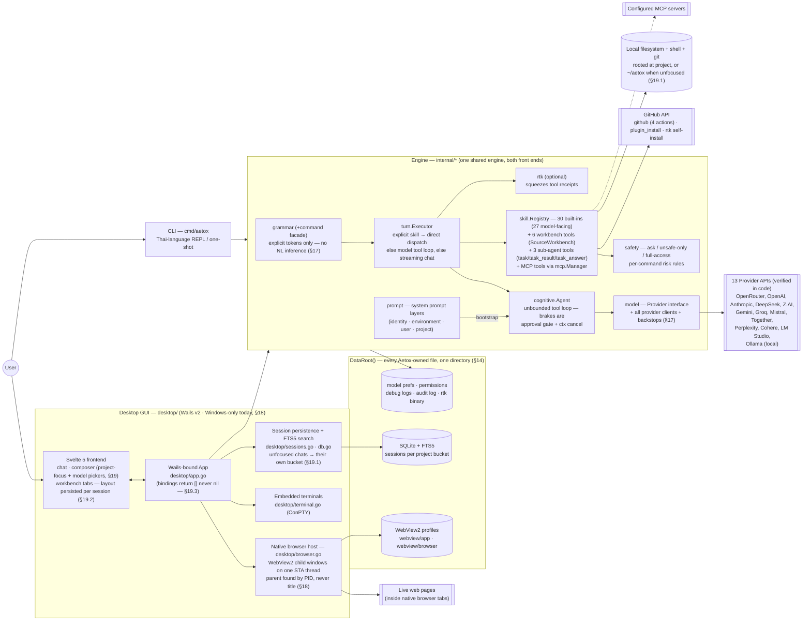
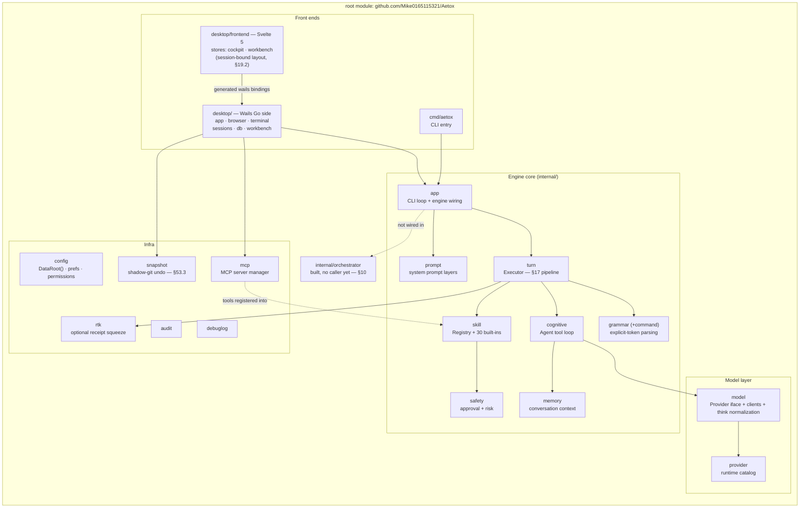
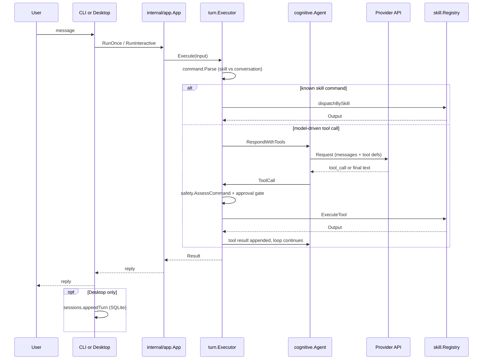

> **Pass level:** Full Mode
> **Trigger:** whole-project documentation requested at root; 3+ interacting modules (root/`internal`, `engine`, `providers`, `cli`, `desktop`), local persistence (SQLite), 11+ external provider integrations, remote code execution path (`plugin_install`).
> **Scope:** entire repository (`e:\Aetox\Aetox`), last updated 2026-07-24.
> **Evidence:** file tree, `go.work`/`go.mod`×4, `README.md`, `AETOX.md`, `docs/adr/0001`, `docs/adr/0002`, `docs/architecture/module-split-2026-07-21.md`, `docs/architecture/browser-security-2026-07-21.md`, `TEST-REPORT.md`, `MCP-SUPPORT-PLAN.md`, and direct reads of `cmd/aetox/main.go`, `internal/app/app.go`, `internal/cognitive/agent.go`, `internal/turn/executor.go`, `internal/skill/{skill,dispatcher,github_tools}.go`, `internal/safety/safety.go`, `internal/config/config.go`, `desktop/{app,browser,terminal,db,sessions,workbench}.go` and their `_test.go` files, `desktop/frontend/src/{App.svelte,style.css,lib/workbench/*}`.
> **Skipped:** Svelte component internals, provider-by-provider implementation detail (`internal/model/*.go` bodies), test file contents (existence noted, not read line-by-line).
> **Status labels used below:** `Direct` = confirmed by reading the file. `Inferred` = derived from evidence but not line-verified. `Proposed` = design intent, not yet built — never presented as existing.

This document is an evidence-first architecture map, distinct from [README.md](README.md) and `AETOX.md`, which are product vision/pitch documents and mix shipped state with roadmap in the same tables. Where they conflict with the code, this document follows the code.

---

## Document Map — this file is the hub

**Owner's law (2026-07-24): this is the master architecture document. Every separate architecture doc must be referenced here — a new doc gets its row in this table (and, if it records a decision, a numbered Decision section) in the same commit that creates it.**

| Doc | What it is |
|---|---|
| **This file** | Evidence-first whole-system map + the one-line index of the Decision log. Start here; everything below is a spoke. |
| [COMPANY.md](COMPANY.md) | **The canonical product picture (2026-08-05, owner's language): one face, five buttons, the office and its chairs, the dispatch star, the lines that are never crossed.** §83–§84 are its engineering record; on product-shape questions COMPANY.md wins, on implementation questions this file wins. |
| [docs/DOOR-ASSISTANT.md](docs/DOOR-ASSISTANT.md) · [docs/DOOR-CODE.md](docs/DOOR-CODE.md) | **Direction documents, one per door (2026-08-05), owner-written and meant to grow long.** Every room carries three fields: **ทิศทาง** (what it should become — the owner's), **วันนี้มีอะไร** (the shipped state, kept true to the code), **ช่องว่าง** (the distance between them). COMPANY.md holds the shape the whole company must keep; these hold the detail of each half. A direction that settles here graduates upward into COMPANY.md or into a numbered Decision. A third file, `docs/SETTINGS.md`, is reserved for the same treatment of the settings surface and does not exist yet. |
| [docs/DECISIONS.md](docs/DECISIONS.md) | **The full numbered Decision log (§10–§84), moved out of this file verbatim on 2026-08-05 with numbering untouched.** Code comments cite "ARCHITECTURE.md §NN" in hundreds of places — those numbers are permanent addresses and resolve there. Append-only; new decisions continue the numbering in that file, and each gets its row in the index below. |
| [README.md](README.md) | The product as a stranger meets it. Mixes shipped state with roadmap; this file wins on conflicts. |
| [docs/architecture/module-split-2026-07-21.md](docs/architecture/module-split-2026-07-21.md) | Why an `engine/`/`providers/`/`cli/` split was proposed and the migration plan (§4). ⚠️ The scaffold directories it describes were deleted in §28 — the rationale stands, the on-disk structure is gone. |
| [docs/architecture/browser-security-2026-07-21.md](docs/architecture/browser-security-2026-07-21.md) | Browser tab `postMessage` bridge — threat model, 3-check defense, residual risk (§6.6). |
| [docs/architecture/desktop-app-2026-07-22.md](docs/architecture/desktop-app-2026-07-22.md) | Layer-5 deep dive: every `desktop/` Go file + workbench frontend, read in full. |
| [docs/architecture/model-control-layer-2026-07-22.md](docs/architecture/model-control-layer-2026-07-22.md) | Layer-2 deep dive (`turn`/`cognitive`/`skill`/`safety`). ⚠️ Executor sections superseded by §17 — the doc says so itself. |
| [docs/architecture/tesseract-ocr-bundling-2026-07-22.md](docs/architecture/tesseract-ocr-bundling-2026-07-22.md) | How `image_ocr`'s Tesseract dependency reaches the user's machine per OS. |
| [docs/architecture/native-browser-embedding-2026-07-24.md](docs/architecture/native-browser-embedding-2026-07-24.md) | Native browser embedding: architecture, 7-entry failure catalog, macOS/Linux port blueprint (§18). |
| [docs/architecture/desk-file-panes-2026-08-06.md](docs/architecture/desk-file-panes-2026-08-06.md) | **The desk's reference table: what the `+` menu's four entries are for, and which pane draws which file** (§87). The menu lists *sources* that start from empty, never file types — a new file type earns a row in the routing table and nothing else. Also records where each size ceiling lives and why, and which formats are deliberately left to the program that already opens them. **§6 is written ahead of its code** (owner's rule: anything arriving on the desk is written here first) and specs the agent's own reach onto the desk — `desk_open`/`desk_list`, and the redaction §81 requires of the latter. |
| [docs/architecture/foreign-coding-clis-2026-07-27.md](docs/architecture/foreign-coding-clis-2026-07-27.md) | Why Claude Code / Codex / OpenCode may be consultants but never the provider seam; the deferred `claude-cli` profile plan (§46). |
| [docs/adr/0001-native-tool-calling-foundation.md](docs/adr/0001-native-tool-calling-foundation.md) | ADR, Accepted 2026-06-07 — native tool calling as the agentic foundation. |
| [docs/adr/0002-directional-cognition-engine.md](docs/adr/0002-directional-cognition-engine.md) | ADR, Proposed 2026-07-10 — long-term multi-AI orchestration vision (ensemble/routing/consensus). |
| `AETOX.md` · `Aetox Desktop.md` · `MCP-SUPPORT-PLAN.md` · `SETTINGS-PARITY-PLAN.md` · `WINDMILL-AUTOMATION.md` | **Deleted from the working tree 2026-08-05 (owner's call), having already been unpublished since 2026-07-29.** Early pitch drafts and pre-implementation survey notes: everything they settled was restated here (and, for identity, in COMPANY.md), which is the copy that counts. Older sections below still cite them as the evidence trail they were; the first four are recoverable from git history, the Windmill note was never tracked. |
| [PLATFORM-SUPPORT.md](PLATFORM-SUPPORT.md) | What runs where **and the live port plan** — phases, per-phase blockers, and what each one has actually been measured to do. Was a record only; §48 made it the work. |
| [third_party/go-webview2/AETOX-PATCH.md](third_party/go-webview2/AETOX-PATCH.md) | Why go-webview2 is vendored+patched: stop a single browser tab's WebView2 error from `os.Exit`-crashing the whole app (§26). |
| [TEST-REPORT.md](TEST-REPORT.md) | The seams that **cannot** be tested and why, plus the conventions new tests follow. Read it for those, never for a count — the count is what `go test ./...` says, and the one written there went seven times stale before anyone noticed. CI that runs it all: [.github/workflows/ci.yml](.github/workflows/ci.yml) (§28). |
| [BENCHMARK.md](BENCHMARK.md) · [bench.ps1](bench.ps1) | Measured comparison against 13 installed rivals (disk/startup/RAM/soak) — the fairness rules, the raw results, and which numbers are **not** clean enough to publish. Every figure quoted in README.md or docs/index.html must trace back to a passing row here. |
| [LICENSE](LICENSE) · [NOTICE](NOTICE) | Apache-2.0 since §60 (MIT up to v0.7.1, §28). `NOTICE` reserves the "Aetox" name and logo and must travel with every redistribution — the anti-rebrand teeth. |
| [docs/opencode-study/](docs/opencode-study/README.md) | Source-level reading of opencode at a pinned commit (agents, MCP, permissions, plugin hooks, snapshot). |
| [docs/architecture-reference-opencode.md](docs/architecture-reference-opencode.md) · [docs/competitor-research.md](docs/competitor-research.md) | Package/feature-level comparisons that motivated the deep study above. |
| ~~docs/architecture-review-aetox-cli.md~~ | **Deleted 2026-08-07.** A CLI-only current-state review from 2026-06-09 that predated `desktop/`, session persistence, the browser tab and `internal/orchestrator` — it had carried a SUPERSEDED banner since 2026-07-22 and nothing pointed at it for anything but history, which git already keeps. |
| Tier-1 module READMEs | `internal/{app,turn,skill,model,grammar,prompt,rtk,subagent}/README.md`, `cmd/aetox/README.md`, `desktop/README.md` — hub-and-spoke rule per §12: meaningful change to a module updates its README in the same commit. [internal/subagent/README.md](internal/subagent/README.md) is also the **sub-agent profile file-format reference** (§44). |

---

## Reader's Map — the "5 layers" mental model vs. actual code

A working mental model used for planning this project splits responsibility into 5 layers: **model management**, **model-control (skills/MCP)**, **orchestrator (multi-agent)**, **UI/CLI front ends**, and **desktop app**. This section states plainly how much of that is real, separate code today, so the mental model isn't mistaken for the module boundaries in §4.

| Layer | What exists today | Where |
|---|---|---|
| 1. Model management | Real behavior, but **not its own module** — lives inside `internal/model` (interface + 5 wire-format clients serving all 18 catalog providers + factory/bootstrap) and `internal/provider` (catalog), both part of the same flat root module. `providers/` (scaffold, §4) is where this is *meant* to move — zero code there yet. |
| 2. Model-control (skill dispatch, tool-calling loop) | Real, but **three cooperating packages, not one**: `internal/skill` (Registry/Dispatcher/30 built-ins), `internal/cognitive` (Agent), `internal/turn` (Executor) — see the flow in §5. MCP is real too, in its own package `internal/mcp` (§55). |
| 3. Orchestrator (multi-agent) | **Scaffold only.** `internal/orchestrator` exists (§10) but nothing calls it — both front ends still construct exactly one `cognitive.Agent` each. |
| 4. UI/CLI front ends | Real. Two front ends — `cmd/aetox` (CLI) and `desktop/` (GUI) — both driving the same engine through `internal/app`. |
| 5. Desktop app (browser/terminal/extension surface) | Real, and the most independently-developed layer as of this session: session persistence (SQLite), native browser tab (WebView2), embedded terminal (ConPTY) — see §4.2, `TEST-REPORT.md` Module 5, and `docs/architecture/browser-security-2026-07-21.md`. |

**Answering "is it 5 clean modules now": no.** Only layer 5 (`desktop/`) is a genuinely separate Go package boundary from the rest. Layers 1–3 are conceptual groupings *within* the same flat `internal/` module (15 packages) — there is no compiler-enforced boundary stopping "layer 1" code from reaching into "layer 2" today. Treat the 5-layer split as a **planning/reading aid**, not as enforced architecture, until the `engine/providers/cli` migration (§4) actually happens.

---

## 1. Synthesis (read this first)

- **Two systems currently share the root Go module without a boundary.** `cmd/aetox` (CLI) and `desktop/` (Wails GUI) both import `internal/app`, but the GUI only uses ~2 of that package's ~35 exported methods (`NewApp`, `RunOnce`) — the rest is CLI terminal presentation (banner, status bar, spinner, Thai-language approval prompts). See [§6.1](#61-internalapp-mixes-orchestration-with-cli-terminal-presentation). `Medium`, `Direct`.
- **`internal/model` imports `internal/provider`**, so the abstraction (Provider interface, Message types) depends on the implementation catalog — already identified by the project's own [module-split proposal](docs/architecture/module-split-2026-07-21.md). Confirmed still true by direct import scan. `Medium`, `Direct`. This was the stated reason `engine/`, `providers/`, `cli/` existed as scaffolds; the coupling outlived them.
- ~~**The 3-module split (`engine/`, `providers/`, `cli/`) is an empty scaffold** — `go.mod` files only, zero source~~ — **deleted 2026-07-25 (§28)** along with `go.work`/`go.work.sum`. Four days of empty directories only obscured where the running code lives: `internal/` and `cmd/`. The migration rationale is preserved in the module-split doc; re-scaffold when migration actually starts.
- ~~`Registry.Register()` silently overwrites on name collision, and there is no built-in-vs-user-added distinction~~ — **fixed 2026-07-21**, see §6.4 below. `Register` now takes a `Source` and rejects collisions instead of overwriting.
- ~~`SearchSessions` (Desktop session search) doesn't work at all — silently returns nothing on every call~~ — **fixed 2026-07-22**, see §6.7 below. Root cause was narrower than first recorded: `snippet()` combined with `GROUP BY` in one query (not the whole query shape). Fixed with a `MATERIALIZED` CTE, single query, no two-step needed.
- **Browser tab Z-order, `postMessage` origin/replay forgery, and two frontend resize/layout bugs — all fixed 2026-07-21/22.** See §6.6 and §6.8 below.
- ~~`README.md`/`AETOX.md` advertise Anthropic support that doesn't exist in the actual provider catalog~~ — **fixed 2026-07-22**, see §6.9 below. `internal/model/anthropic.go` now implements a real client against Anthropic's Messages API (`/v1/messages`, `x-api-key`/`anthropic-version` headers, content-block request/response shape — not OpenAI-compatible, so it's its own file, not a reuse of `openai_compatible.go`), registered in the catalog and wired into the desktop provider picker (`desktop/app.go`'s `desktopProviders`). `zai` is still undocumented in both docs — that half of §6.9 is still open.

**Primary recommendation:** ~~apply the `SearchSessions` fix (§6.7)~~ — applied 2026-07-22, suite green. Next: the `Registry` Source gap (§6.4, closed) unblocks deciding what `plugin_install`'s loader (§6.5) or an MCP client should set as `Source` — `SourceExternal` alone doesn't yet distinguish them. Independently, `zai` (Z.AI/GLM) is fully implemented but still absent from `README.md`/`AETOX.md`'s provider tables — same category of doc-drift as the now-fixed Anthropic gap, worth a follow-up pass.

---

## 2. System Overview (confirmed)

Aetox is a single-user, local-first AI coding/personal-assistant agent with two front ends sharing one Go engine:

- **CLI** (`cmd/aetox`) — interactive REPL or one-shot invocation, Thai-language terminal UI.
- **Desktop** (`desktop/`) — Wails v2 + Svelte 5 GUI with chat, a tabbed workbench (Review/Terminal/Files/Browser), persistent SQLite-backed sessions, and an agent-controlled native browser (WebView2).

Both front ends drive the same tool-calling agent loop: user message → `cognitive.Agent` → provider API (model-driven tool calls) → `turn.Executor` dispatches to one of the 27 model-facing built-in skills → result folded back into the conversation.

No backend server, no cloud database, no multi-tenant concerns — everything runs on the user's machine against third-party model provider APIs.

---

## 3. System Boundary

```mermaid
flowchart LR
    User(("User"))
    CLI["CLI — cmd/aetox\nThai-language REPL / one-shot"]

    subgraph DesktopApp["Desktop GUI — desktop/ (Wails v2 · Windows-only today, §18)"]
        direction TB
        FE["Svelte 5 frontend\nchat · composer (project-focus + model pickers, §19)\nworkbench tabs — layout persisted per session (§19.2)"]
        Bindings["Wails-bound App\ndesktop/app.go\n(bindings return [] never nil — §19.3)"]
        BrowserHost["Native browser host — desktop/browser.go\nWebView2 child windows on one STA thread\nparent found by PID, never title (§18)"]
        Term["Embedded terminals\ndesktop/terminal.go (ConPTY)"]
        Sessions["Session persistence + FTS5 search\ndesktop/sessions.go · db.go\nunfocused chats → their own bucket (§19.1)"]
        FE <--> Bindings
        Bindings --> BrowserHost
        Bindings --> Term
        Bindings --> Sessions
    end

    subgraph Engine["Engine — internal/* (one shared engine, both front ends)"]
        direction TB
        Grammar["grammar (+command facade)\nexplicit tokens only — no NL inference (§17)"]
        Turn["turn.Executor\nexplicit skill → direct dispatch\nelse model tool loop, else streaming chat"]
        Cog["cognitive.Agent\nunbounded tool loop — brakes are\napproval gate + ctx cancel"]
        Skills["skill.Registry — 30 built-ins (27 model-facing)\n+ 6 workbench tools (SourceWorkbench)\n+ 3 sub-agent tools (task/task_result/task_answer)\n+ MCP tools via mcp.Manager"]
        Safety["safety — ask / unsafe-only / full-access\nper-command risk rules"]
        Prompt["prompt — system prompt layers\n(identity · environment · user · project)"]
        RTK["rtk (optional)\nsqueezes tool receipts"]
        Model["model — Provider interface\n+ all provider clients + backstops (§17)"]
        Grammar --> Turn
        Turn --> Cog
        Cog --> Model
        Turn --> Skills
        Skills --> Safety
        Turn --> RTK
        Prompt -->|bootstrap| Cog
    end

    User --> FE
    User --> CLI
    CLI --> Engine
    Bindings --> Engine

    Providers[["13 Provider APIs (verified in code)\nOpenRouter, OpenAI, Anthropic, DeepSeek, Z.AI,\nGemini, Groq, Mistral, Together,\nPerplexity, Cohere, LM Studio,\nOllama (local)"]]
    GH[["GitHub API\ngithub (4 actions) · plugin_install · rtk self-install"]]
    MCPExt[["Configured MCP servers"]]
    Web[["Live web pages\n(inside native browser tabs)"]]
    FS[("Local filesystem + shell + git\nrooted at project, or ~/aetox when unfocused (§19.1)")]

    Model --> Providers
    Skills --> GH
    Skills --> FS
    Skills -.-> MCPExt
    BrowserHost --> Web

    subgraph Data["DataRoot() — every Aetox-owned file, one directory (§14)"]
        DB[("SQLite + FTS5\nsessions per project bucket")]
        Profiles[("WebView2 profiles\nwebview/app · webview/browser")]
        Misc[("model prefs · permissions\ndebug logs · audit log · rtk binary")]
    end

    Sessions --> DB
    BrowserHost --> Profiles
    Engine --> Misc
```

- **Confirmed external dependencies:** 13 named provider HTTP APIs (14 catalog entries, counting the built-in `aetox` fallback), verified against the actual catalog map in `internal/provider/catalog.go` (not README's list — see §6.9, they differ), GitHub REST API (`internal/skill/github_tools.go`), local shell (`internal/skill/shell.go`), local filesystem, SQLite (confirmed `modernc.org/sqlite`, `Direct` — `desktop/db.go:17`), Windows WebView2 (`desktop/browser.go`, Win32 syscalls — Windows-only, `Direct`).
- **Not observed:** no outbound telemetry/analytics code found in `internal/` or `desktop/` during inspection (`Inferred`, `Verify first: Yes` — not exhaustively grepped for every HTTP client call).

---

## 4. Module Map

```mermaid
flowchart TB
    subgraph rootmod["root module: github.com/Mike0165115321/Aetox"]
        direction TB
        subgraph fronts["Front ends"]
            cmd["cmd/aetox\nCLI entry"]
            dfe["desktop/frontend — Svelte 5\nstores: cockpit · workbench\n(session-bound layout, §19.2)"]
            dgo["desktop/ — Wails Go side\napp · browser · terminal\nsessions · db · workbench"]
            dfe -->|generated wails bindings| dgo
        end
        subgraph engcore["Engine core (internal/)"]
            app["app\nCLI loop + engine wiring"]
            turn["turn\nExecutor — §17 pipeline"]
            cognitive["cognitive\nAgent tool loop"]
            skill["skill\nRegistry + 30 built-ins"]
            safety["safety\napproval + risk"]
            grammar["grammar (+command)\nexplicit-token parsing"]
            prompt["prompt\nsystem prompt layers"]
            memory["memory\nconversation context"]
        end
        subgraph modellayer["Model layer"]
            model["model\nProvider iface + clients + think normalization"]
            provider["provider\nruntime catalog"]
        end
        subgraph infra["Infra"]
            config["config\nDataRoot() · prefs · permissions"]
            mcp["mcp\nMCP server manager"]
            snapshot["snapshot\nshadow-git undo — §53.3"]
            rtk["rtk\noptional receipt squeeze"]
            audit["audit"]
            debuglog["debuglog"]
        end
        orch["internal/orchestrator\nbuilt, no caller yet — §10"]

        cmd --> app
        dgo --> app
        app --> turn
        turn --> grammar
        turn --> cognitive
        turn --> skill
        turn --> rtk
        skill --> safety
        cognitive --> model
        cognitive --> memory
        model --> provider
        app --> prompt
        dgo --> mcp
        dgo --> snapshot
        mcp -.->|tools registered into| skill
        app -.->|not wired in| orch
    end

```

`rootmod` is the whole picture — one module, no workspace. The `engine/`/`providers/`/`cli/` scaffold that used to sit beside it was deleted in §28; the split it was meant to become is still [proposed](docs/architecture/module-split-2026-07-21.md), just no longer half-present on disk.

### 4.1 `internal/` packages (root module, `Direct`)

Per-module docs (hub-and-spoke, §12): Tier-1 modules carry a `README.md` in their own folder — linked in the **Docs** column. Front-end modules: [cmd/aetox/README.md](cmd/aetox/README.md), [desktop/README.md](desktop/README.md) (§4.2).

| Package | Files | Role | Docs |
|---|---|---|---|
| `app` | 4 | CLI interactive loop + orchestration wiring (`NewApp`, `RunOnce`, `RunInteractive`, banner/status bar, approval-mode picker). Shared with desktop only via `NewApp`/`RunOnce` — see [§6.1](#61-internalapp-mixes-orchestration-with-cli-terminal-presentation). | [README](internal/app/README.md) |
| `cognitive` | 2 | `Agent` — builds provider requests, runs the (unbounded, §11 "related cleanup") tool-call loop, streams responses. | [model-control deep dive](docs/architecture/model-control-layer-2026-07-22.md) |
| `turn` | 3 | `Executor` — turn pipeline (§17): explicit skill command → direct dispatch, else model-driven tool loop, else streaming chat; approval gate on every tool path. No NL intent inference — that layer was deleted 2026-07-23. | [README](internal/turn/README.md) |
| `skill` | 43 | `Registry`/`Dispatcher` + all 33 built-in tools. The 30 the model can be offered: read/write/edit/delete/list/glob/grep/apply_patch/notebook_edit/diagnostics/symbol/shell/git/time/calc/web_fetch/web_search/image_ocr/video_ocr/pdf_read/audio_transcribe/sheet_write/slides_write/doc_write/github/n8n/windmill/plugin_install/skills_list/skill_view. Four of those are **packed** (§99, [packed.go](internal/skill/packed.go)): `shell` is `run`/`output`/`kill`/`list`, `github` is `search`/`repo_summary`/`list_files`/`read_file`, and the two engines carry their five calls each — `n8n` as `list`/`read`/`create`/`update`/`activate`, `windmill` as `workspaces`/`list`/`read`/`create`/`update` — so what used to be seventeen entries in the tool block is now four. The old per-action names (`shell_output`, `n8n_workflow_activate`, `windmill_workspace_list`, …) are still the permission keys and still what `internal/safety` and the approval prompt judge a call by. The other 3 (`echo`/`fs`/`help`) are CLI-only and never sent to the model. | [README](internal/skill/README.md) |
| `model` | 18 | `Provider` interface, `Message`/`Request`/`Response` types, factory, bootstrap, and **5 wire-format client implementations** (anthropic, openai_compatible, responses, ollama, noop) serving all 18 catalog providers, in the same package. Imports `internal/provider` (see [§6.2](#62-modelprovider-imports-providers-catalog)). | [README](internal/model/README.md) |
| `provider` | 2 | Provider runtime catalog (names, capabilities) — separate from `model`'s own `provider_catalog.go`, which is a second source for similar data (`Inferred`, `Verify first: Yes` — not diffed line-by-line). | — |
| `safety` | 2 | 3-tier approval (`ask`/`unsafe-only`/`full-access`), per-command risk assessment (`AssessCommand`, git/fs-specific rules). `PermissionRule.Default` separates a rule the app generated from one the user wrote: an app default yields to the approval mode the user picked, a user's rule outranks it. | [model-control deep dive](docs/architecture/model-control-layer-2026-07-22.md) |
| `command` | 3 | Input intent parsing facade — thin aliases delegating to `grammar` (the real implementation). | see `grammar` |
| `config` | 2 | Config loading, `.env`, model-preference persistence (JSON on disk). Owns `DataRoot()` — the single directory every Aetox-owned file lives under, see [§14](#14-decision--unified-data-root-2026-07-23-cleaning-up-where-aetox-writes-its-own-data). Also owns two layouts other packages need and must not re-derive: `AgentHome`/`AgentDefinitionPath`/`AgentMemoryPath` (one agent is one folder) and `credentials.json`, split out of the preference file so settings stay quotable while secrets get their own handling. `MCPServersForDesk`/`MCPServersForAgent` answer who carries a server from its own `for:` list. | — |
| `atrest` | 0 | Wraps a secret for storage — DPAPI on Windows, passthrough elsewhere. Its own leaf package because `config` and `oauth` both hold credentials and `config` already imports `oauth`. | — |
| `think` | 2 | Thinking-level normalization per provider. | — |
| `plan` | 2 | Execution planning (conversation vs. skill classification, per ADR 0001). | — |
| `memory` | 1 | Context/conversation memory. | — |
| `mode` | 2 | Session modes (§83/§84) — one desk per kind of work. Bundled `modes/*.md` (assistant · coding · specialized) shadowed by `<DataRoot>/modes/*.md`; `categories:`/`tools:`/`deny:` select built-ins, `chairs:` names tools kept **in the room for the desk's agents but off the desk itself**, default-closed `mcp:` attaches servers, default-closed `dispatch:` names the desks this one may hand a job to, the body is the direction prompt. `Carries` is the one place a registered tool is judged (MCP by server, skills always kept); `CarriesForChair` is the same question asked on behalf of a chair, and is the only reader of `chairs:` — an ordinary delegate gets the plain ceiling. `Office` is the desk chairs sit at. Not an identity (§44.0) and not a permission tier. | §83, §84 |
| `audit` | 2 | Execution audit log. | — |
| `debuglog` | 1 | Debug logging, and the process's one secret registry: `Redact` records a value, `Scrub` removes it. Three sinks use it — the debug log, the shell audit log, and `tool_runs` in the database — so a key registered once cannot reach any file that outlives the session. | — |
| `grammar` | 2 | Input classification rules engine (Kind/Intent/slash parsing) behind the `command` facade. | [README](internal/grammar/README.md) |
| `orchestrator` | 2 | Multi-`cognitive.Agent` lifecycle tracker (`Spawn`/`Get`/`Stop`/`List`). Built this session, **not called by `cmd/aetox` or `desktop/app.go` yet** — see [§10](#10-decision--agent-orchestrator-layer-proposed-approved-2026-07-21) for scope and naming rationale. | §10 |
| `prompt` | 2 | System prompt assembly (identity/environment/user-global/project layers) — both front ends call it, replacing two near-duplicate `buildSystemPrompt` copies. Built 2026-07-22, see [§11](#11-decision--promptcontext-layer-proposed-being-settled-section-by-section-2026-07-22). | [README](internal/prompt/README.md) |
| `snapshot` | 1 | Shadow-git undo: a per-project git repository under `DataRoot()` with its work tree pointed at the real project, so a snapshot costs one `write-tree` and the user's own repository never notices. Bound into `desktop/app.go`; **no UI button yet** — see [§53.3](#533-undo--internalsnapshot). | §53.3 |
| `rtk` | 4 | Optional bridge to the owner's `rtk` CLI — shrinks tool-call output before it's wrapped into the model's receipt (`turn.modelToolReceipt`). v1: `git`+`shell` only. Auto-installs itself once from GitHub if missing (`install.go`), no NSIS changes. Built 2026-07-22, see [§13](#13-decision--rtk-integration-proposed-being-settled-section-by-section-2026-07-22). | [README](internal/rtk/README.md) |

### 4.2 `desktop/` (root module, `Direct`)

Module doc: [desktop/README.md](desktop/README.md) (replaced the Wails template boilerplate 2026-07-22).

| File | Role |
|---|---|
| `app.go` (665 lines) | Wails-bound `App` struct — the GUI's own type, distinct from `internal/app.App`. Owns `bootstrapFromConfig` (wires `internal/app.App` + `cognitive.Agent` + extra skills), provider/model switching, project tree/file read-write for the Files pane. |
| `sessions.go` | Per-project session persistence: `ListSessions`, `SearchSessions` (FTS5 — fixed 2026-07-22, see §6.7 below), `LoadSession`, transcript ↔ `model.Message` conversion. |
| `db.go` (77 lines) | SQLite connection + schema. `App.dbDir` overrides the default `<UserConfigDir>/aetox` directory (empty = production default) — a test seam added this session, not a behavior change. |
| `browser.go` (~470 lines) | Native WebView2 tab host via raw Win32 syscalls (`wndClassExW`, message loop) — Windows-specific, no build-tag isolation observed (`Inferred`, `Verify first: Yes`). Z-order and `postMessage`-forgery issues fixed this session — see §6.6 below and `docs/architecture/browser-security-2026-07-21.md`. |
| `workbench.go` · `browser_tool.go` | One `browser` tool with four actions — `open`, `read`, `click`, `type` — implemented as `skill.Tool`; the agent drives the browser itself, distinct from the user-facing `BrowserOpen`/`BrowserNavigate` etc. in `browser.go`. `read` tags interactive elements with `data-aetox-ref` (see `textScript`, `browser.go`) so `click`/`type` can target one by number — same ref-based pattern as Playwright MCP's accessibility tree and browser-use's element index. Packed on 2026-08-10 (§99): four tools describing one object cost four tool-block entries in every request that carried them, and every new browser capability cost another. The old `browser_open`/`browser_read`/`browser_click`/`browser_type` names live on as the **per-action permission keys** — `categories:` and a profile's `tools:` still speak them, so a profile naming only some gets only those actions and the tool's description advertises only those. The agent browses in ONE tab: `open` navigates the tab it already has (`agentBrowserTabID`) rather than minting `web-agent-N` per call, which is what makes the four actions one flow. This is the pattern `MCP-SUPPORT-PLAN.md` recommends reusing for an MCP adapter. |
| `terminal.go` | Embedded shell session lifecycle (`TerminalStart`/`Write`/`Resize`/`Close`), independent of `internal/skill/shell.go` (that one is the agent's `shell` tool; this is the user-facing terminal pane). |
| `main.go` (39 lines) | Wails bootstrap. |

Test files added this session (`Direct`, all passing except the one noted bug): `app_test.go`, `browser_test.go`, `db_test.go`, `sessions_test.go`, `terminal_test.go` — per-file coverage detail in `TEST-REPORT.md` Module 5. `TerminalStart`/`TerminalClose`/`browser.go`'s Win32 window plumbing remain **not** unit-testable (documented there): `wailsruntime.EventsEmit` calls `log.Fatalf`/`os.Exit(1)` when the context isn't a real Wails-bound one, which a test never has.

`desktop/frontend/src/lib/`: `stores/` (Svelte 5 runes: `cockpit.svelte.ts`, `workbench.svelte.ts`), `services/cockpit.ts` (Go binding wrappers), `workbench/*.svelte` (Review/Files/Browser panes). Not read in detail — structure only (`Direct` for existence, `Inferred` for internal behavior), except `App.svelte` (resize-handle logic, read in full — see §6.8) and `workbench/Workbench.svelte`/`style.css` (address-bar + blank-state layout, read in full — see §6.8).

---

## 5. Primary Workflow — one chat turn

```mermaid
sequenceDiagram
    participant U as User
    participant Front as CLI or Desktop
    participant App as internal/app.App
    participant Turn as turn.Executor
    participant Agent as cognitive.Agent
    participant Provider as Provider API
    participant Skill as skill.Registry

    U->>Front: message
    Front->>App: RunOnce / RunInteractive
    App->>Turn: Execute(input)
    Turn->>Turn: command.Parse (skill vs conversation)
    alt known skill command
        Turn->>Skill: dispatchBySkill
        Skill-->>Turn: Output
    else model-driven tool call
        Turn->>Agent: RespondWithTools
        Agent->>Provider: Request (messages + tool defs)
        Provider-->>Agent: tool_call or final text
        Agent->>Turn: ToolCall
        Turn->>Turn: safety.AssessCommand + approval gate
        Turn->>Skill: ExecuteTool
        Skill-->>Turn: Output
        Turn->>Agent: tool result appended, loop continues
    end
    Turn-->>App: Result
    App-->>Front: reply
    Front-->>U: reply
    opt Desktop only
        Front->>Front: sessions.appendTurn (SQLite)
    end
```

Desktop-specific additions confirmed in `desktop/app.go`/`sessions.go`: every turn is persisted via `appendTurn` after `SendMessage` returns; sessions are keyed per project root (`projectKey`); full-text search is FTS5-backed.

---

## 6. Debt Register

### 6.1 `internal/app` mixes orchestration with CLI terminal presentation

- **Evidence:** `internal/app/app.go` exports `NewApp`, `RunOnce`, `RunInteractive`, `PrintBanner`, `printStatusBar`, `printPromptLine`, `pickApprovalMode` (Thai-language console prompts), `showHelp`, `showSkillPalette` — all in one package/type. `desktop/app.go:275-289` (`SendMessage`) calls only `a.chat.RunOnce`; no desktop code path reaches `RunInteractive`, `PrintBanner`, or the approval-mode console picker.
- **Impact:** the GUI binary compiles and links terminal-rendering code it never calls. Any change to CLI presentation (banner, status bar, Thai approval prompts) risks breaking desktop's build even though desktop doesn't use those methods. The project's own [module-split plan](docs/architecture/module-split-2026-07-21.md) intends to move this whole package to `engine/app/` labeled "shared by CLI + desktop" — migrating as-is carries the same mixing forward.
- **Severity:** `Medium` (taxes the planned migration; doesn't break anything today).
- **Confidence:** `Direct`.
- **Direction (proposed, needs approval):** split `internal/app` into an orchestration piece (`NewApp`, `RunOnce`, turn-executor wiring — genuinely shared) and a CLI-presentation piece (banner, status bar, interactive loop, approval picker) before or during the `engine/` migration, so `engine/app/` doesn't inherit terminal-only code.

### 6.2 `model` imports `provider` — abstraction depends on implementation

- **Evidence:** `internal/model/factory.go`, `provider_catalog.go`, `thinking_capabilities.go` import `internal/provider`. Documented and accepted as the reason for the 3-module split in [module-split-2026-07-21.md:8-16](docs/architecture/module-split-2026-07-21.md).
- **Impact:** any consumer of `model.Provider`/`model.Message` transitively pulls in the full provider catalog; can't depend on the interface alone.
- **Severity:** `Medium`.
- **Confidence:** `Direct`.
- **Direction:** already proposed (`engine/model` interface-only, `providers/` for implementations) — no new recommendation, just confirming the existing plan matches the evidence. The empty scaffold that used to stand in for it is gone (§28); the plan is a plan again, not a half-built directory.

### 6.3 Two provider catalogs

- **Evidence:** `internal/model/provider_catalog.go` and `internal/provider/catalog.go` both exist; not diffed for exact overlap.
- **Impact:** unclear without deeper read — possibly one is the canonical list and the other is a thin re-export, or they've drifted.
- **Severity:** `Low`–`Medium` (`Unverified` which).
- **Confidence:** `Inferred`, `Verify first: Yes`.
- **Direction:** none proposed — needs verification first, listed as an open question (§7).

### 6.4 Skill registry has no core/user-added boundary — FIXED 2026-07-21

- **Original evidence:** `internal/skill/skill.go:44` `Registry.Register()` overwrote on key collision with no warning. `internal/skill/defaults.go` registered all 17 built-ins and `plugin_install` into the same flat map. Documented in detail in `MCP-SUPPORT-PLAN.md:37-51`.
- **Impact (was):** couldn't gate trust levels differently (built-in vs. third-party MCP/plugin tool), couldn't show "core" vs. "installed" separately in the Settings UI, and a user-installed skill could silently shadow a built-in tool by name.
- **Severity:** was `High` (blocked safe MCP support).
- **Fix applied:** [internal/skill/skill.go](internal/skill/skill.go) — added `Source` type (`SourceBuiltin`/`SourceExternal`), `Registry` now stores `{skill, source}` pairs and exposes `SourceOf(name)`. `Register(skill, source)` returns an error instead of silently overwriting on name collision.
  - [internal/skill/defaults.go](internal/skill/defaults.go) — all 12 built-ins register with `SourceBuiltin`; a collision among built-ins now panics at startup (programmer error, not a runtime condition).
  - [desktop/app.go](desktop/app.go) `bootstrapFromConfig` — `extraSkills` (the `workbenchTools`: `browser` and the rest) register with `SourceExternal`; a collision is logged via `debuglog.Msg` and the skill is skipped rather than silently overwriting a built-in.
  - Tests: [internal/skill/skill_test.go](internal/skill/skill_test.go) (`TestRegisterTracksSource`, `TestRegisterRefusesCollision`).
- **Still open:** `SourceExternal` is one bucket for everything non-built-in — MCP and `plugin_install`-loaded skills don't yet have their own distinct source values, and nothing consumes `SourceOf` yet (no per-source permission gating, no Settings UI grouping). Add `SourceMCP`/`SourcePlugin` when those integrations are actually built, not before.
- **Confidence:** `Direct` — `go build ./...` and `go test ./internal/skill/...` pass.

### 6.5 `plugin_install` downloads files but nothing loads them back

- **Evidence:** `internal/skill/github_tools.go` implements `plugin_install` fully (fetches manifest, path-traversal-checked, writes to `~/.agents/skills/<name>/`) but `internal/skill/defaults.go` only registers compiled-in Go skills — no bootstrap-time scan of the install directory. Confirmed by direct read of `validatePluginManifest`/`normalizeManifestRelativePath` (traversal guards present) and by `MCP-SUPPORT-PLAN.md:17-23`.
- **Impact:** "installing a plugin" via this tool currently has no observable effect after download completes.
- **Severity:** `Medium` (feature is inert, not unsafe — path traversal is guarded and manifest type is restricted to `"skill-bundle"`).
- **Confidence:** `Direct`.
- **Direction:** proposed in `MCP-SUPPORT-PLAN.md` — write a loader that scans the install directory at `bootstrapFromConfig` time; decide execution model for downloaded (non-compiled) skills first.

### 6.6 Browser tab Z-order + `postMessage` forgery — FIXED 2026-07-21/22

- **Evidence (Z-order):** `desktop/browser.go`'s tab window used only `MoveWindow`/`ShowWindow` — neither changes Z order. Two independent WebView2 controllers in one top-level window each composite via DirectComposition; without an explicit Z-order call the tab's pixels could render behind the app's own webview — confirmed live (page navigated successfully, per-page title updated, but the tab area stayed solid black, the app's own background color).
- **Evidence (`postMessage` forgery):** `onMessage` trusted a page's `postMessage({__aetox:...})` envelope with no check that the page was the one it claimed to be, or that a `"text"` response corresponded to a specific `BrowserGetText` call. `args.GetSource()` (real origin, page can't forge) was available on `ICoreWebView2WebMessageReceivedEventArgs` but unused.
- **Impact:** Z-order bug made the entire browser tab feature appear non-functional (page loads, nothing visible). The `postMessage` gap allowed a malicious page to (a) claim an arbitrary `url` in a `"meta"` message — address-bar spoofing, a phishing enabler — and (b) inject fabricated `"text"` content into the agent's `BrowserGetText` read path — a prompt-injection vector distinct from the page's own real (untrusted) DOM content.
- **Severity:** was `High` for the `postMessage` gap (security), `Medium` for Z-order (functionality, not security).
- **Fix applied:** `procSetWindowPos` + `HWND_TOP` on tab creation/resize/show ([browser.go](desktop/browser.go)). `onMessage` now requires `sameOrigin(source, m.URL)` for `"meta"`, and a matching per-request nonce (`textToken`, minted by `BrowserGetText`, `crypto/rand`) for `"text"`. Full threat model and residual risk in [docs/architecture/browser-security-2026-07-21.md](docs/architecture/browser-security-2026-07-21.md).
- **Confidence:** `Direct` — 12 new tests in `browser_test.go`, `go build`/`go vet` clean.

### 6.7 `SearchSessions` returned nothing, ever — FIXED 2026-07-22

- **Evidence:** `desktop/sessions.go`'s `SearchSessions` joined `messages_fts` (FTS5) with `messages`/`sessions` in one query and called `snippet(messages_fts, ...)` in the same statement. That shape returns SQL error `"unable to use function snippet in the requested context"` from `modernc.org/sqlite` every time — and `SearchSessions` swallows the error (`if err != nil { return out }`), so the function always silently returned zero results instead of surfacing a failure. That silent swallow is why the bug was invisible outside the failing test.
- **Root cause (narrowed from the original record):** not the whole join shape — specifically `snippet()` + `GROUP BY` in one statement. Probing each variant against `modernc.org/sqlite v1.54.0` showed the same query passes with either `snippet()` or `GROUP BY` removed, and a plain subquery doesn't help (the planner flattens it back into the failing shape).
- **Fix applied:** `snippet()` moved into a `WITH f AS MATERIALIZED (...)` CTE, which the planner may not flatten; the outer query keeps the joins, `GROUP BY s.id` dedupe, and ordering. Single query — the originally proposed two-step rewrite wasn't needed.
- **Confidence:** `Direct` — [`TestSearchSessionsFindsMatch`](desktop/sessions_test.go) now passes (it verified both a hit and a miss), full `desktop` suite green.

### 6.8 Frontend layout bugs — FIXED 2026-07-22

Three distinct issues surfaced while verifying the Z-order fix (§6.6) visually, all in `desktop/frontend/src/`:

- **Blank-state text clipped instead of wrapping** — [style.css](desktop/frontend/src/style.css) `.insp-blank-title`/`.insp-blank-sub` sat in a `align-items:center` flex column with no `max-width`, so they sized to their own text's natural width instead of the pane's — at a narrow pane width the text overflowed and was hard-clipped by the ancestor's `overflow:hidden` instead of wrapping. **Fixed:** added `max-width:100%` + `text-align:center` + container padding.
- **Resize drag could get stuck and grow a panel forever** — dragging the sidebar/inspector resize handle across the native WebView2 browser window (§6.6) let the OS deliver the drag-ending `pointerup` to that separate native window instead of the DOM, so the drag state never cleared and any later mouse movement kept growing the panel. **Fixed:** `setPointerCapture` on the handle at drag start ([App.svelte](desktop/frontend/src/App.svelte)), with `pointercancel`/`blur` as backstops.
- **Panel width had no maximum at all** — `clampSize` was `Math.max(min, px)`, deliberately unbounded per a prior code comment ("neither side panel can squeeze [main] into the overlap bug from before"). Confirmed by the user that unbounded dragging itself is undesirable (pushes chat content off-screen, `.app`'s `overflow-x:auto` masking it as a horizontal scrollbar rather than a visible error). **Fixed:** max is now computed at drag time as `window.innerWidth − (other panel's current width) − 360 (main's own grid floor) − 12 (two 6px handles)` — keeps main's floor guarantee intact (the thing the original unbounded design was protecting) while capping runaway growth.
- **Confidence:** `Direct` — `svelte-check`: 0 errors after each change; visually confirmed against the user's screenshots for the first and third.

### 6.9 README.md/AETOX.md advertised Anthropic support that didn't exist; still omit a real provider (Z.AI) that does

- **Status: Anthropic half fixed 2026-07-22.** `internal/provider/catalog.go` now registers `anthropic` (aliases `anthropic`/`claude`, `ANTHROPIC_API_KEY`) and `internal/model/anthropic.go` implements a real client against Anthropic's Messages API — its own file, not a reuse of `openai_compatible.go`, since Anthropic's wire format differs on every axis that matters (`system` is a top-level field not a message, `x-api-key`/`anthropic-version` headers instead of `Authorization: Bearer`, content-block request/response shape instead of a flat string, different SSE event types for streaming). Wired through the existing `Provider`/`StreamingProvider`/`ReasoningProvider` interfaces via `internal/model/factory.go`, so `BootstrapProvider`'s fallback-to-noop path (still described below) no longer triggers for `--model-provider anthropic`. The desktop GUI's provider picker (`desktop/app.go`'s `desktopProviders` allowlist) was updated in the same pass — the engine catalog alone wasn't enough to surface it in the Settings dropdown.
- **What's still open:** `zai` (Z.AI / GLM) is fully registered and implemented but is **still not mentioned anywhere** in `README.md` or `AETOX.md`. Same category of issue as the Anthropic gap was — a real provider missing from user-facing docs — just not yet addressed.
- **`BootstrapProvider`'s silent fallback — no longer silent in the desktop app, 2026-07-28.** The fallback itself stays: `internal/model/bootstrap.go` still catches any `NewProvider` error and swaps in the `noop` stub, because a window that goes dead on a bad provider is worse than one that keeps answering. What changed is that the reason now reaches the user. Reported as "LM Studio can't connect": with its server off, `ResolveDefaultModel` correctly returns `""` (local runtimes carry no catalog fallback model on purpose), `NewOpenAICompatibleProvider` returns `ErrMissingModel`, the bootstrap falls back — and every `Switch*` method in `desktop/app.go` checked only `a.chat == nil`, which a successful fallback never trips. The picker showed `lmstudio / —` with no error while Aetox's own provider answered. Three fixes, one per layer: `clarifyBootstrapError` replaces the misleading "model name is required" with the endpoint that went unanswered (an empty model on a provider with no catalog fallback means the server is down, not that the user forgot to type a name); `bootstrapFromConfig` returns its error, `applyConfig` stores it as `App.modelErr`, and one `modelSwitchResult` helper replaces the six copies of the old guard; `ModelInfo.Warning` carries it to the composer's model menu and the Settings provider panel. The CLI half of this (`--model-provider` typo'd into a silent noop session) is unchanged and still worth a look.
- **Base URL was read-only, so a non-default endpoint was unreachable — fixed 2026-07-28.** Found while confirming the above: LM Studio's server port is user-configurable (`~/.lmstudio/.internal/http-server-config.json`), and Settings displayed the catalog default in a read-only field with no way to override it. `ModelPreference.ModelBaseURL` did exist but held one slot for whatever provider was active, so switching away reset it and the custom URL was gone. Now `ModelPreference.ModelBaseURLs` is keyed per provider (same shape as `ModelAPIKeys`), `resolveBaseURLForProvider` is the single answer to "where do we dial this provider" that discovery, the connection test, and every switch share, and `App.SetProviderBaseURL` persists it — validated as an http/https URL at the boundary, empty clears the override. The legacy single slot is still read for old preference files.
- **A thinking model's whole answer was dropped on the OpenAI-compatible path — fixed 2026-07-28.** Found only by running the live test the two fixes above deserved and had not had (`desktop/live_provider_test.go`, `AETOX_LIVE=1`): against a real keyless local server, `TestProviderConnection` failed with "response has empty text" on a server that had answered HTTP 200 with a valid completion. `Message.ReasoningContent` is tagged `reasoning_content` — DeepSeek's spelling — but Ollama's OpenAI-compatible endpoint and llama.cpp (LM Studio's runtime) send plain `reasoning`, so every reasoning token was discarded and a reply that was all reasoning read as empty. `openAIMessage.reasoningText()` now reads whichever field arrived, in both `Complete` and `StreamComplete`. This is the same bug `ollamaMessage.reasoning` already fixed for the native Ollama client in `internal/model/ollama.go` — fixed there, never carried across to the shared OpenAI-compatible client, and no unit test caught it because every fixture used DeepSeek's spelling.
- **The warning was a snapshot and got stuck — fixed 2026-07-28.** Reported one screenshot later: the red banner still claiming "start its server" while the model list directly beneath it had just been discovered from that exact endpoint. It was not lying about the engine — the bootstrap that failed while the server was down is still the one running, on the aetox fallback — but nothing ever re-tried, so recovery required the user to re-select the provider by hand. `App.RetryActiveProvider` re-bootstraps only when `modelErr != nil` (and re-resolves the model name, which a failed local bootstrap leaves empty), called from both places the banner is visible: Settings' `selectProvider` and the composer's `refreshProviderDerived`, each gated on a successful model discovery — the list loading IS the proof the endpoint answers. Clearing the banner without re-bootstrapping would have been the actual lie.
- **Confidence:** `Direct` — Anthropic fix verified by `go build ./...`, `go vet ./...`, and `go test ./internal/...` all passing, plus a direct read of the new client, factory wiring, and catalog entry.

### 6.10 Permission per-tool (pattern-based) + skill auto-discovery — FIXED 2026-07-22

- **Original gap:** per `MCP-SUPPORT-PLAN.md` and `docs/architecture-reference-opencode.md` §5, Aetox only had a 3-tier `ApprovalMode` (ask/unsafe-only/full-access) with no per-tool pattern override, and no scan of `~/.agents/skills/`/`~/.claude/skills/` for externally authored skills — two of the four gaps opencode's own comparison doc named.
- **Fix applied — permissions:** [internal/safety/safety.go](internal/safety/safety.go) adds `PermissionConfig`/`PermissionRule` (`Tool`+`Pattern` glob match, `Action` allow/ask/deny, last-match-wins — opencode's own semantics). `turn.Executor.resolveApproval` (new, [internal/turn/executor.go](internal/turn/executor.go)) checks it before falling back to `ApprovalMode`/`ShouldPrompt`, replacing the `if safety.ShouldPrompt(...)` gate at all 3 call sites that used to call it directly. A matched `deny`/`allow` rule skips the prompt entirely (including under `full-access`, where `ask` now still forces a prompt). Persisted via `config.LoadPermissions`/`SavePermissions` (`~/.config/aetox/permissions.json`, same shape as `model-preference.json`) and threaded through `internal/app.Options.Permissions` into all 4 `turn.NewExecutor` call sites, and wired at both bootstrap points (`cmd/aetox/main.go`, `desktop/app.go`'s `bootstrapFromConfig`).
- **Fix applied — auto-discovery:** [internal/skill/discovery.go](internal/skill/discovery.go) adds `DiscoverSkills`/`RegisterDiscovered`, scanning `~/.agents/skills/` then `~/.claude/skills/` (`DefaultDiscoveryPaths`, opencode's own scan order) for `<dir>/*/SKILL.md`, parsing `name`/`description` frontmatter + a markdown body into a `markdownSkill` (`skill.Tool` — invoking it just returns the body as tool output, the model follows the instructions itself, same shape as opencode/Claude Code skills). Registered as `SourceExternal`; a name collision with a built-in is reported and skipped, not fatal (mirrors the existing `extraSkills` collision handling). Wired into both `cmd/aetox/main.go` and `desktop/app.go`'s bootstrap.
- **Still open:** `plugin_install`'s downloaded bundles ([internal/skill/github_tools.go](internal/skill/github_tools.go), §6.5) are only picked back up by the new discovery scan if the bundle happens to contain a `SKILL.md` — the manifest format doesn't guarantee one, so §6.5's loader gap is only partially closed by this. No Settings UI exists yet to edit `permissions.json` rules (JSON-only for now). MCP itself is still not built — see `MCP-SUPPORT-PLAN.md`, which this closes 2 of the 4 originally-named gaps for (auto-discovery, permission pattern); MCP client and plugin hook system remain.
- **Confidence:** `Direct` — `go build ./...`/`go vet ./...` clean in both modules, new tests in `internal/safety/safety_test.go`, `internal/turn/executor_test.go`, `internal/config/config_test.go`, `internal/skill/discovery_test.go` all pass; full suite otherwise unchanged (`desktop`'s pre-existing `TestSearchSessionsFindsMatch` failure, §6.7, is unrelated and still open).

---

## 7. Open Questions

- Are `internal/model/provider_catalog.go` and `internal/provider/catalog.go` duplicates, or does one wrap the other? (§6.3) — affects how cleanly `providers/` can absorb both during migration.
- Is `desktop/browser.go`'s direct Win32 syscall usage guarded by a build tag for non-Windows, or is desktop Windows-only by design? Not confirmed either way.
- ~~`go.work.sum`: commit it or gitignore it?~~ — moot since §28 deleted the workspace; there is one module and no `go.work`.

## 8. Risks

- ~~**Migration drift risk:** `engine/providers/cli` scaffolds exist with zero code~~ — removed at the source (§28): the scaffolds are deleted, so there is no stale dependency graph left to drift. The `internal/model` → `internal/provider` coupling that motivated the split is still open (§6.3).
- **MCP readiness risk:** per `MCP-SUPPORT-PLAN.md`, adding an MCP client before resolving §6.4 (registry core/user-added split) means third-party tool code would run under the same 3-tier safety model designed for trusted, self-written built-ins.

## 9. AI Agent Notes

- **Documentation discipline (owner-set, 2026-07-22):** this repo's architecture documentation follows the `senior-architect-agent` skill's discipline — evidence-first (`Direct`/`Inferred`/`Proposed`, `Verify first: Yes`), describe-then-judge findings (evidence + impact + severity + confidence, never bare style opinions), and numbered Decision sections for new design before implementation. This was a deliberate choice, not a retrofit: §§2–10 of this file already matched the skill's Full Mode template set (overview/boundary/module-map/workflow/debt-register/open-questions/risks/agent-notes/decision-record) before the skill was ever invoked — confirmed 2026-07-22. Module-level `README.md` files (§12) are the skill's "file responsibility map," kept plain/descriptive rather than evidence-tagged line-by-line — tagging is for claims under dispute (debt, risk, inferred behavior), not for code the writer read directly.
- **Documentation rule (owner-set, 2026-07-22):** docs live with their module, not as loose root files. A change that meaningfully alters a Tier-1 module (§12) updates that module's `README.md` in the same commit; if it changes the architecture picture, update the relevant ARCHITECTURE.md section too. New design discussions become numbered `Decision` sections in [docs/DECISIONS.md](docs/DECISIONS.md) (§10/§11/§12 style — the log moved there 2026-08-05, numbering continues unbroken) before implementation — do not create new standalone `.md` files at the repo root.
- Start reading at `cmd/aetox/main.go` (CLI) or `desktop/app.go:bootstrapFromConfig` (Desktop) — both converge on the same `internal/app.NewApp` + `cognitive.Agent` + `turn.Executor` wiring. Each Tier-1 module's `README.md` (§4 Docs column) is the fast map of its seams.
- **One Go module, no workspace** (since §28). All running code is `internal/`, `cmd/aetox` and `desktop/`. If you ever re-introduce a `go.work`, it must list every module whose directory tree you run workspace-aware commands (`go mod tidy`, `wails dev`) from, *including* the root module — Go activates workspace mode for any subdirectory under a `go.work` ancestor regardless of intent, and forgetting this is what broke `wails dev` in 2026-07-21.
- For skill/tool changes, `internal/skill/dispatcher.go` and `skill.go`'s `Tool` interface are the seam — already MCP-shaped per `MCP-SUPPORT-PLAN.md`.
- Per-module test status (what's covered, what's structurally untestable and why) lives in `TEST-REPORT.md`, organized by the same 5-layer reading grouped above — don't re-derive it from scratch, read it first.
- `desktop/browser.go`'s `postMessage` security model (threat model, the 3-layer defense, residual risk) is documented separately in `docs/architecture/browser-security-2026-07-21.md` — read it before touching `onMessage`/`metaScript`/`textScript`.
- Two deep-dive docs expand the layers with the most independent complexity — read them before making non-trivial changes in either: `docs/architecture/model-control-layer-2026-07-22.md` (layer 2: `skill`+`cognitive`+`turn`, the exact 4-phase turn pipeline, the safety-gate chokepoint, where MCP plugs in) and `docs/architecture/desktop-app-2026-07-22.md` (layer 5: `desktop/`, the Svelte↔native-window bridge, known issues).
- `internal/skill/image_ocr.go` shells out to a `tesseract` binary the user doesn't install manually — on Windows it's silently downloaded and installed by the NSIS installer itself (checksummed, install-time, not vendored in git); on macOS/Linux (no packaging pipeline exists for either yet) `image_ocr.go` itself does a lightweight runtime fallback instead (auto `brew install` on macOS, a copy-paste `apt`/`dnf`/`pacman` hint on Linux). Full mechanism + pinned-version bump instructions: `docs/architecture/tesseract-ocr-bundling-2026-07-22.md`.

---

## The Decision Log — one line per decision, full text in docs/DECISIONS.md

The numbered log (§10–§84) lives, verbatim and with numbering untouched, in
[docs/DECISIONS.md](docs/DECISIONS.md). Every "ARCHITECTURE.md §NN" citation in
code comments and docs resolves there — the numbers are permanent addresses,
which is why the log moved as one block and nothing was ever renumbered. New
decisions are appended there and indexed here in the same commit.

**Start with what defines the product today:** §83–§84 (modes and the company —
product picture in [COMPANY.md](COMPANY.md)) · §82 (the learning floor) · §44
(sub-agents) · §67 (store versioning) · §19 (workspace model) · §14 (data root).

| § | Decision |
|---|---|
| §10 | Agent Orchestrator Layer (Proposed, approved 2026-07-21) |
| §11 | Prompt/Context Layer (Proposed, being settled section-by-section, 2026-07-22) |
| §12 | Per-Module Documentation, Hub-and-Spoke (Proposed 2026-07-22) |
| §13 | RTK Integration (Proposed, being settled section-by-section, 2026-07-22) |
| §14 | Unified Data Root (2026-07-23) — cleaning up where Aetox writes its own data |
| §15 | Coding Loop Tools: `edit` + `grep` (2026-07-23) |
| §16 | Dead-Code Sweep (2026-07-23) |
| §17 | Kill the Regex Intent Layer (Proposed 2026-07-23) |
| §18 | Browser Embedding: Never Find Your Own Window by Title (2026-07-24) |
| §19 | Desktop: No-Project-Focus Default, Session-Bound Workbench, Non-Nil Binding Contract (2026-07-24) |
| §20 | Tool-Loop Hardening, Context Truth, Summarizing Compaction (2026-07-24) |
| §21 | Research Tool Suite: web_search, web_fetch, GitHub read, images end-to-end (2026-07-24) |
| §22 | Capability Extension: video_ocr + computer, and the empty-reply nudge (2026-07-24, `computer` removed 2026-07-25) |
| §23 | Windows Distribution: GitHub Releases → winget → Scoop; npm rejected (2026-07-24) |
| §24 | Settings Parity Roadmap + Process-Tree Lifetime via Job Object (2026-07-24) |
| §25 | Subagents: the `task` tool (Proposed 2026-07-24, awaiting owner approval) |
| §26 | Browser Tab Errors Must Never Crash the App (2026-07-24) |
| §27 | Engine Parity Batch + Interactive UI Tools (2026-07-25) |
| §28 | External Review Response: Sandbox, Process and Read-Path Hardening (2026-07-25) |
| §29 | Windows First, Recorded Not Pursued; and the Sibling-Bug Sweep (2026-07-25) |
| §30 | The CLI Is Not a Product: Unship and Unadvertise, Keep the Code (2026-07-25) |
| §31 | `audio_transcribe`: the Last Sense, and Why the Model File Is Not Bundled (2026-07-25) |
| §32 | Assets: What a Tool Needs on Disk, Chosen and Fetched by the User (Proposed 2026-07-25) |
| §33 | `internal/stt`: One Language for Every Speech Engine (2026-07-25) |
| §34 | A nil Go Slice Is a Frontend Crash: Fix It at the Boundary (2026-07-25) |
| §35 | Prompt Presets: Ship the Examples, Not an Empty Folder (2026-07-25) |
| §36 | Composer Palette: `+` and `/`, Split by What Enter Does (2026-07-25) |
| §37 | Preset Gallery: Cards, Covers, and Editable Where the Reference Sites Are Not (2026-07-25) |
| §38 | `+` Is Attach, `/` Is Prompts, Ctrl+K Is Everything Else (2026-07-25) |
| §39 | The Guide Lives in the Locale Files, Not in the Engine (2026-07-25) |
| §40 | The Locale Reaches Exactly One Provider (2026-07-25) |
| §41 | Every Built-in Model Speaks the User's Language, and an Instant Answer Scrolls to Its Top (2026-07-25) |
| §42 | The Guide Stops Being a Second Path (2026-07-25) |
| §43 | A Fresh Install Shows Its Model Name (2026-07-25) |
| §44 | Sub-agents: the `task` Tool and Its Profiles (2026-07-26) |
| §45 | System Tests Run on Aetox's Own Model (2026-07-26) |
| §46 | Foreign Coding CLIs Are Consultants, Never the Engine (Deferred 2026-07-27) |
| §47 | Typing While Aetox Works Goes Into the Turn, Not a Queue (2026-07-27) |
| §48 | §29 Reversed: the Linux/macOS Port Is Now the Work, Desktop First (2026-07-27) |
| §49 | The Agent Can Finally Run What It Writes: `shell` and `git` Reach the Model (2026-07-28) |
| §50 | Four Parameters the Standard Tools Have and Ours Did Not (2026-07-28) |
| §51 | Models With Eyes Get the Picture; OCR Becomes the Fallback It Was Always Meant to Be (2026-07-28) |
| §52 | The Sweep Behind §50: One Real Defect and Four Dead Ends (2026-07-28) |
| §53 | The Three That Were Designs, Not Parameters (2026-07-28) |
| §54 | Clearing the Rest of the Parity List (2026-07-28) |
| §55 | MCP Resources, `symbol`, and Two Things Deliberately Not Built (2026-07-28) |
| §56 | Vision Proven Against Real Providers, Not Just Against Its Own Schema (2026-07-28) |
| §57 | Hooks Are a Shell Command, Not a Plugin Runtime; and Undo Gets a Button (2026-07-28) |
| §58 | v0.7.0, and What the Numbers Say After a Day of Building (2026-07-28) |
| §59 | The Loop Works Out Loud: Narration and Thinking Interleaved into the Timeline (2026-07-28) |
| §60 | MIT → Apache-2.0, and the Brand Is Carved Out of the Licence (2026-07-28) |
| §61 | Sign In With the Plan You Already Pay For (2026-07-29) |
| §62 | The Two Wire Formats §61 Deferred, and What Only a Live Call Could Tell Us (2026-07-29) |
| §63 | The Claude Contract, As the Server Actually Enforces It (2026-07-29) |
| §64 | The Restricted Sign-Ins Come Back Out (v0.8.1, 2026-07-31) |
| §65 | Qwen's Sign-In Goes Too (v0.8.1, 2026-08-01) |
| §66 | Code Assist Goes; One Sign-In Left (v0.8.1, 2026-08-01) |
| §67 | The Store Learns to Version Itself, and Starts Recording the Work (v0.8.2, 2026-08-01) |
| §68 | The Settings Surface Gets a Design System, and Three Pages Get Their Bugs Back (v0.8.2, 2026-08-01) |
| §69 | ChatGPT Comes Back, and the Rule Behind §64 Is Narrowed (2026-08-01) |
| §70 | The Warning Comes Off Too, and `Risk` Starts Meaning Evidence (2026-08-01) |
| §71 | Context Gets Cheaper Four Ways, and the Store Gets Its First Reader (2026-08-02) |
| §72 | The Chat Learns Two Gestures: Run This, and Do That Later (2026-08-02) |
| §73 | Aetox Learns Its Own Version, and Asks Whoever Installed It to Upgrade It (2026-08-02) |
| §74 | A Turn Is a Sequence, Not a String (2026-08-03) |
| §75 | The Agent Learns to Hand Back a File Excel Opens (2026-08-03) |
| §76 | The Workbench Loses the Review Panel, and Gains a Way Out to the Real Program (2026-08-03) |
| §77 | The Deck Writer, and Why It Ignores the Format's Own Layout System (2026-08-04) |
| §78 | The Document Writer Closes the Set (2026-08-04) |
| §79 | A Workbook Gets a Grid; a Deck and a Document Do Not (2026-08-04) |
| §80 | The Workbench Is a Desk, So Things Can Be Put Down On It (2026-08-04) |
| §81 | The Desk Is the Default Destination, and a New Tab Shows Where the Agent Has Been (2026-08-04) |
| §82 | The Floor Under Learning: a Score, a Place to Write, a Door, and a Scope (2026-08-04) |
| §83 | Three Modes: One Assistant, Three Desks (2026-08-05) |
| §84 | The Company: Five Buttons, One Face, a Star With One Center (2026-08-05) |
| §85 | Chairs Are Full Agents: Direct Chat in the Office (2026-08-05) |
| §86 | One Company, Two Doors: Aetox ผู้ช่วย and Aetox โค้ด (2026-08-05) |
| §87 | Files Travel as Addresses, and the Desk's Menu Does Not Grow (2026-08-06) |
| §88 | A Drawing Is Confined to Its Own Box (2026-08-06) |
| §89 | A Number Is Worked Out, Not Recalled (2026-08-07) |
| §90 | A Project Is a Folder of Conversations, Not a Fence (2026-08-07) |
| §91 | An Agent Is a Colleague With a Job, Not a Tool With a Name (2026-08-08) |
| §92 | The Code Door Is a Focus, Not a Fence; and the Automation Room Borrows Somebody Else's Clock (2026-08-09) |
| §93 | A Prompt Layer That Names a Tool Must Be Able to Ask Whether the Tool Is Here (2026-08-09) |
| §94 | A Desk Owns Its Own Team, and a Team's Ceiling Is Its Desk's (2026-08-09) |
| §96 | Do Not Ask the Model to Match What It Cannot See, and Do Not Answer a Failure With "Look Again" (2026-08-09) |
| §97 | A Second Engine Is Another Dialect, Not Another Agent; and a Server May Be Taken in Part (2026-08-10) |
| §99 | Packing: One Name in the Tool Block, Several Rights Inside It (2026-08-10) |

---

## Validation

1. **Claim traceability:** every claim above cites a file or an existing project doc; the two `Unverified`/`Inferred, Verify first: Yes` items are marked as such, not stated as fact.
2. **Scope alignment:** scope matches intake (whole-repo documentation at root); no expansion.
3. **Handoff readiness:** open questions (§7) and safe next actions (§6 "Direction" fields, all marked proposed/pending approval) are included.

**Artifact budget note:** this is a single consolidated file rather than the full multi-template package (overview/boundary/module-map/debt-register as separate files), because the request specified one location ("ที่ root") and the repo already has `docs/architecture/module-split-2026-07-21.md` and two ADRs covering deeper detail on the migration and cognition-engine designs — this file indexes and cross-links them instead of duplicating.
