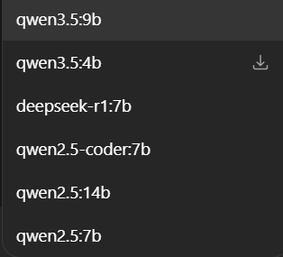

# AetoxOS — Full Technical Specification
> **Document Version:** 1.0.0  
> **Target Model:** Gemini (Antigraviity AI)  
> **Purpose:** Hand-off document for code implementation  
> **Language Stack:** Python 3.11+ (Brain Layer) · Rust (Memory/Storage Layer)  
> **Platform:** Windows 10/11 Native  
> **LLM Backend:** Ollama (Local)  

---

## Table of Contents

1. [Project Overview](#1-project-overview)
2. [Architecture Overview](#2-architecture-overview)
3. [Project Structure](#3-project-structure)
4. [Memory Schema (Core System)](#4-memory-schema-core-system)
5. [Agent Roles & Responsibilities](#5-agent-roles--responsibilities)
6. [Core Modules Specification](#6-core-modules-specification)
7. [Tool Registry](#7-tool-registry)
8. [Interface Layer](#8-interface-layer)
9. [Safety Layer](#9-safety-layer)
10. [Configuration Schema](#10-configuration-schema)
11. [Data Flow Diagram](#11-data-flow-diagram)
12. [Implementation Phases](#12-implementation-phases)
13. [Coding Rules & Conventions](#13-coding-rules--conventions)

---

## 1. Project Overview

**AetoxOS** is a Windows-native, multi-agent AI operating system built on top of local LLMs via Ollama. It is **not a chatbot**. It is an intelligent task orchestration system where multiple smaller AI agents collaborate, pass tasks between each other, and manage memory intelligently — behaving like a real human assistant team.

### Core Philosophy

- **System intelligence > Model size** — A smart architecture with 7B–14B models outperforms a dumb wrapper around a 70B model
- **Memory is selective** — Only pass forward what the next step actually needs
- **Safety first** — Always ask permission before irreversible actions on Windows
- **Open Source** — Designed to be distributed and community-extendable

### Models Used (via Ollama)

| Role | Model | Why |
|------|-------|-----|
| Planner | `qwen2.5:14b` | Best reasoning, called only when planning |
| Executor | `qwen2.5:7b` | Fast, handles individual tasks |
| Researcher | `qwen3.5:9b` | Search and Analyze Information |
| Critic | `deepseek-r1:7b` | Evaluates and scores output quality (Thinking mode) |
| Code tasks | `qwen2.5-coder:7b` | Specific for Coding and Technical tasks |

> **Note:** Heavy models are NOT running constantly. They are invoked only when needed to preserve VRAM.

---

## 2. Architecture Overview

```
User Input (Telegram / CLI)
          │
          ▼
┌─────────────────────────┐
│     Interface Layer     │  ← Python: Telegram Bot / CLI / REST API
└────────────┬────────────┘
             │
             ▼
┌─────────────────────────┐
│    🧠 Brain Layer        │  ← Python: Planner, Dispatcher, Prompt Engine
│  ┌─────────────────┐    │
│  │ Planner (14B)   │    │  Plans and decomposes tasks into steps
│  │ Dispatcher      │    │  Routes tasks to correct agent
│  │ Prompt Engine   │    │  Formats prompts per model size
│  │ Validator       │    │  Checks output quality before passing on
│  │ Observer        │    │  Detects loops and failures
│  └─────────────────┘    │
└────────────┬────────────┘
             │
             ▼
┌─────────────────────────┐
│    ⚙️  Agent Layer       │  ← Python: Executor, Researcher, Critic
│  ┌─────────────────┐    │
│  │ Executor (7B)   │    │  Carries out individual steps
│  │ Researcher (9B) │    │  Searches and analyzes information
│  │ Critic          │    │  Evaluates output quality
│  └─────────────────┘    │
└────────────┬────────────┘
             │
             ▼
┌─────────────────────────┐
│   🧠 Memory Layer        │  ← Rust: Fast I/O, Compression, Queue
│  ┌─────────────────┐    │
│  │ Working Memory  │    │  Current task only (RAM)
│  │ Session Memory  │    │  Current session (RAM)
│  │ Episodic Memory │    │  Past events (SQLite on disk)
│  │ Preference Mem  │    │  User habits (JSON on disk)
│  │ Compressor      │    │  Summarizes before passing forward
│  └─────────────────┘    │
└────────────┬────────────┘
             │
             ▼
┌─────────────────────────┐
│    🛡️  Safety Layer      │  ← Rust + Python
│  Sandbox · Permissions  │
│  Rollback · Audit Log   │
└─────────────────────────┘
```

---

## 3. Project Structure

```
AetoxOS/
├── aetox/
│   ├── __init__.py
│   │
│   ├── core/                        # Brain Layer (Python)
│   │   ├── __init__.py
│   │   ├── planner.py               # Decomposes user goals into task steps
│   │   ├── dispatcher.py            # Routes tasks to the correct agent
│   │   ├── prompt_engine.py         # Formats prompts optimized per model size
│   │   ├── validator.py             # Validates task output before passing on
│   │   ├── observer.py              # Detects infinite loops and failures
│   │   └── context_window.py        # Manages token budget per model
│   │
│   ├── agents/                      # Agent Layer (Python)
│   │   ├── __init__.py
│   │   ├── base_agent.py            # Abstract base class for all agents
│   │   ├── executor.py              # Executes individual task steps (7B)
│   │   ├── researcher.py            # Deep research and analysis (9B thinking)
│   │   └── critic.py                # Evaluates and scores output quality
│   │
│   ├── memory/                      # Memory Layer (Python interface → Rust backend)
│   │   ├── __init__.py
│   │   ├── manager.py               # Central memory coordinator
│   │   ├── working.py               # In-RAM memory for current task
│   │   ├── session.py               # In-RAM memory for current session
│   │   ├── episodic.py              # Persistent event memory (SQLite)
│   │   ├── preference.py            # Persistent user preference memory (JSON)
│   │   ├── compressor.py            # Compresses memory before passing to next step
│   │   └── filter.py                # Decides what to keep vs. discard
│   │
│   ├── tools/                       # Tool Registry (Python)
│   │   ├── __init__.py
│   │   ├── base_tool.py             # Abstract base class for all tools
│   │   ├── file_manager.py          # Windows file system operations
│   │   ├── web_search.py            # Internet search (DuckDuckGo / SerpAPI)
│   │   ├── code_runner.py           # Executes Python / PowerShell scripts
│   │   ├── system_monitor.py        # Windows CPU / RAM / Process monitoring
│   │   └── external_ai.py           # Calls Claude API / GPT-4 for complex tasks
│   │
│   ├── interfaces/                  # Interface Layer (Python)
│   │   ├── __init__.py
│   │   ├── telegram_bot.py          # Telegram Bot interface
│   │   ├── cli.py                   # Rich terminal CLI interface
│   │   └── api_server.py            # FastAPI REST server for future extensibility
│   │
│   └── safety/                      # Safety Layer (Python + Rust)
│       ├── __init__.py
│       ├── sandbox.py               # Restricts file system access boundaries
│       ├── permission.py            # Prompts user before irreversible actions
│       ├── rollback.py              # Undoes changes if task fails
│       └── audit_log.py             # Logs every action taken by the system
│
├── rust_core/                       # Rust Backend (compiled as Python extension)
│   ├── src/
│   │   ├── main.rs
│   │   ├── memory_store.rs          # Fast SQLite read/write
│   │   ├── compressor.rs            # Memory compression algorithm
│   │   ├── task_queue.rs            # Reliable task queue (no data loss)
│   │   ├── file_ops.rs              # Safe Windows file operations
│   │   └── sandbox.rs               # File system access boundary enforcement
│   └── Cargo.toml
│
├── data/
│   ├── memory_store/
│   │   ├── episodic.db              # SQLite: past events
│   │   └── preferences.json         # User habits and settings
│   ├── logs/
│   │   ├── audit.log                # Every action ever taken
│   │   └── errors.log               # Failures and exceptions
│   └── task_queue/
│       └── pending.json             # Tasks waiting to be processed
│
├── config/
│   ├── models.yaml                  # Which model handles which task type
│   ├── permissions.yaml             # What AetoxOS is allowed to touch
│   └── settings.yaml                # General configuration
│
├── tests/
│   ├── test_memory.py
│   ├── test_planner.py
│   ├── test_agents.py
│   └── test_tools.py
│
├── main.py                          # Entry point: aetox.start()
├── requirements.txt
└── README.md
```

---

## 4. Memory Schema (Core System)

This is the most critical part of AetoxOS. The memory system must be smart enough to know **what to remember, what to compress, and what to discard** before passing context to the next step.

### 4.1 Memory Types

#### Working Memory
```python
# aetox/memory/working.py
# Scope: Current task only. Destroyed when task completes.
# Storage: RAM only (Python dict)

class WorkingMemory:
    schema = {
        "task_id": str,           # Unique ID for this task
        "task_goal": str,         # What the user originally asked
        "current_step": int,      # Which step we're on
        "step_results": list,     # Results from each completed step
        "artifacts": dict,        # Files/data created during task
        "errors": list,           # Errors encountered so far
        "retry_count": int,       # How many times we've retried
    }
```

#### Session Memory
```python
# aetox/memory/session.py
# Scope: Current session (from start to shutdown). Destroyed on exit.
# Storage: RAM only (Python dict)

class SessionMemory:
    schema = {
        "session_id": str,
        "started_at": str,              # ISO timestamp
        "tasks_completed": list,        # Summary of completed tasks
        "user_corrections": list,       # Times user corrected the system
        "active_preferences": dict,     # Preferences set this session
        "context_window_usage": int,    # Total tokens used this session
    }
```

#### Episodic Memory
```python
# aetox/memory/episodic.py
# Scope: Persistent across sessions. Lives in SQLite.
# Storage: data/memory_store/episodic.db

class EpisodicMemory:
    schema = {
        "event_id": "TEXT PRIMARY KEY",
        "timestamp": "TEXT",           # ISO 8601
        "event_type": "TEXT",          # task_completed | error | user_correction
        "task_summary": "TEXT",        # Short summary of what happened
        "outcome": "TEXT",             # success | failure | partial
        "key_facts": "TEXT",           # JSON: important facts from this event
        "tags": "TEXT",                # JSON array: searchable tags
    }

    # Save trigger conditions:
    # - Task completed successfully
    # - Task failed (to learn from)
    # - User corrected the system
    # - New pattern discovered (e.g., user always prefers X)
```

#### Preference Memory
```python
# aetox/memory/preference.py
# Scope: Permanent. Updated cumulatively over time.
# Storage: data/memory_store/preferences.json

class PreferenceMemory:
    schema = {
        "file_naming": str,        # e.g., "snake_case"
        "output_format": str,      # e.g., "always PDF"
        "language": str,           # e.g., "Thai preferred"
        "verbosity": str,          # e.g., "concise"
        "forbidden_paths": list,   # Paths the user said never to touch
        "preferred_tools": dict,   # Tool preferences per task type
        "custom_rules": list,      # User-defined rules in natural language
        "last_updated": str,
    }
```

---

### 4.2 Memory Filter — The Smart Core

This is what makes AetoxOS feel intelligent. Before passing context to the next step, the filter decides:

```python
# aetox/memory/filter.py

class MemoryFilter:
    """
    Core decision engine: what gets passed forward, what gets compressed, what gets discarded.
    Uses LLM (7B) to make filtering decisions.
    """

    def filter_for_next_step(
        self,
        current_result: dict,
        next_step_description: str,
        token_budget: int,
    ) -> dict:
        """
        Args:
            current_result: Full output from the current step
            next_step_description: What the next step needs to do
            token_budget: Max tokens we can pass forward

        Returns:
            {
                "critical": [...],    # Must pass forward — next step cannot work without this
                "context": [...],     # Helpful but not critical — pass if budget allows
                "discard": [...],     # Not needed by next step — drop it
                "summary": str,       # Compressed summary of what happened
            }
        """

        prompt = self._build_filter_prompt(current_result, next_step_description, token_budget)
        response = self.llm.ask(model="qwen2.5:7b", prompt=prompt)
        return self._parse_filter_response(response)

    def should_save_to_episodic(self, event: dict) -> bool:
        """
        Returns True if this event is worth saving to long-term memory.
        Saves when: user corrects system, task fails, new preference detected,
        or a repeated pattern is identified.
        """
        triggers = [
            event.get("outcome") == "failure",
            event.get("user_corrected") is True,
            event.get("new_preference_detected") is True,
            event.get("repeated_pattern") is True,
        ]
        return any(triggers)

    def should_update_preference(self, event: dict) -> bool:
        """
        Returns True if a new user preference was discovered.
        """
        return (
            event.get("user_corrected") is True
            or event.get("explicit_preference") is True
        )
```

---

### 4.3 Memory Compressor

```python
# aetox/memory/compressor.py

class MemoryCompressor:
    """
    Compresses memory to fit within context window limits.
    Uses LLM to intelligently summarize — not naive truncation.
    """

    def compress(self, memory_block: dict, max_tokens: int) -> str:
        """
        Compress a memory block to fit within max_tokens.
        Preserves: facts, outcomes, key decisions
        Removes: raw data, verbose descriptions, redundant info
        """

    def compress_step_results(self, step_results: list) -> str:
        """
        Takes all step results so far and compresses into a single
        coherent summary for the final reporting step.
        """

    def rolling_compress(self, session_memory: dict) -> dict:
        """
        Called when session memory approaches context limit.
        Keeps recent steps in full, compresses older steps.
        Like human short-term memory — recent is detailed, old is summary.
        """
```

---

## 5. Agent Roles & Responsibilities

### 5.1 Planner Agent (Qwen 14B)

```python
# aetox/agents/ (called from core/planner.py)
# Model: qwen2.5:14b
# Called: ONCE per user request (not per step)

class Planner:
    """
    Receives user goal → outputs a TaskPlan with ordered steps.
    Each step specifies: what to do, which agent, which tool, what memory to pass.
    """

    def create_plan(self, user_goal: str, context: dict) -> TaskPlan:
        """
        Output schema:
        {
            "plan_id": str,
            "goal": str,
            "estimated_steps": int,
            "steps": [
                {
                    "step_id": int,
                    "description": str,          # What to do
                    "agent": str,                # "executor" | "researcher" | "critic"
                    "tool": str,                 # Which tool to use
                    "depends_on": list[int],     # Step IDs that must complete first
                    "memory_needed": list[str],  # What memory keys to pass forward
                    "success_criteria": str,     # How to know this step succeeded
                    "fallback": str,             # What to do if this step fails
                }
            ],
            "requires_permission": bool,         # Does this plan need user approval?
            "risk_level": str,                   # "low" | "medium" | "high"
        }
        """
```

### 5.2 Executor Agent (Qwen 7B)

```python
# aetox/agents/executor.py
# Model: qwen2.5:7b
# Called: Once per task step

class ExecutorAgent(BaseAgent):
    """
    Does the actual work. Receives one step at a time.
    Does NOT know about other steps — only what memory passes to it.
    """

    def execute_step(self, step: TaskStep, memory: dict) -> StepResult:
        """
        Output schema:
        {
            "step_id": int,
            "status": "success" | "failure" | "partial",
            "output": any,           # The actual result
            "artifacts": dict,       # Files or data created
            "error": str | None,     # Error message if failed
            "confidence": float,     # 0.0 to 1.0
            "memory_updates": dict,  # New info to add to memory
        }
        """
```

### 5.3 Researcher Agent (Qwen 3.5 9B)

```python
# aetox/agents/researcher.py
# Model: qwen3.5:9b
# Called: When task requires web search or deep analysis

class ResearcherAgent(BaseAgent):
    """
    Uses extended thinking for complex research tasks.
    Returns structured findings with source citations.
    """

    def research(self, query: str, depth: str = "standard") -> ResearchResult:
        """
        depth: "quick" | "standard" | "deep"
        Output includes: summary, key_facts, sources, confidence_score
        """
```

### 5.4 Critic Agent (DeepSeek R1 7B)

```python
# aetox/agents/critic.py
# Model: deepseek-r1:7b (thinking mode)
# Called: After executor completes, before passing to next step

class CriticAgent(BaseAgent):
    """
    Evaluates executor output quality.
    Decides: pass forward | retry | escalate to planner
    """

    def evaluate(self, step: TaskStep, result: StepResult) -> CriticVerdict:
        """
```

### 5.5 Coder Agent (Qwen 2.5 Coder 7B)

```python
# aetox/agents/coder.py
# Model: qwen2.5-coder:7b
# Called: When task requires code generation, debugging, or technical analysis

class CoderAgent(BaseAgent):
    """
    Expert in coding and technical tasks.
    Used for generating scripts, fixing bugs, and reviewing code.
    """

    def execute_code_task(self, task: TaskStep, context: dict) -> StepResult:
        """
        Specialized prompt for high-quality code output.
        """
```
        Output schema:
        {
            "verdict": "pass" | "retry" | "escalate",
            "score": float,          # 0.0 to 1.0 quality score
            "issues": list[str],     # Problems found
            "suggestions": list[str] # How to fix if retry
        }
        """
```

---

## 6. Core Modules Specification

### 6.1 Dispatcher

```python
# aetox/core/dispatcher.py

class Dispatcher:
    """
    Routes tasks to the correct agent.
    Manages the task queue and step execution order.
    Handles retries and escalation.
    """

    def dispatch(self, plan: TaskPlan) -> TaskResult:
        """
        Main loop:
        1. Pull next step from plan
        2. Fetch required memory from MemoryManager
        3. Route to correct agent
        4. Pass output to Critic
        5. If pass → compress memory → next step
        6. If retry → retry up to max_retries
        7. If escalate → back to Planner for re-planning
        8. If all steps done → compile final result
        """

    MAX_RETRIES = 3
    MAX_ESCALATIONS = 2
```

### 6.2 Prompt Engine

```python
# aetox/core/prompt_engine.py

class PromptEngine:
    """
    Critical component: formats prompts specifically for each model size.
    7B and 14B models need different prompt structures to avoid hallucination.
    """

    def build_planner_prompt(self, goal: str, context: dict) -> str:
        """
        For 14B model: Can handle complex, multi-part prompts.
        Includes full context, examples, and detailed output schema.
        """

    def build_executor_prompt(self, step: TaskStep, memory: dict) -> str:
        """
        For 7B model: Must be focused, short, with ONE clear task.
        Strict JSON output format enforced.
        Never give 7B model ambiguous instructions.
        """

    def build_filter_prompt(self, result: dict, next_step: str) -> str:
        """
        For memory filtering: Asks model to categorize information.
        Returns structured JSON: {critical, context, discard}
        """

    # Anti-hallucination rules for small models:
    RULES_7B = [
        "Respond ONLY in valid JSON. No explanation.",
        "If unsure, set confidence to 0.0 and explain in 'error' field.",
        "Do not invent file paths or data that was not given to you.",
        "Complete only the task described. Do nothing extra.",
    ]
```

### 6.3 Observer

```python
# aetox/core/observer.py

class Observer:
    """
    Watches for problems during execution.
    Detects: infinite loops, repeated failures, unexpected behavior.
    """

    def check_for_loop(self, step_history: list) -> bool:
        """
        Returns True if the same step has failed 3+ times with same error.
        Triggers escalation to Planner.
        """

    def check_progress(self, plan: TaskPlan, current_step: int) -> ProgressStatus:
        """
        Monitors whether task is making forward progress.
        If stuck for too long → alert user.
        """

    def detect_anomaly(self, result: StepResult) -> bool:
        """
        Checks if result is suspiciously different from expected.
        E.g., executor claims to delete 10,000 files in 0.001 seconds → anomaly.
        """
```

### 6.4 Context Window Manager

```python
# aetox/core/context_window.py

# Token budgets per model
TOKEN_BUDGETS = {
    "qwen2.5:7b":  8192,    # Max safe context
    "qwen2.5:14b": 16384,
    "qwen3:9b":    12288,
}

# Reserve for output generation
OUTPUT_RESERVE = {
    "qwen2.5:7b":  1024,
    "qwen2.5:14b": 2048,
    "qwen3:9b":    2048,
}

class ContextWindowManager:
    """
    Ensures we never exceed model context limits.
    Prioritizes: system prompt > current task > memory > history
    """

    def get_available_budget(self, model: str) -> int:
        return TOKEN_BUDGETS[model] - OUTPUT_RESERVE[model]

    def fit_memory_to_budget(self, memory: dict, model: str) -> dict:
        """
        Trims memory to fit within available token budget.
        Drops lower-priority items first.
        Priority order: critical_facts > context > history > preferences
        """
```

---

## 7. Tool Registry

All tools inherit from `BaseTool` and must implement `execute()` and `validate_input()`.

### 7.1 Base Tool

```python
# aetox/tools/base_tool.py

from abc import ABC, abstractmethod
from pydantic import BaseModel

class BaseTool(ABC):
    name: str
    description: str
    requires_permission: bool = False    # If True, ask user before running

    @abstractmethod
    def execute(self, params: dict) -> ToolResult:
        pass

    @abstractmethod
    def validate_input(self, params: dict) -> bool:
        pass

    def get_schema(self) -> dict:
        """Returns JSON schema of this tool's parameters for the LLM."""
        pass
```

### 7.2 File Manager Tool

```python
# aetox/tools/file_manager.py
# Requires permission for: delete, overwrite, move

class FileManagerTool(BaseTool):
    name = "file_manager"
    supported_actions = [
        "list_files",       # List files in directory
        "read_file",        # Read file contents
        "write_file",       # Write/create file
        "move_file",        # Move file (requires permission)
        "delete_file",      # Delete file (requires permission, logged)
        "search_files",     # Search by name or content
        "get_metadata",     # File size, dates, attributes
        "create_directory", # Create new directory
    ]

    # SAFETY: Never access paths outside allowed_paths in permissions.yaml
    # SAFETY: Always create backup before overwrite
    # SAFETY: Log all destructive operations to audit.log
```

### 7.3 Web Search Tool

```python
# aetox/tools/web_search.py

class WebSearchTool(BaseTool):
    name = "web_search"
    backends = ["duckduckgo", "serpapi"]    # serpapi requires API key in config

    def search(self, query: str, max_results: int = 5) -> list[SearchResult]:
        """
        Returns structured results:
        [{"title": str, "url": str, "snippet": str, "relevance": float}]
        """

    def fetch_page(self, url: str) -> str:
        """Fetches and extracts clean text from a URL."""
```

### 7.4 Code Runner Tool

```python
# aetox/tools/code_runner.py
# SAFETY: Runs in restricted subprocess. No network access from scripts.

class CodeRunnerTool(BaseTool):
    name = "code_runner"
    requires_permission = True
    supported_languages = ["python", "powershell"]

    def run_python(self, code: str, timeout: int = 30) -> CodeResult:
        """Runs Python in sandboxed subprocess."""

    def run_powershell(self, script: str, timeout: int = 30) -> CodeResult:
        """Runs PowerShell with restricted execution policy."""

    # CodeResult schema:
    # {"stdout": str, "stderr": str, "return_code": int, "timed_out": bool}
```

### 7.5 External AI Tool

```python
# aetox/tools/external_ai.py
# For tasks that exceed local model capabilities

class ExternalAITool(BaseTool):
    name = "external_ai"
    requires_permission = True    # Sends data to external API
    supported_providers = ["claude", "openai"]

    def ask(self, prompt: str, provider: str = "claude") -> str:
        """
        Sends prompt to external AI API.
        Always warns user: "This will send data to an external server."
        API keys stored in config/settings.yaml (never hardcoded)
        """
```

---

## 8. Interface Layer

### 8.1 Telegram Bot Interface

```python
# aetox/interfaces/telegram_bot.py
# Library: python-telegram-bot

class TelegramInterface:
    """
    Main user interface via Telegram.
    Supports: text commands, file uploads, inline progress updates.
    """

    # Commands:
    # /start     — Initialize AetoxOS
    # /task      — Start a new task
    # /status    — Check current task status
    # /cancel    — Cancel current task
    # /memory    — Show what AetoxOS remembers about user
    # /forget    — Clear specific memories
    # /approve   — Approve a pending permission request
    # /deny      — Deny a pending permission request

    def send_progress(self, step: int, total: int, message: str):
        """Sends live progress updates during long tasks."""

    def request_permission(self, action: str, details: str) -> bool:
        """Sends inline keyboard Yes/No for user approval."""
```

### 8.2 CLI Interface

```python
# aetox/interfaces/cli.py
# Library: rich (for beautiful terminal output)

class CLIInterface:
    """
    Rich terminal interface for local development and testing.
    Shows: live progress bars, colored logs, task tree visualization.
    """
```

### 8.3 REST API Server

```python
# aetox/interfaces/api_server.py
# Library: FastAPI

# Endpoints:
# POST /task          — Submit new task
# GET  /task/{id}     — Get task status and results
# GET  /memory        — Get current memory state
# POST /approve/{id}  — Approve permission request
# GET  /health        — System health check
```

---

## 9. Safety Layer

### 9.1 Permission System

```python
# aetox/safety/permission.py

# Risk levels require different approval:
RISK_LEVELS = {
    "low":    "auto_approve",      # List files, read files
    "medium": "notify_user",       # Write new files
    "high":   "require_approval",  # Delete, move, run code, external AI
}

class PermissionManager:
    def check_and_request(self, action: str, details: dict) -> bool:
        """
        1. Determine risk level
        2. If high → pause execution, notify user via interface
        3. Wait for user approval (timeout: 300 seconds)
        4. Log decision to audit.log
        5. Return True if approved, False if denied/timeout
        """
```

### 9.2 Sandbox

```python
# aetox/safety/sandbox.py

class Sandbox:
    """
    Enforces file system access boundaries.
    AetoxOS can ONLY access paths listed in config/permissions.yaml
    """

    def validate_path(self, path: str) -> bool:
        """Returns True only if path is within allowed_paths."""

    def wrap_file_operation(self, operation: callable, path: str):
        """Decorator that validates path before any file operation."""
```

### 9.3 Rollback

```python
# aetox/safety/rollback.py

class RollbackManager:
    """
    Creates restore points before destructive operations.
    Can undo the last N operations.
    """

    def create_checkpoint(self, task_id: str) -> str:
        """Creates backup of files about to be modified."""

    def rollback(self, checkpoint_id: str) -> bool:
        """Restores files to checkpoint state."""
```

---

## 10. Configuration Schema

### config/models.yaml

```yaml
models:
  planner:
    name: "qwen2.5:14b"
    max_tokens: 16384
    temperature: 0.3
    timeout: 120

  executor:
    name: "qwen2.5:7b"
    max_tokens: 8192
    temperature: 0.1
    timeout: 60

  researcher:
    name: "qwen3.5:9b"
    max_tokens: 12288
    temperature: 0.7
    timeout: 90

  critic:
    name: "deepseek-r1:7b"
    max_tokens: 16384
    temperature: 0.5
    timeout: 180
    thinking_enabled: true

  coder:
    name: "qwen2.5-coder:7b"
    max_tokens: 8192
    temperature: 0.2
    timeout: 90

task_routing:
  file_operations:    executor
  web_research:       researcher
  code_generation:    coder
  code_debugging:     coder
  data_analysis:      researcher
  report_writing:     executor
  quality_check:      critic
  complex_planning:   planner
```

### config/permissions.yaml

```yaml
allowed_paths:
  - "C:/Users/{username}/Documents"
  - "C:/Users/{username}/Desktop"
  - "D:/Projects"                     # Add custom paths here

forbidden_paths:
  - "C:/Windows"
  - "C:/Program Files"
  - "C:/Users/{username}/AppData"

allowed_operations:
  auto_approve:
    - list_files
    - read_file
    - search_files
    - web_search

  require_approval:
    - delete_file
    - move_file
    - run_code
    - external_ai_call

max_file_size_mb: 100
max_files_per_operation: 500
```

### config/settings.yaml

```yaml
ollama:
  host: "http://localhost:11434"
  timeout: 120

interfaces:
  telegram:
    enabled: true
    token: ""                 # Set via environment variable TELEGRAM_BOT_TOKEN
  cli:
    enabled: true
  api:
    enabled: false
    port: 8000

memory:
  max_working_tokens: 4096
  max_session_tokens: 8192
  episodic_db_path: "data/memory_store/episodic.db"
  preferences_path: "data/memory_store/preferences.json"

safety:
  permission_timeout_seconds: 300
  max_retries: 3
  max_escalations: 2
  rollback_enabled: true
  audit_log_path: "data/logs/audit.log"

external_ai:
  claude_api_key: ""          # Set via environment variable CLAUDE_API_KEY
  openai_api_key: ""          # Set via environment variable OPENAI_API_KEY
```

---

## 11. Data Flow Diagram

```
User: "Organize all PDF files in D:/Documents into folders by year"
  │
  ▼
[Interface Layer]
  Telegram receives message → creates Task object
  │
  ▼
[Planner — qwen2.5:14b]
  Creates TaskPlan:
  Step 1: list all PDF files in D:/Documents  (executor + file_manager)
  Step 2: extract year from each filename      (executor)
  Step 3: create year folders if not exist     (executor + file_manager) ⚠️ permission
  Step 4: move each file to correct folder     (executor + file_manager) ⚠️ permission
  Step 5: generate summary report              (executor)
  risk_level: "high" → requires_permission: true
  │
  ▼
[Permission Check]
  "This task will move 847 files. Approve? [Yes] [No]"
  User clicks Yes
  │
  ▼
[Dispatcher Loop]
  ┌─────────────────────────────────────────────────┐
  │  Step 1: Executor scans files                   │
  │    Result: {pdf_count: 847, files: [...]}        │
  │    MemoryFilter: pass forward → {count, years}   │
  │    Discard: {full file paths list}               │
  │    Compress: "847 PDFs found, years 2019–2024"  │
  │                                                  │
  │  Step 2: Executor extracts years                 │
  │    Result: {year_groups: {2019: 23, 2020: ...}} │
  │    MemoryFilter: pass forward → year_groups      │
  │                                                  │
  │  Step 3: Executor creates folders                │
  │    Result: {folders_created: [2019, 2020, ...]} │
  │                                                  │
  │  Step 4: Executor moves files                    │
  │    Result: {moved: 847, failed: 0}               │
  │    EpisodicMemory.save() ← task completed        │
  │                                                  │
  │  Step 5: Executor writes report                  │
  │    Result: "report.txt saved to D:/Documents"    │
  └─────────────────────────────────────────────────┘
  │
  ▼
[Interface Layer]
  "✅ Done! Moved 847 files into 6 year folders. Report saved."
```

---

## 12. Implementation Phases

### Phase 1 — Core MVP (Python only, ~2 weeks)
- [ ] `main.py` entry point with Ollama connection test
- [ ] `core/planner.py` — Basic task planning with qwen2.5:14b
- [ ] `core/dispatcher.py` — Sequential step execution
- [ ] `core/prompt_engine.py` — Prompts for 7B and 14B
- [ ] `agents/executor.py` — Basic execution with qwen2.5:7b
- [ ] `memory/working.py` — In-RAM working memory
- [ ] `memory/filter.py` — Basic memory filtering
- [ ] `tools/file_manager.py` — List, read, write files
- [ ] `interfaces/cli.py` — Basic CLI with rich
- [ ] `safety/permission.py` — Simple Yes/No approval

**Goal:** Ask AetoxOS to organize files → it works end-to-end

---

### Phase 2 — Smart Memory (~1 week)
- [ ] `memory/session.py` — Session-level memory
- [ ] `memory/episodic.py` — SQLite persistence
- [ ] `memory/preference.py` — User preference learning
- [ ] `memory/compressor.py` — Context compression
- [ ] `core/context_window.py` — Token budget management
- [ ] `core/observer.py` — Loop detection

**Goal:** AetoxOS remembers user preferences across sessions

---

### Phase 3 — Full Agent Network (~1 week)
- [ ] `agents/researcher.py` — Web research with thinking mode
- [ ] `agents/critic.py` — Output quality evaluation
- [ ] `tools/web_search.py` — DuckDuckGo integration
- [ ] `tools/code_runner.py` — Python/PowerShell execution
- [ ] `interfaces/telegram_bot.py` — Full Telegram interface
- [ ] `safety/sandbox.py` — Path boundary enforcement
- [ ] `safety/rollback.py` — Undo system

**Goal:** Multi-agent collaboration working. Telegram interface live.

---

### Phase 4 — Rust Core (~2 weeks)
- [ ] `rust_core/memory_store.rs` — Replace SQLite Python with Rust
- [ ] `rust_core/compressor.rs` — Fast memory compression
- [ ] `rust_core/task_queue.rs` — Reliable task queue
- [ ] `rust_core/file_ops.rs` — Fast Windows file operations
- [ ] Python ↔ Rust bridge via PyO3

**Goal:** System is measurably faster. No memory leaks.

---

### Phase 5 — Open Source Release
- [ ] `tools/external_ai.py` — Claude/GPT fallback for complex tasks
- [ ] `interfaces/api_server.py` — FastAPI REST server
- [ ] Full test suite
- [ ] Docker / Windows installer
- [ ] README and documentation

---

## 13. Coding Rules & Conventions

### Python Standards
```python
# Python version: 3.11+
# Formatter: black
# Type hints: required on all public functions
# Docstrings: required on all classes and public methods

# ✅ Correct
def execute_step(self, step: TaskStep, memory: dict) -> StepResult:
    """Executes a single task step and returns the result."""
    ...

# ❌ Wrong
def execute_step(self, step, memory):
    ...
```

### Error Handling
```python
# All tool calls must catch exceptions and return structured errors
# Never let an exception crash the dispatcher loop

try:
    result = tool.execute(params)
except ToolExecutionError as e:
    return StepResult(status="failure", error=str(e))
```

### LLM Response Parsing
```python
# Always expect LLM to return invalid JSON sometimes
# Always have fallback behavior

import json

def parse_llm_response(response: str) -> dict:
    try:
        return json.loads(response)
    except json.JSONDecodeError:
        # Extract JSON from response if wrapped in markdown
        import re
        match = re.search(r'\{.*\}', response, re.DOTALL)
        if match:
            return json.loads(match.group())
        # Last resort: return error dict
        return {"error": "Could not parse LLM response", "raw": response}
```

### Logging Convention
```python
import logging

# Every module must have its own logger
logger = logging.getLogger("aetox.core.planner")

# Log levels:
# DEBUG   — internal state, memory contents
# INFO    — task started, step completed, tool called
# WARNING — retry attempted, low confidence result
# ERROR   — step failed, tool crashed
# CRITICAL — safety violation detected
```

### Environment Variables (Never hardcode secrets)
```
TELEGRAM_BOT_TOKEN=your_token_here
CLAUDE_API_KEY=your_key_here
OPENAI_API_KEY=your_key_here
SERPAPI_KEY=your_key_here
AETOX_ENV=development  # or production
```

---

## Implementation Notes for Gemini

1. **Start with Phase 1 only.** Do not implement Rust core until Python version is fully working.

2. **The Memory Filter is the most important component.** Get this right before anything else — it determines whether the system feels intelligent or dumb.

3. **Prompt Engine is critical for reliability.** The 7B model will hallucinate if given ambiguous prompts. Always enforce JSON-only output with explicit schema.

4. **Test with this exact scenario first:**
   - User: "List all .txt files on my Desktop and tell me how many there are"
   - Expected: Planner creates 2-step plan → Executor lists files → Executor counts → Report

5. **Ollama connection assumed at:** `http://localhost:11434`  
   Test with: `GET http://localhost:11434/api/tags`

6. **Models must be pre-pulled before running:**
   ผมมีโมเดล ใน Olama อยู่แล้ว 

7. **Windows path handling:** Always use `pathlib.Path` — never string concatenation for paths.
   ```python
   from pathlib import Path
   path = Path("D:/Documents") / "report.txt"  # ✅ Correct
   path = "D:/Documents" + "/" + "report.txt"  # ❌ Wrong
   ```

---

*End of AetoxOS Technical Specification v1.0.0*