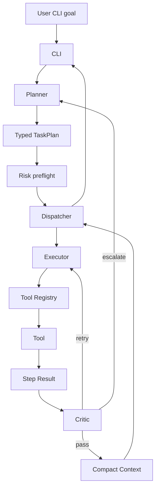

# Aetox CLI Architecture Handoff

## Intake

- Mode: Existing System Mapping Mode plus proposed rebuild.
- Selected pass level: Full Mode.
- Reason: The request explicitly retires the whole existing project, preserves
  architectural knowledge, and prepares a new implementation in Go.
- Output path: `docs/`.
- Evidence inspected: root file tree, README, `AetoxClaw.md`, existing `docs/`,
  Python source module structure, configs, tests, git remote, and recent commits.

## Confirmed Facts

- The old repo was named AetoxOS remotely and AetoxClaw in several documents.
- The implementation was Python-based, with modules under `aetox/`.
- The system was organized around agent orchestration rather than pure chat.
- Core implementation areas existed for agents, dispatcher/core, memory, tools,
  safety, interfaces, planner, config, and tests.
- The old implementation used local Ollama model configuration.
- The repo had a GitHub remote at `Mike0165115321/AetoxOS`.

## Reasonable Inferences

- The original goal was a local-first AI assistant that can operate on the
  user's machine while keeping safety boundaries.
- The Python implementation was an exploration prototype, not the final product
  shape.
- The strongest reusable value is the architecture vocabulary and workflows,
  not the concrete Python code.
- Go is a good target for the rebuild because the desired product is CLI-first,
  fast to start, easy to distribute, and likely to include filesystem/process
  operations.

## Architecture Areas

### CLI Interface

Proposed for the Go rewrite.

Responsibilities:

- Accept a user goal.
- Show plan preview, progress, permission prompts, and final report.
- Support direct command mode first, interactive shell later.

### Planner

Confirmed concept, proposed Go implementation.

Responsibilities:

- Convert user intent into a typed `TaskPlan`.
- Mark risk level and permission requirements before execution.
- Keep plans small and executable.

Suggested Go package: `internal/planner`.

### Dispatcher

Confirmed concept, proposed Go implementation.

Responsibilities:

- Run task steps in order.
- Apply timeout, retry, critic feedback, and escalation rules.
- Keep plan-scoped history short.

Suggested Go package: `internal/dispatcher`.

### Executor

Confirmed concept, proposed Go implementation.

Responsibilities:

- Convert each task step into a tool call or chat-style response.
- Use tool schemas from the registry.
- Avoid knowing specific tool internals.

Suggested Go package: `internal/executor`.

### Critic

Confirmed concept, proposed Go implementation.

Responsibilities:

- Check whether step output satisfies success criteria.
- Decide `pass`, `retry`, or `escalate`.
- Produce concise retry hints.

Suggested Go package: `internal/critic`.

### Tool Registry

Confirmed concept, proposed Go implementation.

Responsibilities:

- Register tools by name.
- Expose tool schemas to planner/executor prompts.
- Execute tools through a stable interface.

Suggested Go package: `internal/tools`.

### Memory

Confirmed concept, proposed Go implementation.

The old direction intentionally favored lightweight context:

- Chat mode uses a short sliding window.
- Plan mode uses immediate previous step plus compact plan summary.
- No automatic background RAG in the MVP.
- No hidden long-running summarization pipeline in the MVP.

Suggested Go package: `internal/memory`.

### Safety

Confirmed concept, proposed Go implementation.

Safety remains a first-class boundary:

- Path sandbox.
- Risk rules.
- Permission prompt for destructive operations.
- Timeout handling.
- Audit trail after the MVP, not before the first vertical slice.

Suggested Go package: `internal/safety`.

### Model Client

Confirmed old dependency, proposed abstraction.

The old implementation was Ollama-oriented. The Go rewrite should hide model
providers behind an interface so local Ollama is the first provider but not a
hard architectural dependency.

Suggested Go package: `internal/llm`.

## Proposed High-Level Flow



## Data Contracts

Proposed minimal contracts for Go:

```go
type TaskPlan struct {
    ID                 string
    Goal               string
    Steps              []TaskStep
    RequiresPermission bool
    RiskLevel          RiskLevel
}

type TaskStep struct {
    ID              int
    Description     string
    Tool            string
    Action          string
    Params          map[string]any
    DependsOn       []int
    SuccessCriteria string
    RiskLevel       RiskLevel
}

type StepResult struct {
    StepID        int
    Status        StepStatus
    Output        string
    Artifacts     map[string]string
    Error         string
    Confidence    float64
    MemoryUpdates map[string]any
}

type CriticVerdict struct {
    Verdict    string
    Score      float64
    Issues     []string
    Suggestion string
}
```

## Decisions Already Made

- Rebuild from scratch in Go.
- Rename product direction to Aetox CLI.
- Preserve docs and ideas.
- Remove old implementation code.

## Decisions Still Needed

- Exact GitHub repo name casing: currently handled as `Aetox-cli` unless later
  changed.
- First LLM provider interface details.
- Whether the initial CLI should support only one-shot commands or also an
  interactive REPL.
- Whether persistent memory is in scope for v0.1 or delayed.

## Open Questions

- Should Aetox CLI be Windows-first only, or cross-platform from day one?
- Should high-risk operations require per-step approval or whole-plan approval?
- Should tool plugins be compiled Go packages, external executables, or both?
- Should the first release support Ollama only?

## Risks

- Overbuilding multi-agent features before the first safe CLI slice works.
- Letting model prompts become the real API instead of typed Go contracts.
- Accidentally reintroducing heavy memory systems before proving they help.
- Hiding destructive filesystem behavior behind natural language without clear
  user confirmation.

## Validation Gate

- Claim traceability: Major claims come from inspected files or the user's
  request. Proposed Go modules are labeled as proposed.
- Scope alignment: Scope expanded only from extraction into handoff docs because
  the user asked to preserve ideas before deleting code.
- Handoff readiness: Unknowns, risks, decisions, and next steps are included.
