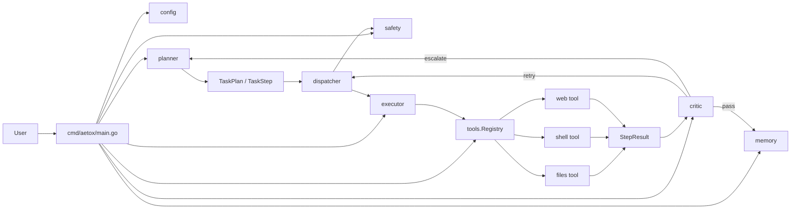

# Aetox CLI System Overview

## Scope

- Project: `Aetox CLI`
- Inspection date: `2026-06-06`
- Inspected by: `Codex` using `senior-architect-agent`
- Intake scope: อธิบายระบบปัจจุบันของ Go codebase ทั้งชุด
- Final documented scope: executable path ใต้ `cmd/` และ orchestration/tooling ใต้ `internal/`
- Scope change: ไม่มี
- Pass level: `Full Mode`
- Pass reason: คำขอเป็นการอธิบายระบบทั้งตัว และพฤติกรรมจริงกระจายอยู่ในหลายแพ็กเกจที่สัมพันธ์กัน
- Inspection scope: `README.md`, `go.mod`, `cmd/aetox/main.go`, ทุกไฟล์ใต้ `internal/`, และเอกสาร `docs/go-rebuild-roadmap.md`, `docs/future-agent-notes.md`, `docs/phase-3-planner-critic-loop.md`
- Skipped areas: asset รูปภาพและ non-code artifacts ที่ไม่กระทบพฤติกรรมของระบบปัจจุบัน
- Inspection source: repository files และ `go test ./...`
- Existing architecture context reused: `README.md`, `docs/go-rebuild-roadmap.md`, `docs/future-agent-notes.md`, `docs/phase-3-planner-critic-loop.md`

## Confirmed Facts

- จุดเข้าโปรแกรมคือ `cmd/aetox/main.go`
  - Evidence: ไฟล์ `cmd/aetox/main.go` parse flags, โหลด config, สร้าง planner/dispatcher/executor/critic/memory/safety และ print report
  - Evidence strength: `Direct`
  - Verify first: `No`
- ระบบปัจจุบันเป็น `CLI-first`, `local-first`, และรันงานแบบ one-shot ต่อหนึ่ง goal
  - Evidence: goal รับจาก command-line args, ไม่มี REPL server หรือ network listener
  - Evidence strength: `Direct`
  - Verify first: `No`
- Planner ปัจจุบันยังเป็น rule-based heuristic ไม่ใช่ LLM-backed planner
  - Evidence: `internal/planner/planner.go` ใช้ string matching/inference เช่น `list`, `read`, `write`, `fetch`, `run`
  - Evidence strength: `Direct`
  - Verify first: `No`
- เส้นทาง execute ของทุก step ผ่าน `executor -> tools.Registry -> Tool.Execute`
  - Evidence: `internal/executor/executor.go`, `internal/tools/tools.go`
  - Evidence strength: `Direct`
  - Verify first: `No`
- Safety gate ใช้ risk level ของ step ร่วมกับ prompt ขออนุมัติจากผู้ใช้
  - Evidence: `internal/safety/manager.go`, `internal/contracts/types.go`
  - Evidence strength: `Direct`
  - Verify first: `No`
- Memory เป็นแบบ transient ต่อ task และเก็บอยู่ใน RAM เท่านั้น
  - Evidence: `internal/memory/context.go` ไม่มี persistence layer, database, หรือ file-backed state
  - Evidence strength: `Direct`
  - Verify first: `No`
- Tool ที่ register อยู่จริงตอนนี้มี 3 ตัว: `files`, `shell`, `web`
  - Evidence: `cmd/aetox/main.go`
  - Evidence strength: `Direct`
  - Verify first: `No`
- โค้ดปัจจุบันคอมไพล์ได้
  - Evidence: `go test ./...` ผ่านทุกแพ็กเกจ และรายงานว่าไม่มี test files
  - Evidence strength: `Direct`
  - Verify first: `No`

## Reasonable Inferences

- โค้ดชุดนี้เป็น vertical slice สำหรับพิสูจน์ orchestration loop ก่อนเพิ่มความฉลาดของ agent
  - Evidence: planner ยังเป็น deterministic heuristic, memory ยังเบา, roadmap ระบุ phase การขยายความสามารถไว้ภายหลัง
  - Evidence strength: `Inferred`
  - Verify first: `No`
- ความปลอดภัยของเวอร์ชันนี้พึ่ง sandbox path checking และ explicit approval มากกว่าการวิเคราะห์คำสั่งเชิงลึก
  - Evidence: `resolveSandboxPath(...)` ป้องกัน path escape, `shell.run` ส่งคำสั่งเข้า OS shell ตรง, approval ตัดสินจาก risk level
  - Evidence strength: `Inferred`
  - Verify first: `Yes`
- โครงสร้าง package ถูกแยกให้พร้อมต่อการแทน planner ด้วย LLM ในอนาคต แม้ปัจจุบันจะยังไม่มี `internal/llm`
  - Evidence: เอกสาร roadmap/future notes วางแผน LLM abstraction, แต่โค้ดจริงยังแยก planner/critic/dispatcher ชัด
  - Evidence strength: `Inferred`
  - Verify first: `No`

## Assumptions

- เอกสารนี้ถือว่า source of truth คือโค้ด Go ปัจจุบัน ไม่ใช่เอกสารสถาปัตยกรรมรุ่นก่อนหรือโน้ตช่วงเปลี่ยนผ่าน
  - Reason: user ขอเอกสารอธิบาย "ระบบ" ใน repo ปัจจุบัน และ README ระบุว่า Python implementation ถูกถอดออกแล้ว
  - Evidence strength: `Assumed`
  - Verify first: `No`

## Architecture Areas

| Area | Status | Notes |
| --- | --- | --- |
| Frontend | Not observed | ไม่มี web UI หรือ desktop UI ใน repo นี้ |
| Backend / Orchestration | Implemented | อยู่ใน `planner`, `dispatcher`, `executor`, `critic`, `safety`, `memory` |
| Database / Persistence | Not observed | ไม่มี database, queue, cache store, หรือ file persistence สำหรับ memory |
| AI / Background Processes | Partial | มี agent-style orchestration แต่ยังไม่มี LLM client/background worker จริง |
| External Services | Partial | รองรับ `web.fetch` แบบ HTTP GET เท่านั้น |
| Infrastructure / Deployment | Not observed | ไม่มี Docker, CI workflow, deployment manifest |
| Shared Modules | Implemented | `contracts` และ `config` เป็นฐานข้อมูลร่วม |
| Tests / Quality Gates | Minimal | `go test ./...` ผ่าน แต่ยังไม่มี test files |

## System Summary

Aetox CLI เป็น command-line orchestrator ขนาดเล็กที่รับ goal ภาษาอังกฤษแบบสั้นจากผู้ใช้ แล้วแปลงเป็น `TaskPlan` ที่ประกอบด้วย step แบบ typed จากนั้น `Dispatcher` จะคุมวงจรการรัน step, ขออนุมัติงานเสี่ยง, เรียก tool ผ่าน registry, ส่งผลลัพธ์เข้า `Critic`, และถ้าจำเป็นจะ retry หรือ re-plan ใหม่จาก hint ที่ critic ส่งกลับมา

สถาปัตยกรรมปัจจุบันเน้นความเรียบและตรวจสอบได้มากกว่าความสามารถเชิง agent เต็มรูปแบบ: planner ยังเป็น rule-based, memory ยังไม่ persistent, และ tool set ยังเล็ก แต่เส้นทางงานหลักตั้งแต่รับ goal จนได้ final report ทำงานครบแล้ว

## Main Components

| Component | Responsibility | Status | Evidence | Evidence Strength | Verify First |
| --- | --- | --- | --- | --- | --- |
| CLI bootstrap | parse flags, โหลด config, สร้าง dependency graph, เรียก plan/run/report | Implemented | `cmd/aetox/main.go` | Direct | No |
| `config` | normalize runtime options เช่น sandbox root, retries, approval timeout | Implemented | `internal/config/config.go` | Direct | No |
| `contracts` | นิยาม shared types เช่น `TaskPlan`, `TaskStep`, `StepResult`, `CriticVerdict` | Implemented | `internal/contracts/types.go` | Direct | No |
| `planner` | แยก goal เป็น clauses และ infer step จาก heuristics | Implemented | `internal/planner/planner.go` | Direct | No |
| `dispatcher` | orchestrate step loop, retry loop, replanning loop, report aggregation | Implemented | `internal/dispatcher/dispatcher.go` | Direct | No |
| `executor` | resolve tool จาก registry และ execute step | Implemented | `internal/executor/executor.go` | Direct | No |
| `critic` | ประเมินผลลัพธ์ว่า pass, retry, หรือ escalate | Implemented | `internal/critic/critic.go` | Direct | No |
| `memory` | เก็บผลลัพธ์ของ step ใน session ปัจจุบัน | Implemented | `internal/memory/context.go` | Direct | No |
| `safety` | ขออนุมัติงานเสี่ยงผ่าน stdin/stdout และ timeout | Implemented | `internal/safety/manager.go` | Direct | No |
| `tools.Registry` | register/get tool ตามชื่อ | Implemented | `internal/tools/tools.go` | Direct | No |
| `files` tool | list/read/write/move/delete พร้อม sandbox path enforcement | Implemented | `internal/tools/files_list.go` | Direct | No |
| `shell` tool | รัน shell command ใน sandbox directory และตัด output | Implemented | `internal/tools/shell_run.go` | Direct | Yes |
| `web` tool | HTTP GET แบบ bounded output และ timeout 15s | Implemented | `internal/tools/web_fetch.go` | Direct | No |

## System Boundary

### In Scope

- รับ goal แบบ one-shot จาก CLI arguments
- แปลง goal เป็น step sequence แบบง่าย
- รันงานบน filesystem, shell, และ web fetch ภายใน sandbox policy ที่มีอยู่
- ขออนุมัติเมื่อ risk level ไม่ใช่ `low`
- aggregate ผลลัพธ์เป็น final execution report

### Not Observed

- persistent memory
- user profile / auth / multi-tenant isolation
- plugin loading แบบ dynamic
- LLM provider integration
- deployment/runtime service mode

## Workflow Map

### Primary Workflow

- Name: `Goal -> Plan -> Execute -> Critic -> Report`
- Trigger: ผู้ใช้รัน `aetox "your goal"`
- Result: ได้ report ของแต่ละ step พร้อมสถานะสำเร็จ/ล้มเหลว
- Inspection source: `cmd/aetox/main.go`, `internal/planner/planner.go`, `internal/dispatcher/dispatcher.go`, `internal/executor/executor.go`, `internal/critic/critic.go`

### Steps

| Step | Actor | Action | Evidence |
| --- | --- | --- | --- |
| 1 | User | ส่ง goal ผ่าน CLI args | `cmd/aetox/main.go` |
| 2 | CLI | parse flags และโหลด config | `cmd/aetox/main.go`, `internal/config/config.go` |
| 3 | Planner | สร้าง `TaskPlan` จาก goal | `internal/planner/planner.go` |
| 4 | CLI | register tools และสร้าง dispatcher dependencies | `cmd/aetox/main.go` |
| 5 | Dispatcher | เดิน step ตามลำดับใน plan ปัจจุบัน | `internal/dispatcher/dispatcher.go` |
| 6 | Safety | อนุมัติ/ปฏิเสธ step ที่ไม่ใช่ `low` risk | `internal/safety/manager.go` |
| 7 | Executor | ส่ง step ไปยัง tool ที่ถูกต้อง | `internal/executor/executor.go` |
| 8 | Tool | ทำงานจริง เช่น list/read/write/move/delete/run/fetch | `internal/tools/*.go` |
| 9 | Critic | ประเมินผลลัพธ์ | `internal/critic/critic.go` |
| 10 | Dispatcher | `pass` -> บันทึก memory, `retry` -> retry step, `escalate` -> build plan ใหม่ | `internal/dispatcher/dispatcher.go` |
| 11 | CLI | พิมพ์ final report | `cmd/aetox/main.go` |

## File Responsibility Map

| Path | Responsibility |
| --- | --- |
| `cmd/aetox/main.go` | application entrypoint และ composition root |
| `internal/config/config.go` | runtime defaults และ option normalization |
| `internal/contracts/types.go` | shared contracts ระหว่างทุกเลเยอร์ |
| `internal/planner/planner.go` | goal parsing, clause splitting, task inference, plan rebuild from hint |
| `internal/dispatcher/dispatcher.go` | orchestration loop หลักของระบบ |
| `internal/executor/executor.go` | tool dispatch |
| `internal/critic/critic.go` | output evaluation rules |
| `internal/memory/context.go` | task-scoped in-memory context |
| `internal/safety/manager.go` | approval flow และ prompt text |
| `internal/tools/tools.go` | tool interface และ registry |
| `internal/tools/files_list.go` | filesystem capability และ sandbox enforcement |
| `internal/tools/shell_run.go` | shell command execution |
| `internal/tools/web_fetch.go` | HTTP fetch capability |

## Module Diagram

## Runtime Notes

- `--yes` ทำให้ step ที่ปกติต้อง approval ผ่านทันที
- `--root` กำหนด sandbox root; ถ้าไม่กำหนดจะใช้ current working directory
- `--retries` คุมจำนวน retry ระดับ step
- `--plan-retries` คุมจำนวนรอบ replanning หลัง critic escalate
- `web.fetch` มี timeout ภายใน tool ที่ 15 วินาที
- `shell.run` ใช้ `cmd /C` บน Windows และ `sh -c` บน non-Windows
- `files` tool บังคับ path ให้อยู่ใต้ sandbox root ด้วย `filepath.Rel(...)`

## Open Questions

- semantics ของ `--retries` และ `--plan-retries` ตั้งใจให้นับเป็น "จำนวน retry" หรือ "จำนวน attempts ทั้งหมด" เพราะ implementation ปัจจุบันมีลักษณะ `max + 1 attempts`
- `critic_hint` ถูก inject เข้า `step.Params` ตอน retry แต่ tool ปัจจุบันยังไม่ได้นำไปใช้โดยตรง ควรใช้กับ planner แบบ LLM, rule engine, หรือ tool adapter ใดในอนาคต
- `SessionContext` เก็บผลลัพธ์ไว้ แต่ dispatcher ยังไม่ได้ใช้ `CompactSummary()` หรือ context นี้เพื่อปรับแผนระหว่างรันมากนัก
- `shell.run` ควรถูกจำกัดคำสั่งเชิงนโยบายมากกว่านี้หรือไม่ เพราะตอนนี้อาศัย sandbox directory และ approval เป็นหลัก

## Risks

- planner ใช้ heuristic string matching จึงเปราะกับ goal ที่กำกวมหรือใช้ถ้อยคำไม่ตรง pattern
- `shell.run` เปิดความสามารถสูง แม้อยู่ใน sandbox directory ก็ยังสามารถแก้ไฟล์จำนวนมากใน root นั้นได้
- `BuildPlanFromHint(...)` ต่อข้อความ hint/error/output เข้ากับ goal เดิม อาจทำให้การ infer plan รอบถัดไปคลุมเครือขึ้นเมื่อข้อความยาว
- ยังไม่มี automated tests ทำให้ regression ของ planner/safety/retry semantics ตรวจจับได้ยาก
- ระบบยังไม่มี explicit step timeout ใน dispatcher นอกจาก context จาก caller และ timeout ภายในบาง tool

## Decisions

- ใช้โค้ด Go ปัจจุบันเป็น source of truth ในการอธิบายระบบ
- จัดประเภทระบบนี้เป็น current executable vertical slice ไม่ใช่ full agent platform
- ถือว่าเฉพาะโค้ด Go ปัจจุบันและเอกสาร Aetox CLI ที่ยังคงอยู่เป็นหลักฐานยืนยัน behavior ปัจจุบัน

## Validation Gate

1. Claim traceability: ทุก claim สำคัญอ้างอิงจากไฟล์โค้ดหรือผล `go test ./...`; ส่วนที่ตีความถูกแยกไว้ใน `Reasonable Inferences`
2. Scope alignment: ขอบเขตสุดท้ายยังเป็นการอธิบายระบบ Go ปัจจุบันทั้งชุดตามที่ร้องขอ ไม่มีการขยายไปถึงสถาปัตยกรรมในอนาคตเกินจำเป็น
3. Handoff readiness: มี unknowns, risks, boundaries, file responsibility, และ next steps ครบ
4. Pass level stated: ระบุ `Full Mode` ไว้แล้ว
5. Inspection scope justified: ตรวจ entrypoint, contracts, orchestration loop, tool layer, และเอกสารบริบทที่เกี่ยวข้อง
6. Skipped areas named: ระบุ asset และ non-code artifacts ที่ไม่ใช่ source of truth แล้ว

## Next Steps

- ถ้าต้องการเอกสารสำหรับ onboarding เพิ่ม ให้แตกต่อเป็น `module-map`, `workflow-map`, และ `risk-register` แยกไฟล์
- เพิ่ม unit tests ให้ `planner`, `safety`, และ `dispatcher` ก่อนขยาย tool set
- ถ้าจะเริ่ม LLM integration ให้สร้าง `internal/llm` แยกจาก `planner` และรักษา typed contracts ปัจจุบันไว้
