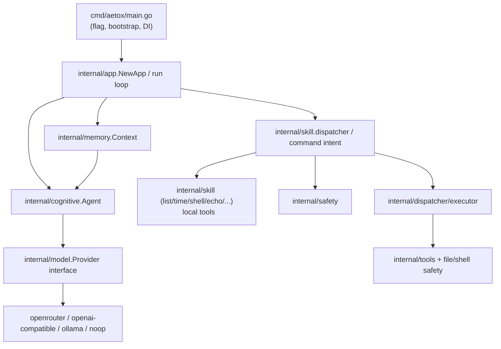

# สถาปัตยกรรม Aetox CLI (โฉมใหม่ที่รองรับการขยาย)

อัปเดตล่าสุด: 7 มิถุนายน 2569  
เป้าหมายเอกสารนี้: วางแนวสถาปัตยกรรมที่ใช้งานได้จริงสำหรับ Aetox โดยคงแนวทางปัจจุบันไว้ก่อน แล้วค่อยย้ายเป็นโมดูลที่เสถียรกว่า โดยไม่ทำลายการรัน CLI ที่มีอยู่

## สรุปเป้าหมาย

1. Aetox ต้องเป็น **ระบบแชตในเทอร์มินัล** ที่คุยงานได้ทันที
2. โค้ดต้องแยกชั้นชัดเจน (modular, decoupled)
3. รองรับโมเดลหลายค่ายตาม provider ที่เพิ่มขึ้นได้ง่าย
4. แยก “คำสั่งที่มาจากสกิล” และ “คำตอบจากโมเดล” ให้ออกจากกัน
5. เพิ่มความปลอดภัยสำหรับงานเสี่ยง (delete/write/shell) โดยยังคงโหมดเร็วง่าย

---

## เป้าหมายระยะสั้น (Phase 0 → Phase 1)

### Phase 0 — เสถียรพื้นฐาน (ก่อนแก้โค้ดหลัก)
- ยืนยัน `aetox` รันได้ทั้ง `interactive` และ `once`
- เอกสารสถาปัตยกรรม + แผนงานที่เชื่อมกับโค้ดจริงใน repo
- เพิ่มแนวทางให้พฤติกรรมเดิมไม่เปลี่ยน

### Phase 1 — แยกหน้าที่ชัดเจนภายในชั้นเดิม
- ยกให้ `cognitive.Agent` ทำหน้าที่ “การโต้ตอบกับโมเดล” อย่างเดียว
- ให้ `app` ทำหน้าที่แค่ terminal I/O และ routing
- ให้ `skill` ทำหน้าที่เป็น "command layer" ที่ตอบ command ทันที
- ให้ `memory` กลายเป็น memory boundary ที่ชัดเจนสำหรับ context

### Phase 2 — สร้าง execution pipeline แท้
- สร้างโครง `planner` / `executor` / `safety` แบบ lightweight
- ทำเป็น interface พร้อมการ mock ในอนาคต

### Phase 3 — เสถียรภาพเชิงระบบ
- เพิ่ม policy และ rollback log
- เพิ่ม integration test สำหรับ command และ interactive flow
- ปรับให้ provider เพิ่มได้แบบ plugin-like โดยไม่แตะ runtime หลัก

---

## ภาพรวมสถาปัตยกรรมเป้าหมาย (Target Architecture)



> หมายเหตุ: ในเฟสแรกไม่จำเป็นต้องสร้าง folder ครบทุกชั้นทันที  
> เริ่มจาก route ที่ใช้อยู่จริงก่อน แล้วค่อยเพิ่ม `planner/safety/executor` ทีละไฟล์

---

## สัญญา Interface (Contract) ที่ควรมี

### `internal/model`
```go
type Provider interface {
    Complete(ctx context.Context, req Request) (Response, error)
}
```
- ต้องตอบ `Response.Text` เสมอ (ไม่ใช่ empty)
- คืน error ชัดเจนเมื่อ provider ผิดพิกัด/timeout/auth

### `internal/app`
- รับ 3 อย่างหลัก: `Agent`, `Console`, `Dispatcher`
- ห้ามซ่อน error และต้อง forward context cancellation

### `internal/skill`
- รับข้อความดิบ `Execute(ctx, input)`  
- คืน `(output string, handled bool, err error)`
- ต้อง parse command pattern แบบ deterministic (ไม่ให้ AI ได้ตัดสินใจแทน)

### `internal/memory`
- เก็บ context แบบ bounded (`maxTurns`, `maxChars`)
- ต้องมี method คืนสรุป context แบบปลอดภัยสำหรับ logging (ไม่ dump file content เต็มๆ)

---

## Data Flow (ปัจจุบัน vs เป้าหมาย)

### ขณะนี้
1. CLI bootstrap -> App -> Agent/Dispatcher
2. ข้อความรับเข้าถึง command dispatcher ก่อน
3. ถ้า handled = false จึงไปถามโมเดล

### เป้าหมายระยะถัดไป
1. เพิ่ม `planner` ที่แปลงข้อความธรรมดาเป็น action intent  
2. `safety` ตัดสินใจอนุมัติ/ยืนยันเพิ่ม (เฉพาะงานเสี่ยง)
3. `executor` execute tool และคืน StepResult
4. `critic` ตรวจผลลัพธ์ก่อนใส่ context
5. Agent สรุปผลต่อเนื่อง

---

## เรื่อง provider ที่คุมง่ายในอนาคต

- ควร map provider แบบ explicit ต่อ namespace:
  - `openrouter`
  - `openai`
  - `openai-compatible`
  - `ollama`
  - `lmstudio`/`localai` (ผ่าน openai-compatible)
  - `noop`
- `NOOP` ใช้สำหรับงานทดสอบและโหมด offline
- ทุก provider ต้องได้ `model` และมีการจัดการ `api-key`/`base-url` อย่างชัดเจน

---

## สัดส่วนความเสี่ยง (Risk Register)

1. **Safety policy ยังไม่สม่ำเสมอ**
   - แก้ด้วย `safety` middleware ก่อน `executor`
2. **Parsing บรรทัดคำสั่งไม่สม่ำเสมอ**
   - แก้ด้วย `planner` + unit tests ต่อคำสั่งที่พบบ่อย
3. **Context memory โตเร็ว**
   - แก้ด้วย compact policy + turn limit + truncate policy
4. **ความเสี่ยงความเข้ากันได้ของ UX**
   - คงพฤติกรรมเดิม (banner, prompt, :help) ในหน้า interactive เดิม

---

## Plan ทำเลย (สัปดาห์นี้)

- วัน 1: สร้าง architecture contract + เพิ่ม unit tests ชุดเล็กใน `internal/app`, `internal/cognitive`, `internal/memory`
- วัน 2: สร้าง `internal/safety` baseline (policy + auto-approve/confirm)
- วัน 3: สร้าง `internal/dispatcher` สำหรับผลลัพธ์ 2 โหมด `handled` และ `agent` ชัด
- วัน 4: ทำ `planner` เวอร์ชัน light (regex + keyword) สำหรับคำสั่งหลัก
- วัน 5: ปรับ CLI tests + docs ให้สอดคล้อง

---

## อนุมัติการขยับต่อไป

- ถ้าคุณโอเค ผมจะเริ่มงานด้วยสแตก `Phase 1` ทันที:
  1) ปรับ `internal/app` และ `internal/skill` ให้เป็น seam ตาม contract  
  2) เพิ่ม safety guard สำหรับคำสั่งเสี่ยงก่อนรัน shell
  3) ค่อยเพิ่ม planner/executor ในการปล่อยต่อเนื่อง

