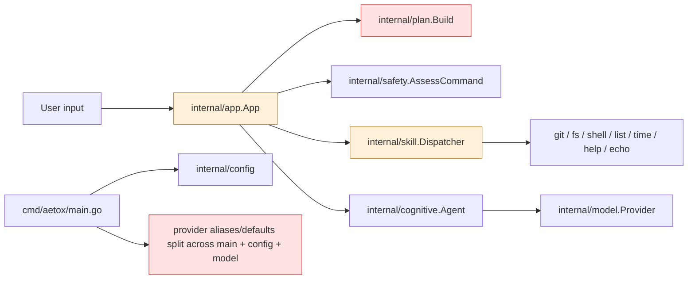
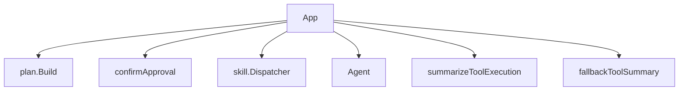
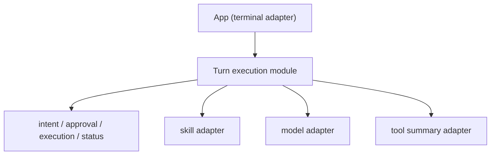
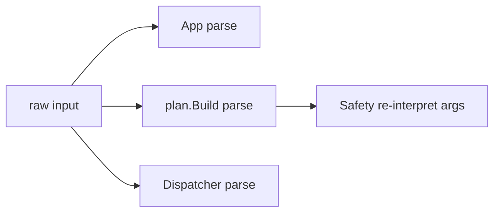
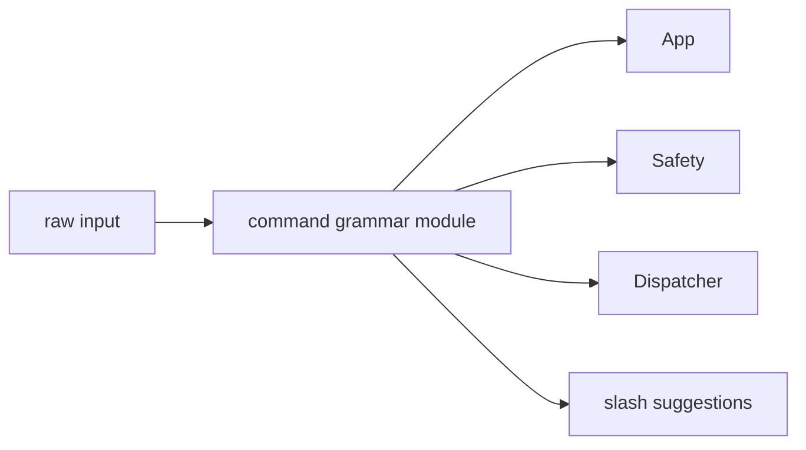
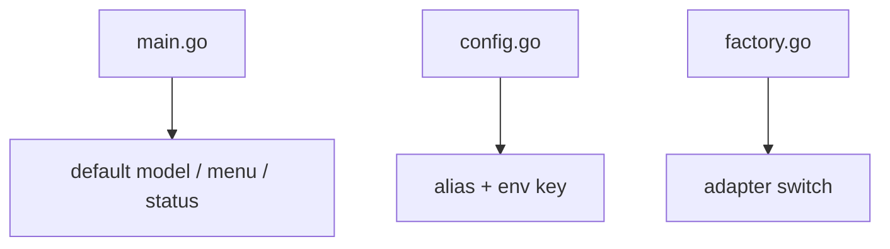
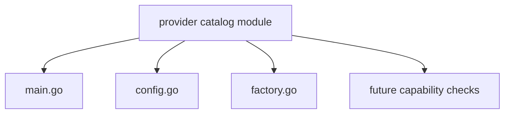
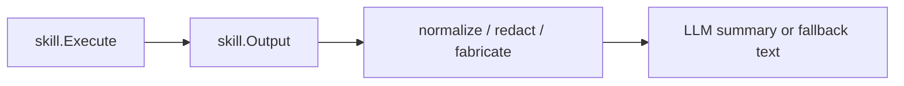
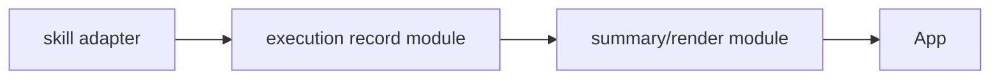

# Architecture Deepening Review: Aetox CLI

อัปเดตล่าสุด: 2026-06-07  
โหมดการวิเคราะห์: Deepening opportunities from current code  
รูปแบบรายงาน: Markdown ตามคำขอ แทน HTML report ของสกิล

## Scope

เอกสารนี้มองหาโอกาสทำให้โค้ดมี **Depth** มากขึ้น โดยยึด current state จากโค้ดจริงก่อน แล้วค่อยเสนอว่าควรย้าย **Seam** ไปตรงไหนเพื่อเพิ่ม **Leverage** และ **Locality** ให้การแก้ไข, การทดสอบ, และการนำทางโค้ดง่ายขึ้น

สิ่งที่พบก่อนเริ่ม:

- ไม่พบ `CONTEXT.md` ในรีโปนี้
- จึงใช้คำศัพท์โดเมนจาก `README.md`, `docs/adr/0001-native-tool-calling-foundation.md`, และชื่อ package ที่มีจริงในโค้ด

## Evidence

หลักฐานหลักที่ใช้:

- `cmd/aetox/main.go`
- `internal/app/app.go`
- `internal/app/interactive_input.go`
- `internal/cognitive/agent.go`
- `internal/command/intent.go`
- `internal/config/config.go`
- `internal/memory/context.go`
- `internal/model/bootstrap.go`
- `internal/model/factory.go`
- `internal/model/openai_compatible.go`
- `internal/model/openrouter.go`
- `internal/model/ollama.go`
- `internal/plan/plan.go`
- `internal/safety/safety.go`
- `internal/skill/skill.go`
- `internal/skill/dispatcher.go`
- `internal/skill/defaults.go`
- `internal/skill/fs.go`
- `internal/skill/git.go`
- `internal/skill/shell.go`
- `docs/response-contract-and-approvals.md`
- `docs/adr/0001-native-tool-calling-foundation.md`

สถานะการยืนยัน:

- `go test ./...` ผ่าน
- แต่ test surface ยังบางใน `internal/app`, `internal/cognitive`, `internal/skill`, `internal/safety`, `internal/memory`

## Current Friction Map

สรุปแรงเสียดทาน:

1. `internal/app.App` ถือทั้ง terminal UX และนโยบายการรันหนึ่ง turn
2. การ parse command กระจายอยู่หลาย **Module**
3. ความรู้เรื่อง provider กระจายอยู่หลายที่และไม่มี **Seam** กลาง
4. **Interface** ระหว่าง skill กับ app ยังรั่ว ทำให้ app ต้องรู้รายละเอียด execution มากเกินไป

## Candidate 1: ย้าย turn execution ออกจาก `internal/app`

**Files**

- `internal/app/app.go`
- `internal/plan/plan.go`
- `internal/safety/safety.go`
- `internal/skill/dispatcher.go`
- `internal/cognitive/agent.go`

**Problem**

`internal/app.App` มี **Interface** เล็กกับ caller (`RunInteractive`, `RunOnce`) แต่ **Seam** ปัจจุบันบังคับให้ terminal UX, approval flow, skill routing, tool summarization, fallback policy, และ cancellation handling อยู่ใน **Implementation** เดียวกันเกือบทั้งหมด

ผลคือการตาม flow ของข้อความเดียวต้องกระโดดระหว่าง:

- `RunInteractive`
- `runCommandWithStream`
- `confirmApproval`
- `summarizeToolExecution`
- `fallbackToolSummary`
- `dispatchBySkill`

นี่ไม่ใช่ปัญหาว่า `App` เล็กเกินไป แต่เป็นปัญหาว่า **Seam** ระหว่าง "render terminal" กับ "ตัดสินใจและรันหนึ่ง turn" ยังไม่อยู่ตรงที่ควรอยู่

**Deletion test**

ถ้าลบ logic ใน `runCommandWithStream` ความซับซ้อนจะไม่หายไป แต่จะกระจายกลับไปที่ `RunInteractive`, `RunOnce`, และ future tests ทันที แปลว่ามี module ที่ควรมีอยู่จริง แต่ตอนนี้ยังฝังใน `App`

**Solution**

สร้าง **Module** กลางสำหรับ turn execution แล้วให้ `App` เป็นแค่ terminal adapter ที่:

- รับ input
- render spinner / output / approval prompt
- ส่งงานรันหนึ่ง turn ให้ module กลาง

ส่วน module กลางควรถือ behavior เหล่านี้ไว้ที่เดียว:

- classify input
- ตัดสินใจว่าจะไป skill หรือ model
- เรียก approval เมื่อจำเป็น
- รัน skill หรือ conversation path
- normalize execution result
- ตัดสินสถานะ `done | error | blocked`

**Benefits**

- เพิ่ม **Locality**: แก้ policy ของหนึ่ง turn ที่เดียว แทนการไล่แก้พร้อมกับ terminal rendering
- เพิ่ม **Leverage**: tests สามารถยิงใส่ turn module โดยไม่ต้องใช้ raw terminal
- ลด coupling ระหว่าง terminal UX กับ execution policy
- ทำให้ `internal/cognitive.Agent` กลับไปถือเฉพาะ model interaction ตาม `docs/architecture-aetox.md`

**Before**

**After**

**Recommendation strength**

`Strong`

## Candidate 2: รวม command grammar ให้เป็น **Module** เดียว

**Files**

- `internal/command/intent.go`
- `internal/plan/plan.go`
- `internal/app/app.go`
- `internal/app/interactive_input.go`
- `internal/skill/dispatcher.go`
- `internal/safety/safety.go`

**Problem**

การ parse command และ meta command ตอนนี้กระจายอยู่หลายที่:

- `App` strip `/` และเช็ก slash behavior เอง
- `plan.Build` classify ว่าเป็น conversation หรือ skill
- `skill.Dispatcher.Execute` parse raw input ซ้ำอีกครั้ง
- `safety.AssessCommand` ตีความ command/args ซ้ำ
- slash suggestions ใช้ `commandSet` อีกเส้นหนึ่ง

`internal/plan.Build` จึงเป็น **Module** ที่ค่อนข้าง **shallow**: caller ยังต้องรู้อีกหลายกฎอยู่ดี ทั้งเรื่อง slash, meta command, args, และเงื่อนไขการส่งต่อ

**Deletion test**

ถ้าลบ `plan.Build` complexity เกือบทั้งหมดไม่ได้หายไป เพราะกฎเดียวกันยังอยู่ใน `App`, `Dispatcher`, และ `Safety` อยู่แล้ว แปลว่า **Interface** ปัจจุบันยังไม่ซ่อนความซับซ้อนพอ

**Solution**

ให้มี command grammar **Module** เดียวที่แปลง raw line เป็น structured intent ที่สมบูรณ์พอสำหรับ caller ทั้งหมด เช่น:

- conversation
- meta command
- skill command
- slash command
- parsed args
- canonical command name

แล้ว reuse object เดียวกันต่อไปยัง approval, dispatcher, และ UX suggestions แทนการ parse ใหม่

**Benefits**

- เพิ่ม **Locality**: เพิ่ม command ใหม่หรือเปลี่ยน grammar แก้ที่เดียว
- เพิ่ม **Leverage**: `App`, `Safety`, `Dispatcher` ใช้ผล parse เดียวกัน
- ลด bug แบบ behavior ไม่ตรงกันระหว่าง `/help`, `help`, meta command, และ safety path
- เป็นฐานที่ดีกว่าสำหรับ ADR 0001 ถ้าต้องเพิ่ม model-selected tool path ในภายหลัง

**Before**

**After**

**Recommendation strength**

`Strong`

## Candidate 3: รวม provider catalog ให้เป็น **Seam** กลาง

**Files**

- `cmd/aetox/main.go`
- `internal/config/config.go`
- `internal/model/factory.go`
- `internal/model/bootstrap.go`
- `internal/model/openai_compatible.go`
- `internal/model/openrouter.go`
- `internal/model/ollama.go`

**Problem**

ความรู้เรื่อง provider ตอนนี้กระจายอยู่หลายที่:

- alias normalization อยู่ใน `internal/config`
- env key resolution อยู่ใน `internal/config`
- default model อยู่ใน `cmd/aetox/main.go`
- model choices และ menu labels อยู่ใน `cmd/aetox/main.go`
- provider adapter selection อยู่ใน `internal/model/factory.go`
- status text อยู่ใน `cmd/aetox/main.go`

การเพิ่ม provider ใหม่จึงต้องแตะหลาย **Module** พร้อมกัน และ caller ต้องรู้รายละเอียด provider มากเกินกว่าที่ควรจะอยู่ใน **Interface**

ยิ่งไปกว่านั้น ADR 0001 ระบุชัดว่าระบบกำลังมุ่งไปทาง native tool calling ซึ่งจะเพิ่มความรู้เชิง capability ของ provider เข้าไปอีก ถ้าไม่มี **Seam** กลาง ตอนเพิ่ม capability flags จะยิ่งกระจาย

**Deletion test**

ลบ helper ใด helper หนึ่ง เช่น `defaultModelForProvider` หรือ `NormalizeModelProvider` แล้วความซับซ้อนไม่ได้หาย แต่กลับไปโผล่ใน main หรือ factory ทันที

**Solution**

สร้าง provider catalog **Module** เดียวที่ถือข้อมูลต่อ provider ไว้ครบ:

- aliases
- default model
- base URL default
- ต้องใช้ API key หรือไม่
- menu label / prompt label
- capability flags
- adapter constructor ที่ผูกกับ `internal/model`

`main` ควรถาม catalog, `config` ควรถาม catalog, `model` ก็ควรถาม catalog เดียวกัน

**Benefits**

- เพิ่ม **Locality**: เพิ่มหรือเลิก provider แก้ที่เดียว
- เพิ่ม **Leverage**: bootstrap, menu, defaults, และ status ใช้ knowledge base เดียวกัน
- ลดโอกาส drift ระหว่าง CLI menu, config normalization, และ runtime adapter
- เตรียมฐานให้ ADR 0001 เพิ่ม capability เช่น tool-calling support ได้แบบไม่กระจาย logic

**Before**

**After**

**Recommendation strength**

`Strong`

## Candidate 4: ทำให้ **Interface** ระหว่าง skill กับ app ลึกขึ้น

**Files**

- `internal/skill/skill.go`
- `internal/skill/dispatcher.go`
- `internal/skill/fs.go`
- `internal/skill/git.go`
- `internal/skill/shell.go`
- `internal/app/app.go`

**Problem**

ตอนนี้ `skill.Output` แบกทั้ง:

- raw execution facts
- text สำหรับผู้ใช้
- stderr
- success flag
- truncation
- duration
- command text

จากนั้น `App` ยังต้อง:

- mutate output ผ่าน `normalizeToolResult`
- redact ผ่าน `sanitizeAndTrimOutput`
- สร้าง blocked/canceled result เองผ่าน `newToolResultForApp`
- แปลงเป็น status ภายนอกอีกชั้น

แปลว่า **Seam** ระหว่าง skill กับ app ยังรั่ว: caller ต้องรู้ว่า field ไหน authoritative, ต้อง redact ตอนไหน, และ blocked result ควรประกอบยังไง

**Deletion test**

ถ้าลบ helpers ใน `App` complexity จะไม่หาย แต่จะกระจายไปยังทุกที่ที่ต้อง render tool result แทน นี่คือสัญญาณว่าควรมี **Module** ที่ลึกกว่านี้คั่นอยู่

**Solution**

แยกเป็นสองส่วนชัดเจน:

1. execution record **Module** ที่ถือ fact ของการรันแบบ canonical  
2. summary/render **Module** ที่แปลง fact เป็นข้อความผู้ใช้

skill ควรคืน fact ของ execution เป็นหลัก ส่วน policy เรื่อง:

- redaction
- status mapping
- blocked / canceled representation
- summary prompt

ควรรวมอยู่ที่ module เดียว ไม่กระจายระหว่าง `App` กับแต่ละ skill

**Benefits**

- เพิ่ม **Locality**: เปลี่ยน response contract ของ tool path ที่เดียว
- เพิ่ม **Leverage**: tests ยิงใส่ execution record และ summary path ได้ตรงกว่าเดิม
- ลดการ fabricate result ad hoc ใน `App`
- สอดคล้องกับ ADR 0001 ที่จะต้องมี structured tool results จริงในอนาคต

**Before**

**After**

**Recommendation strength**

`Worth exploring`

## What I Would Tackle First

เริ่มที่ **Candidate 2** ก่อน แล้วตามด้วย **Candidate 1**

เหตุผล:

- Candidate 2 เป็นการย้าย **Seam** ที่เล็กพอจะทำได้เร็ว แต่ให้ **Leverage** สูงทันที
- ถ้า command grammar ยังแตกหลายที่ การย้าย turn execution ออกจาก `App` ใน Candidate 1 จะยังแบกกฎ parse ซ้ำอยู่ดี
- พอ command grammar ลึกขึ้นแล้ว Candidate 1 จะทำต่อได้สะอาดกว่า และ tests จะเขียนตรง **Interface** ใหม่ได้ง่าย

ลำดับที่แนะนำ:

1. รวม command grammar
2. ย้าย turn execution ออกจาก `App`
3. รวม provider catalog
4. ค่อยทำ execution record / summary contract

## Notes

- ยังไม่พบ ADR ที่ขัดกับข้อเสนอข้างต้น
- Candidate ทั้งหมดนี้หลีกเลี่ยงการเสนอ "แยกไฟล์เพราะไฟล์ยาว" เฉยๆ
- จุดที่เสนอทั้งหมดผ่าน **deletion test** ในระดับที่พอเชื่อได้จาก current state

