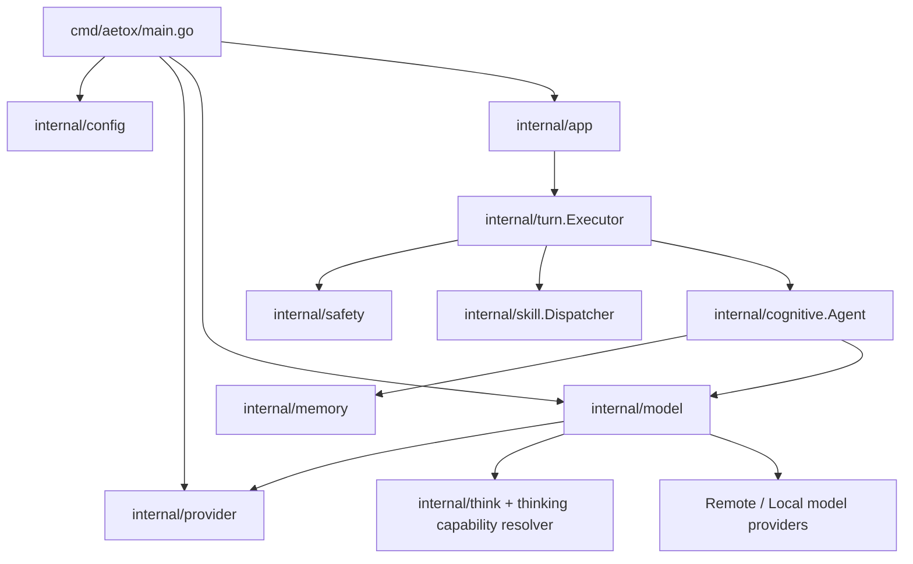
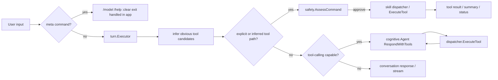

# Architecture Review: Aetox CLI (Current State)

อัปเดตล่าสุด: 2026-06-09  
โหมดการวิเคราะห์: Existing System Mapping  
Pass level: Full Mode  
วัตถุประสงค์: อัปเดตภาพ current-state architecture ของ Aetox CLI หลังการยกสถาปัตยกรรมฝั่ง provider/model/thinking/runtime execution ให้รองรับการขยายได้ดีขึ้น โดยยังยึดพฤติกรรม CLI ที่ใช้งานอยู่จริง

## 1. ขอบเขตและหลักฐานที่ตรวจ

เอกสารนี้อ้างอิงจากโค้ดและเอกสารที่ตรวจจริงใน repository:

- `cmd/aetox/main.go`
- `internal/app/app.go`
- `internal/cognitive/agent.go`
- `internal/config/config.go`
- `internal/memory/context.go`
- `internal/model/openai_compatible.go`
- `internal/model/provider_catalog.go`
- `internal/model/thinking_capabilities.go`
- `internal/model/types.go`
- `internal/provider/catalog.go`
- `internal/safety/safety.go`
- `internal/skill/defaults.go`
- `internal/skill/dispatcher.go`
- `internal/skill/skill.go`
- `internal/think/think.go`
- `internal/turn/executor.go`
- `docs/architecture-aetox.md`
- `docs/adr/0001-native-tool-calling-foundation.md`

Inspection limitations:

- เอกสารนี้เน้น current state ของ execution path, provider/model integration, thinking architecture, และ terminal UX state
- เอกสาร target architecture ใน [architecture-aetox.md](E:\Aetox\Aetox-cli\docs\architecture-aetox.md) ถูกใช้เป็นบริบทเปรียบเทียบ ไม่ใช่ source of truth หลัก
- ข้อความที่เป็นข้อเสนออนาคตถูกแยกไว้ในส่วน open questions และ risks เท่านั้น

## 2. Executive Summary

ข้อเท็จจริงที่ยืนยันได้:

- Aetox CLI ยังเป็น Go application แบบ single local process ไม่มี backend service แยก
- runtime path ปัจจุบันไม่ได้เป็นแค่ `app -> skill/agent` แบบเดิมอีกแล้ว แต่มี `internal/turn.Executor` เป็น orchestration layer กลางของหนึ่ง turn
- model layer ถูกแยกเป็น 2 ชั้นชัดขึ้น:
  - `internal/provider` ถือ static provider catalog
  - `internal/model` ถือ runtime bootstrap, live model discovery, request shaping, และ per-model thinking capability resolution
- ระบบรองรับ model-native thinking levels แบบ provider/model aware แล้ว และ normalize ระดับที่ผู้ใช้เลือกก่อนใช้งานจริง
- `ModelPreference` ตอนนี้เก็บมากกว่า provider/model/base URL โดยเก็บ `think_level` และ API key map แยกตาม provider ด้วย
- terminal UI แสดง model status พร้อมระดับคิดที่ใช้อยู่จริงใน header ตลอด และแยก context line ออกจาก model line
- native tool-calling path มีอยู่จริงแล้วใน current state:
  - model contract รองรับ `tools`, `tool_calls`, `tool` messages และ `reasoning_content`
  - `skill.Dispatcher` เผย `ToolDefinitions()` และ `ExecuteTool(...)`
  - `cognitive.Agent` มี bounded tool loop
  - `turn.Executor` ยังบังคับ safety check ก่อน execute tool
- Gemini ถูกเพิ่มเป็น first-class provider ในโครงเดียวกับค่ายหลักอื่น โดยใช้ OpenAI-compatible runtime แต่มี live model discovery path ของตัวเอง

Reasonable inferences:

- seam ระหว่าง "provider metadata" กับ "provider runtime behavior" ดีขึ้นอย่างมีนัยสำคัญ ทำให้เพิ่ม provider ใหม่โดยแตะจุดที่ชัดขึ้น
- thinking architecture ตอนนี้ถูกย้ายออกจาก UI-specific logic ไปอยู่ใน model capability layer มากขึ้น จึงลดความเสี่ยงของ label/behavior drift
- `internal/turn` กำลังกลายเป็น execution boundary หลักของระบบ และมีแนวโน้มเป็นฐานสำหรับงาน agentic/tool-driven ต่อจาก ADR 0001

## 3. System Boundary

| Area | Current state |
| --- | --- |
| Frontend | Terminal UI ใน `internal/app`, มี header status + prompt status แยกบรรทัด |
| Backend service | ไม่พบ service แยก; logic ทั้งหมดรันใน process เดียว |
| Database | ไม่พบ database |
| Local persistence | `model-preference.json` ผ่าน `internal/config`, เก็บ provider/model/base URL/think level/provider API keys |
| AI runtime | `internal/cognitive` + `internal/model` + `internal/provider` + `internal/think` + `internal/turn` |
| External model services | OpenRouter, OpenAI-compatible providers (เช่น OpenAI, DeepSeek, Gemini, Groq, Mistral, Together, Perplexity, Cohere, LM Studio/LocalAI), Ollama |
| Background jobs/workers | ไม่พบ |
| Safety layer | `internal/safety` ถูกใช้ทั้ง explicit skill path, inferred tool path, และ model-selected tool path |
| Tests/quality gates | คุณภาพฝั่ง model/provider/think ดีกว่าก่อน แต่ UX/app/turn path ยังเป็น seam ที่มีความเสี่ยงกว่า |

สิ่งที่ไม่พบจากโค้ดปัจจุบัน:

- Web server
- Authentication/authorization
- Queue/worker
- Database migrations
- Deployment manifests

## 4. Architecture Overview

สถาปัตยกรรมที่เปลี่ยนชัดจากเอกสารรุ่นก่อน:

- `internal/provider` ถูกแยกออกมาเป็นบ้านของ provider metadata อย่างชัดเจน
- `internal/turn.Executor` กลายเป็น execution orchestration layer แทนการแบก flow ไว้ใน `internal/app` เป็นหลัก
- `internal/model` ไม่ได้เป็นแค่ adapter HTTP อีกต่อไป แต่เป็นชั้น runtime intelligence สำหรับ live model discovery และ thinking normalization

## 5. Module Map

| Module | Responsibility | Evidence strength |
| --- | --- | --- |
| `cmd/aetox` | parse flags, load config/preference, prompt model selection, normalize think level, bootstrap provider, persist preference, compose app runtime | Direct |
| `internal/config` | load runtime config defaults, save/load `ModelPreference`, canonicalize per-provider API key storage | Direct |
| `internal/provider` | static provider catalog: aliases, env keys, runtime class, fallback model, provider-level capabilities | Direct |
| `internal/model` | provider abstraction, bootstrap, request/response contract, live model discovery, provider-specific reasoning payload shaping, per-model thinking capability resolution | Direct |
| `internal/think` | generic think-level parsing/normalization contract used by CLI/runtime | Direct |
| `internal/app` | terminal UX, header/prompt rendering, interactive loop, model switching entrypoint, thinking spinner/status | Direct |
| `internal/turn` | one-turn orchestration: intent normalization, inferred tool path, explicit skill path, agent tool loop, approval handoff, result shaping | Direct |
| `internal/cognitive` | conversation agent, streaming fallback, bounded model tool loop, context updates, request assembly | Direct |
| `internal/skill` | skill registry/dispatcher plus opt-in tool surface via `ToolDefinition()` and `ExecuteTool(...)` | Direct |
| `internal/safety` | risk assessment before executing commands/tools | Direct |
| `internal/memory` | bounded in-memory conversation context | Direct |

Observed default registered skills:

- `help`
- `echo`
- `time`
- `list`
- `read`
- `github_repo_summary`
- `git`
- `fs`
- `shell`
- `write`
- `delete`
- `plugin_install`

Observed tool-capable surface:

- `time`
- `list`
- `read`
- `write`
- `delete`
- `github_repo_summary`
- `plugin_install`

หมายเหตุ: เอกสารนี้ยืนยันเฉพาะ tool-capable skills ที่ตรวจพบ `ToolDefinition()` และ `ExecuteTool(...)` จากโค้ดที่อ่านจริง

## 6. Runtime Flow

### 6.1 Startup Flow

1. `cmd/aetox/main.go` parse global flags รวม `--model-provider`, `--model-name`, `--model-base-url`, `--model-api-key`, `--model-context-tokens`, และ `--think`
2. `model-name` สามารถเขียนรูป `model(think-level)` ได้ และถูก parse แยกจาก `--think`
3. `internal/config.Load` สร้าง runtime config โดยมี default `ThinkLevel = low` เมื่อยังไม่ระบุ
4. ระบบโหลด `ModelPreference` จาก user config directory ถ้ามี
5. ถ้าไม่มี explicit model config และมี stored preference ระบบจะ reuse provider/model/base URL/API key/think level ตามที่เก็บไว้
6. ถ้าเป็น interactive และยังไม่มี stored preference ระบบจะเข้า flow เลือก:
   - provider
   - model
   - thinking level
7. ก่อน bootstrap จริง ระบบ normalize thinking level ผ่าน `model.NormalizeThinkingLevel(provider, model, requestedLevel)`
8. `bootstrapModelWithStatus(...)` สร้าง provider runtime และ compose model status ในรูป `provider/model(level)`
9. ระบบ persist preference กลับลงไฟล์
10. สร้าง `cognitive.Agent`, `skill.Registry`, `skill.Dispatcher`, `turn.Executor`, และ `app.App`

### 6.2 Interactive Turn Flow

พฤติกรรมสำคัญที่พบจริง:

- `internal/app` ยัง intercept `/model`, `/help`, `:clear`, `exit` โดยตรง
- status line ถูกแยกเป็น 2 ชั้น:
  - header: title ซ้าย, model status ขวา
  - prompt line: `>` ซ้าย, context usage ขวา
- `turn.Executor.Execute(...)` ทำมากกว่าการ route ธรรมดา:
  - normalize intent
  - infer tool candidates จากข้อความธรรมชาติบางกรณี
  - เลือกว่าจะรัน inferred tool path ก่อน agent หรือไม่
  - ใช้ model tool loop ถ้า agent และ dispatcher รองรับ
- explicit skill path, inferred tool path, และ model-selected tool path ล้วนผ่าน safety gate

### 6.3 Agent Tool Loop

ข้อเท็จจริงที่ยืนยันได้:

- `cognitive.Agent.RespondWithTools(...)` ใช้ `model.ToolDefinition`, `model.ToolCall`, และ `model.RoleTool`
- agent จะ:
  1. ส่งข้อความพร้อม tool definitions
  2. ตรวจ `tool_calls` จาก model response
  3. execute tool locally
  4. append tool output กลับเป็น `tool` message
  5. loop ต่อจน model ส่ง final text หรือชน loop limit
- loop limit default คือ 4 รอบ
- ถ้าไม่มี tools หรือ provider ไม่รองรับ tool calling ระบบจะ fallback ไป `Respond(...)`

ข้อสังเกตเชิงสถาปัตยกรรม:

- ADR 0001 ไม่ได้เป็นแค่ target architecture แล้ว แต่บางส่วนลง current state จริงแล้ว
- tool loop อยู่ใน `internal/cognitive` ส่วน policy/safety/result shaping อยู่ใน `internal/turn` มากกว่าถูกผูกไว้กับ `app`

## 7. State and Persistence

### 7.1 Conversation State

ข้อเท็จจริงที่ยืนยันได้:

- `internal/memory.Context` เก็บข้อความใน RAM
- `cognitive.Agent` เติมทั้ง assistant text, `reasoning_content`, และ tool-call/tool-result messages ลง context
- การ `:clear` จะ reset context
- การ switch model สร้าง agent ใหม่ จึงมีผลเป็นการตัดบริบทเดิมของ session

ผลเชิงสถาปัตยกรรม:

- conversation state ยังเป็น ephemeral state
- ระบบมี session continuity เฉพาะใน process ปัจจุบัน ไม่ข้ามการรัน

### 7.2 Persisted State

ข้อเท็จจริงที่ยืนยันได้:

- `ModelPreference` เก็บ:
  - `provider`
  - `model`
  - `base_url`
  - `think_level`
  - `provider_api_keys`
- API keys ถูกเก็บแบบ map แยกตาม canonical provider key
- ตอน persist ระบบ normalize provider และ think level ก่อนเขียน

ผลเชิงสถาปัตยกรรม:

- persistence layer ยังเล็กและเฉพาะเรื่อง model/session preferences
- preference schema รองรับ multi-provider environment มากขึ้น โดยไม่ต้องมี database

## 8. Model Integration Architecture

### 8.1 Two-Layer Provider Architecture

สถาปัตยกรรมปัจจุบันแบ่งชัดเป็น 2 ชั้น:

1. `internal/provider`
   - ไม่มี HTTP
   - ถือ static metadata เท่านั้น
   - รับผิดชอบ alias normalization, env key list, runtime class, fallback model, provider-level capability flags

2. `internal/model`
   - มี HTTP/runtime behavior
   - รับผิดชอบ bootstrap provider, live model discovery, request shaping, response parsing, tool call handling, thinking normalization

ผลเชิงสถาปัตยกรรม:

- provider addition มี locality ดีขึ้น
- static fallback กับ live runtime knowledge ถูกแยกออกจากกันชัดขึ้น

### 8.2 Provider Families ที่พบจริง

- `noop`
- `openrouter`
- OpenAI-compatible family ผ่าน adapter เดียว:
  - `openai`
  - `deepseek`
  - `gemini`
  - `groq`
  - `mistral`
  - `together`
  - `perplexity`
  - `cohere`
  - `lmstudio`
  - `localai`
- `ollama`

### 8.3 Live Model Discovery

ข้อเท็จจริงที่ยืนยันได้:

- Ollama ใช้ `/api/tags`
- OpenAI-compatible family ใช้ `/models`
- Gemini มี path พิเศษ:
  - ใช้ OpenAI-compatible base URL สำหรับ runtime chat completions
  - แต่ derive native Google models endpoint สำหรับ discovery
  - filter เฉพาะ model ที่รองรับ `generateContent`

ผลเชิงสถาปัตยกรรม:

- Gemini ไม่ถูกยัดเข้า generic `/models` path แบบฝืนๆ
- discovery seam รองรับ provider-specific quirks ได้โดยไม่ทำให้ provider catalog ปนกับ HTTP logic

### 8.4 Thinking Capability Architecture

ข้อเท็จจริงที่ยืนยันได้:

- generic think levels ถูก parse ใน `internal/think`
- model/provider-specific support ถูก resolve ใน `internal/model/thinking_capabilities.go`
- current config default คือ `low`
- ก่อน runtime ใช้งานจริง ระดับที่ผู้ใช้เลือกจะถูก normalize ตาม provider/model family

Observed capability examples:

- DeepSeek:
  - native levels: `off-think`, `high`, `max`
  - default: `high`
- Gemini:
  - `gemini-2.5*`: `none`, `minimal`, `low`, `medium`, `high`
  - `gemini-2.5-pro`: `minimal`, `low`, `medium`, `high`
  - `gemini-3*`: `minimal`, `low`, `medium`, `high`
  - `gemini-2.0-flash-lite`: ไม่รองรับ thinking
- OpenAI/OpenRouter/Groq:
  - รองรับต่างกันตาม model family และถูก resolve ผ่าน capability resolver

ข้อสังเกตสำคัญ:

- UI และ config ใช้ generic think levels
- provider runtime รับค่า native ที่ถูก normalize แล้ว
- label ที่ผู้ใช้เห็นกับ behavior ที่ provider ได้รับเริ่มผูกกันดีขึ้นกว่าก่อน

### 8.5 Provider-Specific Reasoning Payload Shaping

ข้อเท็จจริงที่ยืนยันได้:

- DeepSeek ใช้ `thinking` และ `reasoning_effort`
- OpenAI ใช้ `reasoning_effort`
- Gemini ใช้ `reasoning_effort`
- Groq ใช้ `reasoning_effort` และปิด `include_reasoning`
- OpenRouter ใช้ `reasoning` object

ผลเชิงสถาปัตยกรรม:

- client layer รู้จัก transport shape ของแต่ละ provider
- แต่การตัดสินว่า level ไหนใช้ได้ ย้ายขึ้นไปอยู่ capability layer มากขึ้น

### 8.6 UI Status Contract

ข้อเท็จจริงที่ยืนยันได้:

- model status ถูก compose จาก `formatModelModeLabel(provider, model, thinkLevel)`
- header line แสดง `provider/model(level)` ด้านขวา
- prompt line แสดง `context used/limit tokens` แยกต่างหาก
- thinking indicator เปลี่ยนข้อความตามว่าเป็น conversation หรือ skill และตามว่าอยู่ใน `off-think` หรือไม่

ผลเชิงสถาปัตยกรรม:

- terminal UX เริ่มสะท้อน runtime state จริง มากกว่าจะเป็น label เชิงตกแต่ง
- model switching, persisted preference, และ header status ใช้ข้อมูล normalized ชุดเดียวกัน

## 9. Safety and Execution Boundaries

ข้อเท็จจริงที่ยืนยันได้:

- `internal/safety` ไม่ได้ใช้เฉพาะ explicit command path แล้ว
- `turn.Executor` เรียก `safety.AssessCommand(...)` ทั้งใน:
  - explicit skill execution
  - inferred tool execution
  - model-selected tool execution
- high-risk command/tool ต้องผ่าน approval prompt

ข้อสังเกตสำคัญ:

- safety boundary ถูกดันเข้าใกล้ execution seam มากขึ้น
- สถาปัตยกรรมปัจจุบันสอดคล้องกับ ADR 0001 มากกว่าเดิมตรงที่ tool calling ไม่ bypass safety

ยังเป็นความจริงอยู่:

- `shell` ยังเป็น boundary ที่เสี่ยงสูง
- local persistence ไม่ได้ทำ audit log หรือ rollback

## 10. Quality Gates

ข้อสังเกตจากโครงสร้างและการเปลี่ยนล่าสุด:

- regression protection ฝั่ง model/provider/thinking ดีขึ้น เพราะ logic ถูกแยก seam ชัดขึ้น
- `internal/model`, `internal/provider`, `internal/think`, และ `cmd/aetox` เป็นพื้นที่ที่มีสัญญาเชิงพฤติกรรมชัดกว่าก่อน
- app/turn/interactive UX path ยังเป็นพื้นที่ที่ควรมี test depth เพิ่มในอนาคต

Reasonable inference:

- การย้าย logic จาก ad hoc UI handling ไปสู่ `provider catalog`, `thinking capability resolver`, และ `turn.Executor` ทำให้ testability ดีขึ้น แม้ execution path หลักยังมีความซับซ้อนสูง

## 11. Risks and Open Questions

Risks:

1. provider catalog ยังมี static fallback models/capabilities อยู่บางส่วน จึงยังมีโอกาส drift จาก provider reality เมื่อ upstream เปลี่ยน
2. per-model thinking support ของหลายค่ายยังใช้ family heuristics มากกว่าการ discover จาก live metadata ทุกกรณี
3. `internal/turn.Executor` กลายเป็น seam สำคัญมาก หากปล่อยให้โตโดยไม่แตก contract เพิ่ม อาจกลายเป็น complexity hotspot
4. tool surface มีทิศทางขยายเร็วขึ้น จึงต้องคุม allowlist และ safety policy ให้ชัดกว่าฝั่ง command-only เดิม
5. UI status ตอนนี้ผูกกับ normalized think label แล้ว แต่ถ้า provider เปลี่ยน native semantics โดยไม่อัปเดต resolver จะทำให้ label ถูกแต่ behavior ผิดได้

Open questions:

1. จะย้ายจาก family-based thinking heuristics ไปสู่ live capability discovery สำหรับค่ายหลักอื่นนอกจาก Gemini เมื่อไร
2. provider catalog ควรถือ model-family metadata เพิ่มอีกหรือควรคงให้ `internal/model` เป็น runtime intelligence layer ต่อไป
3. tool allowlist สำหรับ model-selected execution ควรผูกกับ provider/model capability matrix ระดับไหน
4. จะ persist conversation/session state ข้ามการรันหรือคง intentionally ephemeral ต่อไป
5. `internal/turn` ควรถูกแยกเป็น submodules เพิ่มหรือยัง หรือยังอยู่ในจุดที่ refactor เฉพาะ contract ก็พอ

## 12. Validation Gate

1. Claim traceability: ผ่าน  
   ทุก claim สำคัญอ้างอิงจากไฟล์ที่ตรวจจริง หรือถูกระบุเป็น reasonable inference/open question

2. Scope alignment: ผ่าน  
   เอกสารยังเป็น current-state review ของทั้งระบบ แต่เพิ่มน้ำหนักในส่วน architecture ที่เปลี่ยนจริงล่าสุด: provider catalog, thinking capability, tool loop, turn orchestration, และ UI model state

3. Handoff readiness: ผ่าน  
   เอกสารมี system boundary, module map, runtime flow, state/persistence, model integration shape, risks, และ open questions เพียงพอสำหรับงานต่อเนื่อง

## 13. Recommended Next Use

เอกสารนี้เหมาะสำหรับใช้:

- onboarding ผู้พัฒนาใหม่ให้เข้าใจว่า Aetox ตอนนี้ไม่ได้เป็นแค่ CLI chat + skill router แบบเดิมแล้ว
- ใช้คุย refactor รอบถัดไปของ `internal/turn`, `internal/model`, และ `internal/provider`
- ใช้เป็นฐานก่อนแตก ADR เพิ่มเรื่อง provider capability discovery หรือ thinking policy
- ใช้แยก current state ออกจาก target architecture ใน [architecture-aetox.md](E:\Aetox\Aetox-cli\docs\architecture-aetox.md)
