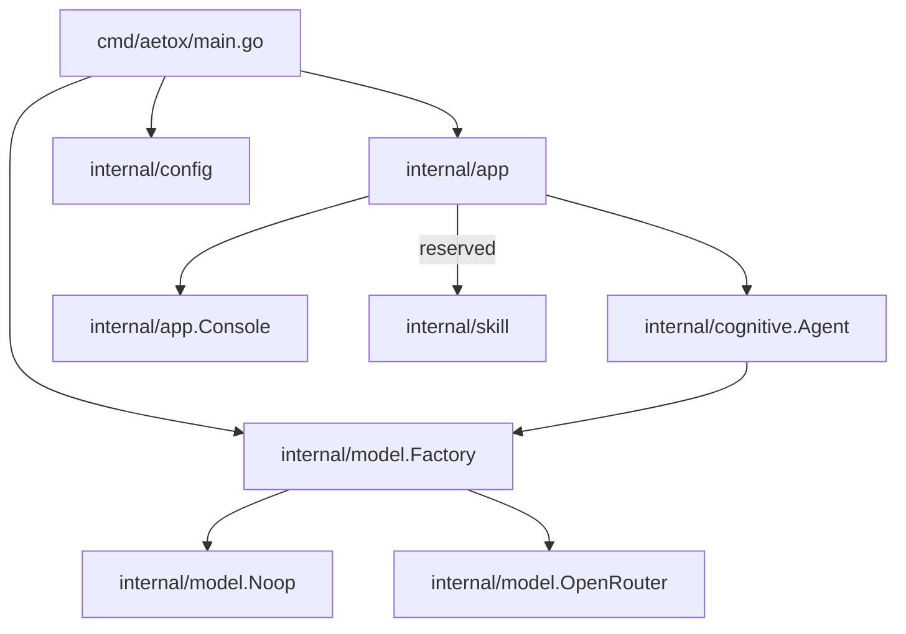

# Architecture Review (Scan Mode)

**วันที่:** 2026-06-07  
**โหมด:** Existing System Mapping (Scan Mode)  
**สถานะ:** ตรวจโครงสร้าง CLI core, app shell, model layer, config, skill skeleton

## สรุปการตรวจ
- โปรเจกต์อยู่ในจุดที่เหมาะสมสำหรับสเกลต่อยอดเป็น chatbot CLI
- แยกหน้าที่หลักได้ชัดขึ้นจาก `main` -> `app` -> `cognitive` -> `model`
- ยังเป็นสเกลแบบ **single-process / in-memory context** สำหรับ session

## ขอบเขตที่ตรวจ
- `README.md`
- `cmd/aetox/main.go`
- `internal/app/{app.go, console.go}`
- `internal/cognitive/agent.go`
- `internal/model/{factory.go,types.go,noop.go,openrouter.go}`
- `internal/config/config.go`
- `internal/skill/skill.go`

## ข้อเท็จจริงที่ยืนยันได้ (Confirmed)
- `cmd/aetox/main.go` ทำหน้าที่ parse flag/dispatch โหมด (`help`, `version`, `interactive`, `once`)
- `internal/app` เป็นชั้นที่แยก interactive loop, help, banner และ I/O ไว้จาก `main`
- `internal/cognitive.Agent` เป็นตัว orchestrator ที่เก็บ conversation context และเรียก provider
- `internal/model` มี abstraction `Provider` พร้อม `NewProvider` เป็น factory
- `noop` provider ใช้เป็น fallback เมื่อ model provider ชนิดอื่น setup ไม่ได้
- `config.Load` มี fallback ค่าเริ่มต้นครบ: root จาก cwd, retries, timeout, provider เป็น `noop`, และอ่าน `OPENROUTER_API_KEY` เมื่อไม่ได้ส่ง key
- `internal/skill` มี `Registry` แล้ว แต่ยังไม่ถูกเรียกใช้จริงใน flow ของระบบ

## ข้อสังเกตจากการตีความเชิงสถาปัตยกรรม (Inferred)
- โครงนี้เหมาะสำหรับขยายรูปแบบ modular chat มากกว่าการรันคำสั่งระบบเดิม
- ระบบยังทำงานแบบข้อความไม่คงตัว (context ชั่วคราวใน memory) ต่อหนึ่ง process เท่านั้น
- การมี `legacyYes` และบาง flag ที่ยังไม่ใช้งานจริงเป็นสัญญาณว่า API/CLI ยังอยู่ช่วง “compatibility transition”
- ไม่มีแผนผังหรือ ADR ระบุ decision boundary ที่คงเสถียรระยะยาว

## แผนผังโมดูล

## Workflow หนึ่งรอบ
1. อ่าน CLI args ใน `main`
2. โหลด config (`Load`) สำหรับค่าเริ่มต้นและ secret
3. init provider ผ่าน `model.NewProvider`  
   - ได้ provider แล้วทำงานปกติ
   - ล้มเหลว -> fallback ไป `noop`
4. สร้าง `cognitive.Agent`
5. รันตามโหมด:
   - interactive: `app.RunInteractive`
   - once: `app.RunOnce`

## ความเสี่ยงสำคัญ (Risk Register)
- ขาดขอบเขต session/persistence ของ context (อาจเจอหน่วยความจำเพิ่มขึ้นเมื่อต่อเนื่องนาน)
- UI และ command semantics ยังค่อนข้างผูกกันใน `app` loop (ยืดเพิ่มใหม่อาจทับกัน)
- คงเหลือ flag ที่มีเป้าหมายสำหรับฟีเจอร์เดิม (`--yes`, `approval` ต่าง ๆ) โดยใช้งานไม่ครบ
- `skill` framework ยังไม่ถูกผนวกเข้ากับ pipeline จริง
- ไม่มีเอกสาร architecture แบบ versioned (ADR/decision record)

## คำถามที่ควรตัดสินใจก่อนขยายเชิงลึก
1. ต้องการคืนแนวคิด command mode (`list/read/write/...`) เข้ามาในโปรโตคอลใหม่หรือไม่?
2. ต้องการให้ `agent` มี session persist (ไฟล์/DB) หรือคงเป็นชั่วคราวในหน่วยความจำ?
3. จะแยก CLI framework (เช่น `cobra`) เพื่อรองรับ subcommand อย่างเป็นทางการหรือยังคงแบบ lightweight parser?
4. fallback `noop` ควรแจ้งเป็น error hard-fail หรือ warning + continue ใน production
5. จะผนวก `skill` ทันทีเป็น first-class route หรือค่อยต่อเมื่อมี schema ของ skill/action ครบ

## คำแนะนำ phase ถัดไป (Recommended)
### Phase 1 (เร็วและปลอดภัย)
1. แยก parsing/dispatch เป็น package `internal/command` เพื่อให้ `main` เหลือ orchestration ล้วน
2. กำหนด policy สำหรับ context limit ใน `Agent` (max messages / max chars)
3. ผูก `skill registry` เข้ากับ app layer แบบเวอร์ชันที่กลับไม่ได้ (non-breaking) เช่น `Agent` ใช้ `SkillDispatcher` stub ก่อน
4. เก็บไฟล์เอกสารสถาปัตยกรรมนี้ใน `docs/` และอัปเดต `README` ให้ลิงก์ชี้อ่าน

## สถานะ
- ความครบถ้วนตามขอบเขต scan: **ครบ**
- ระดับความเสี่ยง: **low-to-medium** สำหรับโหมด chat เดี่ยว
- ข้อเสนอขยายต่อ: ทำได้ในรอบ next โดยไม่รบกวนความเสถียรของ runtime ปัจจุบัน
