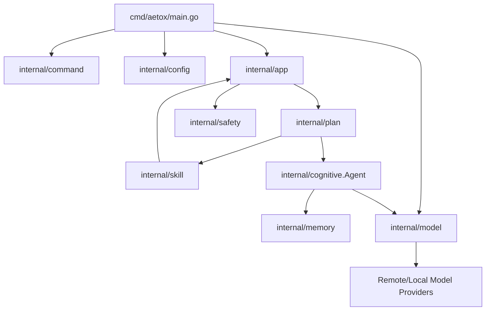
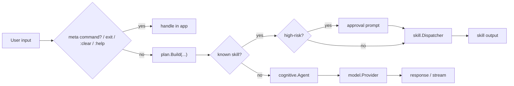

# Architecture Review: Aetox CLI (Current State)

อัปเดตล่าสุด: 2026-06-07  
โหมดการวิเคราะห์: Existing System Mapping  
Pass level: Full Mode  
วัตถุประสงค์: สรุปสถาปัตยกรรมของระบบจากโค้ดปัจจุบัน เพื่อใช้สื่อสารกับทีม/ผู้ร่วมพัฒนา

## 1. ขอบเขตและหลักฐานที่ตรวจ

เอกสารนี้อ้างอิงจากโค้ดและเอกสารที่มีอยู่จริงใน repository เป็นหลัก:

- `README.md`
- `cmd/aetox/main.go`
- `internal/app/*`
- `internal/cognitive/agent.go`
- `internal/command/intent.go`
- `internal/config/config.go`
- `internal/memory/context.go`
- `internal/model/*`
- `internal/plan/plan.go`
- `internal/safety/safety.go`
- `internal/skill/*`
- test files ใต้ `internal/config`, `internal/model`, `internal/plan`

หมายเหตุ:

- `docs/architecture-aetox.md` มีเนื้อหาเชิง target architecture และแผนในอนาคตปนอยู่
- `docs/architecture-review-v2.md` มีเนื้อหา current state บางส่วน แต่ไม่ใช่ source of truth หลัก
- เอกสารฉบับนี้ยึด current state จากโค้ดปัจจุบันเป็นหลัก

## 2. Executive Summary

ข้อเท็จจริงที่ยืนยันได้:

- Aetox CLI เป็นแอป Go แบบ local process เดียว ไม่มี backend service แยก
- ระบบรองรับ 2 โหมดหลัก: interactive terminal chat และ one-shot command/message
- request จะถูกจัดเส้นทางไปยัง local skill ก่อน ถ้าไม่ตรง skill จึงส่งต่อไปยัง LLM provider
- state สนทนาเก็บในหน่วยความจำผ่าน `internal/memory`
- persistence ที่พบจริงมีเฉพาะไฟล์ model preference ใน user config directory
- model provider ถูกห่อด้วย abstraction กลางใน `internal/model` และ fallback ไป `noop` ได้ถ้า bootstrap provider หลักล้มเหลว

Reasonable inferences:

- โค้ดถูกจัดแพ็กเกจให้รองรับการขยาย provider และ skill ได้โดยไม่ต้องเปลี่ยน flow หลักมาก
- `internal/app`, `internal/skill`, `internal/model` เป็น seam หลักของระบบสำหรับการเปลี่ยน behavior ในอนาคต

## 3. System Boundary

| Area | Current state |
| --- | --- |
| Frontend | Terminal UI ใน `internal/app` |
| Backend service | ไม่พบ service แยก; logic รันใน process เดียว |
| Database | ไม่พบ database |
| Local persistence | พบเฉพาะ `model-preference.json` ผ่าน `internal/config` |
| AI layer | `internal/cognitive` + `internal/model` |
| External services | OpenRouter, OpenAI-compatible APIs, Ollama, LM Studio/LocalAI endpoints |
| Background jobs/workers | ไม่พบ |
| Safety layer | `internal/safety` ประเมินความเสี่ยงก่อนรันบาง skill |
| Tests/quality gates | มี unit tests บางส่วนใน `config`, `model`, `plan` |

สิ่งที่ไม่พบจากโค้ดปัจจุบัน:

- Web server
- Authentication/authorization
- Queue/worker
- Database migrations
- Deployment manifests

## 4. Architecture Overview

## 5. Module Map

| Module | Responsibility | Evidence strength |
| --- | --- | --- |
| `cmd/aetox` | bootstrap app, parse flags, load config, bootstrap provider, create app and run mode | Direct |
| `internal/command` | แปลง CLI args ไปเป็น `help`, `version`, `interactive`, `once` | Direct |
| `internal/config` | load runtime config, normalize provider, resolve env key, save/load model preference | Direct |
| `internal/app` | terminal UX, interactive loop, slash palette, meta commands, approval prompt, request routing | Direct |
| `internal/plan` | classify input ว่าเป็น skill command หรือ conversation | Direct |
| `internal/skill` | skill interface, registry, dispatcher, built-in skills | Direct |
| `internal/safety` | ประเมิน risk ของ command ก่อน execute โดยเฉพาะ `shell` | Direct |
| `internal/cognitive` | orchestration ระหว่าง input, memory, provider, streaming fallback | Direct |
| `internal/memory` | bounded conversation context ในหน่วยความจำ | Direct |
| `internal/model` | provider abstraction, provider factory, HTTP adapters, noop fallback | Direct |

Built-in skills ที่พบจริง:

- `help`
- `echo`
- `time`
- `list`
- `shell`

## 6. Runtime Flow

### 6.1 Startup Flow

1. `cmd/aetox/main.go` parse flags และ mode
2. `internal/config.Load` สร้าง runtime config
3. ระบบพยายามโหลด model preference เดิมจาก user config directory
4. ถ้าเป็น interactive และยังไม่มี preference อาจ prompt ให้เลือก provider/model
5. `internal/model.BootstrapProvider` สร้าง provider จาก config
6. ถ้า provider init ล้มเหลว จะ fallback ไป `noop`
7. สร้าง `cognitive.Agent`, `skill.Registry`, `skill.Dispatcher`, และ `app.App`
8. เข้า `RunInteractive` หรือ `RunOnce` ตาม intent

### 6.2 Message Handling Flow

พฤติกรรมสำคัญ:

- ใน interactive mode ถ้าผู้ใช้พิมพ์ `/...` ระบบจะ strip `/` ออกก่อนแล้วค่อย route
- `/model` และ `/help` ถูก intercept ใน `internal/app` โดยตรง
- `:clear`, `:help`, `exit` และคำสั่งใกล้เคียงเป็น meta command ของ app layer
- ถ้า input ไม่ตรง known skill ระบบจะถือเป็น conversation แล้วส่งเข้า agent

## 7. State and Persistence

### 7.1 Conversation State

ข้อเท็จจริงที่ยืนยันได้:

- `internal/memory.Context` เก็บข้อความใน RAM
- ค่า default คือ `maxTurns = 40` และ `maxChars = 12000`
- เมื่อเกิน limit ระบบจะ trim ประวัติเก่า โดยเก็บ system prompt ไว้
- การสลับ model และคำสั่ง `:clear` จะ reset context

ผลเชิงสถาปัตยกรรม:

- conversation state เป็น ephemeral state
- ปิดโปรแกรมแล้ว context หาย

### 7.2 Persisted State

ข้อเท็จจริงที่ยืนยันได้:

- มีการ save/load `ModelPreference` เป็น JSON
- path อยู่ใต้ user config directory ผ่าน `config.PreferencePath()`
- เก็บ `provider`, `model`, `base_url`

สิ่งที่ไม่พบ:

- ไม่มี persisted chat history
- ไม่มี project-level database
- ไม่มี cache layer แยก

## 8. Model Integration Architecture

provider families ที่พบจริง:

- `noop`
- `openrouter`
- OpenAI-compatible family ผ่าน adapter ตัวเดียว:
  - `openai`
  - `deepseek`
  - `groq`
  - `mistral`
  - `together`
  - `perplexity`
  - `cohere`
  - `lmstudio`
  - `localai`
- `ollama`

ลักษณะการออกแบบ:

- `internal/model.Provider` เป็น abstraction หลักสำหรับ non-streaming
- `internal/model.StreamingProvider` เป็น optional capability สำหรับ streaming
- `cognitive.Agent` จะลอง path แบบ streaming ก่อน และ fallback ไป non-streaming ถ้าจำเป็น
- bootstrap ล้มเหลวแล้ว app ยังรันได้ผ่าน `noop` ตราบใดที่ fallback สำเร็จ

## 9. Safety and Execution Boundaries

ข้อเท็จจริงที่ยืนยันได้:

- `internal/safety` ใช้กับ skill command path
- ปัจจุบัน rule ที่มีผลจริงเน้น `shell`
- `shell` ที่ถูกจัดว่า high-risk ต้องผ่าน confirmation เว้นแต่รันด้วย `--yes`
- `list` จำกัด path ให้อยู่ใต้ sandbox root

ข้อสังเกตสำคัญ:

- `shell` รันผ่าน `cmd /C` บน Windows หรือ `sh -c` บนระบบอื่น
- sandbox root ไม่ได้บังคับกับ `shell`
- `approval-timeout` มี flag และ config field แต่ยังไม่พบ enforcement เชิงเวลาใน runtime path

## 10. Quality Gates

ข้อเท็จจริงที่ยืนยันได้:

- มี unit tests ใน:
  - `internal/config`
  - `internal/model`
  - `internal/plan`
- ไม่พบ test ใน:
  - `internal/app`
  - `internal/cognitive`
  - `internal/skill`
  - `internal/memory`
  - `internal/safety`

ผลเชิงสถาปัตยกรรม:

- seams หลักมีอยู่ แต่ regression protection ยังหนักไปทาง config/provider/planning มากกว่า UX loop และ skill execution

## 11. Risks and Open Questions

Risks:

1. `shell` เป็น execution boundary ที่มีผลข้างเคียงสูง แต่ปัจจุบันใช้ heuristic ค่อนข้างบาง
2. `shell` ไม่ถูกผูกกับ sandbox root เหมือน `list`
3. conversation state ยังไม่ persisted จึงไม่เหมาะกับ session continuity ข้ามการรัน
4. app loop และ skill path ยังมี test coverage น้อยเมื่อเทียบกับส่วน model/config

Open questions:

1. ตั้งใจให้ `shell` เป็น power-user feature หรือเป็น internal tool seam สำหรับอนาคต
2. ต้องการ persisted session history หรือ intentionally stateless ระหว่างการรัน
3. ต้องการขยาย safety ไปยัง skill อื่นในอนาคตหรือไม่
4. `internal/plan` จะยังคงเป็น rule-based classifier แบบเบาหรือจะโตเป็น planner เต็มรูปแบบ

## 12. Validation Gate

1. Claim traceability: ผ่าน  
   ทุก claim สำคัญในเอกสารนี้อ้างอิงจากไฟล์ใน repo หรือถูกระบุเป็น inference/open question

2. Scope alignment: ผ่าน  
   เอกสารครอบคลุมทั้งระบบตามที่ร้องขอ แต่คงระดับเป็น current-state architecture ไม่ขยายไปถึง proposal ใหม่

3. Handoff readiness: ผ่าน  
   มีทั้ง architecture overview, module map, runtime flow, state, risks, และ open questions

## 13. Recommended Next Use

เอกสารนี้เหมาะสำหรับใช้:

- onboarding คนใหม่ให้เข้าใจระบบเร็ว
- ใช้คุยเรื่องขอบเขต refactor
- ใช้แยก current state ออกจาก target architecture ใน `docs/architecture-aetox.md`
- ใช้เป็นฐานก่อนทำ ADR หรือออกแบบ subsystem ใหม่
