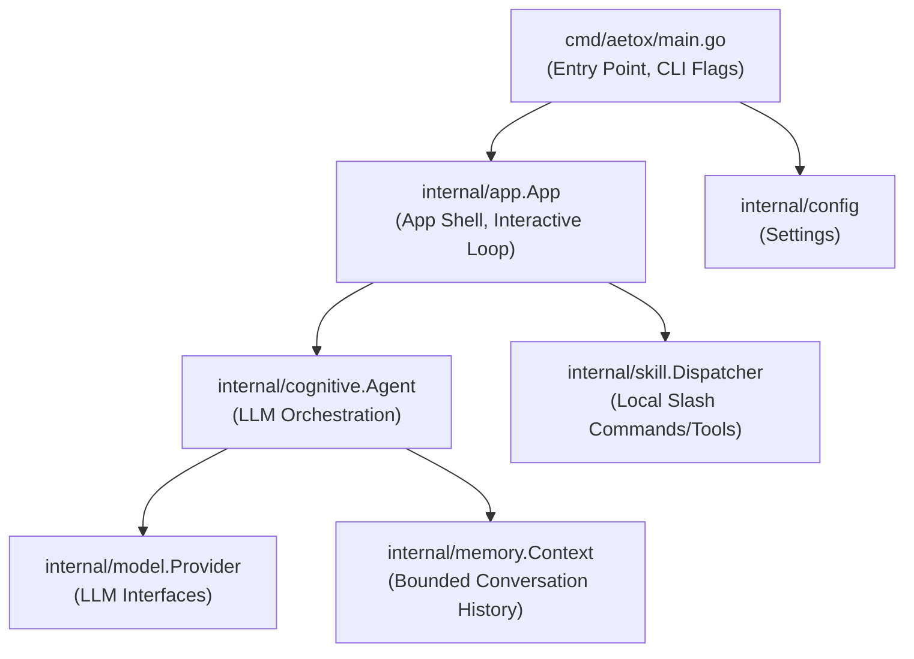

# รีวิวสถาปัตยกรรมระบบ Aetox CLI (อัปเดตล่าสุด)

**วันที่:** 7 มิถุนายน 2569
**สถานะ:** เอกสารระบุสถานะปัจจุบันของระบบ (Current State)

เอกสารฉบับนี้อธิบายถึงภาพรวมสถาปัตยกรรมของระบบ Aetox CLI ในเวอร์ชันปัจจุบัน ซึ่งได้รับการพัฒนามาเป็นแชตบอทผ่านเทอร์มินัลที่มีโครงสร้างแบบแยกส่วน (Modular) รองรับการเรียกใช้สกิลผ่านคำสั่ง (Slash Commands), การสตรีมข้อความตอบกลับแบบเรียลไทม์ และฟีเจอร์การสลับโมเดล LLM ระหว่างการทำงาน

---

## 1. ภาพรวมสถาปัตยกรรมระดับสูง (High-Level Architecture)

ระบบมีโครงสร้างแอปพลิเคชันแบบแยกชั้นที่ชัดเจน (Decoupled Layered Architecture):

---

## 2. คอมโพเนนต์หลัก (Core Components)

### 2.1 `cmd/aetox` (Bootstrap Layer)
- **หน้าที่หลัก:** จัดการอาร์กิวเมนต์แบบ CLI (`--model-provider`, `--version`, `--help` ฯลฯ) โหลดการตั้งค่า (config) และทำการ Bootstrap ตัว Provider ของ Model เพื่อเตรียมพร้อมเข้าสู่ระบบแอปพลิเคชัน (`internal/app`)
- **โหมดการทำงาน:** รองรับทั้งแบบส่งคำสั่งครั้งเดียวจบ (`aetox chat "goal"`) และโหมดแชตตอบโต้ต่อเนื่อง (`aetox`)

### 2.2 `internal/app` (Application Shell)
- **หน้าที่หลัก:** ควบคุม User Interface บนเทอร์มินัลทั้งหมด (UI) เช่น หน้าจอแบนเนอร์ แถบสถานะ (Status Bar) และรับ-ส่งข้อความ
- **ฟีเจอร์สำคัญ:**
  - **Console Abstraction:** สร้าง Interface สำหรับการทำงานกับ I/O ป้องกันการอ้างอิง `os.Stdout` ตรงๆ เพื่อให้ง่ายต่อการนำไปทดสอบ
  - **การจัดการ Routing:** ตรวจสอบและแยกประเภทข้อมูลที่ผู้ใชัป้อนเข้ามา หากเริ่มด้วย `/` จะเป็นคำสั่ง Slash Commands (เช่น `/model`, `/help`) หรือคำสั่งระบบอย่าง `:clear` ก่อนจะส่งไปประมวลผลต่อ
  - **Terminal UX:** หน้าแบนเนอร์แสดงผลสีตามชุดสีเฉพาะ (Brand Colors) แสดงข้อมูลผู้ใช้และ Model ที่ใช้งานอยู่

### 2.3 `internal/cognitive` (Cognitive Agent)
- **หน้าที่หลัก:** ควบคุมและประสานงาน (Orchestration) ระหว่างผู้ใช้กับ Language Model (LLM)
- **ฟีเจอร์สำคัญ:**
  - **Streaming Support:** สามารถรับข้อมูลแบบ Streaming เพื่อแสดงผลทีละข้อความผ่าน `RespondStream` และสามารถ Fallback กลับเป็นแบบ Synchronous ธรรมดาได้ถ้า Model ไม่รองรับ
  - **การจัดการ Model:** มีลอจิกให้สามารถเปลี่ยนสลับค่าย หรืออัปเดต System Prompt ได้ตลอดเวลา

### 2.4 `internal/model` (Provider Abstraction)
- **หน้าที่หลัก:** ออกแบบมาตรฐาน (Interface) ในการติดต่อกับค่าย LLM ต่างๆ (`Provider`, `StreamingProvider`)
- **Provider ที่มีในระบบ:**
  - `openrouter`, `openai_compatible`, `ollama`
  - `noop`: ถือเป็น Default Fallback ใช้ในกรณีที่เซ็ตอัพ Provider หลักล้มเหลว เพื่อไม่ให้แอปพลิเคชันพัง

### 2.5 `internal/skill` (Skill Dispatcher & Registry)
- **หน้าที่หลัก:** สร้างโครงสร้างเพื่อรองรับการทำงานพิเศษแบบ Local (Skills) ที่ไม่ต้องวิ่งผ่าน LLM
- **รูปแบบการทำงาน:** รองรับ Slash Commands หรือการตั้งชื่อเจาะจง เมื่อระบบได้รับคำสั่ง จะให้ Skill ทำงานทันที (เช่น `/time`, `/shell`, `/list`)

### 2.6 `internal/memory` (Context Management)
- **หน้าที่หลัก:** ควบคุมประวัติการสนทนา (History) เพื่อส่งให้ LLM
- **นโยบาย (Policy):** มีระบบการจำกัดจำนวนประโยค (Max Turns) และตัวอักษร (Max Chars) ป้องกันปัญหา Context Window ทะลุลิมิต

---

## 3. วงจรของระบบเมื่อรับคำสั่ง (Request Lifecycle)

ใน Interactive Mode เมื่อระบบรับคำสั่ง จะมีขั้นตอนการทำงานดังนี้:
1. **Input Parsing:** รับข้อความที่พิมพ์ผ่าน Terminal ผ่านทาง `app.App`
2. **Slash Command Interception:** ตรวจสอบก่อนว่าขึ้นต้นด้วยเครื่องหมาย `/` หรือไม่ หากใช่ก็จะตีความว่าเป็นระบบคำสั่งภายในทันที (เช่น เรียกใช้ตัวสลับโมเดล `ModelSwitcher`)
3. **Intent Resolution:** ตรวจสอบเทียบกับคำสั่งระบบ เช่น `:clear` หรือ `:help` หากตรงกันก็จะทำงานทันที
4. **Skill Execution:** ถ้ารูปแบบเข้ากับคลัง Skill ที่มีอยู่ จะทำการเรียก `skill.Dispatcher` ทันที และผ่านระบบความปลอดภัย (`safety`) หากเป็นคำสั่งที่มีความเสี่ยง (เช่น ยืนยันทำงานบน Shell)
5. **LLM Inference:** หากไม่ได้ตกเข้าเงื่อนไขใด ๆ ระบบจะมองว่าเป็นประโยคพูดคุยทั่วไป จึงส่งเข้า `cognitive.Agent.RespondStream` จัดเก็บลงหน่วยความจำ ส่งเข้า LLM และส่งข้อความสตรีมมิ่งคืนให้กับผู้ใช้งาน

---

## 4. สิ่งที่ถูกปรับปรุงให้ดีขึ้นล่าสุด

> [!TIP]
> **การออกแบบ Slash Commands:** ระบบเลิกการจับคู่คำจากประโยคธรรมชาติและเปลี่ยนไปใช้ `/command` อย่างชัดเจน ช่วยให้ผู้ใช้คาดหวังผลลัพธ์จากคำสั่งได้ง่ายขึ้น (เหมือนแอพแชตทั่วไป)

- **Dynamic Model Switching:** ผู้ใช้งานสามารถเปลี่ยนค่ายเปลี่ยน Model ใช้งานได้สดๆ แบบกลางอากาศด้วยคำสั่ง `/model` โดยไม่ต้องรันโปรแกรมใหม่
- **Streaming UI:** ให้ความรู้สึกตอบสนองทันทีแบบ Low-Latency แทนที่การนั่งรอประโยคเต็มๆ เหมือนเวอร์ชันเก่า
- **Polished CLI Branding:** ยกระดับหน้าจอแบนเนอร์และสีสันต่างๆ ให้ดูมีความเป็นเอกลักษณ์มากขึ้น และมีการแบ่งแถบสถานะชัดเจน

---

## 5. ความเสี่ยงและการเสนอแนะ (Architectural Risks & Recommendations)

> [!WARNING]
> **State Persistence:** ปัจจุบันระบบเก็บ Memory Context เอาไว้ใน RAM เท่านั้น หากปิดโปรแกรมแล้วเปิดใหม่ประวัติจะหายไปทั้งหมด
> **ข้อเสนอแนะ:** ควรนำระบบ Local Storage อย่าง SQLite หรือ JSON File เข้ามาเสริมในโมดูล `memory.Context` ให้จดจำประวัติไว้ใช้งานต่อได้

> [!NOTE]
> **Extensibility Limits:** การเพิ่มสคริปต์ความสามารถใหม่ (Skill) ในขณะนี้ยังต้องแก้โค้ด Go และบิวด์ระบบใหม่เสมอ
> **ข้อเสนอแนะ:** อาจพิจารณาการโหลด Skill มาจากระบบข้างนอกโดยตรง เช่น อนุญาตให้สร้างไฟล์ Python/JS ไปวางไว้ใน `~/.aetox/skills/` เพื่อให้เพิ่มความสามารถของตัวเองได้อย่างอิสระ
