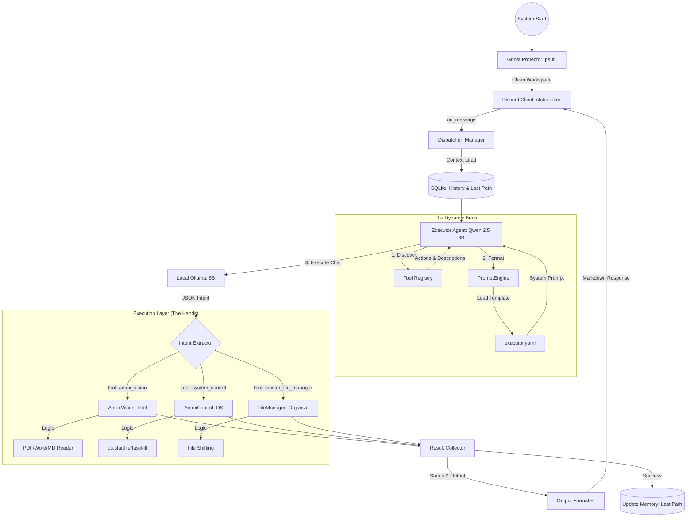

# 🌌 AetoxClaw: Architecture & Dynamic Intelligence

เอกสารฉบับนี้อธิบายโครงสร้างและกระบวนการทำงานของ AetoxClaw เวอร์ชันปัจจุบัน (Gold Standard)

---

## 1. High-Level Workflow (The Orchestration)

กระบวนการทำงานหลักถูกขับเคลื่อนด้วยระบบ **Dynamic Agentic Flow** ซึ่งมีความยืดหยุ่นสูงกว่าระบบเดิม

### 🗺️ Overview Flow (The Data Journey)

```text
[ START ] ──► [ PROCESS GUARD ] ──► [ DISCORD GATEWAY ] ──► [ CONTEXT INJECTION ]
                   (Kill Ghosts)        (Message Recv)         (Load History/Memory)
                                                                       │
[ OUTPUT ] ◄── [ FORMATTER ] ◄── [ TOOL EXECUTION ] ◄── [ INTENT EXTRACTION ]
   (Discord Msg)  (Markdown/Tree)    (Dynamic Result)       (Discovery + 8B)
```

### 🏛️ Detailed Architecture (The Master Blueprint)



---

## 2. หัวใจของระบบ: Dynamic Tool Discovery

AetoxClaw ใช้สถาปัตยกรรมแบบ **Class-Driven Prompting** ซึ่งแตกต่างจากระบบทั่วไป:

1.  **Discovery Phase**: เมื่อ Executor เริ่มทำงาน มันจะเข้าไปอ่านค่า `description` และ `actions` จาก Class เครื่องมือทั้งหมดโดยตรง
2.  **Prompt Injection**: ข้อมูลเหล่านั้นจะถูกฉีดเข้าไปใน `executor.yaml` แบบไดนามิก ทำให้ AI เห็นคู่มือการใช้เครื่องมือที่อัปเดตที่สุดเสมอ
3.  **Zero-Debt Extension**: นักพัฒนาสามารถเพิ่ม Tool ใหม่ได้เพียงแค่สร้าง Class ใหม่และลงทะเบียน ระบบจะรู้จักและใช้งานได้ทันทีโดยไม่ต้องแก้ไขพรอมต์คำสั่งหลัก

---

## 3. ขั้นตอนการทำงาน (The Execution Algorithm)

### ขั้นตอนที่ 1: การสกัดเจตนา (Intent Extraction)
- ใช้โมเดล **Qwen 2.5:8b** เพื่อความแม่นยำสูงสุด
- AI จะได้รับรายชื่อเครื่องมือที่มีอยู่พร้อมตัวอย่าง (Few-Shot)
- ผลลัพธ์ต้องเป็น JSON ที่ระบุ `tool`, `action`, และ `params` (รองรับพารามิเตอร์แบบลิสต์ `targets` สำหรับการเปิดหลายแอปพร้อมกัน)

### ขั้นตอนที่ 2: การทำงานของเครื่องมือ (Tool Execution)
- ระบบจะตรวจสอบ `status` ของการทำงาน
- หากสำเร็จ จะส่งสรุปงานกลับไปที่ Discord
- หากล้มเหลว จะส่งข้อความแจ้งเตือนพร้อมสาเหตุ (Error Handling)

---

## 4. มาตรฐานเครื่องมือ (Gold Standard Tools)
เครื่องมือทุกตัวใน AetoxClaw ต้องสืบทอดจาก `BaseTool` และมีองค์ประกอบดังนี้:
- **name**: ชื่อเครื่องมือ (สำหรับระบบ)
- **description**: คำอธิบายหน้าที่ (สำหรับ AI)
- **actions**: รายการคำสั่งที่รองรับ (เช่น `open`, `read`, `summarize`)
- **execute()**: ตรรกะการทำงานที่คืนค่า `status`, `output`, และ `error`

---

## 5. ความปลอดภัยและเสถียรภาพ (Safety & Stability)
1.  **Single Instance Lock**: ใช้ `psutil` ตรวจสอบและปิดกั้นบอทตัวซ้ำซ้อนเพื่อป้องกันการทำงานผิดพลาด
2.  **Path Sanitization**: ตรวจสอบพาธไฟล์ทุกครั้งก่อนดำเนินการ เพื่อความปลอดภัยของข้อมูลในเครื่อง
3.  **Human-in-the-loop**: งานที่มีความเสี่ยงสูงจะยังคงมีการขอคำยืนยันก่อนดำเนินการ

---

## 6. เจาะลึก: ทำไมสถาปัตยกรรมถึงเป็นแบบนี้? (The Philosophy)

เพื่อให้คุณกิตเข้าใจเหตุผลเบื้องหลังการออกแบบ เรามาเจาะลึก 4 เสาหลักที่ทำให้ AetoxClaw แตกต่างจากบอททั่วไปครับ:

### A. การแยกสมองออกจากร่างกาย (Separation of Brain & Body)
*   **อดีต:** พรอมต์คำสั่ง (Brain) ถูกเขียนฝังไว้ในโค้ด Python (Body) ทำให้เวลาอยากจูนบอท ต้องมานั่งแก้โค้ด เสี่ยงทำโปรแกรมพัง
*   **ปัจจุบัน:** เราแยกพรอมต์ไปไว้ใน **YAML Config** ทั้งหมด โค้ด Python มีหน้าที่แค่รัน Logic ส่วนการตัดสินใจอยู่ที่ไฟล์ตั้งค่า ผลที่ได้คือเราสามารถ "ผ่าตัดสมอง" บอทได้โดยไม่ต้องกลัวเครื่องพังครับ

### B. ระบบ Plug-and-Play (Dynamic Tool Discovery)
*   **อดีต:** เวลาเพิ่ม Tool ใหม่ ต้องไปนั่งพิมพ์บอก AI ในพรอมต์ว่า "มีเครื่องมือใหม่ชื่อนี้นะ ใช้แบบนี้นะ" ซึ่งเป็นภาระและเกิด Technical Debt
*   **ปัจจุบัน:** เราใช้ระบบ **Self-Reporting** คือเครื่องมือแต่ละตัวต้อง "รายงานตัว" เองได้ว่าชื่ออะไร ทำหน้าที่อะไร (ผ่าน `description`) และใช้คำสั่งอะไรได้บ้าง (ผ่าน `actions`) Executor จะกวาดข้อมูลเหล่านี้ไปบอก AI เองอัตโนมัติ 
*   **เหตุผล:** เพื่อให้คุณกิตสามารถ "ขว้าง" Tool ใหม่เข้าใส่โฟลเดอร์ แล้วบอทจะรู้จักและเริ่มงานได้ทันที 100%

### C. สัญญาใจแบบ JSON (The JSON Contract)
*   **ทำไมต้อง JSON?**: เพราะบอทต้องทำงานในระดับ "นิ้วมือ" (Tools) การส่งข้อความภาษาไทยธรรมดาอาจเกิดความผิดพลาดได้สูง เราจึงบังคับให้ AI คุยกับเครื่องมือผ่าน JSON เสมอ 
*   **ผลลัพธ์:** ทำให้ระบบมีความแม่นยำสูง (Precision) และสามารถส่งพารามิเตอร์ซับซ้อนอย่าง `targets: ["app1", "app2"]` ได้โดยไม่สับสน

### D. ระบบ Single Instance (ป้องกันการเกิด Ghost)
*   **ปัญหา:** บอทแบบ Agentic มักจะมี Process ค้างอยู่เบื้องหลังถ้าเราปิดไม่สนิท ทำให้เกิดอาการ "บอทตอบซ้ำ" หรือ "แย่งกันรันคำสั่ง"
*   **การแก้ปัญหา:** เราใช้ `psutil` สแกนหาตัวเองก่อนรันเสมอ ถ้าเจอ "ร่างเงา" (Ghost) มันจะกำจัดทิ้งทันที 
*   **เหตุผล:** เพื่อให้แน่ใจว่าจะมี "สมองเดียว" เท่านั้นที่คุมเครื่องคอมพิวเตอร์ของคุณกิตในเวลาเดียวครับ

---
*Created with ❤️ by Antigravity for the Aetox Ecosystem*
