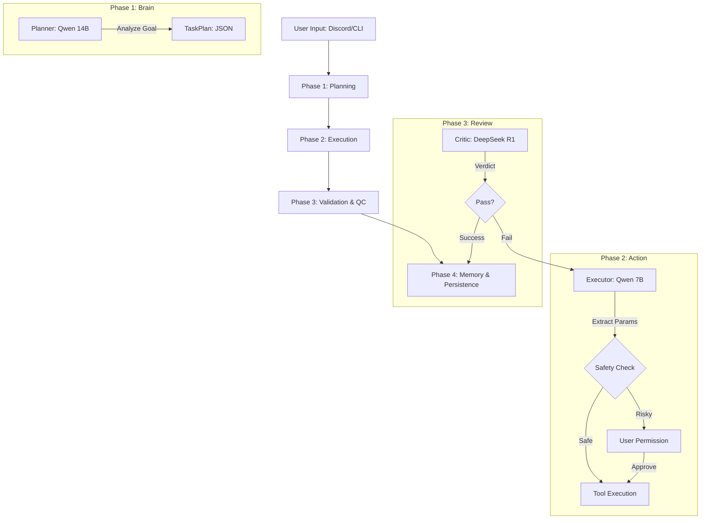

# 🌌 AetoxOS: Workflow & Algorithm Logic

เอกสารฉบับนี้อธิบายกระบวนการทำงานของ AetoxOS ตั้งแต่รับคำสั่งจนถึงการประเมินผลสำเร็จ

---

## 1. High-Level Workflow (The Pipeline)

กระบวนการทำงานหลักแบ่งเป็น 4 ระยะ (Phases):

### Overview Flow (ASCII)

```text
[ USER INPUT ] ──► [ PHASE 1: PLANNING ] ──► [ PHASE 2: EXECUTION ] ──► [ PHASE 3: QC ] ──► [ PHASE 4: MEMORY ]
                       (Qwen 14B)              (Qwen 7B + Tools)       (DeepSeek R1)          (SQLite)
```

### Detailed Flow (Mermaid)



---

## 2. ขั้นตอนการทำงานโดยละเอียด (The Algorithm)

### ขั้นตอนที่ 1: การวางแผน (Strategic Planning)

เมื่อได้รับ Goal (เช่น "คำนวณภาษีจากไฟล์ csv")

1.  **Context Injection**: Planner ดึงความทรงจำ (Memory) และการตั้งค่า (Preferences) ล่าสุดมาประกอบ
2.  **Model (14B)**: ทำการแตกเป้าหมายออกเป็นขั้นตอนย่อยๆ (Step-by-Step)
3.  **Output**: ผลลัพธ์เป็น JSON ที่ระบุว่าแต่ละขั้นต้องใช้ Agent ตัวไหนและเครื่องมืออะไร

### ขั้นตอนที่ 2: การทำงาน (Smart Execution)

Executor รับงานทีละขั้น:

1.  **Parameter Extraction**: ใช้ Model 7B แกะว่า "ต้องใช้พารามิเตอร์อะไร" (เช่น Path ไหน, โค้ดชุดไหน)
2.  **Safety Sandbox**: ตรวจสอบว่าไฟล์ที่เข้าถึงอยู่นอกพื้นที่อนุญาตหรือไม่
3.  **Permission Manager**: หากเป็นงานเสี่ยงสูง (เช่น `run_code`) ระบบจะหยุดและส่ง Reaction ถามคุณใน Discord

### ขั้นตอนที่ 3: การตรวจสอบคุณภาพ (Critic Loop)

DeepSeek R1 ทำหน้าที่เป็น QC:

1.  **Analysis**: อ่านคำสั่งเดิม + ผลลัพธ์ที่ Executor ทำได้
2.  **Verdict**:
    - **Pass**: ทำขั้นตอนถัดไป
    - **Retry**: สั่งให้ Executor แก้ไขงานใหม่ (สูงสุด 2 ครั้ง)
    - **Escalate**: ยอมแพ้และรายงานปัญหาให้ User ทราบ

---

## 3. ตัวอย่างสถานการณ์จริง (Use-Case Example)

**สถานการณ์:** ผู้ใช้สั่ง `!task สรุปยอดขายจากไฟล์ sales.csv แล้วสร้างโฟลเดอร์สรุปงาน`

| ลำดับ | Agent        | กิจกรรมที่เกิดขึ้น                                                           |
| :---- | :----------- | :--------------------------------------------------------------------------- |
| 1     | **Planner**  | วางแผน 3 ขั้น: 1. อ่านไฟล์ 2. คำนวณด้วย Python 3. สร้างโฟลเดอร์              |
| 2     | **Executor** | เรียก `file_manager.read_file("sales.csv")`                                  |
| 3     | **Critic**   | ตรวจสอบว่าเนื้อหาไฟล์อ่านออกมาได้ครบถ้วนหรือไม่ -> **Pass**                  |
| 4     | **Executor** | รัน Python โค้ดคำนวณยอดรวม -> **ส่งคำขอ ✅ ใน Discord**                      |
| 5     | **User**     | กด ✅ อนุมัติการรันโค้ด                                                      |
| 6     | **Executor** | สร้างโฟลเดอร์ `C:/AetoxOS_Workspace/projects/Summary`                        |
| 7     | **Memory**   | บันทึกเหตุการณ์ลง SQLite ว่า "สรุปยอดขายสำเร็จ" เพื่อใช้ในการวางแผนครั้งหน้า |

---

## 4. โครงสร้างความปลอดภัย (Safety Layers)

1.  **Path Sandbox**: จำกัดการเข้าถึงไฟล์ในพื้นที่ที่กำหนดเท่านั้น
2.  **Code Scanner**: ตรวจจับคีย์เวิร์ดอันตราย (Network/Socket) ก่อนรัน
3.  **Timeout Control**: ตัดการทำงานทันทีหากโค้ดค้างเกิน 30 วินาที
4.  **Human-in-the-loop**: ความเสี่ยงสูงต้องรอคนกดปุ่มอนุมัติเสมอ
