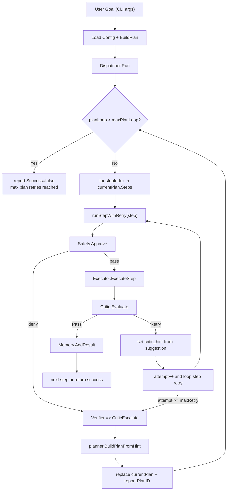

# Phase 3 — Planner / Critic / Multi-Step Planning Loop

## Intake

- เป้าหมาย: ตรวจสถาปัตยกรรมของ Phase 3 ใน codebase ปัจจุบัน
- โหมดการทำงาน: **Existing System Mapping**
- ขอบเขต: การทำงานของ loop ระดับ step, hint feedback, และการนำทางใหม่ของ plan
- เอกสารอ้างอิงที่เชื่อมต่อ: `docs/go-rebuild-roadmap.md`, `internal/*`, `cmd/aetox/main.go`

## Verified Facts (based on current code)

- CLI อ่าน goal จาก arg แล้วโหลด config, สร้าง `planner`, `executor`, `critic`, `safety`, `memory`, `dispatcher` ใน `cmd/aetox/main.go`
  - มี flag ควบคุม `--retries`, `--plan-retries`, `--yes`, `--approval-timeout`
- `dispatcher.Run` เก็บ `Plan` ปัจจุบันและรันซ้ำได้ (plan loop) จนกว่าจะผ่านทุก step หรือตรวจเจอข้อผิดพลาด
  - เงื่อนไขหยุดกรณี `planLoop > maxPlanLoop` และส่ง error `"max plan retries reached"`
- `runStepWithRetry` ทำงานเป็น loop ต่อ step:
  - ก่อน execute จะรัน safety approve
  - ถ้าผ่าน ให้ execute step โดย `executor.ExecuteStep`
  - ส่งผลลัพธ์ให้ `critic.Evaluate`
  - ถ้า verdict = `pass` -> return
  - ถ้า verdict = `retry` -> เก็บ `critic_hint` ใน params แล้วทำ loop ใหม่
  - ถ้า retries เกินเพดาน -> escalate เป็น `CriticEscalate`
- `critic` ทำหน้าที่ evaluate ผลลัพธ์:
  - `StatusSuccess` + output ว่าง (และไม่ใช่ delete/move) => `retry`
  - `StatusFailure` => `retry` พร้อม suggestion ตาม action (`run`, `fetch`, `read`, ...)
  - `pass` เมื่อผลลัพธ์สำเร็จและไม่โดน rule failure
- `dispatcher` รับ verdict:
  - `pass`: เพิ่มผลลัพธ์ลง memory (`AddResult`) แล้วทำ step ถัดไป
  - `escalate`: สร้างแผนใหม่ผ่าน `planner.BuildPlanFromHint(...)` โดยใช้ goal เดิม + hint + ข้อผิดพลาดล่าสุด
  - จากนั้นเปลี่ยน `currentPlan` แล้วรัน loop ใหม่
- `planner.BuildPlanFromHint` เป็นการ compose string ใหม่แล้ว call `BuildPlan`
- `planner.BuildPlan` แยก goal เป็น clauses (`&&`, `;`, `then`) แล้ว infer step ทีละ clause โดย heuristic แบบข้อความดิบ
- `planner` map risk ในระดับขั้นตอน (`low/medium/high`) และ safety gate อิง risk นั้น
- `safety.Approve` ให้ผ่านทันทีสำหรับ low risk หรือเมื่อ `AutoApprove=true`; step เสี่ยงสูงจะขอ confirm จาก stdin
- `executor` แปล `TaskStep` เป็น tool call โดยผ่าน `tools.Registry`

## Reasonable Inferences

- โอเคว่า dispatcher ทำงานเป็นสองชั้น loop: **step retry loop** และ **plan replanning loop**
- `critic_hint` ถูกใส่ลงใน `step.Params` ตอน retry ใน step loop, แสดงว่า intent คือให้ข้อมูลกลับไปช่วยปรับพฤติกรรมในรอบถัดไป
- แม้โค้ด `dispatcher` ยังมี branch จัดการ `CriticRetry` ระดับ `Run` แต่ทาง `runStepWithRetry` ปัจจุบันคืนเฉพาะ `pass`/`escalate` ทำให้ branch นี้กลายเป็นทางสำรองเชิงแนวคิดมากกว่าใช้งานจริง
- ความหมายของค่า flag:
  - `maxRetry` ใน step loop คือจำนวนครั้งที่อนุญาตให้ลองซ้ำก่อน escalate (คาดว่าเป็นจำนวน "retry attempts" ไม่ใช่จำนวน attempts ทั้งหมด)
  - `maxPlanLoop` ใน plan loop คือเพดานรอบ replanning

## Assumptions

- การใช้ `critic_hint` ใน params ยังไม่ส่งผลต่อ tool ปัจจุบันโดยตรง เพราะไม่มี tool ใดอ่าน `critic_hint` แบบเฉพาะเจาะจง
- แผนเดิมของ phase3 ใน roadmap คาดว่าจะมีการใช้ LLM-backed planner ในอนาคต แต่ implementation ปัจจุบันยังเป็น deterministic heuristic planner
- การยกเลิกหรือยืนยันผู้ใช้ (`--yes`) ถือเป็นการยอมรับพฤติกรรมเสี่ยงระดับสูงอย่างชัดเจน

## Open Questions

- ต้องการให้ `--plan-retries` คิดเป็นจำนวนรอบใหม่ของ plan จริง ๆ เท่ากับค่า `maxPlanLoop` ปัจจุบัน (โดยมี +1 offset) หรือมีควรแก้ semantics?
- ต้องการใช้ `critic_hint` ในรูปแบบไหนต่อไป: ส่งกลับให้ LLM planner, ปรับ tool param, หรือใช้ใน rule-based planner เฉพาะ?
- ปัจจุบันไม่มี stateful memory ที่ใช้ผลลัพธ์ในแต่ละ step ในการปรับ plan; ต้องการเพิ่มความเข้มข้นตรงไหนก่อนเพิ่มความซับซ้อน?
- การแก้ไข error ที่ไม่ผ่านเพราะ permission/user-deny ควรเป็นจุดสิ้นสุดทันทีหรือควร expose hint/retry channel ด้วย?

## Risks

- ค่า `maxPlanLoop` ใช้เงื่อนไข `if planLoop > d.maxPlanLoop` ทำให้พฤติกรรมอาจอนุญาตรอบได้น้อยกว่าที่ผู้ใช้ตีความจาก flag
- Retry ของ step ทำตามเงื่อนไข `attempt >= maxRetry` ซึ่งหมายถึงลอง `maxRetry + 1` ครั้งจริง (attempt เริ่ม 0)
- ไม่มีการจำกัดขอบเขตข้อความของ hint/goal composition ยาว ๆ ใน `BuildPlanFromHint` อาจทำให้ plan string โตขึ้นและกระทบความเสถียร
- ไม่มี step timeout ระดับ `dispatcher` โดยตรง (ยกเว้น context ที่ส่งผ่านจาก caller และ tool-level timeout)
- ความเสี่ยงด้านความปลอดภัย: safety approval timeout คือตัวเดียวที่ตัดการรอผู้ใช้

## Decisions

- ยืนยันโครงสร้างหลักของ loop ตาม Phase 3 แล้ว (retry + hint + replanning)
- ยืนยันการเก็บข้อมูลที่ผ่านแล้วเท่านั้นเข้าหน่วยความจำรันเทส (memory.AddResult เฉพาะ pass)
- ยืนยันให้ใช้ `Status` และ `Verdict` types ที่ typed contract ชัดเจนในเส้นทางหลัก
- ยืนยันว่ายังไม่ต้องเพิ่มลักษณะการตัดสินใจเชิง LLM ใน runtime loop นี้ทันที แต่เพิ่มได้ต่อหลังจาก feedback loop เสถียร

## Current Control Flow Map

## Validation Gate

- Claim traceability: ทุกข้อยืนยันหลักอ้างอิงไฟล์ source ใน repository (`internal/{planner,dispatcher,critic,executor,safety,memory,tools}` และ `cmd/aetox/main.go`)
- Scope alignment: เอกสารนี้จำกัดเฉพาะ Phase 3 control loop เท่านั้น ไม่แก้ข้อกำหนด phase 4+ ต่อเติม
- Handoff readiness: มีความเสี่ยง/คำถาม/สมมติฐานที่ชัดเจน และมี map flow ระดับ loop ครบทั้ง step-level และ plan-level
